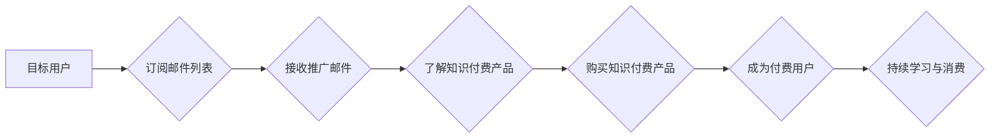

                 

## 如何利用邮件营销推广知识付费产品

> 关键词：邮件营销、知识付费、用户运营、自动化、转化率

## 1. 背景介绍

知识付费行业近年来蓬勃发展，越来越多的创作者和机构通过线上平台提供课程、咨询、工具等付费服务。然而，在竞争激烈的市场环境下，如何有效地推广知识付费产品，吸引目标用户并提升转化率成为一个关键问题。邮件营销作为一种精准、高效的营销方式，在知识付费推广中发挥着越来越重要的作用。

传统的广告投放方式往往难以精准触达目标用户，而邮件营销则可以通过收集用户邮箱地址，建立个性化用户画像，并根据用户的兴趣爱好、行为习惯发送精准的推广邮件，提高用户参与度和转化率。

## 2. 核心概念与联系

### 2.1 邮件营销

邮件营销是指通过电子邮件向目标用户发送营销信息，以推广产品或服务，促进销售的一种营销方式。它可以分为以下几个阶段：

* **邮件列表构建:** 收集目标用户的邮箱地址，建立邮件列表。
* **邮件内容创作:** 根据目标用户需求和产品特点，撰写吸引人的邮件内容。
* **邮件发送:** 通过邮件营销平台或工具，发送邮件到目标用户邮箱。
* **邮件效果分析:** 跟踪邮件打开率、点击率、转化率等指标，分析邮件效果并进行优化。

### 2.2 知识付费

知识付费是指通过提供有价值的知识、技能或服务，向用户收取费用的一种商业模式。知识付费产品可以包括：

* **在线课程:** 视频课程、音频课程、文字课程等。
* **咨询服务:** 一对一咨询、群组咨询等。
* **工具软件:** 设计工具、办公工具、学习工具等。
* **会员服务:** 提供独家内容、优惠活动等。

### 2.3 邮件营销与知识付费的联系

邮件营销可以有效地推广知识付费产品，通过以下方式：

* **精准触达目标用户:** 邮件营销可以根据用户的兴趣爱好、行为习惯，精准触达目标用户，提高推广效率。
* **建立用户信任:** 通过定期发送有价值的内容，例如行业资讯、学习技巧、产品更新等，可以建立用户信任，提升用户粘性。
* **引导用户购买:** 通过邮件推广产品优势、优惠活动等，引导用户购买知识付费产品。
* **提高用户复购率:** 通过邮件发送用户专属内容、会员福利等，可以提高用户复购率。

**Mermaid 流程图**



## 3. 核心算法原理 & 具体操作步骤

### 3.1 算法原理概述

邮件营销的核心算法原理在于数据分析和自动化。通过收集用户数据，分析用户行为和偏好，并根据分析结果自动发送个性化邮件，以提高用户参与度和转化率。

### 3.2 算法步骤详解

1. **数据收集:** 收集用户邮箱地址、用户行为数据、用户兴趣爱好等信息。
2. **用户画像构建:** 根据收集到的数据，构建用户画像，将用户分为不同的群体，例如年龄、性别、职业、兴趣爱好等。
3. **邮件内容定制:** 根据用户画像，定制不同的邮件内容，例如针对不同年龄段的用户发送不同的课程推荐，针对不同职业的用户发送不同的行业资讯。
4. **邮件发送自动化:** 利用邮件营销平台或工具，根据用户行为和时间段，自动发送个性化邮件。
5. **邮件效果分析:** 跟踪邮件打开率、点击率、转化率等指标，分析邮件效果并进行优化。

### 3.3 算法优缺点

**优点:**

* **精准触达:** 可以精准触达目标用户，提高推广效率。
* **个性化定制:** 可以根据用户画像，定制个性化邮件内容，提高用户参与度。
* **自动化操作:** 可以自动化发送邮件，节省人力成本。
* **数据分析:** 可以通过数据分析，优化邮件内容和发送策略。

**缺点:**

* **邮件列表维护:** 需要不断维护邮件列表，确保邮件地址有效。
* **邮件内容创作:** 需要创作高质量的邮件内容，吸引用户阅读。
* **邮件发送频率:** 需要控制邮件发送频率，避免用户反感。
* **法律法规:** 需要遵守相关的法律法规，例如反垃圾邮件法。

### 3.4 算法应用领域

邮件营销算法广泛应用于各个领域，例如：

* **电商:** 推广商品、发送优惠券、提醒发货等。
* **教育:** 推广课程、发送学习资料、提醒缴费等。
* **金融:** 推广理财产品、发送账单、提醒还款等。
* **医疗:** 推广医疗服务、发送预约提醒、分享健康资讯等。

## 4. 数学模型和公式 & 详细讲解 & 举例说明

### 4.1 数学模型构建

邮件营销效果可以被量化评估，常用的指标包括：

* **打开率 (Open Rate):** 邮件被打开的比例。
* **点击率 (Click-Through Rate):** 邮件中的链接被点击的比例。
* **转化率 (Conversion Rate):** 点击邮件链接后完成目标操作 (例如购买产品) 的比例。

这些指标可以用数学公式来表示：

* **打开率 = 打开邮件数 / 发送邮件数**
* **点击率 = 点击链接数 / 打开邮件数**
* **转化率 = 完成目标操作数 / 点击链接数**

### 4.2 公式推导过程

这些公式的推导过程比较简单，是基于事件发生的概率计算。例如，打开率就是指邮件被打开的概率，可以通过发送邮件数和打开邮件数的比例来计算。

### 4.3 案例分析与讲解

假设我们发送了一封邮件给 1000 个用户，有 200 个用户打开了邮件，其中 50 个用户点击了邮件中的链接，最终有 10 个用户购买了知识付费产品。

那么，我们可以计算出：

* **打开率 = 200 / 1000 = 0.2 = 20%**
* **点击率 = 50 / 200 = 0.25 = 25%**
* **转化率 = 10 / 50 = 0.2 = 20%**

通过分析这些指标，我们可以了解到邮件的推广效果，例如打开率较低可能需要优化邮件主题和内容，点击率较低可能需要优化链接文案，转化率较低可能需要优化产品页面和购买流程。

## 5. 项目实践：代码实例和详细解释说明

### 5.1 开发环境搭建

为了实现邮件营销自动化，我们可以使用一些邮件营销平台或工具，例如 Mailchimp、Sendinblue、GetResponse 等。这些平台提供丰富的功能，例如邮件列表管理、邮件模板设计、自动化发送等。

### 5.2 源代码详细实现

由于邮件营销平台和工具的具体实现方式不同，这里只提供一个简单的邮件发送代码示例，使用 Python 的 smtplib 库：

```python
import smtplib
from email.mime.text import MIMEText

# 发件人邮箱地址和密码
sender_email = "your_email@example.com"
sender_password = "your_password"

# 收件人邮箱地址
receiver_email = "recipient_email@example.com"

# 邮件主题和内容
subject = "知识付费产品推广"
body = "您好，\n\n我们为您推荐了一款关于 [产品名称] 的知识付费课程，\n\n[课程介绍]\n\n点击链接了解更多：\n[课程链接]"

# 创建邮件对象
msg = MIMEText(body)
msg['Subject'] = subject
msg['From'] = sender_email
msg['To'] = receiver_email

# 连接SMTP服务器
with smtplib.SMTP_SSL('smtp.gmail.com', 465) as server:
    server.login(sender_email, sender_password)
    server.sendmail(sender_email, receiver_email, msg.as_string())

print("邮件发送成功!")
```

### 5.3 代码解读与分析

这段代码首先导入必要的库，然后定义发件人邮箱地址、密码、收件人邮箱地址、邮件主题和内容。

接着，创建邮件对象，设置邮件主题、发件人、收件人等信息。

最后，使用 smtplib 库连接 SMTP 服务器，登录发件人邮箱，并发送邮件。

### 5.4 运行结果展示

如果代码运行成功，将会发送一封邮件到收件人邮箱。

## 6. 实际应用场景

### 6.1 知识付费产品推广

邮件营销可以用于推广各种知识付费产品，例如在线课程、咨询服务、工具软件等。

例如，我们可以根据用户的学习兴趣和需求，发送个性化的课程推荐邮件，或者根据用户的职业和行业，发送相关的行业资讯和咨询服务推广邮件。

### 6.2 用户运营与维护

邮件营销可以用于维护用户关系，提高用户粘性。

例如，我们可以定期发送有价值的内容，例如行业资讯、学习技巧、产品更新等，以保持用户对产品的关注度。

### 6.3 会员服务与福利

邮件营销可以用于向会员用户提供专属服务和福利，例如提前预告课程更新、提供会员专属折扣、发送会员专属活动邀请等。

### 6.4 未来应用展望

随着人工智能和自动化技术的不断发展，邮件营销将会更加智能化和个性化。

例如，我们可以利用机器学习算法，分析用户的行为数据和偏好，自动生成个性化的邮件内容，提高邮件的转化率。

## 7. 工具和资源推荐

### 7.1 学习资源推荐

* **邮件营销书籍:** 《邮件营销实战》、《邮件营销 bible》
* **在线课程:** Udemy、Coursera 等平台上的邮件营销课程
* **博客和网站:** Mailchimp Blog、Sendinblue Blog 等

### 7.2 开发工具推荐

* **邮件营销平台:** Mailchimp、Sendinblue、GetResponse 等
* **编程语言:** Python、PHP、Java 等
* **SMTP 库:** Python 的 smtplib 库

### 7.3 相关论文推荐

* **邮件营销效果分析:** 《邮件营销效果分析方法研究》
* **邮件营销自动化:** 《基于机器学习的邮件营销自动化系统》

## 8. 总结：未来发展趋势与挑战

### 8.1 研究成果总结

邮件营销作为一种成熟的营销方式，在知识付费推广中发挥着越来越重要的作用。通过数据分析和自动化，邮件营销可以精准触达目标用户，提高推广效率和转化率。

### 8.2 未来发展趋势

未来，邮件营销将会更加智能化和个性化。

例如，我们可以利用人工智能技术，分析用户的行为数据和偏好，自动生成个性化的邮件内容，提高邮件的打开率和点击率。

### 8.3 面临的挑战

邮件营销也面临着一些挑战，例如：

* **用户隐私保护:** 邮件营销需要收集用户的个人信息，因此需要严格遵守用户隐私保护法律法规。
* **邮件垃圾化:** 邮件营销需要避免发送垃圾邮件，否则可能会损害品牌形象。
* **邮件平台限制:** 不同的邮件平台有不同的规则和限制，需要根据不同的平台进行邮件营销策略调整。

### 8.4 研究展望

未来，我们需要继续研究邮件营销的算法和技术，提高邮件营销的效率和效果。

同时，还需要关注用户隐私保护和邮件垃圾化问题，确保邮件营销的健康发展。

## 9. 附录：常见问题与解答

### 9.1 如何构建高质量的邮件列表？

高质量的邮件列表是邮件营销成功的关键。我们可以通过以下方式构建高质量的邮件列表：

* **网站订阅表单:** 在网站上设置订阅表单，收集用户邮箱地址。
* **线下活动:** 在线下活动中收集用户联系方式。
* **付费广告:** 通过付费广告平台，例如 Google Ads、Facebook Ads 等，定向投放广告，收集用户邮箱地址。

### 9.2 如何提高邮件打开率和点击率？

提高邮件打开率和点击率可以通过以下方式实现：

* **吸引人的邮件主题:** 使用简洁明了的主题，突出邮件内容的重点。
* **个性化的邮件内容:** 根据用户的兴趣爱好和需求，定制个性化的邮件内容。
* **清晰的邮件结构:** 使用标题、段落、图片等元素，使邮件内容清晰易读。
* **醒目的按钮:** 使用醒目的按钮，引导用户点击链接。

### 9.3 如何避免邮件被标记为垃圾邮件？

避免邮件被标记为垃圾邮件可以通过以下方式实现：

* **使用真实的邮箱地址:** 不要使用虚假或不相关的邮箱地址发送邮件。
* **遵守邮件发送规范:** 遵守邮件平台的发送规范，例如邮件内容格式、发送频率等。
* **避免使用敏感词汇:** 避免使用敏感词汇，例如“免费”、“奖品”等。
* **提供退订链接:** 在邮件中提供退订链接，方便用户取消订阅。


作者：禅与计算机程序设计艺术 / Zen and the Art of Computer Programming 
<end_of_turn>

