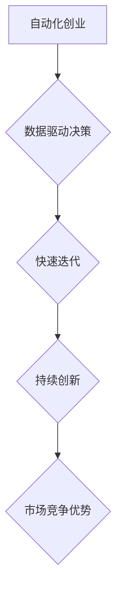

                 

## 如何在自动化创业中实现持续创新

> 关键词：自动化创业、持续创新、人工智能、机器学习、流程自动化、数据驱动、敏捷开发、云计算、DevOps

### 1. 背景介绍

在当今科技飞速发展的时代，创业者面临着前所未有的机遇和挑战。自动化技术正在迅速普及，为创业者提供了强大的工具，帮助他们提高效率、降低成本，并释放出更多的时间和精力去专注于创新。然而，仅仅依靠自动化技术并不能保证创业公司的持续创新。为了在激烈的市场竞争中脱颖而出，创业公司需要将自动化技术与创新思维相结合，构建一个能够持续迭代、不断进化的创新生态系统。

### 2. 核心概念与联系

**2.1 自动化创业**

自动化创业是指利用自动化技术来简化和加速创业过程，从产品开发到运营管理，各个环节都尽可能地自动化。

**2.2 持续创新**

持续创新是指企业不断地开发和推出新的产品、服务和商业模式，以满足不断变化的市场需求和用户期望。

**2.3 连接点：自动化为持续创新赋能**

自动化技术为持续创新提供了强大的支持：

* **解放人力资源：** 自动化可以解放人力资源，让创业团队可以专注于更具创造性的工作，例如产品设计、市场营销和用户体验优化。
* **加速迭代速度：** 自动化可以加速产品开发和测试迭代速度，让创业公司能够更快地响应市场变化和用户反馈。
* **降低成本：** 自动化可以降低运营成本，例如生产成本、物流成本和客服成本，为创业公司提供更多资源投入到创新中。
* **数据驱动决策：** 自动化可以收集和分析海量数据，为创业公司提供数据驱动的决策支持，帮助他们更好地理解用户需求和市场趋势。

**2.4 流程图**



### 3. 核心算法原理 & 具体操作步骤

**3.1 算法原理概述**

持续创新的核心算法原理是基于数据驱动的敏捷开发模式。

* **数据驱动：** 利用自动化收集和分析用户行为、市场趋势等数据，为创新决策提供依据。
* **敏捷开发：** 将产品开发过程拆解成多个小周期，快速迭代，并根据用户反馈不断改进产品。

**3.2 算法步骤详解**

1. **数据收集与分析：** 利用自动化工具收集用户行为、市场趋势、竞争对手信息等数据，并进行分析，识别出潜在的创新机会。
2. **需求定义与优先级排序：** 根据数据分析结果，定义创新目标和产品需求，并根据用户价值和市场潜力进行优先级排序。
3. **快速原型开发：** 利用敏捷开发方法，快速开发产品原型，并进行用户测试和反馈收集。
4. **迭代改进：** 根据用户反馈和数据分析结果，对产品原型进行迭代改进，不断优化产品功能和用户体验。
5. **产品发布与推广：** 将经过多次迭代改进的产品发布到市场，并进行推广和营销活动。

**3.3 算法优缺点**

* **优点：**
    * 数据驱动，决策更科学、更精准。
    * 敏捷开发，迭代速度更快，能够快速响应市场变化。
    * 用户反馈驱动，产品更符合用户需求。
* **缺点：**
    * 需要强大的数据分析能力和技术支持。
    * 需要具备敏捷开发的团队文化和管理模式。
    * 需要不断收集和分析数据，才能持续进行创新。

**3.4 算法应用领域**

* **互联网产品开发：** 利用数据驱动和敏捷开发模式，快速迭代开发新的互联网产品和服务。
* **移动应用开发：** 根据用户行为数据，开发更符合用户需求的移动应用。
* **人工智能应用开发：** 利用机器学习算法，开发能够自动学习和改进的智能应用。

### 4. 数学模型和公式 & 详细讲解 & 举例说明

**4.1 数学模型构建**

我们可以用一个简单的数学模型来描述持续创新的过程：

```latex
Innovation = f(Data, Feedback, Iteration)
```

其中：

* **Innovation:** 创新程度
* **Data:** 数据分析结果
* **Feedback:** 用户反馈
* **Iteration:** 迭代次数

这个模型表明，持续创新是一个由数据、用户反馈和迭代次数共同决定的过程。

**4.2 公式推导过程**

我们可以进一步推导这个模型，将每个变量量化：

* **Data:** 可以用数据分析结果的准确度和丰富度来量化。
* **Feedback:** 可以用用户反馈的积极性、数量和及时性来量化。
* **Iteration:** 可以用迭代次数和每次迭代的改进幅度来量化。

**4.3 案例分析与讲解**

例如，一家互联网公司开发一款新的社交媒体应用。

* **数据:** 公司利用用户行为数据分析，发现用户对短视频内容的需求越来越高。
* **反馈:** 公司在应用上线后，收集了大量用户反馈，发现用户希望能够更方便地分享短视频。
* **迭代:** 公司根据数据分析和用户反馈，不断迭代改进应用，增加了短视频分享功能，并优化了用户体验。

通过不断的数据分析、用户反馈和迭代改进，这款社交媒体应用最终获得了成功。

### 5. 项目实践：代码实例和详细解释说明

**5.1 开发环境搭建**

为了实现持续创新，创业公司需要搭建一个完善的开发环境，包括：

* **代码管理工具：** 例如 Git，用于管理代码版本和协作开发。
* **持续集成/持续交付工具：** 例如 Jenkins，用于自动化构建、测试和部署代码。
* **云计算平台：** 例如 AWS，用于提供弹性计算资源和数据存储服务。

**5.2 源代码详细实现**

以下是一个简单的代码实例，演示了如何利用 Python 和机器学习库 scikit-learn 来分析用户行为数据，并预测用户对新产品的兴趣：

```python
from sklearn.linear_model import LogisticRegression
from sklearn.model_selection import train_test_split

# 假设我们有用户行为数据，包括用户年龄、性别、浏览历史等特征
# 以及用户是否购买新产品的标签

# 将数据分割成训练集和测试集
X_train, X_test, y_train, y_test = train_test_split(data['features'], data['target'], test_size=0.2)

# 使用逻辑回归模型训练模型
model = LogisticRegression()
model.fit(X_train, y_train)

# 使用训练好的模型预测测试集的用户购买行为
predictions = model.predict(X_test)

# 计算模型的准确率
accuracy = model.score(X_test, y_test)
print(f'Model accuracy: {accuracy}')
```

**5.3 代码解读与分析**

这段代码演示了如何利用机器学习模型来分析用户行为数据，并预测用户对新产品的兴趣。

* 首先，我们将用户行为数据分割成训练集和测试集。
* 然后，我们使用逻辑回归模型来训练模型。
* 最后，我们使用训练好的模型来预测测试集的用户购买行为，并计算模型的准确率。

**5.4 运行结果展示**

运行这段代码后，我们可以得到模型的准确率，这表明模型对用户购买行为的预测能力。

### 6. 实际应用场景

**6.1 产品开发**

* **用户需求分析：** 利用数据分析工具，分析用户行为数据，识别出用户需求和痛点。
* **产品原型设计：** 利用敏捷开发方法，快速开发产品原型，并进行用户测试和反馈收集。
* **产品迭代改进：** 根据用户反馈和数据分析结果，对产品原型进行迭代改进，不断优化产品功能和用户体验。

**6.2 市场营销**

* **精准营销：** 利用数据分析工具，分析用户画像，进行精准营销，提高营销效果。
* **内容推荐：** 利用机器学习算法，分析用户行为数据，推荐个性化内容，提高用户粘性。
* **广告投放：** 利用数据分析工具，分析广告效果，优化广告投放策略，降低广告成本。

**6.3 运营管理**

* **自动化运营：** 利用自动化工具，自动化完成一些重复性的运营任务，例如客服回复、订单处理等。
* **数据驱动决策：** 利用数据分析工具，分析运营数据，为运营决策提供数据支持。
* **风险控制：** 利用机器学习算法，识别潜在的风险，并采取相应的措施进行风险控制。

**6.4 未来应用展望**

随着人工智能技术的不断发展，自动化创业将更加深入地融入到各个行业，并带来更多创新应用。例如：

* **自动生成创意：** 利用人工智能算法，自动生成创意内容，例如广告文案、产品设计等。
* **自动完成复杂任务：** 利用人工智能算法，自动完成一些复杂的任务，例如法律合同审查、医学诊断等。
* **个性化定制：** 利用人工智能算法，为用户提供个性化的产品和服务，例如定制服装、个性化教育等。

### 7. 工具和资源推荐

**7.1 学习资源推荐**

* **书籍：**
    * 《自动化创业》
    * 《敏捷开发》
    * 《机器学习实战》
* **在线课程：**
    * Coursera
    * Udacity
    * edX

**7.2 开发工具推荐**

* **代码管理工具：** Git
* **持续集成/持续交付工具：** Jenkins, CircleCI, Travis CI
* **云计算平台：** AWS, Azure, Google Cloud Platform
* **机器学习库：** scikit-learn, TensorFlow, PyTorch

**7.3 相关论文推荐**

* **敏捷开发：**
    * The Agile Manifesto
    * Extreme Programming Explained
* **机器学习：**
    * The Elements of Statistical Learning
    * Deep Learning

### 8. 总结：未来发展趋势与挑战

**8.1 研究成果总结**

自动化创业为创业公司提供了强大的工具和方法，帮助他们实现持续创新。通过数据驱动、敏捷开发和人工智能技术的应用，创业公司能够更快地响应市场变化，开发更符合用户需求的产品和服务。

**8.2 未来发展趋势**

未来，自动化创业将朝着以下几个方向发展：

* **更智能的自动化：** 利用人工智能技术，实现更智能的自动化，例如自动生成创意、自动完成复杂任务等。
* **更个性化的定制：** 利用人工智能技术，为用户提供更个性化的产品和服务，例如定制服装、个性化教育等。
* **更广泛的应用场景：** 自动化创业将应用于更多行业，例如医疗、教育、金融等。

**8.3 面临的挑战**

自动化创业也面临着一些挑战：

* **数据安全和隐私保护：** 自动化创业需要收集和分析大量用户数据，因此需要加强数据安全和隐私保护措施。
* **人才短缺：** 自动化创业需要具备数据分析、人工智能和敏捷开发等方面的专业人才，而这些人才目前比较稀缺。
* **伦理问题：** 自动化创业可能会带来一些伦理问题，例如算法偏见、工作岗位替代等，需要引起重视和探讨。

**8.4 研究展望**

未来，我们需要继续研究和探索自动化创业的最佳实践，并解决其面临的挑战，以推动自动化创业的健康发展。


### 9. 附录：常见问题与解答

**9.1 如何选择合适的自动化工具？**

选择合适的自动化工具需要根据创业公司的具体需求和情况进行评估。

* **功能需求：** 不同的自动化工具具有不同的功能，需要根据创业公司的具体需求选择合适的工具。
* **成本预算：** 不同的自动化工具价格不同，需要根据创业公司的成本预算进行选择。
* **技术支持：** 选择具有良好技术支持的自动化工具，可以帮助创业公司解决技术问题。

**9.2 如何构建一个高效的自动化创业团队？**

构建一个高效的自动化创业团队需要以下几个方面：

* **人才招聘：** 招募具备数据分析、人工智能和敏捷开发等方面的专业人才。
* **团队文化：** 建立以数据驱动、创新和协作为核心的团队文化。
* **管理模式：** 采用敏捷开发管理模式，提高团队效率。


作者：禅与计算机程序设计艺术 / Zen and the Art of Computer Programming 
<end_of_turn>

