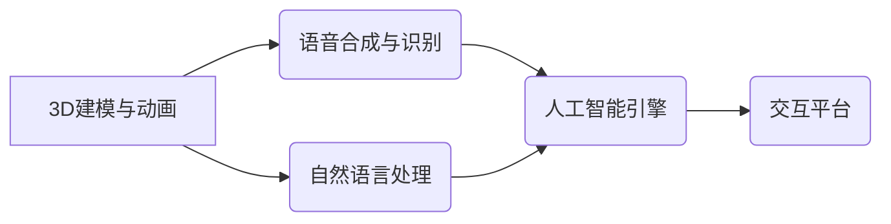

                 

## 2050年的数字创意：从虚拟偶像到数字人的商业应用

> 关键词：数字人、虚拟偶像、人工智能、深度学习、计算机视觉、自然语言处理、元宇宙、商业应用

### 1. 背景介绍

2050年，数字创意将彻底改变我们的生活方式，并成为经济发展的新引擎。虚拟偶像和数字人将不再是科幻小说中的幻想，而是我们日常生活中的常见存在。从娱乐、教育到医疗、金融，数字人将渗透到各个领域，为我们提供个性化、沉浸式的体验。

近年来，人工智能技术取得了飞速发展，特别是深度学习算法的突破，为数字人技术的实现提供了强大的技术支撑。计算机视觉、自然语言处理等相关领域的进步也为数字人赋予了更逼真的外观、更自然的交互能力。

### 2. 核心概念与联系

**2.1 虚拟偶像与数字人的区别**

虚拟偶像通常是指以虚拟形象为载体的娱乐明星，主要通过动画、游戏等形式进行表演和互动。而数字人则更具智能性和现实感，能够进行更复杂的对话、学习和适应环境。

**2.2 数字人技术架构**

数字人技术的实现需要多学科交叉融合，主要包括以下几个核心模块：

* **3D建模与动画:**  构建逼真的数字人外形和动作。
* **语音合成与识别:**  实现数字人自然流畅的语音交互。
* **自然语言处理:**  理解和响应用户的自然语言指令。
* **人工智能引擎:**  赋予数字人学习、推理和决策的能力。
* **交互平台:**  提供数字人与用户进行交互的平台。

**2.3 数字人技术关系图**



### 3. 核心算法原理 & 具体操作步骤

**3.1 算法原理概述**

数字人技术的核心算法主要包括深度学习、计算机视觉和自然语言处理等算法。

* **深度学习:** 用于训练数字人识别图像、语音和文本等数据的模型，并赋予数字人学习和决策的能力。
* **计算机视觉:** 用于构建数字人的3D模型，并实现数字人识别和理解图像信息的能力。
* **自然语言处理:** 用于理解和响应用户的自然语言指令，并生成自然流畅的语音回复。

**3.2 算法步骤详解**

1. **数据采集和预处理:** 收集大量图像、语音和文本数据，并进行预处理，例如图像裁剪、语音降噪等。
2. **模型训练:** 使用深度学习算法训练数字人识别和理解数据的模型。
3. **模型评估和优化:** 对训练好的模型进行评估，并根据评估结果进行模型优化。
4. **数字人部署:** 将训练好的模型部署到数字人交互平台上。

**3.3 算法优缺点**

* **优点:** 深度学习算法能够学习复杂的模式，并实现高精度识别和理解。
* **缺点:** 深度学习算法需要大量的训练数据，并且训练过程耗时和耗能。

**3.4 算法应用领域**

* **娱乐:** 虚拟偶像、游戏角色、影视特效等。
* **教育:** 智能教学助手、虚拟导师等。
* **医疗:** 虚拟医生、病症诊断辅助等。
* **金融:** 智能客服、风险评估等。

### 4. 数学模型和公式 & 详细讲解 & 举例说明

**4.1 数学模型构建**

数字人技术的数学模型主要基于概率论和统计学，例如贝叶斯网络、隐马尔可夫模型等。这些模型用于描述数字人与环境的交互关系，以及数字人学习和决策的过程。

**4.2 公式推导过程**

例如，在语音合成领域，可以使用Mel-Frequency Cepstral Coefficients (MFCC)来描述语音信号的特征。MFCC是一种基于人类听觉感知的语音特征提取方法，可以有效地捕捉语音信号中的音调、音色等信息。

**4.3 案例分析与讲解**

在自然语言处理领域，可以使用Transformer模型来实现机器翻译。Transformer模型是一种基于注意力机制的深度学习模型，能够捕捉句子中的长距离依赖关系，从而实现更准确的机器翻译。

### 5. 项目实践：代码实例和详细解释说明

**5.1 开发环境搭建**

数字人开发环境通常需要包含以下软件：

* **操作系统:** Linux、Windows或macOS
* **编程语言:** Python、C++或Java
* **深度学习框架:** TensorFlow、PyTorch或Keras
* **计算机视觉库:** OpenCV、Dlib或Face++
* **自然语言处理库:** NLTK、SpaCy或HuggingFace

**5.2 源代码详细实现**

以下是一个简单的数字人语音合成代码示例，使用Python和PyTorch框架：

```python
import torch
import torch.nn as nn

class TextToSpeechModel(nn.Module):
    def __init__(self):
        super(TextToSpeechModel, self).__init__()
        # 定义模型结构
        self.embedding = nn.Embedding(vocab_size, embedding_dim)
        self.lstm = nn.LSTM(embedding_dim, hidden_dim)
        self.linear = nn.Linear(hidden_dim, output_dim)

    def forward(self, text):
        # 前向传播过程
        embedded = self.embedding(text)
        output, _ = self.lstm(embedded)
        predicted_mel = self.linear(output[:, -1, :])
        return predicted_mel

# 实例化模型
model = TextToSpeechModel()

# 加载预训练模型权重
model.load_state_dict(torch.load('model_weights.pth'))

# 输入文本
text = "Hello, world!"

# 生成语音
mel = model(text)
```

**5.3 代码解读与分析**

该代码示例定义了一个简单的文本到语音模型，使用LSTM网络进行语音序列的生成。模型首先将文本嵌入到一个低维向量空间，然后使用LSTM网络学习文本序列的上下文信息，最后使用线性层将LSTM输出映射到语音特征空间。

**5.4 运行结果展示**

运行该代码后，模型将根据输入的文本生成对应的语音信号。

### 6. 实际应用场景

**6.1 虚拟偶像**

虚拟偶像可以用于娱乐、营销和教育等领域。例如，虚拟歌手可以演唱歌曲、虚拟演员可以出演电影，虚拟老师可以进行在线教学。

**6.2 数字人客服**

数字人客服可以提供24小时不间断的客户服务，并根据用户的需求提供个性化的服务。

**6.3 数字人陪伴**

数字人可以作为用户的陪伴者，提供情感支持和社交互动。

**6.4 未来应用展望**

未来，数字人将更加智能化、个性化和沉浸式。例如，数字人将能够理解和响应用户的复杂情感，并提供更加个性化的服务。

### 7. 工具和资源推荐

**7.1 学习资源推荐**

* **书籍:**
    * 《深度学习》
    * 《自然语言处理》
    * 《计算机视觉》
* **在线课程:**
    * Coursera
    * edX
    * Udacity

**7.2 开发工具推荐**

* **深度学习框架:** TensorFlow、PyTorch、Keras
* **计算机视觉库:** OpenCV、Dlib、Face++
* **自然语言处理库:** NLTK、SpaCy、HuggingFace

**7.3 相关论文推荐**

* 《Attention Is All You Need》
* 《BERT: Pre-training of Deep Bidirectional Transformers for Language Understanding》
* 《Generative Adversarial Networks》

### 8. 总结：未来发展趋势与挑战

**8.1 研究成果总结**

数字人技术取得了显著的进展，特别是深度学习算法的突破，为数字人技术的实现提供了强大的技术支撑。

**8.2 未来发展趋势**

未来，数字人技术将朝着更加智能化、个性化和沉浸式的方向发展。

* **更强的智能能力:** 数字人将能够理解和响应用户的复杂情感，并提供更加个性化的服务。
* **更逼真的交互体验:** 数字人将能够更加逼真地模拟人类的行为和情感，从而提供更加沉浸式的交互体验。
* **更广泛的应用场景:** 数字人将应用于更多领域，例如医疗、教育、金融等。

**8.3 面临的挑战**

数字人技术还面临着一些挑战，例如：

* **数据获取和隐私保护:** 数字人需要大量的训练数据，如何获取高质量的数据并保护用户隐私是一个重要问题。
* **算法伦理:** 数字人技术的应用需要考虑伦理问题，例如数字人是否会取代人类工作，数字人是否会产生意识等。
* **技术标准和规范:** 数字人技术的应用需要制定相应的技术标准和规范，以确保数字人的安全性和可靠性。

**8.4 研究展望**

未来，我们需要继续加强对数字人技术的研发，并探索数字人技术的应用场景，以推动数字人技术的发展和应用。

### 9. 附录：常见问题与解答

**9.1 如何创建自己的数字人？**

创建数字人需要一定的技术基础，例如3D建模、语音合成、自然语言处理等。您可以参考开源项目或学习相关课程，逐步掌握相关技术。

**9.2 数字人技术是否会取代人类工作？**

数字人技术可以自动化一些重复性工作，但不会完全取代人类工作。数字人更像是人类的助手，可以帮助人类提高效率和创造力。

**9.3 数字人技术对社会有什么影响？**

数字人技术对社会的影响是多方面的，既有积极的一面，也有消极的一面。我们需要积极探索数字人技术的应用场景，并制定相应的政策和规范，以确保数字人技术能够更好地服务于人类社会。


作者：禅与计算机程序设计艺术 / Zen and the Art of Computer Programming 
<end_of_turn>

