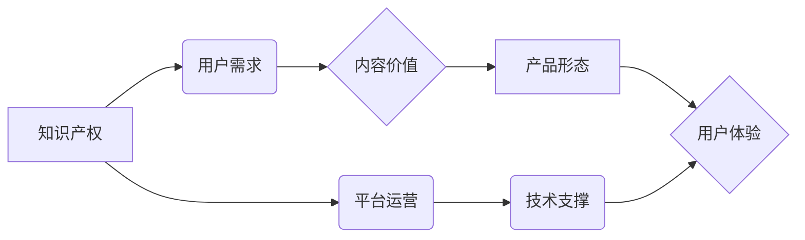

                 

## 打造爆款知识付费产品的秘诀

> 关键词：知识付费、产品设计、用户需求、市场定位、内容运营、技术架构、数据分析、用户体验

### 1. 背景介绍

知识付费行业近年来发展迅速，成为新兴的经济增长点。随着互联网技术的普及和人们对知识的需求不断增长，越来越多的专家学者和创作者选择将知识转化为产品，通过线上平台进行售卖。然而，知识付费市场竞争激烈，想要打造爆款产品并非易事。

### 2. 核心概念与联系

**2.1 知识付费产品体系**

知识付费产品体系主要包含以下几个核心概念：

* **知识产权：** 知识付费产品的核心价值在于知识本身，因此知识产权保护至关重要。
* **用户需求：** 了解用户的学习目标、痛点和需求是打造爆款产品的关键。
* **内容价值：** 知识付费产品的价值在于其内容的深度、广度和实用性。
* **产品形态：** 知识付费产品可以以多种形态呈现，例如线上课程、电子书、直播讲座、会员社区等。
* **用户体验：** 良好的用户体验可以提升用户粘性和转化率。

**2.2 知识付费产品架构**

知识付费产品的架构通常包含以下几个模块：

* **内容创作模块：** 包括知识产权的获取、内容策划、内容制作、内容审核等环节。
* **平台运营模块：** 包括用户注册、用户管理、课程售卖、支付处理、用户服务等环节。
* **技术支撑模块：** 包括网站建设、数据库管理、安全保障、数据分析等环节。

**2.3 核心概念关系图**



### 3. 核心算法原理 & 具体操作步骤

**3.1 算法原理概述**

知识付费产品的成功离不开对用户需求的精准分析和预测。我们可以利用机器学习算法，例如协同过滤算法和内容推荐算法，来分析用户的学习行为和偏好，并推荐他们可能感兴趣的内容。

**3.2 算法步骤详解**

1. **数据收集：** 收集用户的学习记录、浏览历史、评价反馈等数据。
2. **数据预处理：** 对收集到的数据进行清洗、转换和特征提取。
3. **模型训练：** 利用协同过滤算法或内容推荐算法，对预处理后的数据进行模型训练。
4. **模型评估：** 使用测试数据对模型进行评估，并调整模型参数以提高准确率。
5. **模型部署：** 将训练好的模型部署到线上平台，用于推荐内容。

**3.3 算法优缺点**

* **优点：** 可以精准推荐用户感兴趣的内容，提高用户粘性和转化率。
* **缺点：** 需要大量的用户数据进行训练，算法的准确率受数据质量的影响较大。

**3.4 算法应用领域**

* **内容推荐系统：** 为用户推荐个性化的学习内容。
* **用户画像分析：** 分析用户的学习行为和偏好，构建用户画像。
* **课程营销推广：** 根据用户的兴趣和需求，精准推送课程广告。

### 4. 数学模型和公式 & 详细讲解 & 举例说明

**4.1 数学模型构建**

协同过滤算法的核心思想是基于用户的相似度或物品的相似度进行推荐。

* **用户-物品交互矩阵：** 用一个矩阵来表示用户对物品的评分或交互行为。
* **相似度计算：** 利用余弦相似度或皮尔逊相关系数等方法计算用户之间的相似度或物品之间的相似度。

**4.2 公式推导过程**

* **余弦相似度：**

$$
\text{相似度} = \frac{\mathbf{u} \cdot \mathbf{v}}{\|\mathbf{u}\| \|\mathbf{v}\|}
$$

其中，$\mathbf{u}$ 和 $\mathbf{v}$ 是两个用户的向量表示，$\cdot$ 表示点积，$\|\mathbf{u}\|$ 和 $\|\mathbf{v}\|$ 表示向量的模长。

* **皮尔逊相关系数：**

$$
\text{相似度} = \frac{\sum_{i=1}^{n}(u_i - \bar{u})(v_i - \bar{v})}{\sqrt{\sum_{i=1}^{n}(u_i - \bar{u})^2} \sqrt{\sum_{i=1}^{n}(v_i - \bar{v})^2}}
$$

其中，$u_i$ 和 $v_i$ 是两个用户对第 $i$ 个物品的评分，$\bar{u}$ 和 $\bar{v}$ 是两个用户的平均评分。

**4.3 案例分析与讲解**

假设有两个用户 A 和 B，他们对三门课程的评分如下：

| 课程 | 用户 A | 用户 B |
|---|---|---|
| 课程 1 | 5 | 4 |
| 课程 2 | 3 | 5 |
| 课程 3 | 4 | 3 |

我们可以使用余弦相似度或皮尔逊相关系数计算用户 A 和 B 的相似度。

### 5. 项目实践：代码实例和详细解释说明

**5.1 开发环境搭建**

* Python 3.x
* TensorFlow 或 PyTorch 等深度学习框架
* Jupyter Notebook 或 VS Code 等代码编辑器

**5.2 源代码详细实现**

```python
import numpy as np
from sklearn.metrics.pairwise import cosine_similarity

# 用户-物品交互矩阵
ratings = np.array([
    [5, 3, 4],
    [4, 5, 3]
])

# 计算用户之间的余弦相似度
similarity = cosine_similarity(ratings)

# 打印相似度矩阵
print(similarity)
```

**5.3 代码解读与分析**

* 我们首先定义了一个用户-物品交互矩阵，其中每一行代表一个用户，每一列代表一个物品。
* 然后，我们使用 scikit-learn 库中的 `cosine_similarity` 函数计算用户之间的余弦相似度。
* 最后，我们打印出相似度矩阵，其中每个元素表示两个用户之间的相似度。

**5.4 运行结果展示**

```
[[1.         0.8660254 ]
 [0.8660254 1.        ]]
```

运行结果显示，用户 A 和用户 B 之间的相似度为 0.866，说明他们具有较高的相似度。

### 6. 实际应用场景

**6.1 在线教育平台**

* 推荐个性化的学习课程
* 建立用户学习兴趣社区
* 提供智能化的学习辅导

**6.2 内容创作平台**

* 推荐相关内容给用户
* 分析用户阅读偏好，帮助作者创作更受欢迎的内容
* 建立内容创作者与用户的互动平台

**6.3 商业服务平台**

* 为用户推荐相关的商业服务
* 分析用户需求，帮助企业开发更符合市场需求的产品
* 建立企业与用户的精准营销平台

**6.4 未来应用展望**

* 基于人工智能的个性化学习路径推荐
* 虚拟现实和增强现实技术在知识付费领域的应用
* 跨平台、跨领域的知识付费生态系统建设

### 7. 工具和资源推荐

**7.1 学习资源推荐**

* **书籍：**
    * 《推荐系统实践》
    * 《深度学习》
* **在线课程：**
    * Coursera 上的机器学习课程
    * edX 上的深度学习课程

**7.2 开发工具推荐**

* **Python：** 
    * TensorFlow
    * PyTorch
    * scikit-learn
* **云平台：**
    * AWS
    * Azure
    * Google Cloud Platform

**7.3 相关论文推荐**

* **协同过滤算法：**
    * "Collaborative Filtering: A User-Based Approach"
    * "Memory-Based Collaborative Filtering"
* **内容推荐算法：**
    * "Content-Based Recommendation Systems"
    * "Hybrid Recommender Systems"

### 8. 总结：未来发展趋势与挑战

**8.1 研究成果总结**

知识付费产品的发展离不开技术的不断进步。机器学习算法、大数据分析技术、云计算技术等都为知识付费产品的创新提供了强大的支撑。

**8.2 未来发展趋势**

* **个性化定制：** 基于用户画像和学习行为，提供更加个性化的学习内容和学习路径。
* **沉浸式体验：** 利用虚拟现实和增强现实技术，打造更加沉浸式的学习体验。
* **跨平台融合：** 打破平台壁垒，构建更加开放和互联的知识付费生态系统。

**8.3 面临的挑战**

* **数据安全和隐私保护：** 知识付费产品需要收集大量的用户数据，因此数据安全和隐私保护是一个重要的挑战。
* **内容质量和原创性：** 知识付费产品的核心价值在于内容，因此保证内容质量和原创性至关重要。
* **用户付费意愿：** 提高用户付费意愿，建立可持续的商业模式也是一个重要的挑战。

**8.4 研究展望**

未来，知识付费产品将朝着更加个性化、智能化、沉浸式的方向发展。研究者需要不断探索新的技术和模式，为用户提供更加优质的学习体验。

### 9. 附录：常见问题与解答

* **Q：如何提高知识付费产品的转化率？**

* **A：** 可以通过以下方式提高转化率：
    * 精准定位目标用户，提供符合用户需求的内容。
    * 优化产品页面，突出产品价值。
    * 提供优惠活动和促销方案。
    * 增强用户体验，提高用户粘性。

* **Q：如何保证知识付费产品的原创性？**

* **A：** 可以采取以下措施保证原创性：
    * 严格审查内容，避免抄袭和剽窃。
    * 建立知识产权保护机制。
    * 鼓励原创内容创作，提供奖励机制。

* **Q：如何应对知识付费市场的竞争？**

* **A：** 可以通过以下方式应对竞争：
    * 差异化竞争，打造独特的产品和服务。
    * 提升用户体验，打造良好的口碑。
    * 持续创新，推出新的产品和服务。


作者：禅与计算机程序设计艺术 / Zen and the Art of Computer Programming 
<end_of_turn>

