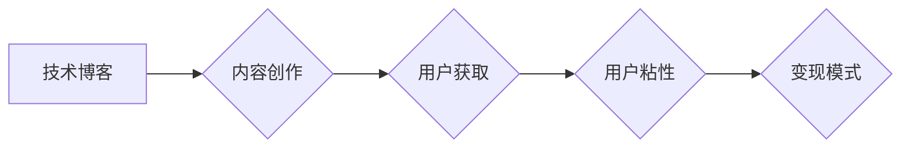

                 

## 技术博客：从爱好到主要收入来源

> 关键词：编程，副业，开源，技术博客，收入，软件开发，技术写作

> 摘要：本文探讨了将编程爱好转化为主要收入来源的路径，从技术博客的搭建和内容创作，到开源项目开发和技术咨询，为有志于将技术技能变现的读者提供实用建议和思考方向。

## 1. 背景介绍

在当今数字时代，编程技能已成为一项炙手可热的技能，越来越多的爱好者希望将自己的技术热情转化为经济效益。然而，从零基础到成为一名合格的程序员，需要付出大量的学习和实践。而技术博客的兴起为爱好者提供了展示技术能力、积累经验和获取收入的平台。

技术博客可以帮助程序员记录学习过程、分享技术经验、建立个人品牌，并通过广告、赞助、课程销售等方式获得收入。随着互联网的发展和内容消费的增长，技术博客已成为程序员副业和主要收入来源的重要途径之一。

## 2. 核心概念与联系

### 2.1 技术博客的本质

技术博客的核心是内容，它需要提供有价值的技术信息，帮助读者解决实际问题，并吸引读者持续关注。

### 2.2 技术博客的价值链

技术博客的价值链可以概括为以下几个环节：

* **内容创作:**  撰写高质量的技术文章，涵盖编程语言、框架、工具、算法等方面。
* **用户获取:** 通过搜索引擎优化、社交媒体推广等方式吸引目标用户访问博客。
* **用户粘性:**  提供互动功能，例如评论区、论坛等，增强用户粘性。
* **变现模式:**  通过广告、赞助、课程销售、产品推广等方式实现变现。

**Mermaid 流程图**

## 3. 核心算法原理 & 具体操作步骤

### 3.1 算法原理概述

技术博客的成功运营需要一定的算法原理支撑，例如：

* **搜索引擎优化 (SEO):** 通过优化博客内容和结构，提高搜索引擎排名，吸引更多用户访问。
* **社交媒体营销:** 利用社交媒体平台推广博客内容，扩大影响力。
* **内容推荐算法:**  根据用户阅读历史和兴趣，推荐相关内容，提高用户粘性。

### 3.2 算法步骤详解

**SEO 算法步骤:**

1. **关键词研究:**  确定目标用户搜索的关键词，并将其融入博客内容中。
2. **内容优化:**  撰写高质量、原创的内容，并优化标题、描述、图片等元素。
3. **网站结构优化:**  构建清晰的网站结构，方便用户导航和搜索引擎抓取。
4. **链接建设:**  获得其他网站的链接，提高博客权重。

**社交媒体营销算法步骤:**

1. **平台选择:**  选择与目标用户活跃的社交媒体平台。
2. **内容创作:**  创作吸引眼球、易于分享的内容。
3. **互动推广:**  积极参与平台讨论，与用户互动。
4. **广告投放:**  利用平台广告功能，精准触达目标用户。

### 3.3 算法优缺点

**SEO 算法:**

* **优点:**  长期效果显著，可以持续吸引用户流量。
* **缺点:**  需要投入大量时间和精力，效果难以快速体现。

**社交媒体营销算法:**

* **优点:**  效果快速可见，可以快速扩大影响力。
* **缺点:**  成本较高，需要持续投入，效果难以长期保持。

### 3.4 算法应用领域

SEO 和社交媒体营销算法广泛应用于技术博客的运营，可以帮助博客提高曝光率、吸引用户、实现变现。

## 4. 数学模型和公式 & 详细讲解 & 举例说明

### 4.1 数学模型构建

技术博客的收入可以看作是一个函数，其输入是博客的流量和用户转化率，输出是博客的收入。

**公式:**

$$
Revenue = Traffic \times Conversion Rate \times Average Revenue Per User
$$

其中:

* **Traffic:** 博客的访问量
* **Conversion Rate:** 用户转化率，即访问博客的用户中购买商品或服务的比例
* **Average Revenue Per User:**  每个用户平均消费金额

### 4.2 公式推导过程

该公式的推导过程基于以下假设:

* 博客的收入主要来自用户购买商品或服务。
* 用户转化率和平均消费金额是可控的因素。

### 4.3 案例分析与讲解

假设一个技术博客每月有 10,000 个访问量，用户转化率为 1%，平均消费金额为 $100，那么该博客的每月收入为:

$$
Revenue = 10,000 \times 0.01 \times 100 = $1,000
$$

## 5. 项目实践：代码实例和详细解释说明

### 5.1 开发环境搭建

技术博客的开发环境搭建需要以下工具:

* **文本编辑器:**  例如 Visual Studio Code, Sublime Text 等
* **版本控制系统:**  例如 Git, GitHub 等
* **网站服务器:**  例如 Apache, Nginx 等
* **数据库:**  例如 MySQL, PostgreSQL 等

### 5.2 源代码详细实现

技术博客的源代码实现可以使用多种技术栈，例如:

* **前端:**  HTML, CSS, JavaScript
* **后端:**  Python, Node.js, PHP 等
* **框架:**  Django, Flask, React, Vue.js 等

### 5.3 代码解读与分析

技术博客的源代码需要包含以下模块:

* **博客内容管理:**  用于创建、编辑、发布博客文章
* **用户管理:**  用于注册、登录、管理用户账户
* **评论系统:**  用于用户评论博客文章
* **搜索功能:**  用于用户搜索博客文章
* **广告管理:**  用于展示广告

### 5.4 运行结果展示

技术博客的运行结果展示是一个完整的网站，用户可以通过浏览器访问网站，阅读博客文章、发表评论、注册账户等。

## 6. 实际应用场景

### 6.1 技术博客的应用场景

技术博客可以应用于以下场景:

* **个人品牌建设:**  展示技术能力、积累经验、建立个人品牌。
* **副业收入:**  通过广告、赞助、课程销售等方式获得收入。
* **技术交流:**  与其他程序员交流技术经验，共同学习进步。
* **开源项目推广:**  推广开源项目，吸引贡献者。

### 6.2 技术博客的未来应用展望

随着人工智能、大数据等技术的不断发展，技术博客将更加智能化、个性化，例如:

* **智能内容推荐:**  根据用户的阅读历史和兴趣，推荐更精准的内容。
* **个性化学习路径:**  根据用户的技术水平和学习目标，提供个性化的学习路径。
* **虚拟社区:**  构建虚拟社区，方便程序员交流互动。

## 7. 工具和资源推荐

### 7.1 学习资源推荐

* **在线学习平台:**  Coursera, Udemy, edX 等
* **技术博客:**  Hacker News, Medium, Dev.to 等
* **开源社区:**  GitHub, Stack Overflow 等

### 7.2 开发工具推荐

* **文本编辑器:**  Visual Studio Code, Sublime Text 等
* **版本控制系统:**  Git, GitHub 等
* **网站服务器:**  Apache, Nginx 等
* **数据库:**  MySQL, PostgreSQL 等

### 7.3 相关论文推荐

* **The Impact of Social Media on Technology Adoption**
* **The Role of Content Marketing in Technology Businesses**
* **The Future of Online Learning**

## 8. 总结：未来发展趋势与挑战

### 8.1 研究成果总结

本文探讨了将编程爱好转化为主要收入来源的路径，从技术博客的搭建和内容创作，到开源项目开发和技术咨询，为有志于将技术技能变现的读者提供实用建议和思考方向。

### 8.2 未来发展趋势

技术博客将更加智能化、个性化，并与其他技术融合，例如人工智能、大数据等，为用户提供更优质的服务。

### 8.3 面临的挑战

技术博客的运营面临着以下挑战:

* **内容竞争:**  技术领域内容竞争激烈，需要不断创作高质量、原创的内容。
* **变现模式:**  技术博客的变现模式需要不断探索，寻找新的盈利模式。
* **用户粘性:**  需要不断提升用户体验，提高用户粘性。

### 8.4 研究展望

未来研究方向可以包括:

* **技术博客的智能化运营:**  利用人工智能技术，实现博客内容的智能推荐、自动生成、个性化定制等功能。
* **技术博客的变现模式创新:**  探索新的变现模式，例如知识付费、会员制等。
* **技术博客的社区建设:**  构建虚拟社区，方便程序员交流互动，共同学习进步。

## 9. 附录：常见问题与解答

### 9.1 如何选择技术博客平台?

选择技术博客平台需要考虑以下因素:

* **功能:**  平台是否提供所需的博客功能，例如内容管理、用户管理、评论系统等。
* **易用性:**  平台是否易于使用，是否提供完善的文档和教程。
* **价格:**  平台的收费模式是否合理，是否适合自己的预算。
* **社区:**  平台是否有活跃的社区，是否可以获得技术支持和交流。

### 9.2 如何提高技术博客的流量?

提高技术博客的流量需要采取以下措施:

* **搜索引擎优化 (SEO):**  优化博客内容和结构，提高搜索引擎排名。
* **社交媒体推广:**  利用社交媒体平台推广博客内容，扩大影响力。
* **内容营销:**  创作高质量、原创的内容，吸引用户阅读和分享。
* **付费广告:**  利用平台广告功能，精准触达目标用户。

### 9.3 如何变现技术博客?

技术博客的变现模式包括:

* **广告:**  在博客上展示广告，获得广告收入。
* **赞助:**  与企业合作，进行产品推广或内容赞助。
* **课程销售:**  开发和销售技术课程。
* **电子书销售:**  编写和销售技术电子书。
* **会员制:**  提供付费会员服务，获得会员订阅收入。

作者：禅与计算机程序设计艺术 / Zen and the Art of Computer Programming 
<end_of_turn>

