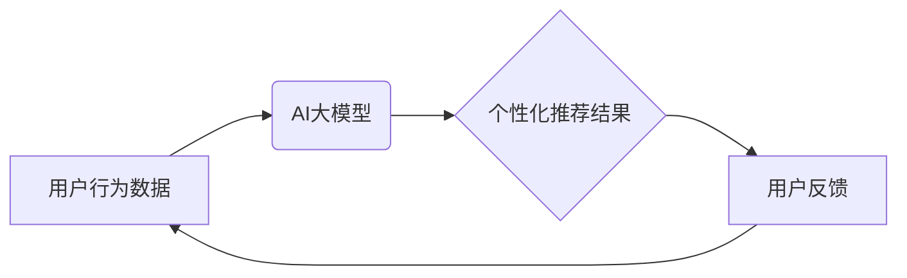

                 

## 推荐系统中AI大模型的实时个性化

> 关键词：推荐系统、AI大模型、个性化推荐、实时性、Transformer、联邦学习、冷启动问题

## 1. 背景介绍

推荐系统作为互联网时代的核心技术之一，在电商、社交媒体、视频平台等领域发挥着至关重要的作用。传统的基于协同过滤和内容过滤的推荐算法，虽然取得了一定的成功，但随着用户行为数据量的激增和用户个性化的需求不断提高，传统的算法逐渐难以满足用户的需求。

近年来，深度学习技术的蓬勃发展为推荐系统带来了新的机遇。AI大模型，特别是基于Transformer架构的模型，凭借其强大的语义理解和序列建模能力，在推荐系统领域展现出巨大的潜力。

然而，将AI大模型应用于推荐系统面临着一些挑战：

* **实时性:**  AI大模型通常需要大量的计算资源和时间进行训练和推理，难以满足推荐系统的实时性要求。
* **个性化:**  如何充分利用用户行为数据，为每个用户提供个性化的推荐仍然是一个难题。
* **数据隐私:**  用户数据隐私保护是AI大模型应用中的重要问题。

## 2. 核心概念与联系

### 2.1  AI大模型

AI大模型是指在海量数据上训练的深度学习模型，拥有强大的泛化能力和学习能力。常见的AI大模型包括GPT-3、BERT、T5等。

### 2.2  推荐系统

推荐系统旨在根据用户的历史行为、偏好和上下文信息，预测用户可能感兴趣的物品，并将其推荐给用户。

### 2.3  实时个性化推荐

实时个性化推荐是指根据用户的实时行为和上下文信息，动态调整推荐结果，为每个用户提供个性化的推荐。

**核心概念与联系流程图:**



## 3. 核心算法原理 & 具体操作步骤

### 3.1  算法原理概述

基于AI大模型的实时个性化推荐算法通常采用以下步骤：

1. **数据预处理:** 收集用户行为数据，并进行清洗、转换和特征工程。
2. **模型训练:** 使用AI大模型训练一个推荐模型，该模型能够学习用户行为数据中的模式和关系。
3. **实时推理:** 当用户进行交互时，将用户的实时行为和上下文信息作为输入，通过训练好的模型进行推理，生成个性化的推荐结果。
4. **结果展示:** 将推荐结果展示给用户，并收集用户的反馈信息。

### 3.2  算法步骤详解

1. **数据预处理:**

* **数据收集:** 收集用户行为数据，包括用户点击、浏览、购买、评分等行为。
* **数据清洗:** 去除无效数据、重复数据和错误数据。
* **数据转换:** 将数据转换为模型可识别的格式。
* **特征工程:**  提取用户行为数据中的特征，例如用户性别、年龄、兴趣爱好、购买历史等。

2. **模型训练:**

* **选择模型架构:** 选择合适的AI大模型架构，例如Transformer、BERT等。
* **数据划分:** 将数据划分为训练集、验证集和测试集。
* **模型训练:** 使用训练集训练模型，并使用验证集进行模型调优。
* **模型评估:** 使用测试集评估模型的性能，例如准确率、召回率、F1-score等。

3. **实时推理:**

* **数据获取:** 获取用户的实时行为和上下文信息。
* **数据预处理:** 对实时数据进行预处理，例如特征提取。
* **模型推理:** 将预处理后的数据作为输入，通过训练好的模型进行推理，生成个性化的推荐结果。

4. **结果展示:**

* **推荐结果展示:** 将推荐结果以列表、卡片等形式展示给用户。
* **用户反馈收集:** 收集用户的反馈信息，例如点击、评分、购买等。

### 3.3  算法优缺点

**优点:**

* **个性化推荐:** AI大模型能够学习用户行为数据中的复杂模式和关系，为每个用户提供个性化的推荐。
* **实时性:**  通过模型压缩和优化技术，可以实现AI大模型的实时推理。
* **泛化能力:**  AI大模型具有强大的泛化能力，能够适应不同的推荐场景。

**缺点:**

* **计算资源:**  训练和推理AI大模型需要大量的计算资源。
* **数据隐私:**  AI大模型的训练需要大量用户数据，如何保护用户数据隐私是一个重要问题。
* **冷启动问题:**  对于新用户或新物品，AI大模型难以进行准确的推荐。

### 3.4  算法应用领域

* **电商推荐:**  推荐商品、优惠券、促销活动等。
* **社交媒体推荐:**  推荐好友、群组、内容等。
* **视频平台推荐:**  推荐视频、电视剧、电影等。
* **音乐平台推荐:**  推荐歌曲、专辑、歌手等。

## 4. 数学模型和公式 & 详细讲解 & 举例说明

### 4.1  数学模型构建

基于AI大模型的实时个性化推荐系统通常采用以下数学模型：

* **用户嵌入:** 将用户转换为低维向量，表示用户的兴趣和偏好。
* **物品嵌入:** 将物品转换为低维向量，表示物品的特征和属性。
* **相似度计算:** 计算用户嵌入和物品嵌入之间的相似度，作为推荐评分的依据。

### 4.2  公式推导过程

**用户嵌入:**

$$
u_i = \text{Embedding}(user_i)
$$

**物品嵌入:**

$$
v_j = \text{Embedding}(item_j)
$$

**相似度计算:**

$$
score(u_i, v_j) = \text{CosineSimilarity}(u_i, v_j)
$$

其中，

* $u_i$ 表示用户 $i$ 的嵌入向量。
* $v_j$ 表示物品 $j$ 的嵌入向量。
* $\text{Embedding}$ 表示嵌入函数。
* $\text{CosineSimilarity}$ 表示余弦相似度函数。

### 4.3  案例分析与讲解

假设我们有一个电商平台，用户 $A$ 喜欢购买电子产品，用户 $B$ 喜欢购买服装。

* 用户 $A$ 的嵌入向量可能包含“电子产品”、“手机”、“电脑”等关键词的权重。
* 用户 $B$ 的嵌入向量可能包含“服装”、“衣服”、“鞋子”等关键词的权重。

当平台推荐新商品时，可以计算新商品的嵌入向量与用户嵌入向量的相似度，并根据相似度排序推荐商品。

## 5. 项目实践：代码实例和详细解释说明

### 5.1  开发环境搭建

* **操作系统:**  Linux/macOS/Windows
* **编程语言:**  Python
* **深度学习框架:**  TensorFlow/PyTorch
* **其他工具:**  Git、Jupyter Notebook

### 5.2  源代码详细实现

```python
import tensorflow as tf

# 定义用户嵌入层
user_embedding = tf.keras.layers.Embedding(input_dim=1000, output_dim=64)

# 定义物品嵌入层
item_embedding = tf.keras.layers.Embedding(input_dim=1000, output_dim=64)

# 定义推荐模型
def recommend_model(user_id, item_id):
    user_embedding_vector = user_embedding(tf.expand_dims(user_id, axis=0))
    item_embedding_vector = item_embedding(tf.expand_dims(item_id, axis=0))
    similarity = tf.reduce_sum(user_embedding_vector * item_embedding_vector, axis=1)
    return similarity

# 训练模型
# ...

# 实时推理
user_id = 123
item_id = 456
similarity = recommend_model(user_id, item_id)
print(similarity)
```

### 5.3  代码解读与分析

* 代码首先定义了用户嵌入层和物品嵌入层，用于将用户和物品转换为低维向量。
* 然后定义了一个推荐模型，该模型接受用户ID和物品ID作为输入，计算用户和物品的相似度。
* 最后，代码演示了如何使用训练好的模型进行实时推理，并输出用户和物品的相似度。

### 5.4  运行结果展示

运行结果将是一个数值，表示用户和物品之间的相似度。数值越大，表示用户和物品越相似，推荐效果越好。

## 6. 实际应用场景

### 6.1  电商推荐

* **商品推荐:**  根据用户的购买历史、浏览记录和兴趣爱好，推荐相关的商品。
* **个性化促销:**  根据用户的消费习惯和偏好，推送个性化的促销活动和优惠券。

### 6.2  社交媒体推荐

* **好友推荐:**  根据用户的兴趣爱好和社交关系，推荐潜在的好友。
* **群组推荐:**  根据用户的兴趣爱好和社交关系，推荐相关的群组。
* **内容推荐:**  根据用户的阅读历史、点赞记录和关注内容，推荐相关的文章、视频和图片。

### 6.3  视频平台推荐

* **视频推荐:**  根据用户的观看历史、点赞记录和评论内容，推荐相关的视频。
* **电视剧推荐:**  根据用户的观看历史和喜好，推荐相关的电视剧。
* **电影推荐:**  根据用户的观看历史和喜好，推荐相关的电影。

### 6.4  未来应用展望

* **多模态推荐:**  结合文本、图像、音频等多模态数据进行推荐，提供更丰富的用户体验。
* **联邦学习:**  利用联邦学习技术，在不泄露用户数据的情况下，训练个性化推荐模型。
* **增强现实 (AR) 和虚拟现实 (VR) 推荐:**  利用 AR 和 VR 技术，为用户提供更沉浸式的推荐体验。

## 7. 工具和资源推荐

### 7.1  学习资源推荐

* **书籍:**  
    * 《深度学习》 by Ian Goodfellow, Yoshua Bengio, and Aaron Courville
    * 《推荐系统实践》 by  Richard S. Sutton and Andrew G. Barto
* **在线课程:**  
    * Coursera:  Machine Learning by Andrew Ng
    * Udacity:  Deep Learning Nanodegree
* **博客和网站:**  
    * Towards Data Science
    * Machine Learning Mastery

### 7.2  开发工具推荐

* **深度学习框架:**  TensorFlow, PyTorch
* **数据处理工具:**  Pandas, NumPy
* **云计算平台:**  AWS, Google Cloud, Azure

### 7.3  相关论文推荐

* **BERT:**  BERT: Pre-training of Deep Bidirectional Transformers for Language Understanding
* **Transformer:**  Attention Is All You Need
* **推荐系统:**  Collaborative Filtering for Implicit Feedback Datasets

## 8. 总结：未来发展趋势与挑战

### 8.1  研究成果总结

基于AI大模型的实时个性化推荐系统取得了显著的成果，能够为用户提供更精准、更个性化的推荐体验。

### 8.2  未来发展趋势

* **模型架构创新:**  探索新的AI大模型架构，提高模型的效率和性能。
* **多模态融合:**  结合文本、图像、音频等多模态数据，构建更全面的用户画像。
* **联邦学习:**  利用联邦学习技术，保护用户数据隐私，实现个性化推荐的公平性和可信度。
* **解释性AI:**  提高推荐系统的可解释性，帮助用户理解推荐结果背后的逻辑。

### 8.3  面临的挑战

* **数据隐私:**  如何保护用户数据隐私，是AI大模型应用中的重要挑战。
* **计算资源:**  训练和推理AI大模型需要大量的计算资源，成本较高。
* **冷启动问题:**  对于新用户或新物品，AI大模型难以进行准确的推荐。

### 8.4  研究展望

未来，基于AI大模型的实时个性化推荐系统将朝着更智能、更个性化、更安全的方向发展。


## 9. 附录：常见问题与解答

**Q1:  如何解决AI大模型的冷启动问题？**

**A1:**  

* **利用用户提供的基本信息:**  例如用户性别、年龄、兴趣爱好等，进行初始化推荐。
* **利用协同过滤技术:**  根据与用户行为相似的其他用户的推荐结果，进行推荐。
* **利用内容过滤技术:**  根据物品的特征和属性，进行推荐。

**Q2:  如何保护用户数据隐私？**

**A2:**  

* **联邦学习:**  利用联邦学习技术，在不泄露用户数据的情况下，训练个性化推荐模型。
* **差分隐私:**  利用差分隐私技术，对用户数据进行匿名化处理。
* **同态加密:**  利用同态加密技术，对用户数据进行加密，保证数据安全。


作者：禅与计算机程序设计艺术 / Zen and the Art of Computer Programming 
<end_of_turn>

