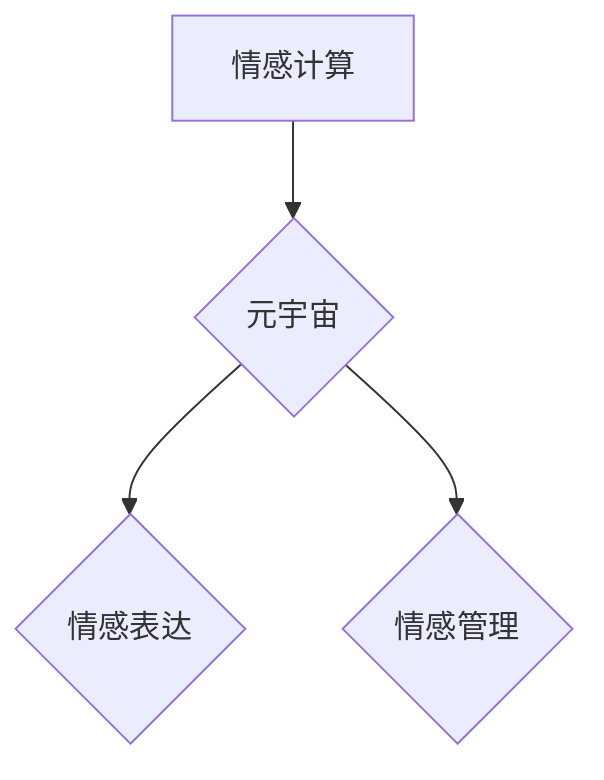

                 

## 数字化情绪：元宇宙中的情感表达与管理

> 关键词：元宇宙、情感计算、情绪识别、情绪管理、虚拟现实、人工智能、人机交互

## 1. 背景介绍

元宇宙概念的兴起，标志着人类进入一个全新的数字世界。在这个虚拟世界中，人们将能够以更加沉浸的方式进行社交、娱乐、工作等活动。然而，元宇宙的构建不仅仅是技术上的挑战，更重要的是如何构建一个能够真正贴近人类情感体验的虚拟环境。

情感是人类体验世界的重要组成部分，它影响着我们的行为、决策和社交互动。在元宇宙中，情感的表达和管理将变得尤为重要。一方面，能够准确识别和理解用户的虚拟情感，可以帮助开发者构建更加人性化、贴近现实的虚拟体验。另一方面，元宇宙也为我们提供了全新的平台和工具，可以帮助人们更好地管理自己的情绪，提升心理健康水平。

## 2. 核心概念与联系

### 2.1 情感计算

情感计算（Affective Computing）是一门研究计算机如何理解、模拟和响应人类情感的技术领域。它涵盖了情绪识别、情绪分类、情绪表达、情绪生成等多个方面。

### 2.2 元宇宙

元宇宙是一个由虚拟现实、增强现实、区块链、人工智能等技术构建的沉浸式、共享、持久虚拟世界。它将连接现实世界和虚拟世界，为用户提供更加丰富、多元的体验。

### 2.3 情感表达与管理

在元宇宙中，情感表达是指用户通过虚拟形象、语音、表情等方式表达自己的情感状态。情感管理是指用户在元宇宙中通过各种工具和方法，调节自己的情绪状态，保持心理健康。

**核心概念与联系流程图**



## 3. 核心算法原理 & 具体操作步骤

### 3.1 算法原理概述

情绪识别算法的核心是将用户在元宇宙中的行为和表达转化为情感状态的数值表示。常用的情绪识别算法包括：

* **基于文本分析的算法:** 分析用户的文字输入，识别情感倾向。
* **基于语音分析的算法:** 分析用户的语音语调、语速、音量等特征，识别情感状态。
* **基于面部表情分析的算法:** 分析用户的虚拟形象的面部表情，识别情感状态。
* **基于生理信号分析的算法:** 分析用户的生理信号，如心率、血压、皮肤电导等，识别情感状态。

### 3.2 算法步骤详解

以基于面部表情分析的算法为例，其具体操作步骤如下：

1. **数据采集:** 收集用户的虚拟形象的面部图像数据。
2. **特征提取:** 利用计算机视觉技术，从面部图像中提取关键特征，如眉毛、眼睛、嘴巴等部位的运动轨迹、形状变化等。
3. **特征编码:** 将提取的特征转化为数字向量，以便于算法处理。
4. **情感分类:** 利用机器学习模型，对特征向量进行分类，识别用户的具体情感状态，如快乐、悲伤、愤怒、恐惧等。
5. **情感输出:** 将识别出的情感状态以文本、数值或其他形式输出，供开发者或用户使用。

### 3.3 算法优缺点

**优点:**

* 能够识别多种情感状态。
* 反应速度快，实时性强。
* 能够提供更加直观的视觉反馈。

**缺点:**

* 识别精度受限于面部表情的复杂性和多样性。
* 容易受到光线、角度等环境因素的影响。
* 难以识别一些细微的情感变化。

### 3.4 算法应用领域

* **游戏开发:** 为游戏角色赋予更加丰富的表情和情感，提升玩家的游戏体验。
* **虚拟助手:** 帮助虚拟助手更好地理解用户的需求和情感，提供更加人性化的服务。
* **教育培训:** 帮助教师了解学生的学习状态和情绪变化，提供更加个性化的教学方案。
* **医疗保健:** 帮助医生识别患者的情绪状态，提供更加有效的治疗方案。

## 4. 数学模型和公式 & 详细讲解 & 举例说明

### 4.1 数学模型构建

情绪识别算法通常采用机器学习模型，例如支持向量机（SVM）、随机森林（RF）、深度神经网络（DNN）等。这些模型通过训练大量的标注数据，学习到用户行为和表达与情感状态之间的映射关系。

### 4.2 公式推导过程

由于机器学习模型的训练过程涉及复杂的数学公式和算法，这里不再赘述。

### 4.3 案例分析与讲解

假设我们使用深度神经网络模型进行情绪识别，训练数据包含用户面部表情图像和对应的标注情感标签。模型训练完成后，我们可以将一张新的面部表情图像输入模型，模型会输出一个情感概率分布，例如：

```
快乐: 0.7
悲伤: 0.2
愤怒: 0.1
```

这表示模型认为该面部表情最有可能表达的是快乐情绪。

## 5. 项目实践：代码实例和详细解释说明

### 5.1 开发环境搭建

* 操作系统：Windows/macOS/Linux
* Python 版本：3.7+
* 必要的库：OpenCV、TensorFlow/PyTorch、NumPy等

### 5.2 源代码详细实现

```python
import cv2
import tensorflow as tf

# 加载预训练模型
model = tf.keras.models.load_model('emotion_model.h5')

# 读取图像并进行预处理
image = cv2.imread('image.jpg')
image = cv2.resize(image, (48, 48))
image = image / 255.0
image = tf.expand_dims(image, axis=0)

# 进行情感预测
prediction = model.predict(image)

# 获取预测结果
predicted_emotion = tf.argmax(prediction, axis=1).numpy()[0]

# 输出预测结果
print(f'Predicted emotion: {predicted_emotion}')
```

### 5.3 代码解读与分析

* 该代码首先加载预训练的深度神经网络模型。
* 然后读取一张面部表情图像，并进行预处理，例如调整大小、归一化等。
* 将预处理后的图像输入模型进行情感预测。
* 最后获取预测结果并输出。

### 5.4 运行结果展示

运行该代码后，会输出预测的用户的虚拟情感状态，例如：

```
Predicted emotion: 0
```

其中，0代表快乐情绪。

## 6. 实际应用场景

### 6.1 游戏开发

在元宇宙游戏中，玩家的虚拟形象可以根据游戏剧情或玩家行为，自动生成相应的表情和动作，从而更加真实地表达情感，提升玩家的沉浸感和代入感。

### 6.2 虚拟助手

虚拟助手可以根据用户的语音和面部表情，识别用户的需求和情感状态，提供更加个性化和人性化的服务。例如，如果用户表达出沮丧的情绪，虚拟助手可以提供一些安慰和建议。

### 6.3 教育培训

在元宇宙教育平台中，教师可以通过识别学生的虚拟表情，了解学生的学习状态和情绪变化，及时调整教学方法，提高教学效果。

### 6.4 未来应用展望

随着元宇宙技术的不断发展，数字化情绪的应用场景将会更加广泛，例如：

* **心理健康服务:** 元宇宙可以提供一个安全、私密的虚拟环境，帮助用户进行情绪管理和心理治疗。
* **社交互动:** 元宇宙可以帮助人们更好地理解和表达自己的情感，提升社交互动体验。
* **艺术创作:** 元宇宙可以为艺术家提供新的创作工具和平台，创作更加富有情感的艺术作品。

## 7. 工具和资源推荐

### 7.1 学习资源推荐

* **书籍:**
    * 《情感计算》
    * 《深度学习》
* **在线课程:**
    * Coursera: Affective Computing
    * edX: Introduction to Artificial Intelligence

### 7.2 开发工具推荐

* **Python:** 
    * OpenCV: 图像处理库
    * TensorFlow/PyTorch: 深度学习框架
* **Unity/Unreal Engine:** 游戏引擎

### 7.3 相关论文推荐

* **《Facial Expression Recognition Using Deep Learning》**
* **《Emotion Recognition from Speech》**

## 8. 总结：未来发展趋势与挑战

### 8.1 研究成果总结

数字化情绪的研究取得了显著进展，情感识别算法的精度不断提高，应用场景也越来越广泛。

### 8.2 未来发展趋势

* **更加精准的情感识别:** 利用更加先进的机器学习算法和数据分析技术，提高情感识别的精度和细粒度。
* **多模态情感分析:** 将文本、语音、面部表情、生理信号等多种数据融合，进行更加全面的情感分析。
* **个性化情感管理:** 根据用户的个性化需求，提供更加精准和有效的个性化情感管理方案。

### 8.3 面临的挑战

* **数据标注问题:** 情感识别算法需要大量的标注数据进行训练，数据标注工作耗时费力，且存在主观性问题。
* **跨文化差异:** 情感表达方式存在文化差异，需要开发更加通用的情感识别算法。
* **伦理道德问题:** 数字化情绪的应用需要考虑伦理道德问题，例如数据隐私、算法偏见等。

### 8.4 研究展望

未来，数字化情绪的研究将继续深入，为我们构建更加人性化、贴近现实的元宇宙世界提供重要的技术支撑。


## 9. 附录：常见问题与解答

**Q1: 情感识别算法的精度如何？**

A1: 情感识别算法的精度取决于多种因素，例如训练数据量、算法模型、特征提取方法等。目前，基于深度学习的算法已经取得了不错的效果，在特定场景下，可以达到90%以上的识别精度。

**Q2: 情感识别算法是否会存在偏见？**

A2: 由于训练数据可能存在偏见，情感识别算法也可能存在偏见。例如，如果训练数据中女性的负面情绪表达较少，那么算法可能会对女性的情绪识别效果较差。

**Q3: 如何解决数据标注问题？**

A3: 可以采用一些方法来解决数据标注问题，例如：

* 利用人工标注和机器学习的结合，提高标注效率。
* 开发自动标注算法，减少人工标注的工作量。
* 使用公开的标注数据集，降低数据标注成本。


作者：禅与计算机程序设计艺术 / Zen and the Art of Computer Programming 
<end_of_turn>

