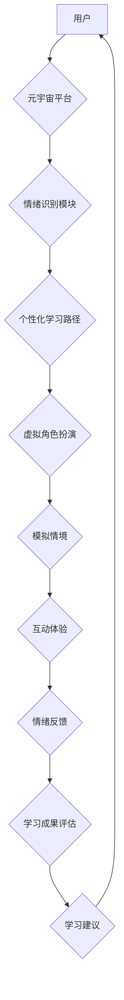

                 

## 数字情商培训:元宇宙中的情感教育新方向

> 关键词：数字情商、元宇宙、情感教育、人工智能、虚拟现实、交互式学习、情绪识别、个性化学习

## 1. 背景介绍

在当今数字化时代，科技发展日新月异，人工智能（AI）技术蓬勃发展，为教育领域带来了前所未有的机遇。元宇宙作为下一代互联网的雏形，以其沉浸式、交互式、虚拟化的特性，为情感教育提供了全新的平台和可能性。数字情商，即在数字环境中理解和管理自身情绪以及他人情绪的能力，正逐渐成为未来社会不可或缺的重要素养。

传统的情感教育往往依赖于课堂讲授和案例分析，缺乏互动性和沉浸感，难以真正帮助学生理解和掌握情绪管理技巧。而元宇宙环境则可以提供一个安全、虚拟化的空间，让学生在虚拟角色扮演、模拟情境等互动体验中，学习识别、理解和管理情绪，从而提升数字情商。

## 2. 核心概念与联系

**2.1 数字情商**

数字情商是指在数字环境中理解和管理自身情绪以及他人情绪的能力，包括以下几个方面：

* **自我意识:** 了解自己的情绪、感受和行为模式，以及它们在数字环境中的影响。
* **情绪管理:**  有效地调节自己的情绪，避免情绪化行为，并利用情绪来促进学习和工作。
* **社交意识:**  理解他人的情绪和观点，并能够在数字环境中建立和维护良好的社交关系。
* **关系管理:**  有效地与他人沟通和合作，解决冲突，并建立信任和尊重。

**2.2 元宇宙**

元宇宙是一个融合了虚拟现实（VR）、增强现实（AR）、区块链、人工智能等技术的虚拟世界，它具有以下特点：

* **沉浸式体验:**  用户可以通过VR设备或AR设备，身临其境地体验虚拟世界。
* **交互式体验:**  用户可以与虚拟环境和虚拟角色进行互动，并影响虚拟世界的变化。
* **持久化世界:**  元宇宙是一个持续存在的虚拟世界，用户可以随时进入和退出，并保留自己的虚拟资产和身份。
* **去中心化:**  元宇宙由多个平台和开发者共同构建，用户拥有更多的自主权和选择权。

**2.3 元宇宙与数字情商培训的联系**

元宇宙为数字情商培训提供了以下优势：

* **沉浸式体验:**  通过虚拟角色扮演、模拟情境等互动体验，让学生更直观地理解和体验情绪的产生、变化和影响。
* **个性化学习:**  元宇宙平台可以根据学生的学习进度、兴趣和需求，提供个性化的学习内容和路径。
* **安全的环境:**  虚拟环境可以为学生提供一个安全、无压力的学习空间，让他们可以自由地表达和尝试，而不担心现实世界的压力和评判。
* **持续的学习:**  元宇宙是一个持续存在的虚拟世界，学生可以随时进入学习，并与其他学生和老师互动，进行持续的学习和成长。

**2.4 元宇宙数字情商培训架构**



## 3. 核心算法原理 & 具体操作步骤

**3.1 算法原理概述**

数字情商培训的核心算法主要包括情绪识别、个性化学习路径规划、虚拟角色扮演和模拟情境生成等方面。

* **情绪识别:** 利用机器学习算法，从用户的语音、文本、表情等数据中识别用户的当前情绪状态。
* **个性化学习路径规划:** 根据用户的学习进度、兴趣和需求，推荐个性化的学习内容和路径。
* **虚拟角色扮演:**  通过虚拟角色扮演，让用户在虚拟环境中体验不同的情境，并学习如何识别、理解和管理情绪。
* **模拟情境生成:**  根据用户的学习目标和需求，生成不同的模拟情境，让用户在虚拟环境中练习情绪管理技巧。

**3.2 算法步骤详解**

**3.2.1 情绪识别算法步骤**

1. **数据采集:** 收集用户的语音、文本、表情等数据。
2. **数据预处理:** 对数据进行清洗、格式化和特征提取。
3. **模型训练:** 利用机器学习算法，训练情绪识别模型。
4. **情绪预测:** 将用户的输入数据输入到训练好的模型中，预测用户的当前情绪状态。

**3.2.2 个性化学习路径规划算法步骤**

1. **用户数据分析:** 收集用户的学习记录、兴趣偏好、学习风格等数据。
2. **知识图谱构建:** 建立一个包含学习内容、学习目标、学习路径等信息的知识图谱。
3. **路径推荐算法:** 利用推荐算法，根据用户的个人特征和学习目标，推荐个性化的学习路径。

**3.2.3 虚拟角色扮演算法步骤**

1. **角色设计:** 设计不同类型的虚拟角色，每个角色都有不同的性格、背景和情绪表达方式。
2. **情境构建:**  构建不同的虚拟情境，让用户可以与虚拟角色进行互动。
3. **交互机制:** 设计交互机制，让用户可以与虚拟角色进行对话、协作、竞争等互动。
4. **情绪反馈:**  根据用户的互动行为，提供情绪反馈，帮助用户理解和管理情绪。

**3.3 算法优缺点**

**3.3.1 情绪识别算法**

* **优点:** 可以准确识别用户的当前情绪状态，为个性化学习提供数据支持。
* **缺点:**  识别精度受限于数据质量和算法模型，可能存在误识别的情况。

**3.3.2 个性化学习路径规划算法**

* **优点:** 可以根据用户的个人特征和学习目标，推荐个性化的学习内容和路径，提高学习效率。
* **缺点:** 需要大量的用户数据进行训练，算法模型的复杂度较高。

**3.3.3 虚拟角色扮演算法**

* **优点:** 可以提供沉浸式的学习体验，帮助用户理解和管理情绪。
* **缺点:** 需要复杂的场景设计和交互机制，开发成本较高。

**3.4 算法应用领域**

* **教育领域:**  数字情商培训、情绪管理教育、社交技能训练。
* **医疗领域:**  心理健康评估、情绪障碍治疗、康复训练。
* **企业领域:**  员工培训、团队建设、客户服务。

## 4. 数学模型和公式 & 详细讲解 & 举例说明

**4.1 数学模型构建**

情绪识别模型通常采用深度学习算法，例如卷积神经网络（CNN）和循环神经网络（RNN）。

* **CNN:**  用于提取语音、文本、表情等数据的特征。
* **RNN:**  用于捕捉时间序列数据中的情感变化趋势。

**4.2 公式推导过程**

深度学习模型的训练过程涉及到大量的数学公式，例如梯度下降算法、激活函数、损失函数等。

* **梯度下降算法:** 用于更新模型参数，使模型的预测结果更加准确。
* **激活函数:** 用于引入非线性因素，提高模型的表达能力。
* **损失函数:** 用于衡量模型预测结果与真实值的差异，指导模型训练。

**4.3 案例分析与讲解**

例如，在情绪识别任务中，可以使用CNN提取语音信号的特征，然后使用RNN捕捉语音信号中的情感变化趋势。训练完成后，模型可以将语音信号输入到模型中，预测用户的当前情绪状态。

## 5. 项目实践：代码实例和详细解释说明

**5.1 开发环境搭建**

* **操作系统:**  Windows、macOS、Linux
* **编程语言:**  Python
* **深度学习框架:**  TensorFlow、PyTorch
* **虚拟环境:**  conda、virtualenv

**5.2 源代码详细实现**

```python
# 使用 TensorFlow 构建情绪识别模型
import tensorflow as tf

# 定义模型结构
model = tf.keras.models.Sequential([
    tf.keras.layers.Conv1D(filters=32, kernel_size=3, activation='relu', input_shape=(1024, 1)),
    tf.keras.layers.MaxPooling1D(pool_size=2),
    tf.keras.layers.LSTM(units=64),
    tf.keras.layers.Dense(units=5, activation='softmax')
])

# 编译模型
model.compile(optimizer='adam',
              loss='categorical_crossentropy',
              metrics=['accuracy'])

# 训练模型
model.fit(x_train, y_train, epochs=10)

# 评估模型
loss, accuracy = model.evaluate(x_test, y_test)
print('Loss:', loss)
print('Accuracy:', accuracy)
```

**5.3 代码解读与分析**

* **模型结构:**  该代码示例使用了一个简单的卷积神经网络（CNN）和循环神经网络（RNN）组合模型，用于情绪识别。
* **数据预处理:**  代码中没有显示数据预处理步骤，但在实际应用中，需要对语音、文本、表情等数据进行清洗、格式化和特征提取。
* **模型训练:**  代码使用梯度下降算法训练模型，并使用交叉熵损失函数和准确率作为评估指标。
* **模型评估:**  代码使用测试数据评估模型的性能，并打印出损失值和准确率。

**5.4 运行结果展示**

运行代码后，会输出模型的训练过程和评估结果，例如损失值和准确率。

## 6. 实际应用场景

**6.1 教育领域**

* **数字情商培训:**  元宇宙平台可以提供沉浸式的数字情商培训课程，让学生通过虚拟角色扮演、模拟情境等互动体验，学习识别、理解和管理情绪。
* **情绪管理教育:**  元宇宙平台可以帮助学生学习应对压力、焦虑、愤怒等负面情绪的技巧，并培养积极的情绪管理能力。
* **社交技能训练:**  元宇宙平台可以提供虚拟社交场景，让学生练习与他人沟通、合作、解决冲突等社交技能。

**6.2 医疗领域**

* **心理健康评估:**  元宇宙平台可以收集用户的语音、文本、表情等数据，并利用情绪识别算法，评估用户的精神状态，帮助医生诊断心理疾病。
* **情绪障碍治疗:**  元宇宙平台可以提供虚拟治疗环境，让患者在虚拟角色扮演、模拟情境等互动体验中，学习应对情绪障碍的技巧，并进行情绪调节训练。
* **康复训练:**  元宇宙平台可以为患者提供虚拟的运动、游戏等活动，帮助他们进行康复训练，并提高他们的情绪状态。

**6.3 企业领域**

* **员工培训:**  元宇宙平台可以提供沉浸式的员工培训课程，帮助员工学习公司文化、业务知识、职业技能等。
* **团队建设:**  元宇宙平台可以提供虚拟团队合作场景，帮助团队成员增强沟通、协作和信任。
* **客户服务:**  元宇宙平台可以提供虚拟客服机器人，帮助企业提供24小时在线客户服务。

**6.4 未来应用展望**

随着元宇宙技术的不断发展，数字情商培训将更加智能化、个性化和沉浸式。未来，元宇宙平台将能够提供更加丰富的学习内容、更加真实的虚拟环境和更加精准的情绪识别技术，为用户提供更加有效的数字情商培训服务。

## 7. 工具和资源推荐

**7.1 学习资源推荐**

* **书籍:**
    * 《数字情商：在数字时代提升你的社交智慧》
    * 《元宇宙：下一代互联网的未来》
* **在线课程:**
    * Coursera: 数字情商课程
    * Udemy: 元宇宙开发课程

**7.2 开发工具推荐**

* **Unity:**  游戏引擎，用于开发元宇宙应用。
* **Unreal Engine:**  游戏引擎，用于开发元宇宙应用。
* **Blender:**  3D建模软件，用于创建元宇宙场景。

**7.3 相关论文推荐**

* **The Metaverse: A New Era of Social Interaction and Collaboration**
* **Digital Emotional Intelligence: A Framework for Understanding and Developing Emotional Competence in the Digital Age**

## 8. 总结：未来发展趋势与挑战

**8.1 研究成果总结**

数字情商培训在元宇宙环境中的应用，为情感教育提供了新的可能性，并取得了一定的研究成果。

* **情绪识别技术:**  情绪识别算法的精度不断提高，能够更加准确地识别用户的当前情绪状态。
* **个性化学习路径规划:**  个性化学习路径规划算法能够根据用户的个人特征和学习目标，推荐更加有效的学习内容和路径。
* **虚拟角色扮演技术:**  虚拟角色扮演技术能够提供更加沉浸式的学习体验，帮助用户更好地理解和管理情绪。

**8.2 未来发展趋势**

* **更加智能化:**  利用人工智能技术，开发更加智能化的数字情商培训系统，能够自动识别用户的学习需求，并提供个性化的学习建议。
* **更加沉浸式:**  利用虚拟现实和增强现实技术，打造更加沉浸式的元宇宙学习环境，让用户能够更加真实地体验虚拟情境。
* **更加社会化:**  鼓励用户在元宇宙平台上与他人互动，进行合作学习和情感交流，促进数字情商的提升。

**8.3 面临的挑战**

* **技术挑战:**  元宇宙技术的成熟度还有待提高，需要进一步研究和开发更加先进的虚拟现实、增强现实、人工智能等技术。
* **伦理挑战:**  元宇宙平台需要解决数据隐私、用户安全、虚拟身份等伦理问题。
* **教育挑战:**  需要开发更加有效的元宇宙数字情商培训课程，并进行教师培训，帮助教师更好地利用元宇宙平台进行教学。

**8.4 研究展望**

未来，数字情商培训在元宇宙环境中的应用将继续发展，并对教育、医疗、企业等多个领域产生深远的影响。


## 9. 附录：常见问题与解答

**9.1 如何评估元宇宙数字情商培训的有效性？**

可以采用多种方法评估元宇宙数字情商培训的有效性，例如：

* **问卷调查:**  收集用户的学习体验、情绪管理能力提升等方面的反馈。
* **行为观察:**  观察用户的虚拟角色扮演、模拟情境等互动行为，评估其情绪管理能力的提升。
* **数据分析:**  分析用户的学习数据、情绪识别数据等，评估培训效果。

**9.2 元宇宙数字情商培训对现实生活有什么帮助？**

元宇宙数字情商培训能够帮助用户提升以下方面的能力：

* **情绪识别:**  能够更加准确地识别自己的情绪和他人的情绪。
* **情绪管理:**  能够更好地控制自己的情绪，避免情绪化行为。
* **社交技能:**  能够更好地与他人沟通、合作、解决冲突。
* **压力应对:**  能够更好地应对压力、焦虑、愤怒等负面情绪。

**9.3 元宇宙数字情商培训有哪些潜在的风险？**

元宇宙数字情商培训也存在一些潜在的风险，例如：

* **虚拟现实依赖:**  过度沉浸于虚拟环境，可能会导致现实生活中的社交障碍和心理问题。
* **数据隐私:**  元宇宙平台收集用户的个人数据，需要确保数据安全和隐私保护。
* **虚拟身份欺诈:**  虚拟环境中存在身份欺诈的风险，需要采取措施防止用户被欺骗。


作者：禅与计算机程序设计艺术 / Zen and the Art of Computer Programming<end_of_turn>

