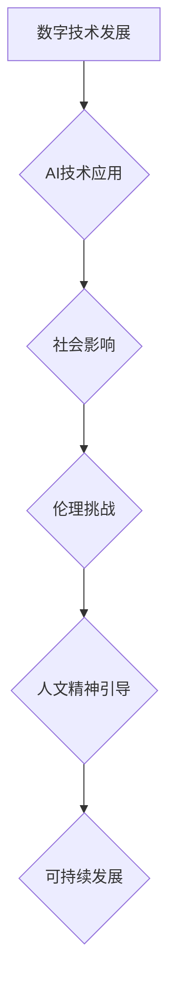

                 

## 数字时代的人文精神的传承

> 关键词：人工智能、人文精神、伦理、技术发展、社会影响、未来展望、可持续发展

### 1. 背景介绍

数字时代，科技发展日新月异，人工智能（AI）作为科技发展的重要方向，正在深刻地改变着我们的生活方式、工作模式和社会结构。AI技术的进步带来了前所未有的机遇，但也引发了人们对未来社会发展方向的思考。如何在数字时代传承和弘扬人文精神，是摆在我们面前的重大课题。

传统的人文精神强调人性的尊严、价值和自由，注重情感、伦理和道德的关怀。而数字时代，科技发展带来的理性、逻辑和效率，有时会忽视人性的复杂性和多样性。如何将人文精神融入到数字技术的发展和应用中，使其更好地服务于人类，是需要我们认真思考的问题。

### 2. 核心概念与联系

**2.1 人文精神**

人文精神是指以人为本，尊重生命、追求真理、崇尚美德、热爱和平、促进社会进步的精神。它包含着对人性的关爱、对社会责任的担当、对未来的憧憬等多方面的内涵。

**2.2 数字时代**

数字时代是指以数字技术为核心的时代，其特征是信息化、网络化、智能化。数字技术正在深刻地改变着我们的生活方式、工作模式和社会结构。

**2.3 人文精神与数字时代的融合**

数字时代的人文精神传承，是指在数字技术发展和应用的过程中，坚持以人为本，尊重生命、追求真理、崇尚美德、热爱和平、促进社会进步的精神，引导科技发展方向，构建更加和谐、 equitable 和可持续的数字社会。

**Mermaid 流程图**



### 3. 核心算法原理 & 具体操作步骤

**3.1 算法原理概述**

在数字时代，人工智能算法在各个领域发挥着越来越重要的作用。其中，深度学习算法作为一种重要的机器学习方法，在图像识别、自然语言处理、语音识别等领域取得了突破性的进展。深度学习算法的核心原理是利用多层神经网络来模拟人类大脑的学习过程，通过大量的训练数据，学习到数据的特征和规律，从而实现对数据的理解和预测。

**3.2 算法步骤详解**

1. **数据收集和预处理:** 收集大量相关数据，并进行清洗、格式化和特征提取等预处理工作。
2. **网络结构设计:** 根据具体任务需求，设计多层神经网络的结构，包括神经元数量、连接方式和激活函数等。
3. **模型训练:** 利用训练数据，通过反向传播算法，调整神经网络的权重和偏置，使模型的预测结果与真实值尽可能接近。
4. **模型评估:** 利用测试数据，评估模型的性能，例如准确率、召回率、F1-score等。
5. **模型调优:** 根据评估结果，调整网络结构、学习率、训练参数等，进一步提高模型的性能。
6. **模型部署:** 将训练好的模型部署到实际应用场景中，用于预测和决策。

**3.3 算法优缺点**

**优点:**

* 能够学习到数据的复杂特征和规律。
* 性能优于传统机器学习算法。
* 应用范围广泛。

**缺点:**

* 需要大量的训练数据。
* 训练过程耗时和耗能。
* 模型解释性较差。

**3.4 算法应用领域**

深度学习算法在各个领域都有广泛的应用，例如：

* **图像识别:** 人脸识别、物体检测、图像分类等。
* **自然语言处理:** 文本分类、机器翻译、情感分析等。
* **语音识别:** 语音转文本、语音助手等。
* **医疗诊断:** 疾病预测、影像分析等。
* **金融风险控制:** 欺诈检测、信用评估等。

### 4. 数学模型和公式 & 详细讲解 & 举例说明

**4.1 数学模型构建**

深度学习算法的核心是多层神经网络，其数学模型可以表示为一个复杂的函数关系。

假设一个神经网络有 L 层，每层有 N_l 个神经元，则网络的输出可以表示为：

$$
y = f_L(W_L \cdot f_{L-1}(W_{L-1} \cdot ... \cdot f_1(W_1 \cdot x) + b_L) + b_{L-1}) + ... + b_1
$$

其中：

* $x$ 是输入数据。
* $W_l$ 是第 l 层神经元的权重矩阵。
* $b_l$ 是第 l 层神经元的偏置向量。
* $f_l$ 是第 l 层神经元的激活函数。

**4.2 公式推导过程**

深度学习算法的训练过程是通过反向传播算法来优化网络参数的。反向传播算法的核心思想是利用梯度下降法，不断调整网络参数，使模型的预测结果与真实值之间的误差最小化。

**4.3 案例分析与讲解**

例如，在图像识别任务中，我们可以使用卷积神经网络（CNN）来提取图像特征。CNN 的结构包含多个卷积层、池化层和全连接层。卷积层通过卷积核对图像进行卷积运算，提取图像的局部特征。池化层通过下采样操作，降低图像的维度，提高模型的鲁棒性。全连接层将提取到的特征进行分类。

### 5. 项目实践：代码实例和详细解释说明

**5.1 开发环境搭建**

深度学习算法的开发通常需要使用 Python 语言和相关的深度学习框架，例如 TensorFlow、PyTorch 等。

**5.2 源代码详细实现**

以下是一个简单的深度学习模型的代码示例，使用 TensorFlow 框架实现一个简单的线性回归模型：

```python
import tensorflow as tf

# 定义模型输入
model_input = tf.keras.Input(shape=(1,))

# 定义模型输出
model_output = tf.keras.layers.Dense(1)(model_input)

# 创建模型
model = tf.keras.Model(inputs=model_input, outputs=model_output)

# 编译模型
model.compile(optimizer='adam', loss='mse')

# 训练模型
model.fit(x_train, y_train, epochs=10)

# 评估模型
loss = model.evaluate(x_test, y_test)
```

**5.3 代码解读与分析**

这段代码定义了一个简单的线性回归模型，输入是一个一维向量，输出是一个标量值。模型使用一个全连接层来进行线性变换，并使用均方误差作为损失函数。

**5.4 运行结果展示**

训练完成后，我们可以使用模型对新的数据进行预测。

### 6. 实际应用场景

深度学习算法在各个领域都有广泛的应用，例如：

* **医疗诊断:** 深度学习算法可以用于分析医学影像，辅助医生诊断疾病。
* **金融风险控制:** 深度学习算法可以用于检测欺诈交易，评估信用风险。
* **自动驾驶:** 深度学习算法可以用于识别道路场景，控制车辆行驶。
* **个性化推荐:** 深度学习算法可以用于分析用户的行为数据，推荐个性化的商品或服务。

**6.4 未来应用展望**

随着人工智能技术的不断发展，深度学习算法将在未来发挥更加重要的作用，例如：

* **更智能的虚拟助手:** 深度学习算法可以使虚拟助手更加智能，能够更好地理解用户的需求，提供更精准的帮助。
* **更精准的医疗诊断:** 深度学习算法可以帮助医生更精准地诊断疾病，提高医疗效率。
* **更安全的自动驾驶:** 深度学习算法可以使自动驾驶汽车更加安全可靠，减少交通事故。
* **更个性化的教育:** 深度学习算法可以根据学生的学习情况，提供个性化的学习方案。

### 7. 工具和资源推荐

**7.1 学习资源推荐**

* **书籍:**
    * 深度学习 (Deep Learning) - Ian Goodfellow, Yoshua Bengio, Aaron Courville
    * 人工智能：一种现代方法 (Artificial Intelligence: A Modern Approach) - Stuart Russell, Peter Norvig
* **在线课程:**
    * TensorFlow 官方教程: https://www.tensorflow.org/tutorials
    * PyTorch 官方教程: https://pytorch.org/tutorials/
    * Coursera 上的深度学习课程: https://www.coursera.org/search?query=deep%20learning

**7.2 开发工具推荐**

* **TensorFlow:** https://www.tensorflow.org/
* **PyTorch:** https://pytorch.org/
* **Keras:** https://keras.io/

**7.3 相关论文推荐**

* **ImageNet Classification with Deep Convolutional Neural Networks** - Alex Krizhevsky, Ilya Sutskever, Geoffrey E. Hinton
* **Attention Is All You Need** - Ashish Vaswani, Noam Shazeer, Niki Parmar, Jakob Uszkoreit, Llion Jones, Aidan N Gomez, Łukasz Kaiser, Illia Polosukhin

### 8. 总结：未来发展趋势与挑战

**8.1 研究成果总结**

近年来，深度学习算法取得了显著的进展，在各个领域都有广泛的应用。

**8.2 未来发展趋势**

未来，深度学习算法将朝着以下方向发展：

* **模型更加高效:** 研究更加高效的深度学习算法，降低训练成本和时间。
* **模型更加解释性:** 研究更加解释性强的深度学习模型，提高模型的可理解性和可信任度。
* **模型更加通用:** 研究更加通用的深度学习模型，能够适应更多不同的任务和领域。

**8.3 面临的挑战**

深度学习算法也面临着一些挑战：

* **数据依赖性:** 深度学习算法需要大量的训练数据，而获取高质量的训练数据仍然是一个难题。
* **计算资源需求:** 训练深度学习模型需要大量的计算资源，这对于资源有限的机构或个人来说是一个挑战。
* **伦理问题:** 深度学习算法的应用也引发了一些伦理问题，例如算法偏见、隐私泄露等，需要引起重视和解决。

**8.4 研究展望**

未来，我们需要更加注重深度学习算法的伦理问题，确保其安全、公平、可解释地应用于社会。同时，还需要探索更加高效、通用、解释性强的深度学习算法，推动人工智能技术更好地服务于人类。

### 9. 附录：常见问题与解答

**常见问题:**

* **深度学习算法的训练过程需要多长时间？**

**解答:** 深度学习算法的训练时间取决于模型的复杂度、训练数据的规模以及硬件资源等因素。一般来说，训练一个简单的模型可能只需要几小时，而训练一个复杂的模型可能需要几天甚至几周。

* **深度学习算法需要多少计算资源？**

**解答:** 深度学习算法的计算资源需求取决于模型的复杂度、训练数据的规模以及训练算法等因素。一般来说，训练一个复杂的模型需要大量的计算资源，例如GPU集群。

* **深度学习算法容易出现偏见吗？**

**解答:** 是的，深度学习算法容易出现偏见。这是因为深度学习算法的训练数据可能包含社会偏见，导致模型在预测时也表现出偏见。

**作者：禅与计算机程序设计艺术 / Zen and the Art of Computer Programming**<end_of_turn>

