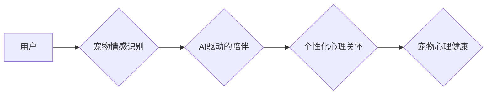

                 

## 智能宠物情感陪护创业：AI驱动的宠物心理关怀

> 关键词：人工智能、宠物情感、心理关怀、机器学习、自然语言处理、计算机视觉、深度学习、情感识别

## 1. 背景介绍

随着人类社会对宠物的喜爱程度不断提升，宠物已经不仅仅是陪伴者，更成为了家庭成员。然而，宠物也面临着各种心理压力，例如分离焦虑、恐惧、抑郁等。传统的宠物护理方式难以有效解决这些问题，因此，利用人工智能技术为宠物提供情感陪护，成为一个新的趋势和机遇。

智能宠物情感陪护创业，旨在通过人工智能技术，帮助宠物缓解心理压力，提升生活质量。该领域融合了人工智能、生物学、心理学等多学科知识，具有广阔的市场前景和社会价值。

## 2. 核心概念与联系

**2.1 核心概念**

* **宠物情感识别:** 通过分析宠物的行为、表情、声音等特征，识别宠物的情绪状态，例如快乐、悲伤、焦虑、恐惧等。
* **AI驱动的陪伴:** 利用人工智能技术，开发智能宠物玩具、机器人等，能够与宠物进行互动，提供情感支持和陪伴。
* **个性化心理关怀:** 根据宠物的个体差异和情绪状态，提供个性化的心理关怀方案，例如调整互动方式、提供舒缓音乐等。

**2.2 架构图**



**2.3 联系**

智能宠物情感陪护创业的核心是将宠物情感识别与AI驱动的陪伴相结合，从而实现个性化心理关怀。

* 宠物情感识别是基础，为AI驱动的陪伴提供情感信息。
* AI驱动的陪伴是手段，通过互动和陪伴来缓解宠物心理压力。
* 个性化心理关怀是目标，根据宠物的情绪状态提供定制化的解决方案。

## 3. 核心算法原理 & 具体操作步骤

**3.1 算法原理概述**

宠物情感识别主要依赖于机器学习和深度学习算法。

* **机器学习算法:** 

例如支持向量机 (SVM)、决策树、随机森林等，可以根据宠物的行为、表情、声音等特征，训练出一个情感分类模型。

* **深度学习算法:** 

例如卷积神经网络 (CNN)、循环神经网络 (RNN) 等，能够学习更复杂的特征，提高情感识别的准确率。

**3.2 算法步骤详解**

1. **数据采集:** 收集宠物的行为、表情、声音等多模态数据，并进行标注，例如标记宠物的情绪状态。
2. **数据预处理:** 对采集到的数据进行清洗、格式化、特征提取等处理，例如将声音数据转换为频谱图，将图像数据进行裁剪和增强等。
3. **模型训练:** 选择合适的机器学习或深度学习算法，利用标注好的数据训练模型，并进行模型评估和调参。
4. **模型部署:** 将训练好的模型部署到实际应用场景中，例如智能宠物玩具、手机APP等。
5. **情感识别:** 当宠物发出行为、表情、声音等信号时，模型会进行识别，并输出宠物的情绪状态。

**3.3 算法优缺点**

* **优点:** 

准确率高、自动化程度高、能够识别多种情绪状态。

* **缺点:** 

需要大量标注数据、模型训练成本高、对硬件资源要求高。

**3.4 算法应用领域**

* **宠物医疗:** 帮助兽医诊断宠物的情绪问题，提供个性化的治疗方案。
* **宠物训练:** 根据宠物的情绪状态，调整训练方式，提高训练效率。
* **宠物陪伴:** 开发智能宠物玩具、机器人等，提供情感支持和陪伴。
* **宠物行为研究:** 研究宠物的行为模式和情绪变化，促进宠物福利的提升。

## 4. 数学模型和公式 & 详细讲解 & 举例说明

**4.1 数学模型构建**

宠物情感识别的数学模型通常基于概率论和统计学。

* **贝叶斯分类器:** 

用于根据宠物特征的概率分布，预测宠物的情绪状态。

$$
P(C_i|X) = \frac{P(X|C_i)P(C_i)}{P(X)}
$$

其中:

* $C_i$ 表示第 $i$ 种情绪状态。
* $X$ 表示宠物的特征向量。
* $P(C_i)$ 表示第 $i$ 种情绪状态的先验概率。
* $P(X|C_i)$ 表示给定第 $i$ 种情绪状态下，宠物特征的条件概率。
* $P(X)$ 表示宠物特征的边缘概率。

* **支持向量机 (SVM):** 

用于寻找最佳的分隔超平面，将不同情绪状态的宠物特征分开。

**4.2 公式推导过程**

SVM 的目标是找到一个最大间隔的超平面，将不同类别的样本分开。

* **间隔:** 超平面到最近样本点的距离。
* **最大间隔:** 使间隔最大的超平面。

SVM 使用拉格朗日乘子法求解最优化问题，推导出支持向量和决策边界。

**4.3 案例分析与讲解**

假设我们想要识别猫的情绪状态，包括快乐、悲伤、愤怒三种。我们可以收集猫的行为、表情、声音等数据，并进行标注。然后，我们可以使用贝叶斯分类器或 SVM 等算法，训练一个情感识别模型。

当我们给模型输入一张猫的照片时，模型会根据猫的特征，例如耳朵的姿势、尾巴的摆动、面部表情等，预测猫的情绪状态。

## 5. 项目实践：代码实例和详细解释说明

**5.1 开发环境搭建**

* **操作系统:** Ubuntu 20.04 LTS
* **编程语言:** Python 3.8
* **深度学习框架:** TensorFlow 2.0
* **计算机视觉库:** OpenCV

**5.2 源代码详细实现**

```python
import tensorflow as tf
from tensorflow.keras.models import Sequential
from tensorflow.keras.layers import Conv2D, MaxPooling2D, Flatten, Dense

# 定义模型结构
model = Sequential()
model.add(Conv2D(32, (3, 3), activation='relu', input_shape=(128, 128, 3)))
model.add(MaxPooling2D((2, 2)))
model.add(Conv2D(64, (3, 3), activation='relu'))
model.add(MaxPooling2D((2, 2)))
model.add(Flatten())
model.add(Dense(10, activation='softmax'))

# 编译模型
model.compile(optimizer='adam',
              loss='sparse_categorical_crossentropy',
              metrics=['accuracy'])

# 训练模型
model.fit(train_images, train_labels, epochs=10)

# 评估模型
loss, accuracy = model.evaluate(test_images, test_labels)
print('Test loss:', loss)
print('Test accuracy:', accuracy)
```

**5.3 代码解读与分析**

* 该代码定义了一个卷积神经网络模型，用于识别猫的情绪状态。
* 模型包含多个卷积层和池化层，用于提取猫特征。
* 全连接层用于分类。
* 模型使用 Adam 优化器，交叉熵损失函数，并使用准确率作为评估指标。

**5.4 运行结果展示**

训练完成后，我们可以使用模型对新的猫图像进行预测，并输出预测的情绪状态。

## 6. 实际应用场景

**6.1 智能宠物玩具**

* 可以根据宠物的情绪状态，调整玩具的互动方式，例如当宠物感到焦虑时，玩具可以播放舒缓的音乐，当宠物感到快乐时，玩具可以进行更加活跃的互动。

**6.2 智能宠物机器人**

* 可以模拟宠物的行为，例如陪伴、玩耍、聊天等，为宠物提供情感支持。
* 可以根据宠物的情绪状态，调整机器人的互动方式，例如当宠物感到悲伤时，机器人可以进行安慰性的互动，当宠物感到兴奋时，机器人可以进行更加活跃的互动。

**6.3 宠物行为分析平台**

* 可以收集宠物的行为数据，例如活动量、睡眠时间、饮食习惯等，并进行分析，识别宠物的情绪变化趋势。
* 可以为宠物主人提供个性化的建议，例如调整宠物的活动量、饮食习惯等，帮助宠物保持良好的心理健康。

**6.4 未来应用展望**

* **更精准的情感识别:** 利用更先进的机器学习算法和传感器技术，提高宠物情感识别的准确率。
* **更个性化的陪伴:** 根据宠物的个体差异和情绪状态，提供更加个性化的陪伴方案。
* **远程宠物护理:** 利用人工智能技术，实现远程宠物护理，例如远程监控宠物的情绪状态，远程指导宠物训练等。

## 7. 工具和资源推荐

**7.1 学习资源推荐**

* **书籍:**

《深度学习》 (Ian Goodfellow, Yoshua Bengio, Aaron Courville)
《机器学习》 (Tom Mitchell)

* **在线课程:**

Coursera: 深度学习 Specialization
edX: 机器学习

**7.2 开发工具推荐**

* **编程语言:** Python
* **深度学习框架:** TensorFlow, PyTorch
* **计算机视觉库:** OpenCV

**7.3 相关论文推荐**

* **宠物情感识别:**

"Emotion Recognition in Animals: A Review" (2020)
"Deep Learning for Pet Emotion Recognition" (2021)

## 8. 总结：未来发展趋势与挑战

**8.1 研究成果总结**

智能宠物情感陪护创业是一个新兴领域，近年来取得了显著进展。

* 宠物情感识别技术不断成熟，准确率不断提高。
* AI驱动的陪伴技术不断发展，能够提供更加智能、个性化的陪伴方案。

**8.2 未来发展趋势**

* **更精准的情感识别:** 利用更先进的机器学习算法和传感器技术，提高宠物情感识别的准确率。
* **更个性化的陪伴:** 根据宠物的个体差异和情绪状态，提供更加个性化的陪伴方案。
* **远程宠物护理:** 利用人工智能技术，实现远程宠物护理，例如远程监控宠物的情绪状态，远程指导宠物训练等。

**8.3 面临的挑战**

* **数据标注:** 宠物情感识别需要大量标注数据，数据标注成本高，效率低。
* **模型解释性:** 深度学习模型的决策过程难以解释，难以获得用户信任。
* **伦理问题:** AI驱动的宠物陪伴可能会引发伦理问题，例如宠物依赖性、数据隐私等。

**8.4 研究展望**

* 研究更有效的宠物情感识别算法，降低数据标注成本。
* 研究可解释性强的深度学习模型，提高模型的透明度和可信度。
* 探索AI驱动的宠物陪伴的伦理问题，制定相应的规范和政策。

## 9. 附录：常见问题与解答

**9.1 如何训练宠物情感识别模型？**

需要收集宠物的行为、表情、声音等多模态数据，并进行标注。然后，选择合适的机器学习或深度学习算法，利用标注好的数据训练模型。

**9.2 如何选择合适的宠物情感识别算法？**

需要根据具体应用场景和数据特点选择合适的算法。例如，对于表情识别任务，可以使用卷积神经网络；对于声音识别任务，可以使用循环神经网络。

**9.3 AI驱动的宠物陪伴会取代人类陪伴吗？**

AI驱动的宠物陪伴可以提供情感支持和陪伴，但无法完全取代人类陪伴。人类陪伴更丰富、更复杂，包含情感交流、互动游戏等多种形式。


作者：禅与计算机程序设计艺术 / Zen and the Art of Computer Programming 
<end_of_turn>

