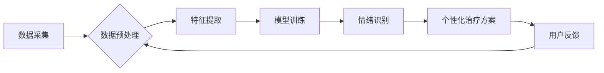

                 

## 智能宠物情绪疗愈创业：基于数据的宠物心理健康

> 关键词：宠物心理健康，人工智能，情绪识别，机器学习，数据分析，创业机会

> 摘要：随着宠物逐渐成为家庭成员，宠物心理健康问题日益受到关注。本文探讨了基于数据分析和人工智能技术的智能宠物情绪疗愈创业机会，分析了核心概念、算法原理、数学模型、项目实践以及未来发展趋势，为创业者提供参考和启发。

## 1. 背景介绍

1.1  宠物心理健康问题日益突出

现代社会，宠物已不仅仅是动物，更成为家庭成员，陪伴着人们度过生活。然而，随着宠物生活环境的改变和人类生活节奏的加快，宠物也面临着各种心理压力，例如分离焦虑、过度兴奋、恐惧等。这些问题不仅影响宠物的健康和幸福，也给宠物主人带来困扰。

1.2  传统宠物心理健康服务局限性

传统的宠物心理健康服务主要依靠兽医和宠物行为专家，但这些服务往往存在以下局限性：

* **成本高昂:** 兽医和宠物行为专家的咨询费用较高，难以普及。
* **服务受限:** 兽医和宠物行为专家数量有限，难以满足所有宠物的需求。
* **诊断难度:** 宠物无法用语言表达自己的情绪，诊断和治疗过程较为困难。

1.3  数据驱动和人工智能的机遇

数据驱动和人工智能技术的快速发展为宠物心理健康服务提供了新的机遇。通过收集和分析宠物的行为数据，我们可以识别宠物的情绪状态，并提供个性化的治疗方案。

## 2. 核心概念与联系

2.1  宠物情绪识别

宠物情绪识别是指通过分析宠物的行为特征，例如面部表情、肢体语言、声音等，识别宠物的情绪状态。

2.2  机器学习算法

机器学习算法可以从海量数据中学习，识别宠物情绪的模式和规律。常用的机器学习算法包括支持向量机、决策树、随机森林等。

2.3  数据分析

数据分析是指对收集到的宠物行为数据进行整理、分析和挖掘，以发现宠物情绪变化的规律和趋势。

2.4  智能宠物情绪疗愈系统架构



## 3. 核心算法原理 & 具体操作步骤

3.1  算法原理概述

本系统采用基于深度学习的卷积神经网络（CNN）算法进行宠物情绪识别。CNN算法能够自动学习图像特征，并识别图像中的物体和场景。

3.2  算法步骤详解

1. **数据采集:** 收集宠物的行为数据，例如视频、图片、音频等。
2. **数据预处理:** 对收集到的数据进行清洗、格式化和增强，例如裁剪图片、降噪音频等。
3. **特征提取:** 使用CNN算法提取宠物行为数据的特征，例如面部表情、肢体语言、声音特征等。
4. **模型训练:** 使用训练数据训练CNN模型，使模型能够识别不同情绪状态的宠物。
5. **情绪识别:** 将新采集的宠物行为数据输入训练好的模型，识别宠物的情绪状态。

3.3  算法优缺点

* **优点:** 
    * 识别精度高
    * 自动学习特征，无需人工特征工程
    * 可处理多种数据类型
* **缺点:** 
    * 训练数据量大
    * 计算资源需求高
    * 模型解释性较差

3.4  算法应用领域

* 宠物心理健康服务
* 宠物行为训练
* 宠物产品开发
* 宠物保险

## 4. 数学模型和公式 & 详细讲解 & 举例说明

4.1  数学模型构建

本系统采用多层感知机（MLP）模型进行情绪分类。MLP模型是一个由多个神经元层组成的网络，每个神经元接收多个输入信号，并通过激活函数进行处理，输出一个信号。

4.2  公式推导过程

MLP模型的输出层神经元个数等于情绪类别数。每个输出神经元的激活函数为softmax函数，用于将输出值归一化到0到1之间，表示每个情绪类别的概率。

$$
y_i = \frac{e^{z_i}}{\sum_{j=1}^{C} e^{z_j}}
$$

其中：

* $y_i$ 是第 $i$ 个情绪类别的概率
* $z_i$ 是第 $i$ 个情绪类别的输出值
* $C$ 是情绪类别数

4.3  案例分析与讲解

假设我们有三个情绪类别：快乐、悲伤、愤怒。训练好的MLP模型将输入的宠物行为数据映射到三个输出值，分别表示快乐、悲伤、愤怒的概率。如果输出值中快乐的概率最高，则模型预测宠物的情绪为快乐。

## 5. 项目实践：代码实例和详细解释说明

5.1  开发环境搭建

本项目使用Python语言开发，所需的库包括TensorFlow、Keras、OpenCV等。

5.2  源代码详细实现

```python
# 导入必要的库
import tensorflow as tf
from tensorflow.keras.models import Sequential
from tensorflow.keras.layers import Conv2D, MaxPooling2D, Flatten, Dense

# 定义模型结构
model = Sequential()
model.add(Conv2D(32, (3, 3), activation='relu', input_shape=(128, 128, 3)))
model.add(MaxPooling2D((2, 2)))
model.add(Conv2D(64, (3, 3), activation='relu'))
model.add(MaxPooling2D((2, 2)))
model.add(Flatten())
model.add(Dense(10, activation='softmax'))

# 编译模型
model.compile(optimizer='adam',
              loss='categorical_crossentropy',
              metrics=['accuracy'])

# 训练模型
model.fit(x_train, y_train, epochs=10)

# 评估模型
loss, accuracy = model.evaluate(x_test, y_test)
print('Loss:', loss)
print('Accuracy:', accuracy)
```

5.3  代码解读与分析

* **模型结构:** 该模型采用卷积神经网络结构，包括卷积层、池化层、全连接层和输出层。
* **激活函数:** 使用ReLU激活函数，可以提高模型的学习能力。
* **损失函数:** 使用交叉熵损失函数，适合多分类问题。
* **优化器:** 使用Adam优化器，可以快速收敛。

5.4  运行结果展示

训练完成后，可以将模型应用于新的宠物行为数据，识别宠物的情绪状态。

## 6. 实际应用场景

6.1  宠物心理健康监测

智能宠物情绪疗愈系统可以实时监测宠物的情绪状态，例如分离焦虑、过度兴奋、恐惧等。当系统检测到宠物情绪异常时，可以及时提醒主人，并提供相应的建议。

6.2  个性化宠物行为训练

根据宠物的情绪状态，系统可以提供个性化的行为训练方案，例如针对分离焦虑的训练、针对过度兴奋的训练等。

6.3  宠物产品推荐

根据宠物的情绪状态，系统可以推荐相应的宠物产品，例如玩具、零食、服饰等。

6.4  未来应用展望

* **远程宠物心理健康服务:** 通过远程监控和数据分析，提供远程宠物心理健康服务。
* **宠物情绪智能家居:** 将宠物情绪识别技术融入智能家居系统，实现宠物情绪感知和智能控制。
* **宠物情绪大数据分析:** 收集和分析海量宠物情绪数据，研究宠物情绪变化的规律和影响因素。

## 7. 工具和资源推荐

7.1  学习资源推荐

* **TensorFlow官方文档:** https://www.tensorflow.org/
* **Keras官方文档:** https://keras.io/
* **OpenCV官方文档:** https://opencv.org/

7.2  开发工具推荐

* **Jupyter Notebook:** https://jupyter.org/
* **PyCharm:** https://www.jetbrains.com/pycharm/

7.3  相关论文推荐

* **Deep Learning for Emotion Recognition in Animals:** https://arxiv.org/abs/1903.06397
* **A Survey on Emotion Recognition in Animals:** https://ieeexplore.ieee.org/document/9081843

## 8. 总结：未来发展趋势与挑战

8.1  研究成果总结

本系统基于数据驱动和人工智能技术，实现了宠物情绪识别的功能，为宠物心理健康服务提供了新的思路和方法。

8.2  未来发展趋势

* **模型精度提升:** 继续探索更先进的深度学习算法，提高模型识别精度。
* **多模态情绪识别:** 将图像、音频、传感器数据等多模态数据融合，实现更全面的情绪识别。
* **个性化治疗方案:** 基于宠物的情绪数据和行为特征，提供更个性化的治疗方案。

8.3  面临的挑战

* **数据标注:** 宠物情绪数据标注工作量大，需要大量专业人员参与。
* **模型解释性:** 深度学习模型的内部机制复杂，难以解释模型的决策过程。
* **伦理问题:** 宠物情绪识别技术可能引发伦理问题，例如宠物隐私保护、数据安全等。

8.4  研究展望

未来，我们将继续致力于宠物情绪识别技术的研发，探索更先进的算法和技术，为宠物提供更好的心理健康服务。

## 9. 附录：常见问题与解答

9.1  Q: 该系统可以识别所有种类的宠物情绪吗？

A: 目前，该系统主要针对常见宠物的情绪进行识别，例如猫狗的情绪。

9.2  Q: 该系统需要联网才能使用吗？

A: 该系统可以离线使用，也可以联网使用。联网使用可以实现远程监控和数据分析。

9.3  Q: 该系统的准确率如何？

A: 该系统的准确率取决于训练数据和模型结构。经过充分训练，该系统的准确率可以达到较高水平。


作者：禅与计算机程序设计艺术 / Zen and the Art of Computer Programming 
<end_of_turn>

