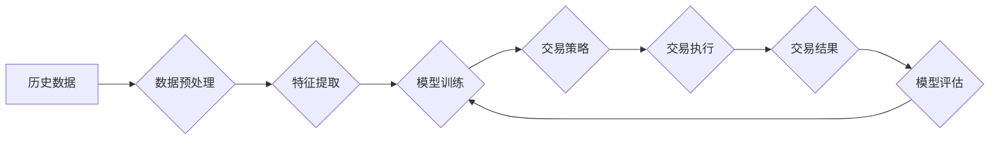

                 

## 未来的智能投资：2050年的量化交易与风险管理

> 关键词：量化交易、人工智能、机器学习、深度学习、风险管理、预测模型、智能算法、金融科技

## 1. 背景介绍

量化交易，即利用数学模型和计算机程序进行交易决策，已成为金融市场的重要组成部分。随着人工智能（AI）技术的飞速发展，量化交易迎来了新的机遇和挑战。2050年，人工智能将深刻改变量化交易的格局，带来更加智能化、自动化和精准化的交易策略。

传统量化交易主要依赖于历史数据和预设规则，难以应对市场的不确定性和复杂性。而人工智能，特别是深度学习，能够从海量数据中提取更深层的特征和模式，构建更强大的预测模型，从而实现更精准的交易决策。

## 2. 核心概念与联系

量化交易的核心是利用数学模型和算法进行交易决策。人工智能技术为量化交易提供了更强大的工具和手段。

**核心概念:**

* **量化交易:** 利用数学模型和计算机程序进行交易决策的投资策略。
* **人工智能 (AI):** 能够模拟人类智能的计算机系统。
* **机器学习 (ML):** 一种人工智能技术，通过学习数据样本，自动构建模型进行预测。
* **深度学习 (DL):** 一种机器学习技术，利用多层神经网络模拟人类大脑的学习过程。

**架构图:**



**核心联系:**

人工智能技术，特别是深度学习，可以帮助量化交易系统从海量数据中提取更深层的特征和模式，构建更强大的预测模型，从而实现更精准的交易决策。

## 3. 核心算法原理 & 具体操作步骤

### 3.1  算法原理概述

深度学习算法的核心是多层神经网络。神经网络由多个层级的神经元组成，每个神经元接收来自上一层的输入，并通过激活函数进行处理，输出到下一层。通过训练，神经网络可以学习到数据中的复杂模式和关系。

在量化交易中，深度学习算法可以用于预测股票价格、识别交易机会、控制风险等。

### 3.2  算法步骤详解

1. **数据收集和预处理:** 收集历史交易数据，并进行清洗、转换和特征工程，以便于模型训练。
2. **模型选择和架构设计:** 选择合适的深度学习模型架构，例如卷积神经网络 (CNN)、循环神经网络 (RNN) 或长短期记忆网络 (LSTM)。
3. **模型训练:** 使用训练数据训练深度学习模型，调整模型参数，使其能够准确预测交易信号。
4. **模型评估和优化:** 使用测试数据评估模型性能，并根据评估结果进行模型优化，例如调整模型架构、增加训练数据或调整训练参数。
5. **交易策略开发:** 基于训练好的模型，开发交易策略，例如设定买入和卖出信号、控制仓位和止损等。
6. **交易执行:** 将交易策略与交易平台集成，自动执行交易指令。
7. **交易结果监控和分析:** 监控交易结果，分析模型性能和交易策略效果，并进行持续优化。

### 3.3  算法优缺点

**优点:**

* **高精度预测:** 深度学习算法能够从海量数据中提取更深层的特征，实现更精准的预测。
* **自动化交易:** 深度学习算法可以自动化交易决策，提高交易效率。
* **适应性强:** 深度学习算法可以根据市场变化不断学习和调整，提高交易策略的适应性。

**缺点:**

* **数据依赖:** 深度学习算法需要大量高质量的数据进行训练，否则模型性能会下降。
* **计算资源消耗:** 深度学习模型训练需要大量的计算资源，成本较高。
* **黑盒效应:** 深度学习模型的决策过程较为复杂，难以解释，存在黑盒效应。

### 3.4  算法应用领域

深度学习算法在量化交易领域有广泛的应用，例如:

* **股票价格预测:** 利用历史股票价格数据预测未来股票价格走势。
* **交易机会识别:** 从市场数据中识别潜在的交易机会，例如突破、反转等。
* **风险管理:** 评估交易风险，控制投资损失。
* **策略优化:** 优化交易策略，提高交易收益。

## 4. 数学模型和公式 & 详细讲解 & 举例说明

### 4.1  数学模型构建

在量化交易中，常用的数学模型包括回归模型、时间序列模型、支持向量机 (SVM) 和深度学习模型等。

**回归模型:** 用于预测连续变量，例如股票价格。

**时间序列模型:** 用于预测时间序列数据，例如股票价格的历史走势。

**支持向量机 (SVM):** 用于分类问题，例如识别交易机会。

**深度学习模型:** 用于更复杂的任务，例如预测股票价格、识别交易机会和控制风险。

### 4.2  公式推导过程

深度学习模型的训练过程涉及到许多数学公式，例如梯度下降算法、激活函数、损失函数等。

**梯度下降算法:** 用于更新模型参数，使其能够更好地拟合训练数据。

**激活函数:** 用于引入非线性，使模型能够学习更复杂的模式。

**损失函数:** 用于衡量模型预测结果与真实值的差异，指导模型训练。

### 4.3  案例分析与讲解

**案例:** 预测股票价格

假设我们想要预测某只股票的未来价格。我们可以使用深度学习模型，例如 LSTM 网络，来完成这个任务。

**数据:** 收集该股票的历史价格数据，包括开盘价、最高价、最低价和收盘价。

**模型:** 使用 LSTM 网络作为预测模型。

**训练:** 使用历史价格数据训练 LSTM 网络，调整模型参数。

**预测:** 将训练好的模型应用于未来的价格数据，预测未来股票价格。

## 5. 项目实践：代码实例和详细解释说明

### 5.1  开发环境搭建

* **操作系统:** Linux 或 Windows
* **编程语言:** Python
* **深度学习框架:** TensorFlow 或 PyTorch
* **数据处理库:** Pandas
* **可视化库:** Matplotlib 或 Seaborn

### 5.2  源代码详细实现

```python
import tensorflow as tf
from tensorflow.keras.models import Sequential
from tensorflow.keras.layers import LSTM, Dense

# 数据预处理
# ...

# 模型构建
model = Sequential()
model.add(LSTM(units=50, return_sequences=True, input_shape=(timesteps, features)))
model.add(LSTM(units=50))
model.add(Dense(units=1))

# 模型编译
model.compile(loss='mean_squared_error', optimizer='adam')

# 模型训练
model.fit(X_train, y_train, epochs=100, batch_size=32)

# 模型评估
# ...

# 预测
predictions = model.predict(X_test)
```

### 5.3  代码解读与分析

* **数据预处理:** 将原始数据转换为模型可接受的格式，例如归一化、特征工程等。
* **模型构建:** 使用 TensorFlow 或 PyTorch 构建深度学习模型，例如 LSTM 网络。
* **模型编译:** 设置模型的损失函数、优化器和指标。
* **模型训练:** 使用训练数据训练模型，调整模型参数。
* **模型评估:** 使用测试数据评估模型性能，例如均方误差 (MSE)、R-squared 等。
* **预测:** 使用训练好的模型预测未来数据。

### 5.4  运行结果展示

运行结果展示包括模型的训练曲线、预测结果与真实值的对比图等。

## 6. 实际应用场景

### 6.1  股票预测

利用深度学习算法预测股票价格走势，帮助投资者做出更明智的投资决策。

### 6.2  交易机会识别

识别市场中的潜在交易机会，例如突破、反转等，帮助交易者捕捉市场波动。

### 6.3  风险管理

评估交易风险，控制投资损失，帮助投资者规避市场风险。

### 6.4  未来应用展望

未来，人工智能将更加深入地融入量化交易领域，例如:

* **个性化投资:** 根据用户的风险偏好和投资目标，定制个性化的量化交易策略。
* **智能客服:** 利用人工智能技术，为投资者提供智能化的客服服务，解答投资疑问和提供交易建议。
* **自动化交易:** 实现更加自动化和智能化的交易决策，提高交易效率和收益。

## 7. 工具和资源推荐

### 7.1  学习资源推荐

* **书籍:**
    * 《深度学习》
    * 《Python机器学习》
    * 《量化投资》
* **在线课程:**
    * Coursera
    * edX
    * Udacity

### 7.2  开发工具推荐

* **Python:** 
    * TensorFlow
    * PyTorch
    * Keras
* **数据处理库:** Pandas
* **可视化库:** Matplotlib, Seaborn

### 7.3  相关论文推荐

* **深度学习在金融领域的应用:**
    * 《Deep Learning for Financial Time Series Forecasting》
    * 《Deep Reinforcement Learning for Algorithmic Trading》
* **量化交易的最新研究:**
    * 《Quantitative Trading: How to Build Your Own Algorithmic Trading Business》
    * 《Algorithmic Trading: Winning Strategies and Their Rationale》

## 8. 总结：未来发展趋势与挑战

### 8.1  研究成果总结

人工智能技术为量化交易带来了新的机遇和挑战。深度学习算法能够从海量数据中提取更深层的特征，构建更强大的预测模型，从而实现更精准的交易决策。

### 8.2  未来发展趋势

未来，量化交易将更加智能化、自动化和精准化。人工智能技术将更加深入地融入量化交易领域，例如:

* **个性化投资:** 根据用户的风险偏好和投资目标，定制个性化的量化交易策略。
* **智能客服:** 利用人工智能技术，为投资者提供智能化的客服服务，解答投资疑问和提供交易建议。
* **自动化交易:** 实现更加自动化和智能化的交易决策，提高交易效率和收益。

### 8.3  面临的挑战

量化交易的发展也面临着一些挑战，例如:

* **数据质量:** 深度学习算法依赖于高质量的数据，数据质量问题会影响模型性能。
* **模型解释性:** 深度学习模型的决策过程较为复杂，难以解释，存在黑盒效应。
* **监管风险:** 量化交易的自动化和智能化可能会带来新的监管风险。

### 8.4  研究展望

未来，我们需要继续研究以下问题:

* 如何提高深度学习模型的解释性，使其决策过程更加透明？
* 如何应对数据质量问题，确保模型的可靠性？
* 如何制定有效的监管框架，引导量化交易的健康发展？


## 9. 附录：常见问题与解答

**常见问题:**

* **量化交易和传统投资有什么区别？**
* **深度学习算法在量化交易中的应用有哪些？**
* **如何选择合适的量化交易策略？**
* **量化交易有哪些风险？**

**解答:**

* **量化交易和传统投资的区别:** 量化交易利用数学模型和计算机程序进行交易决策，而传统投资则主要依赖于投资者的经验和判断。
* **深度学习算法在量化交易中的应用:** 深度学习算法可以用于预测股票价格、识别交易机会、控制风险等。
* **如何选择合适的量化交易策略:** 需要根据自身的风险偏好、投资目标和市场环境选择合适的策略。
* **量化交易有哪些风险:** 量化交易也存在一定的风险，例如市场风险、模型风险和技术风险等。


作者：禅与计算机程序设计艺术 / Zen and the Art of Computer Programming 
<end_of_turn>

