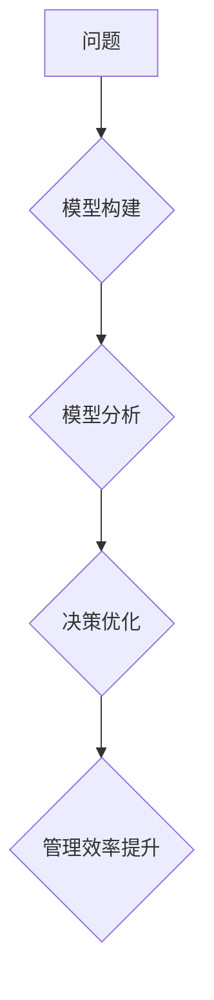

                 

## 1. 背景介绍

在当今数据爆炸和信息飞速发展的时代，管理效率已成为企业竞争力的关键因素。传统管理模式往往难以应对复杂、动态的业务环境，而模型思维作为一种全新的管理理念，正逐渐受到越来越多的关注。

模型思维的核心在于将复杂问题抽象成可理解、可分析的模型，通过对模型的构建、分析和优化，来提高决策的准确性和效率。它借鉴了计算机科学中的模型化思想，将管理问题视为一个需要建模、模拟和解决的系统，从而帮助管理者更清晰地洞察问题本质，制定更有效的解决方案。

## 2. 核心概念与联系

### 2.1 模型思维的定义

模型思维是一种将复杂系统抽象成简化模型，并通过分析和演算模型来理解和解决问题的方法。它强调以结构化、逻辑化的思维方式，构建可视化、可操作的模型，以便更好地理解系统行为、预测未来趋势和优化决策。

### 2.2 模型思维与管理效率的关系

模型思维能够有效提升管理效率，主要体现在以下几个方面：

* **清晰化问题：** 通过构建模型，将复杂问题分解成可管理的子问题，帮助管理者更清晰地理解问题本质和关键因素。
* **优化决策：** 模型可以模拟不同决策方案的结果，帮助管理者选择最优方案，降低决策风险。
* **提高协作：** 模型提供了一个共同的语言和框架，方便不同部门和人员进行沟通和协作。
* **促进创新：** 模型思维鼓励管理者从不同的角度思考问题，激发创新思维，探索新的解决方案。

**模型思维与管理效率的联系**



## 3. 核心算法原理 & 具体操作步骤

### 3.1 算法原理概述

模型思维的核心算法原理是基于系统动力学和数据分析的。系统动力学关注系统内部的反馈机制和循环结构，通过构建动态模型来模拟系统行为的演变过程。数据分析则利用统计学和机器学习等方法，从大量数据中提取有价值的信息，为模型构建和分析提供依据。

### 3.2 算法步骤详解

1. **问题定义:** 明确需要解决的问题，并将其分解成可管理的子问题。
2. **模型构建:** 根据问题特点，选择合适的模型框架，并构建模型结构，包括变量、关系和反馈机制。
3. **数据收集:** 收集与模型相关的关键数据，并进行清洗和预处理。
4. **模型参数化:** 根据数据分析结果，确定模型参数，使模型能够准确地反映现实世界。
5. **模型验证:** 使用测试数据验证模型的准确性和可靠性，并进行必要的调整和优化。
6. **模型分析:** 利用模型模拟不同情景，分析系统行为的演变趋势，并预测未来可能出现的问题。
7. **决策优化:** 基于模型分析结果，制定最优决策方案，并评估方案的潜在风险和收益。
8. **方案实施:** 将决策方案付诸实践，并持续监控和评估方案的效果。

### 3.3 算法优缺点

**优点:**

* **清晰化问题:** 模型思维能够将复杂问题分解成可理解的子问题，帮助管理者更清晰地洞察问题本质。
* **优化决策:** 模型可以模拟不同决策方案的结果，帮助管理者选择最优方案，降低决策风险。
* **提高协作:** 模型提供了一个共同的语言和框架，方便不同部门和人员进行沟通和协作。

**缺点:**

* **模型构建复杂:** 建立准确的模型需要专业知识和经验，并且需要投入大量的时间和资源。
* **数据依赖性强:** 模型的准确性依赖于数据的质量和完整性，如果数据不准确或不完整，模型的结果也会受到影响。
* **局限性:** 模型只能模拟已知的因素和关系，无法预测所有可能发生的事件。

### 3.4 算法应用领域

模型思维在各个领域都有广泛的应用，例如：

* **商业管理:** 预测市场趋势、优化供应链、制定营销策略等。
* **金融管理:** 风险管理、投资决策、资产配置等。
* **人力资源管理:** 人员招聘、培训、绩效评估等。
* **公共管理:** 政策制定、资源分配、社会服务等。

## 4. 数学模型和公式 & 详细讲解 & 举例说明

### 4.1 数学模型构建

在模型思维中，数学模型是描述系统行为的工具，它利用数学语言和符号来表达系统变量之间的关系和反馈机制。常见的数学模型类型包括：

* **线性模型:** 描述线性关系的模型，例如线性回归模型。
* **非线性模型:** 描述非线性关系的模型，例如Logistic回归模型。
* **差分方程模型:** 描述系统随时间变化的模型，例如人口增长模型。
* **微分方程模型:** 描述系统连续变化的模型，例如物理系统动力学模型。

### 4.2 公式推导过程

以线性回归模型为例，其目标是找到一条直线，使得该直线与数据点之间的距离最小。

**公式:**

$$
y = mx + c
$$

其中：

* $y$ 是预测值
* $x$ 是自变量
* $m$ 是斜率
* $c$ 是截距

**推导过程:**

1. 计算数据点之间的残差平方和:

$$
RSS = \sum_{i=1}^{n}(y_i - mx_i - c)^2
$$

2. 对 $m$ 和 $c$ 求偏导，并令其等于零:

$$
\frac{\partial RSS}{\partial m} = -2\sum_{i=1}^{n}x_i(y_i - mx_i - c) = 0
$$

$$
\frac{\partial RSS}{\partial c} = -2\sum_{i=1}^{n}(y_i - mx_i - c) = 0
$$

3. 解方程组，得到 $m$ 和 $c$ 的最佳值。

### 4.3 案例分析与讲解

假设我们想要预测房屋价格，并收集了房屋面积和价格的数据。我们可以使用线性回归模型来建立房屋价格预测模型。

通过对数据进行分析，我们发现房屋面积和价格之间存在正相关关系，即房屋面积越大，价格越高。我们可以使用线性回归模型来拟合这条关系，并得到一个预测公式。

例如，假设我们得到以下预测公式:

$$
y = 5000x + 100000
$$

其中：

* $y$ 是房屋价格
* $x$ 是房屋面积

这意味着，如果房屋面积为 100 平方米，那么预测价格为 600,000 元。

## 5. 项目实践：代码实例和详细解释说明

### 5.1 开发环境搭建

为了实现模型思维的应用，我们需要搭建一个合适的开发环境。常用的开发环境包括：

* **Python:** Python 是一种开源的编程语言，拥有丰富的机器学习和数据分析库，例如 scikit-learn、pandas 和 numpy。
* **R:** R 是一种专门用于统计分析和数据可视化的编程语言，拥有强大的统计模型和图形工具。
* **MATLAB:** MATLAB 是一个商业化的数值计算和数据分析软件，拥有强大的建模和仿真功能。

### 5.2 源代码详细实现

以下是一个使用 Python 实现线性回归模型的代码示例:

```python
import pandas as pd
from sklearn.linear_model import LinearRegression

# 加载数据
data = pd.read_csv('house_data.csv')

# 提取特征和目标变量
X = data[['面积']]
y = data['价格']

# 创建线性回归模型
model = LinearRegression()

# 训练模型
model.fit(X, y)

# 获取模型参数
slope = model.coef_[0]
intercept = model.intercept_

# 打印模型参数
print('斜率:', slope)
print('截距:', intercept)

# 使用模型预测
new_area = 100
predicted_price = slope * new_area + intercept
print('预测价格:', predicted_price)
```

### 5.3 代码解读与分析

这段代码首先加载了房屋面积和价格的数据，然后提取特征和目标变量。接着，创建了一个线性回归模型，并使用训练数据训练模型。最后，获取模型参数，并使用模型预测新的房屋价格。

### 5.4 运行结果展示

运行这段代码后，会输出模型的斜率、截距以及对新房屋面积的预测价格。

## 6. 实际应用场景

### 6.1 案例分析

模型思维在实际应用中具有广泛的应用场景，例如：

* **供应链管理:** 通过构建供应链模型，可以预测需求变化、优化库存水平、降低物流成本。
* **市场营销:** 通过构建市场营销模型，可以预测市场趋势、优化广告投放、提高营销效果。
* **人力资源管理:** 通过构建人力资源模型，可以预测人才需求、优化招聘策略、提高员工绩效。

### 6.2 未来应用展望

随着人工智能和数据分析技术的不断发展，模型思维的应用场景将更加广泛，例如：

* **个性化推荐:** 通过构建用户行为模型，可以提供更加个性化的产品和服务推荐。
* **智能决策支持:** 通过构建决策模型，可以帮助管理者做出更加智能和高效的决策。
* **预测性维护:** 通过构建设备运行模型，可以预测设备故障，并进行提前维护。

## 7. 工具和资源推荐

### 7.1 学习资源推荐

* **书籍:**

    * 《模型思维》
    * 《系统思考》
    * 《数据科学方法》

* **在线课程:**

    * Coursera: 数据科学、机器学习
    * edX: 系统动力学、数据分析

### 7.2 开发工具推荐

* **Python:** scikit-learn、pandas、numpy
* **R:** tidyverse、ggplot2
* **MATLAB:** Simulink、Statistics and Machine Learning Toolbox

### 7.3 相关论文推荐

* **《模型思维：从复杂系统到简单解决方案》**
* **《系统动力学：原理和应用》**
* **《数据科学方法：从理论到实践》**

## 8. 总结：未来发展趋势与挑战

### 8.1 研究成果总结

模型思维作为一种新的管理理念，已经取得了一定的成果，并在各个领域得到了广泛的应用。它能够帮助管理者更好地理解复杂问题，制定更有效的解决方案，提高管理效率。

### 8.2 未来发展趋势

未来，模型思维的发展趋势主要体现在以下几个方面：

* **更加智能化:** 随着人工智能技术的进步，模型思维将更加智能化，能够自动构建和优化模型，并提供更精准的预测和建议。
* **更加个性化:** 模型思维将更加注重个性化，能够根据用户的需求和特点，构建个性化的模型，提供更加定制化的服务。
* **更加协作化:** 模型思维将更加强调协作，能够帮助不同部门和人员进行更有效的沟通和协作，共同解决问题。

### 8.3 面临的挑战

模型思维的发展也面临着一些挑战，例如：

* **模型复杂性:** 构建复杂的模型需要专业知识和经验，并且需要投入大量的时间和资源。
* **数据质量:** 模型的准确性依赖于数据的质量和完整性，如果数据不准确或不完整，模型的结果也会受到影响。
* **伦理问题:** 模型思维的应用可能会带来一些伦理问题，例如模型的偏见和透明度问题。

### 8.4 研究展望

未来，我们需要继续深入研究模型思维的理论和方法，并探索其在更多领域的应用。同时，我们也需要关注模型思维的伦理问题，并制定相应的规范和制度，确保模型思维的健康发展。

## 9. 附录：常见问题与解答

### 9.1 模型思维与传统管理方法的比较

模型思维与传统管理方法相比，具有以下优势:

* **更加系统化:** 模型思维能够将复杂问题分解成可管理的子问题，并构建系统化的模型，帮助管理者更全面地理解问题本质。
* **更加数据驱动:** 模型思维强调数据分析和模型验证，能够帮助管理者做出更加数据驱动的决策。
* **更加创新性:** 模型思维鼓励管理者从不同的角度思考问题，激发创新思维，探索新的解决方案。

### 9.2 如何学习和应用模型思维

学习和应用模型思维需要以下步骤:

1. **学习基础知识:** 了解模型思维的基本概念、原理和方法。
2. **实践应用:** 通过实际项目，将模型思维应用到实际问题中。
3. **不断反思:** 反思模型的优缺点，并不断改进模型和方法。

### 9.3 模型思维的局限性

模型思维虽然是一种强大的管理工具，但也存在一些局限性:

* **模型的准确性:** 模型的准确性依赖于数据的质量和模型的复杂度，如果数据不准确或模型过于简单，模型的结果可能会不准确。
* **模型的局限性:** 模型只能模拟已知的因素和关系，无法预测所有可能发生的事件。
* **模型的解释性:** 一些复杂的模型难以解释，难以让非专业人员理解模型的运作机制。


作者：禅与计算机程序设计艺术 / Zen and the Art of Computer Programming 
<end_of_turn>

