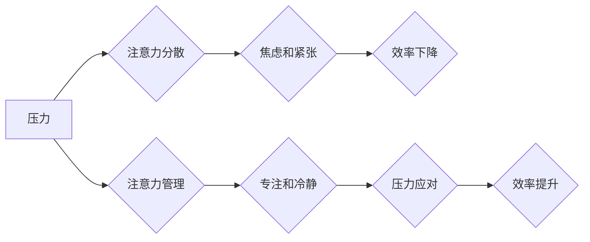

                 

## 1. 背景介绍

在当今快速发展的科技时代，IT从业者们面临着前所未有的压力和挑战。项目截止日期紧迫、工作量繁重、技术更新迭代迅速，这些因素都可能导致注意力分散、效率下降，甚至引发焦虑和压力。如何有效地管理注意力，在压力和焦虑中保持专注，已成为IT从业者们亟需解决的问题。

## 2. 核心概念与联系

### 2.1 注意力与压力

注意力是认知功能的核心，它指我们对特定信息或任务的集中和选择性关注。压力则是我们面对挑战或威胁时产生的生理和心理反应。两者之间存在着密切的联系：

* **压力会影响注意力：** 当我们处于压力状态时，大脑会释放应激激素，这些激素会影响大脑的认知功能，导致注意力难以集中，反应迟钝。
* **注意力不足会加剧压力：** 当我们无法集中注意力时，更容易感到焦虑和紧张，从而加剧压力。

### 2.2  注意力管理与压力管理

注意力管理和压力管理是相互关联的，它们共同影响着我们的工作效率和生活质量。有效的注意力管理策略可以帮助我们更好地应对压力，保持专注和冷静。

**Mermaid 流程图：**



## 3. 核心算法原理 & 具体操作步骤

### 3.1 算法原理概述

注意力管理和压力管理并非简单的技术算法，而是需要结合心理学、认知科学和实践经验的综合策略。 

**核心算法原理：**

* **认知行为疗法 (CBT)：** CBT 是一种心理治疗方法，它帮助人们识别和改变负面思维模式和行为模式，从而减轻压力和焦虑。
* **正念练习：** 正念练习是一种专注于当下体验的冥想方法，它可以帮助人们提高注意力，减轻压力，并增强情绪调节能力。
* **时间管理技巧：** 

有效的计划和时间管理可以帮助人们更好地安排工作和生活，减少压力和焦虑。

### 3.2 算法步骤详解

**注意力管理步骤：**

1. **识别注意力干扰源：** 首先要了解哪些因素会干扰你的注意力，例如手机通知、社交媒体、噪音等。
2. **创造专注环境：** 尽量减少注意力干扰源，创造一个安静、舒适的工作环境。
3. **使用番茄工作法：** 将工作时间分成25分钟的间隔，每间隔结束后休息5分钟，可以帮助提高专注力。
4. **练习正念冥想：** 每天花几分钟进行正念冥想，可以帮助提高注意力和专注力。

**压力管理步骤：**

1. **识别压力源：** 了解哪些因素会让你感到压力，例如工作压力、人际关系、生活琐事等。
2. **调整心态：** 尝试用积极的心态面对压力，不要过度焦虑和担忧。
3. **寻求支持：** 与朋友、家人或专业人士倾诉你的压力，寻求他们的支持和帮助。
4. **进行放松练习：** 练习深呼吸、瑜伽、冥想等放松技巧，可以帮助缓解压力和焦虑。

### 3.3 算法优缺点

**注意力管理算法：**

* **优点：** 可以有效提高注意力和专注力，提升工作效率。
* **缺点：** 需要坚持练习，才能看到效果。

**压力管理算法：**

* **优点：** 可以有效减轻压力和焦虑，改善情绪状态。
* **缺点：** 并非所有压力都能有效缓解，需要根据具体情况选择合适的策略。

### 3.4 算法应用领域

注意力管理和压力管理策略广泛应用于以下领域：

* **IT行业：** 帮助程序员、设计师、项目经理等IT从业者提高工作效率，减少压力和焦虑。
* **教育领域：** 帮助学生提高学习效率，减轻学习压力。
* **医疗领域：** 帮助患者缓解焦虑和压力，改善心理健康。

## 4. 数学模型和公式 & 详细讲解 & 举例说明

### 4.1 数学模型构建

注意力可以被视为一个动态的系统，其强度受多种因素影响。我们可以用以下数学模型来描述注意力：

$$A(t) = f(S(t), I(t), E(t))$$

其中：

* $A(t)$ 表示在时间 $t$ 时刻的注意力强度。
* $S(t)$ 表示在时间 $t$ 时刻的刺激强度。
* $I(t)$ 表示在时间 $t$ 时刻的干扰强度。
* $E(t)$ 表示在时间 $t$ 时刻的能量水平。
* $f$ 是一个非线性函数，描述注意力强度与刺激强度、干扰强度和能量水平之间的关系。

### 4.2 公式推导过程

该模型的推导过程需要结合心理学和认知科学的理论，以及大量的实验数据。 

**举例说明：**

假设一个程序员在编写代码时，代码本身是刺激，周围的噪音是干扰，而程序员的精力水平是能量。 

当代码难度较高时，刺激强度 $S(t)$ 会增加，注意力强度 $A(t)$ 也随之增加。但当噪音干扰 $I(t)$ 较大时，注意力强度 $A(t)$ 会下降。 

如果程序员感到疲劳，能量水平 $E(t)$ 降低，注意力强度 $A(t)$ 也会下降。

### 4.3 案例分析与讲解

通过分析实际案例，我们可以更深入地理解注意力管理和压力管理的数学模型。

**案例：**

一位程序员在工作时，经常受到同事聊天、邮件提醒等干扰，导致注意力难以集中，工作效率低下。

**分析：**

* 刺激强度 $S(t)$：代码本身的难度。
* 干扰强度 $I(t)$：同事聊天、邮件提醒等。
* 能量水平 $E(t)$：程序员的疲劳程度。

**解决方案：**

* 减少干扰：使用耳机隔绝噪音，关闭不必要的通知。
* 提高能量水平：保证充足的睡眠，合理安排工作时间，进行适当的运动。
* 调整心态：保持积极乐观的心态，专注于眼前的工作。

## 5. 项目实践：代码实例和详细解释说明

### 5.1 开发环境搭建

为了更好地理解注意力管理和压力管理的实践应用，我们可以开发一个简单的项目，例如一个专注时间管理工具。

**开发环境：**

* 操作系统：Windows/macOS/Linux
* 编程语言：Python
* 开发工具：VS Code/Atom/Sublime Text

### 5.2 源代码详细实现

```python
import time
import random

class PomodoroTimer:
    def __init__(self, work_time=25, break_time=5):
        self.work_time = work_time
        self.break_time = break_time
        self.current_state = "work"

    def start(self):
        if self.current_state == "work":
            print(f"开始工作模式，倒计时 {self.work_time} 分钟...")
            self.countdown(self.work_time)
        elif self.current_state == "break":
            print(f"开始休息模式，倒计时 {self.break_time} 分钟...")
            self.countdown(self.break_time)

    def countdown(self, duration):
        while duration > 0:
            print(f"剩余时间：{duration} 分钟")
            time.sleep(60)
            duration -= 1
        if self.current_state == "work":
            self.current_state = "break"
            print("休息时间到，开始休息...")
        else:
            self.current_state = "work"
            print("休息时间到，开始工作...")

# 实例化 PomodoroTimer 对象
timer = PomodoroTimer()

# 启动番茄工作法
timer.start()
```

### 5.3 代码解读与分析

这段代码实现了一个简单的番茄工作法计时器。

* `PomodoroTimer` 类：定义了番茄工作法的核心逻辑，包括工作时间、休息时间和当前状态。
* `start()` 方法：根据当前状态启动工作或休息计时器。
* `countdown()` 方法：倒计时并切换工作和休息状态。

### 5.4 运行结果展示

运行这段代码后，程序会打印出倒计时信息，并在指定时间后切换工作和休息状态。

## 6. 实际应用场景

### 6.1  IT行业应用

* **程序员：** 使用番茄工作法提高专注力，避免长时间编程导致的疲劳和错误。
* **设计师：** 利用正念练习缓解设计过程中的压力和焦虑，保持创意灵感。
* **项目经理：** 运用时间管理技巧合理安排工作任务，避免过度工作和压力。

### 6.2  教育领域应用

* **学生：** 使用番茄工作法提高学习效率，克服拖延症。
* **教师：** 结合正念练习，帮助学生缓解考试压力，提升学习兴趣。

### 6.3  医疗领域应用

* **患者：** 通过正念练习缓解焦虑和压力，改善心理健康。
* **医护人员：** 运用压力管理技巧应对工作压力，提高工作效率和服务质量。

### 6.4 未来应用展望

随着人工智能技术的不断发展，注意力管理和压力管理将得到更广泛的应用。

* **个性化注意力管理系统：** 基于用户的行为数据和生理指标，提供个性化的注意力管理建议和干预措施。
* **智能压力监测和缓解系统：** 利用传感器和人工智能算法，实时监测用户的压力水平，并提供相应的缓解建议和干预措施。

## 7. 工具和资源推荐

### 7.1 学习资源推荐

* **书籍：**
    * 《专注力：如何训练你的大脑专注于当下》
    * 《压力与焦虑的管理》
    * 《正念：改变生活的八周冥想计划》
* **在线课程：**
    * Coursera：正念与专注力
    * Udemy：压力管理技巧
    * edX：认知行为疗法

### 7.2 开发工具推荐

* **番茄工作法计时器：**
    * Forest
    * Focus Keeper
* **正念冥想应用：**
    * Headspace
    * Calm
* **压力监测设备：**
    * Fitbit
    * Apple Watch

### 7.3 相关论文推荐

* **注意力机制：**
    * Attention Is All You Need
* **压力管理：**
    * Mindfulness-Based Stress Reduction for Chronic Pain
* **正念练习：**
    * The Effects of Mindfulness-Based Stress Reduction on Anxiety and Depression

## 8. 总结：未来发展趋势与挑战

### 8.1 研究成果总结

注意力管理和压力管理的研究取得了显著进展，已经形成了较为完善的理论体系和实践方法。

### 8.2 未来发展趋势

未来，注意力管理和压力管理的研究将更加注重以下几个方面：

* **个性化定制：** 基于用户的个体差异，提供个性化的注意力管理和压力管理方案。
* **人工智能辅助：** 利用人工智能技术，开发更智能、更有效的注意力管理和压力管理工具。
* **跨学科融合：** 将注意力管理和压力管理与其他学科，例如神经科学、心理学、教育学等进行交叉研究，探索更深层次的机制和应用。

### 8.3 面临的挑战

注意力管理和压力管理的研究也面临着一些挑战：

* **数据获取和隐私保护：** 

注意力和压力数据往往是敏感信息，需要采取有效的措施保证数据安全和隐私。
* **模型解释性和可信度：** 

一些注意力管理和压力管理模型过于复杂，难以解释其工作原理，这可能会影响用户的信任和接受度。
* **跨文化差异：** 

注意力和压力管理的机制可能存在跨文化差异，需要进行跨文化研究，才能更好地推广应用。

### 8.4 研究展望

尽管面临着挑战，但注意力管理和压力管理的研究前景依然广阔。 相信随着技术的进步和研究的深入，我们能够开发出更有效的注意力管理和压力管理工具，帮助人们更好地应对现代生活中的压力和挑战，提升工作效率和生活质量。

## 9. 附录：常见问题与解答

**Q1：如何提高注意力？**

**A1：** 

* 创造专注环境：减少干扰，例如关闭手机通知、使用耳机隔绝噪音。
* 使用番茄工作法：将工作时间分成25分钟的间隔，每间隔结束后休息5分钟。
* 练习正念冥想：每天花几分钟进行正念冥想，可以帮助提高注意力和专注力。

**Q2：如何缓解压力？**

**A2：**

* 调整心态：保持积极乐观的心态，不要过度焦虑和担忧。
* 寻求支持：与朋友、家人或专业人士倾诉你的压力，寻求他们的支持和帮助。
* 进行放松练习：练习深呼吸、瑜伽、冥想等放松技巧，可以帮助缓解压力和焦虑。


作者：禅与计算机程序设计艺术 / Zen and the Art of Computer Programming 
<end_of_turn>

