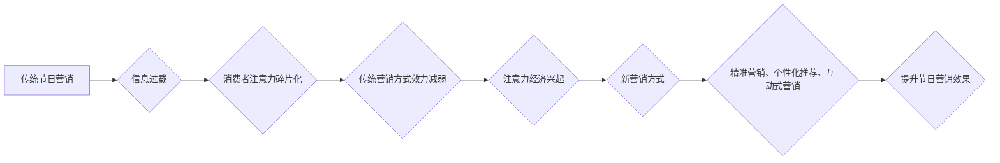

                 

## 1. 背景介绍

在当今信息爆炸的时代，人们面临着来自各方信息的冲击，注意力已成为稀缺的资源。这种“注意力经济”的兴起对传统节日营销带来了深刻的影响。传统节日营销，长期以来依赖于海量的广告投放和线下活动，但随着互联网和移动互联网的普及，消费者注意力被分散到各个平台和内容中，传统营销方式的效力逐渐减弱。

节日营销需要抓住消费者在特定时间段内 heightened 的消费意愿，但如何有效地吸引和留住消费者注意力，成为了一个新的挑战。

## 2. 核心概念与联系

### 2.1 注意力经济

注意力经济是指在信息过载的时代，注意力成为一种稀缺资源，而能够有效获取和利用用户注意力的产品和服务将占据市场主导地位。

### 2.2 传统节日营销

传统节日营销是指在节日期间，企业通过各种营销活动，如广告投放、促销活动、线下活动等，来吸引消费者购买商品或服务。

### 2.3 核心概念联系

注意力经济的兴起对传统节日营销提出了新的挑战和机遇。一方面，传统节日营销需要适应消费者注意力碎片化的特点，寻找新的营销方式来吸引和留住消费者注意力。另一方面，注意力经济也为传统节日营销提供了新的工具和手段，例如精准营销、个性化推荐、互动式营销等，可以帮助企业更有效地触达目标消费者。

**Mermaid 流程图**



## 3. 核心算法原理 & 具体操作步骤

### 3.1 算法原理概述

在注意力经济背景下，传统节日营销需要借助数据分析和算法模型来预测消费者需求，精准投放广告，提高营销效果。

常见的算法模型包括：

* **推荐算法**: 基于用户历史行为、偏好和节日主题，推荐相关商品或服务。
* **预测算法**: 分析历史节日销售数据，预测未来节日期间的消费趋势和需求。
* **个性化算法**: 根据用户画像和节日场景，定制个性化的营销内容和活动。

### 3.2 算法步骤详解

**推荐算法为例**:

1. **数据收集**: 收集用户历史购买记录、浏览记录、评分记录等数据。
2. **数据预处理**: 对数据进行清洗、转换、特征提取等处理，以便算法模型的训练。
3. **模型训练**: 使用机器学习算法，例如协同过滤、内容过滤、深度学习等，训练推荐模型。
4. **模型评估**: 使用测试数据评估模型的准确性和效果。
5. **模型部署**: 将训练好的模型部署到线上系统，为用户提供个性化的商品推荐。

### 3.3 算法优缺点

**优点**:

* **精准推荐**: 根据用户需求和节日主题，推荐更精准的商品或服务。
* **提高转化率**: 精准推荐可以提高用户点击率和购买率，提升营销效果。
* **个性化体验**: 为用户提供个性化的营销内容和活动，提升用户体验。

**缺点**:

* **数据依赖**: 推荐算法需要大量的数据进行训练，数据质量直接影响模型效果。
* **算法复杂**: 训练和部署推荐算法需要一定的技术门槛。
* **隐私问题**: 数据收集和使用需要考虑用户隐私保护问题。

### 3.4 算法应用领域

推荐算法在电商、社交媒体、内容平台等领域广泛应用，例如：

* **商品推荐**: 根据用户历史购买记录和浏览记录，推荐相关商品。
* **内容推荐**: 根据用户兴趣和阅读习惯，推荐相关新闻、文章、视频等内容。
* **广告推荐**: 根据用户兴趣和行为特征，推荐精准的广告。

## 4. 数学模型和公式 & 详细讲解 & 举例说明

### 4.1 数学模型构建

推荐算法通常使用协同过滤算法，其核心思想是基于用户的相似度或商品的相似度进行推荐。

**用户-商品交互矩阵**:

用户-商品交互矩阵是一个二维矩阵，其中每一行代表一个用户，每一列代表一个商品，矩阵元素表示用户对商品的评分或购买行为。

**用户相似度**:

可以使用余弦相似度、皮尔逊相关系数等方法计算用户之间的相似度。

**商品相似度**:

可以使用余弦相似度、Jaccard系数等方法计算商品之间的相似度。

### 4.2 公式推导过程

**余弦相似度**:

$$
\text{相似度} = \frac{\mathbf{u} \cdot \mathbf{v}}{\|\mathbf{u}\| \|\mathbf{v}\|}
$$

其中：

* $\mathbf{u}$ 和 $\mathbf{v}$ 是两个向量的表示，例如用户或商品的特征向量。
* $\cdot$ 表示向量的点积。
* $\|\mathbf{u}\|$ 和 $\|\mathbf{v}\|$ 表示向量的模长。

**皮尔逊相关系数**:

$$
\text{相关系数} = \frac{\sum_{i=1}^{n}(x_i - \bar{x})(y_i - \bar{y})}{\sqrt{\sum_{i=1}^{n}(x_i - \bar{x})^2} \sqrt{\sum_{i=1}^{n}(y_i - \bar{y})^2}}
$$

其中：

* $x_i$ 和 $y_i$ 是两个变量的第 $i$ 个观测值。
* $\bar{x}$ 和 $\bar{y}$ 是两个变量的平均值。

### 4.3 案例分析与讲解

假设有一个电商平台，用户购买商品的记录存储在用户-商品交互矩阵中。

可以使用协同过滤算法，根据用户的购买历史，推荐用户可能感兴趣的商品。

例如，如果用户 A 和用户 B 都购买了商品 X 和商品 Y，那么可以认为用户 A 和用户 B 的兴趣相似，因此可以推荐用户 A 购买的用户 B 购买过的商品 Z。

## 5. 项目实践：代码实例和详细解释说明

### 5.1 开发环境搭建

* Python 3.x
* Pandas
* Scikit-learn
* TensorFlow/PyTorch

### 5.2 源代码详细实现

```python
import pandas as pd
from sklearn.metrics.pairwise import cosine_similarity

# 加载用户-商品交互矩阵
data = pd.read_csv('user_item_matrix.csv')

# 计算用户之间的余弦相似度
user_similarity = cosine_similarity(data)

# 获取用户 A 的索引
user_a_index = data.index.get_loc('user_a')

# 获取与用户 A 相似度最高的 5 个用户
similar_users = user_similarity[user_a_index].argsort()[:-6:-1]

# 获取相似用户购买过的商品
recommended_items = data.iloc[similar_users].mean().sort_values(ascending=False)

# 打印推荐商品
print(recommended_items)
```

### 5.3 代码解读与分析

* 代码首先加载用户-商品交互矩阵数据。
* 使用 `cosine_similarity` 函数计算用户之间的余弦相似度。
* 获取用户 A 的索引，并根据相似度排序，获取与用户 A 相似度最高的 5 个用户。
* 从相似用户的购买记录中，计算平均值，得到推荐商品。

### 5.4 运行结果展示

运行代码后，将输出用户 A 可能感兴趣的商品列表，以及每个商品的推荐得分。

## 6. 实际应用场景

### 6.1 精准营销

利用用户画像和节日主题，精准推送节日促销信息和优惠活动，提高用户转化率。

### 6.2 个性化推荐

根据用户历史行为和节日偏好，推荐个性化的节日商品和服务，提升用户体验。

### 6.3 互动式营销

设计互动式节日活动，例如抽奖、投票、问答等，吸引用户参与，增强品牌粘性。

### 6.4 未来应用展望

随着人工智能技术的不断发展，注意力经济对传统节日营销的影响将更加深远。

未来，我们可以期待以下应用场景：

* **更精准的个性化推荐**: 利用深度学习等先进算法，实现更精准的个性化推荐，满足用户多样化的需求。
* **更沉浸式的互动体验**: 利用虚拟现实、增强现实等技术，打造更沉浸式的节日互动体验，增强用户参与度。
* **更智能的营销决策**: 利用大数据分析和机器学习，实现更智能的营销决策，提高营销效率。

## 7. 工具和资源推荐

### 7.1 学习资源推荐

* **书籍**:

    * 《深度学习》
    * 《机器学习实战》
    * 《Python数据科学手册》

* **在线课程**:

    * Coursera
    * edX
    * Udacity

### 7.2 开发工具推荐

* **Python**: 广泛应用于数据分析、机器学习和人工智能领域。
* **Pandas**: 用于数据分析和处理的 Python 库。
* **Scikit-learn**: 用于机器学习的 Python 库。
* **TensorFlow/PyTorch**: 用于深度学习的 Python 库。

### 7.3 相关论文推荐

* **Attention Is All You Need**: https://arxiv.org/abs/1706.03762
* **BERT: Pre-training of Deep Bidirectional Transformers for Language Understanding**: https://arxiv.org/abs/1810.04805

## 8. 总结：未来发展趋势与挑战

### 8.1 研究成果总结

注意力经济对传统节日营销的影响日益显著，数据分析和算法模型为节日营销提供了新的工具和手段。

通过精准推荐、个性化营销和互动式营销，企业可以更有效地触达目标消费者，提升营销效果。

### 8.2 未来发展趋势

未来，注意力经济对传统节日营销的影响将更加深远，以下趋势值得关注：

* **更精准的个性化推荐**: 利用深度学习等先进算法，实现更精准的个性化推荐，满足用户多样化的需求。
* **更沉浸式的互动体验**: 利用虚拟现实、增强现实等技术，打造更沉浸式的节日互动体验，增强用户参与度。
* **更智能的营销决策**: 利用大数据分析和机器学习，实现更智能的营销决策，提高营销效率。

### 8.3 面临的挑战

尽管注意力经济为传统节日营销带来了新的机遇，但也面临着一些挑战：

* **数据隐私**: 数据收集和使用需要考虑用户隐私保护问题。
* **算法可解释性**: 复杂的算法模型难以解释，需要提高算法的可解释性。
* **用户信任**: 用户对算法推荐的信任度需要不断提升。

### 8.4 研究展望

未来，需要进一步研究以下问题：

* 如何更好地平衡数据利用和用户隐私保护？
* 如何提高算法模型的可解释性和透明度？
* 如何增强用户对算法推荐的信任度？


## 9. 附录：常见问题与解答

### 9.1 如何提高算法推荐的准确性？

* 提高数据质量：收集更丰富、更准确的用户数据。
* 选择合适的算法模型：根据实际情况选择合适的算法模型。
* 优化算法参数：通过调参，优化算法模型的性能。

### 9.2 如何解决数据隐私问题？

*  anonymize 用户数据：对用户数据进行匿名处理，保护用户隐私。
* 获得用户同意：在收集和使用用户数据前，获得用户的明确同意。
* 加强数据安全防护：采取措施保护用户数据的安全。


作者：禅与计算机程序设计艺术 / Zen and the Art of Computer Programming 
<end_of_turn>

