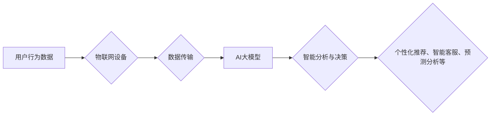

                 

## 电商平台中的AI大模型与物联网结合

> 关键词：AI大模型、物联网、电商平台、个性化推荐、智能客服、预测分析、数据驱动、深度学习

## 1. 背景介绍

电子商务平台作为当今数字经济的重要组成部分，其发展离不开对用户体验的不断提升和业务效率的持续优化。近年来，人工智能（AI）和大数据技术的蓬勃发展为电商平台带来了前所未有的机遇。其中，AI大模型和物联网（IoT）技术的结合，正在深刻地改变着电商平台的运营模式和用户体验。

AI大模型，例如Transformer、BERT等，凭借其强大的语义理解和文本生成能力，在电商平台的多个领域展现出巨大的潜力。例如，个性化推荐、智能客服、商品搜索、内容创作等。物联网则通过传感器、网络和数据分析技术，将物理世界与数字世界连接起来，为电商平台提供了海量实时数据，为AI大模型的训练和应用提供了重要的数据支撑。

## 2. 核心概念与联系

### 2.1 AI大模型

AI大模型是指在海量数据上训练的深度学习模型，其参数规模庞大，能够学习到复杂的模式和关系。例如，GPT-3、LaMDA等语言模型，能够进行自然语言理解、文本生成、翻译等任务；DALL-E 2等图像生成模型，能够根据文本描述生成逼真的图像。

### 2.2 物联网

物联网是指通过传感器、网络和数据分析技术，将各种物理设备和物体连接到互联网，实现数据采集、传输、处理和应用的网络系统。物联网设备可以收集各种数据，例如温度、湿度、位置、运动等，这些数据可以为电商平台提供用户行为、商品需求、物流状态等方面的实时信息。

### 2.3 AI大模型与物联网的结合

AI大模型与物联网的结合，可以将物联网收集到的海量数据与AI大模型的强大计算能力相结合，实现更智能、更精准的电商平台运营。例如，可以利用AI大模型对用户行为数据进行分析，预测用户的购买意愿，提供更精准的个性化推荐；可以利用AI大模型对商品信息和用户需求进行匹配，优化商品展示和推荐策略；可以利用AI大模型对物流数据进行分析，优化物流配送路线，提高配送效率。

**Mermaid 流程图**



## 3. 核心算法原理 & 具体操作步骤

### 3.1 算法原理概述

AI大模型与物联网结合的核心算法原理主要包括：

* **深度学习算法**: 

深度学习算法是AI大模型的核心，例如卷积神经网络（CNN）、循环神经网络（RNN）、Transformer等，能够学习到复杂的模式和关系。

* **机器学习算法**: 

机器学习算法用于对物联网收集到的数据进行分析和预测，例如回归算法、分类算法、聚类算法等。

* **自然语言处理（NLP）算法**: 

NLP算法用于处理用户文本数据，例如文本分类、情感分析、文本生成等。

### 3.2 算法步骤详解

1. **数据采集**: 物联网设备收集用户行为数据、商品信息、物流数据等。
2. **数据预处理**: 对收集到的数据进行清洗、转换、特征提取等操作，使其适合AI大模型的训练和应用。
3. **模型训练**: 利用深度学习算法对预处理后的数据进行训练，构建AI大模型。
4. **模型评估**: 对训练好的模型进行评估，例如准确率、召回率、F1-score等指标，并根据评估结果进行模型调优。
5. **模型部署**: 将训练好的模型部署到电商平台，用于个性化推荐、智能客服、预测分析等应用场景。
6. **数据反馈**: 应用场景中收集到的数据反馈到模型训练环节，不断优化模型性能。

### 3.3 算法优缺点

**优点**:

* **精准度高**: AI大模型能够学习到复杂的模式和关系，实现更精准的预测和分析。
* **自动化程度高**: AI大模型可以自动化完成许多任务，例如个性化推荐、智能客服等，提高效率。
* **用户体验提升**: AI大模型可以提供更个性化、更智能的用户体验，例如精准推荐、智能客服等。

**缺点**:

* **数据依赖性强**: AI大模型的性能取决于训练数据的质量和数量。
* **计算资源消耗大**: 训练大型AI模型需要大量的计算资源。
* **解释性差**: AI大模型的决策过程往往难以解释，这可能导致用户信任度降低。

### 3.4 算法应用领域

* **个性化推荐**: 根据用户的历史购买记录、浏览记录、兴趣爱好等数据，推荐个性化的商品。
* **智能客服**: 利用自然语言处理技术，实现自动回复用户咨询，提高客服效率。
* **预测分析**: 利用历史数据预测用户的购买意愿、商品需求、物流状态等，帮助电商平台优化运营策略。
* **内容创作**: 利用AI大模型生成商品描述、广告文案、营销内容等，提高内容创作效率。

## 4. 数学模型和公式 & 详细讲解 & 举例说明

### 4.1 数学模型构建

在电商平台中，AI大模型的训练通常基于以下数学模型：

* **损失函数**: 用于衡量模型预测结果与真实结果之间的差异。常见的损失函数包括均方误差（MSE）、交叉熵损失（Cross-Entropy Loss）等。
* **优化算法**: 用于更新模型参数，使模型的损失函数最小化。常见的优化算法包括梯度下降（Gradient Descent）、Adam优化器等。

### 4.2 公式推导过程

例如，对于一个基于回归算法的商品推荐模型，其损失函数可以定义为均方误差：

$$
Loss = \frac{1}{N} \sum_{i=1}^{N} (y_i - \hat{y}_i)^2
$$

其中：

* $N$ 为样本数量
* $y_i$ 为真实值
* $\hat{y}_i$ 为模型预测值

优化算法的目标是通过迭代更新模型参数，使损失函数的值最小化。

### 4.3 案例分析与讲解

假设电商平台想要预测用户的购买意愿，可以利用用户的历史购买记录、浏览记录、兴趣爱好等数据训练一个基于深度学习的预测模型。

模型的输入数据可以包括用户的 demographic 信息、浏览历史、购买历史、商品信息等。模型的输出可以是一个概率值，表示用户购买该商品的可能性。

通过训练模型，可以获得一个能够预测用户购买意愿的模型。电商平台可以利用这个模型，为用户推荐他们可能感兴趣的商品，提高转化率。

## 5. 项目实践：代码实例和详细解释说明

### 5.1 开发环境搭建

* **操作系统**: Ubuntu 20.04 LTS
* **编程语言**: Python 3.8
* **深度学习框架**: TensorFlow 2.x
* **其他工具**: Jupyter Notebook、Git

### 5.2 源代码详细实现

```python
import tensorflow as tf

# 定义模型结构
model = tf.keras.Sequential([
    tf.keras.layers.Dense(64, activation='relu', input_shape=(10,)),
    tf.keras.layers.Dense(32, activation='relu'),
    tf.keras.layers.Dense(1, activation='sigmoid')
])

# 定义损失函数和优化器
model.compile(loss='binary_crossentropy', optimizer='adam', metrics=['accuracy'])

# 训练模型
model.fit(x_train, y_train, epochs=10, batch_size=32)

# 评估模型
loss, accuracy = model.evaluate(x_test, y_test)
print('Loss:', loss)
print('Accuracy:', accuracy)
```

### 5.3 代码解读与分析

* **模型结构**: 代码定义了一个简单的多层感知机模型，包含三个全连接层和一个sigmoid激活函数的输出层。
* **损失函数和优化器**: 使用二元交叉熵损失函数和Adam优化器进行模型训练。
* **训练模型**: 使用训练数据进行模型训练，设置训练轮数和批处理大小。
* **评估模型**: 使用测试数据评估模型的性能，输出损失值和准确率。

### 5.4 运行结果展示

训练完成后，可以将模型部署到电商平台，用于预测用户的购买意愿。

## 6. 实际应用场景

### 6.1 个性化推荐

AI大模型可以根据用户的历史购买记录、浏览记录、兴趣爱好等数据，推荐个性化的商品，提高用户体验和转化率。例如，电商平台可以利用AI大模型推荐用户可能感兴趣的商品、新品、促销活动等。

### 6.2 智能客服

AI大模型可以利用自然语言处理技术，实现自动回复用户咨询，提高客服效率。例如，电商平台可以利用AI大模型构建智能客服机器人，自动回答用户关于商品信息、订单状态、退换货政策等方面的常见问题。

### 6.3 预测分析

AI大模型可以利用历史数据预测用户的购买意愿、商品需求、物流状态等，帮助电商平台优化运营策略。例如，电商平台可以利用AI大模型预测用户的购买高峰期，提前做好库存准备；预测商品的热销趋势，调整商品的采购计划；预测物流的配送时间，优化配送路线。

### 6.4 未来应用展望

随着AI技术和物联网技术的不断发展，AI大模型与物联网的结合在电商平台的应用场景将更加广泛。例如：

* **虚拟试衣间**: 利用AI大模型和AR/VR技术，实现虚拟试衣间，让用户在家就能试穿衣服，提高购物体验。
* **个性化营销**: 利用AI大模型分析用户的行为数据，进行精准的个性化营销，提高营销效果。
* **智能仓储管理**: 利用AI大模型和物联网传感器，实现智能仓储管理，提高仓储效率和安全性。

## 7. 工具和资源推荐

### 7.1 学习资源推荐

* **在线课程**: Coursera、edX、Udacity等平台提供丰富的AI和物联网相关课程。
* **书籍**: 《深度学习》、《机器学习》、《物联网编程》等书籍。
* **开源项目**: TensorFlow、PyTorch、OpenCV等开源项目。

### 7.2 开发工具推荐

* **编程语言**: Python、Java、C++等。
* **深度学习框架**: TensorFlow、PyTorch、Keras等。
* **物联网平台**: AWS IoT、Azure IoT、Alibaba Cloud IoT等。

### 7.3 相关论文推荐

* **AI大模型**: Attention Is All You Need、BERT: Pre-training of Deep Bidirectional Transformers for Language Understanding等。
* **物联网**: The Internet of Things: A Survey、A Survey on Security and Privacy in the Internet of Things等。

## 8. 总结：未来发展趋势与挑战

### 8.1 研究成果总结

AI大模型与物联网的结合为电商平台带来了巨大的机遇，能够实现更智能、更精准的运营，提升用户体验和业务效率。

### 8.2 未来发展趋势

* **模型规模和能力的提升**: 未来，AI大模型的规模和能力将进一步提升，能够处理更复杂的数据，学习更复杂的模式和关系。
* **边缘计算的应用**: 将AI模型部署到物联网设备的边缘端，实现更实时、更低延迟的智能分析和决策。
* **多模态数据融合**: 将文本、图像、音频等多模态数据融合到AI模型中，实现更全面的用户理解和服务。

### 8.3 面临的挑战

* **数据安全和隐私保护**: AI大模型的训练和应用需要大量的数据，如何保证数据的安全和隐私保护是一个重要的挑战。
* **模型解释性和可信度**: AI大模型的决策过程往往难以解释，如何提高模型的解释性和可信度是一个重要的研究方向。
* **算法公平性和可控性**: AI大模型的训练数据可能存在偏差，导致模型输出结果存在偏见，如何保证算法的公平性和可控性是一个重要的伦理问题。

### 8.4 研究展望

未来，AI大模型与物联网的结合将继续深入发展，为电商平台带来更多创新应用，推动电商行业向智能化、个性化、数据化方向发展。


## 9. 附录：常见问题与解答

**Q1: AI大模型的训练需要多少数据？**

A1: AI大模型的训练数据量取决于模型的复杂度和任务的难度。一般来说，需要大量的训练数据才能训练出性能良好的AI模型。

**Q2: 如何保证AI大模型的公平性和可控性？**

A2: 

* **数据预处理**: 在训练数据中去除潜在的偏见。
* **算法设计**: 设计公平性和可控性的算法，例如使用对抗训练等技术。
* **模型评估**: 对模型输出结果进行评估，检测是否存在偏见或不公平现象。

**Q3: 如何部署AI大模型到物联网设备？**

A3: 可以使用边缘计算技术，将AI模型部署到物联网设备的边缘端，实现更实时、更低延迟的智能分析和决策。

**作者：禅与计算机程序设计艺术 / Zen and the Art of Computer Programming**<end_of_turn>

