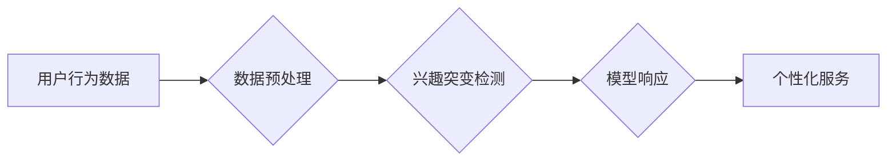

                 

## 电商平台中的用户兴趣突变检测与响应模型

> 关键词：用户兴趣突变检测、电商平台、推荐系统、机器学习、时间序列分析、模型响应

## 1. 背景介绍

在当今数据爆炸的时代，电商平台积累了海量用户行为数据，这些数据蕴含着用户的兴趣偏好、消费习惯等宝贵信息。传统的电商推荐系统往往基于用户的历史购买记录和浏览行为进行推荐，但用户兴趣是动态变化的，用户的行为模式也可能发生突变。如果不能及时捕捉和响应用户的兴趣变化，将会导致推荐效果下降，用户体验降低，甚至影响平台的商业发展。

用户兴趣突变检测与响应模型旨在解决这一问题，通过对用户行为数据进行分析，识别用户的兴趣突变点，并根据突变情况进行个性化推荐和服务响应。例如，一个用户长期购买运动类商品，突然开始购买化妆品，这可能表明其兴趣发生了突变。平台可以通过模型识别这一变化，推荐相关化妆品，并提供个性化服务，例如提供化妆品使用技巧、搭配建议等。

## 2. 核心概念与联系

### 2.1 用户兴趣突变

用户兴趣突变是指用户在一段时间内，其行为模式发生显著变化，表现为对新商品或类别表现出强烈的兴趣，而对过去感兴趣的商品或类别兴趣明显下降。

### 2.2 电商平台推荐系统

电商平台推荐系统是根据用户的兴趣偏好和行为数据，推荐用户可能感兴趣的商品或服务。推荐系统通常包括以下几个模块：

* 数据采集模块：收集用户行为数据，例如浏览记录、购买记录、评价记录等。
* 数据预处理模块：对收集到的数据进行清洗、转换、特征提取等操作。
* 推荐算法模块：根据用户数据和商品信息，使用推荐算法生成推荐结果。
* 展示模块：将推荐结果以用户友好的方式展示给用户。

### 2.3 模型响应

模型响应是指根据用户兴趣突变检测结果，对用户进行个性化服务响应。例如，推荐相关商品、提供个性化建议、推送优惠活动等。

**核心概念与架构流程图**



## 3. 核心算法原理 & 具体操作步骤

### 3.1 算法原理概述

用户兴趣突变检测算法通常基于时间序列分析，通过分析用户的行为数据变化趋势，识别出异常点，即用户兴趣突变点。常用的算法包括：

* **滑动窗口法:** 将用户行为数据划分为多个滑动窗口，在每个窗口内计算用户行为特征，并比较相邻窗口特征的变化，识别出突变点。
* **异常检测算法:** 使用异常检测算法，例如K-Means聚类、Isolation Forest等，识别出与其他用户行为数据明显不同的数据点，即用户兴趣突变点。
* **深度学习模型:** 使用深度学习模型，例如RNN、LSTM等，对用户行为数据进行序列建模，识别出用户兴趣变化的模式，并预测未来兴趣变化趋势。

### 3.2 算法步骤详解

以滑动窗口法为例，用户兴趣突变检测的具体操作步骤如下：

1. **数据收集:** 收集用户的行为数据，例如购买记录、浏览记录、评价记录等。
2. **数据预处理:** 对收集到的数据进行清洗、转换、特征提取等操作，例如将购买记录转换为购买频率、浏览记录转换为浏览时长等。
3. **滑动窗口划分:** 将用户行为数据划分为多个滑动窗口，每个窗口包含一定数量的数据点。
4. **特征计算:** 在每个窗口内计算用户行为特征，例如平均购买频率、平均浏览时长等。
5. **特征比较:** 比较相邻窗口特征的变化，如果变化超过设定阈值，则认为用户兴趣发生了突变。
6. **突变点标记:** 将识别出的突变点标记出来，并记录突变时间和特征变化情况。

### 3.3 算法优缺点

**优点:**

* 算法简单易实现。
* 可以有效识别出用户兴趣的短期变化。

**缺点:**

* 对长期的兴趣变化难以识别。
* 需要设定阈值，阈值设置不当可能会导致误判。

### 3.4 算法应用领域

用户兴趣突变检测算法广泛应用于电商平台、社交媒体、内容推荐等领域，例如：

* **个性化推荐:** 根据用户兴趣突变，推荐更符合用户当前需求的商品或服务。
* **用户画像更新:** 更新用户的兴趣偏好，构建更精准的用户画像。
* **营销策略优化:** 根据用户兴趣变化，调整营销策略，提高营销效果。

## 4. 数学模型和公式 & 详细讲解 & 举例说明

### 4.1 数学模型构建

用户兴趣突变检测模型可以构建为一个时间序列分析模型，例如ARIMA模型。ARIMA模型假设时间序列数据服从一定的统计规律，并使用自回归、移动平均和季节性成分来描述时间序列的特性。

### 4.2 公式推导过程

ARIMA模型的公式如下：

$$
y_t = c + \phi_1 y_{t-1} + \phi_2 y_{t-2} + ... + \phi_p y_{t-p} + \theta_1 \epsilon_{t-1} + \theta_2 \epsilon_{t-2} + ... + \theta_q \epsilon_{t-q} + \epsilon_t
$$

其中：

* $y_t$ 是时间点 $t$ 的观测值。
* $c$ 是截距项。
* $\phi_i$ 是自回归系数。
* $p$ 是自回归阶数。
* $\theta_i$ 是移动平均系数。
* $q$ 是移动平均阶数。
* $\epsilon_t$ 是白噪声项。

### 4.3 案例分析与讲解

假设我们想要检测用户的购买频率变化，可以使用ARIMA模型对用户的购买记录进行建模。

1. **数据收集:** 收集用户的购买记录，例如每天购买的商品数量。
2. **数据预处理:** 将购买记录转换为时间序列数据。
3. **模型训练:** 使用ARIMA模型对时间序列数据进行训练，确定模型参数。
4. **预测与比较:** 使用训练好的模型预测未来的购买频率，并与实际购买频率进行比较。
5. **突变点识别:** 如果预测值与实际值存在较大偏差，则认为用户购买频率发生了突变。

## 5. 项目实践：代码实例和详细解释说明

### 5.1 开发环境搭建

* 操作系统: Ubuntu 20.04
* Python 版本: 3.8
* 依赖库: pandas, numpy, scikit-learn, statsmodels

### 5.2 源代码详细实现

```python
import pandas as pd
from statsmodels.tsa.arima.model import ARIMA

# 加载用户购买记录数据
data = pd.read_csv('user_purchase_data.csv', index_col='date')

# 训练ARIMA模型
model = ARIMA(data['purchase_count'], order=(5,1,0))
model_fit = model.fit()

# 预测未来一周的购买频率
forecast = model_fit.predict(start=len(data), end=len(data)+6)

# 将预测结果与实际值进行比较
print(forecast)
print(data['purchase_count'].tail(7))

# 识别突变点
# ...
```

### 5.3 代码解读与分析

* 代码首先加载用户购买记录数据，并将日期作为索引。
* 然后使用ARIMA模型对购买记录进行建模，并训练模型。
* 接着使用训练好的模型预测未来一周的购买频率。
* 最后将预测结果与实际值进行比较，并识别出突变点。

### 5.4 运行结果展示

运行结果将显示预测的购买频率和实际的购买频率，并通过可视化方式展示两者之间的差异，从而识别出用户兴趣突变点。

## 6. 实际应用场景

### 6.1 个性化推荐

电商平台可以根据用户兴趣突变，推荐更符合用户当前需求的商品或服务。例如，如果用户突然开始购买化妆品，平台可以推荐相关化妆品、护肤品、美妆工具等。

### 6.2 用户画像更新

电商平台可以根据用户兴趣突变，更新用户的兴趣偏好，构建更精准的用户画像。例如，如果用户购买记录中出现新的商品类别，平台可以更新用户的兴趣标签，并根据新的标签进行个性化推荐。

### 6.3 营销策略优化

电商平台可以根据用户兴趣变化，调整营销策略，提高营销效果。例如，如果用户对某个商品类别兴趣明显下降，平台可以减少对该类别的推广力度，并加大对其他热门类别的推广力度。

### 6.4 未来应用展望

用户兴趣突变检测与响应模型在未来将有更广泛的应用场景，例如：

* **内容推荐:** 根据用户的兴趣突变，推荐更符合用户需求的内容，例如新闻、视频、文章等。
* **社交媒体:** 根据用户的兴趣突变，推荐更相关的用户和话题，提高用户粘性和活跃度。
* **教育领域:** 根据学生的学习兴趣变化，提供个性化的学习资源和辅导建议。

## 7. 工具和资源推荐

### 7.1 学习资源推荐

* **书籍:**
    * 《时间序列分析与预测》
    * 《机器学习》
* **在线课程:**
    * Coursera: Time Series Analysis
    * edX: Machine Learning

### 7.2 开发工具推荐

* **Python:** 
    * pandas
    * numpy
    * scikit-learn
    * statsmodels
* **R:** 
    * forecast
    * tseries

### 7.3 相关论文推荐

* **《基于滑动窗口的兴趣突变检测方法》**
* **《深度学习方法在用户兴趣突变检测中的应用》**

## 8. 总结：未来发展趋势与挑战

### 8.1 研究成果总结

用户兴趣突变检测与响应模型在电商平台、社交媒体等领域取得了显著成果，能够有效提升用户体验、个性化推荐效果和营销效率。

### 8.2 未来发展趋势

* **模型精度提升:** 研究更精准的模型，能够更准确地识别用户兴趣突变点。
* **跨平台融合:** 将用户兴趣突变检测与其他平台数据融合，构建更全面的用户画像。
* **实时响应:** 实现实时用户兴趣突变检测和响应，提供更及时、更精准的个性化服务。

### 8.3 面临的挑战

* **数据质量:** 用户行为数据质量参差不齐，需要进行有效的数据清洗和预处理。
* **模型解释性:** 一些深度学习模型的解释性较差，难以理解模型的决策过程。
* **隐私保护:** 用户兴趣数据涉及个人隐私，需要采取有效措施保护用户隐私安全。

### 8.4 研究展望

未来，用户兴趣突变检测与响应模型将继续朝着更精准、更智能、更安全的方向发展，为用户提供更个性化、更贴心的服务体验。

## 9. 附录：常见问题与解答

* **问题:** 如何选择合适的ARIMA模型参数？
* **解答:** 可以使用AIC、BIC等信息准则来选择最优的模型参数。
* **问题:** 如何处理缺失数据？
* **解答:** 可以使用插值法、平均法等方法处理缺失数据。
* **问题:** 如何评估模型的性能？
* **解答:** 可以使用RMSE、MAPE等指标来评估模型的性能。


作者：禅与计算机程序设计艺术 / Zen and the Art of Computer Programming 
<end_of_turn>

