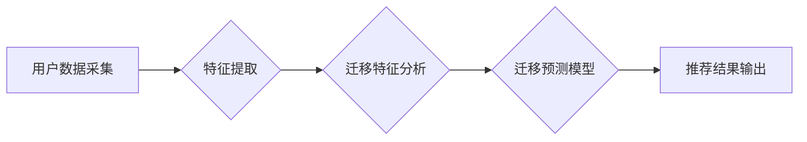

                 

## 电商平台中的用户兴趣迁移模型

> 关键词：用户兴趣迁移，电商平台，推荐系统，机器学习，深度学习，用户行为分析

## 1. 背景介绍

在当今数据爆炸的时代，电商平台面临着激烈的竞争。如何精准地推荐商品，提升用户体验，并最终促进交易转化，是电商平台的核心挑战之一。用户兴趣迁移是指用户在一段时间内，其兴趣爱好发生变化，从原来喜欢的商品类别或品牌转向新的商品类别或品牌。 

传统电商推荐系统往往基于用户的历史购买行为或浏览记录进行推荐，难以捕捉到用户兴趣的动态变化。因此，构建一个能够有效地识别和预测用户兴趣迁移的模型，对于提升电商平台的推荐精准度和用户满意度至关重要。

## 2. 核心概念与联系

用户兴趣迁移模型的核心概念包括：

* **用户兴趣**: 指用户对特定商品或品牌的偏好程度。
* **兴趣迁移**: 指用户兴趣发生变化，从原来喜欢的商品类别或品牌转向新的商品类别或品牌。
* **迁移特征**: 指能够反映用户兴趣迁移的特征，例如浏览历史、购买记录、评论内容、社交行为等。
* **迁移预测**: 指预测用户未来是否会迁移到新的商品类别或品牌。

**用户兴趣迁移模型架构**



## 3. 核心算法原理 & 具体操作步骤

### 3.1  算法原理概述

用户兴趣迁移模型通常基于机器学习或深度学习算法进行构建。常见的算法包括：

* **隐语义模型**: 通过挖掘用户和商品之间的潜在关系，预测用户对商品的兴趣。
* **深度神经网络**: 利用多层神经网络结构，学习更复杂的特征表示，提高迁移预测的准确性。

### 3.2  算法步骤详解

1. **数据采集**: 收集用户行为数据，包括浏览记录、购买记录、评论内容、社交行为等。
2. **特征提取**: 从用户行为数据中提取迁移特征，例如用户最近浏览的商品类别、购买频率、评论主题等。
3. **数据预处理**: 对提取的特征进行清洗、转换和归一化，以提高模型训练的效率和准确性。
4. **模型训练**: 选择合适的机器学习或深度学习算法，并利用预处理后的数据进行模型训练。
5. **模型评估**: 使用测试数据评估模型的性能，例如准确率、召回率、F1-score等。
6. **模型部署**: 将训练好的模型部署到电商平台，用于实时预测用户兴趣迁移。

### 3.3  算法优缺点

**隐语义模型**:

* **优点**: 能够挖掘用户和商品之间的潜在关系，对稀疏数据具有较好的鲁棒性。
* **缺点**: 难以捕捉到用户兴趣的动态变化，对特征工程依赖性较高。

**深度神经网络**:

* **优点**: 可以学习更复杂的特征表示，对用户兴趣迁移的预测精度更高。
* **缺点**: 需要大量的训练数据，训练时间较长，对硬件资源要求较高。

### 3.4  算法应用领域

用户兴趣迁移模型在电商平台的应用场景广泛，例如：

* **个性化推荐**: 根据用户的兴趣迁移趋势，推荐更符合用户当前偏好的商品。
* **新品推荐**: 预测用户对新产品的兴趣，并进行精准推荐。
* **用户画像**: 通过分析用户的兴趣迁移轨迹，构建更精准的用户画像。
* **营销策略**: 根据用户的兴趣迁移趋势，制定更有效的营销策略。

## 4. 数学模型和公式 & 详细讲解 & 举例说明

### 4.1  数学模型构建

用户兴趣迁移模型可以构建为一个二分类问题，即预测用户是否会迁移到新的商品类别或品牌。

假设：

* $u$ 表示用户，$i$ 表示商品，$t$ 表示时间。
* $r_{u,i,t}$ 表示用户 $u$ 在时间 $t$ 对商品 $i$ 的交互行为，例如购买、浏览、点赞等。
* $c_i$ 表示商品 $i$ 所属的类别。

**目标**: 预测用户 $u$ 在时间 $t+1$ 是否会迁移到新的商品类别 $c'$, 即预测 $P(c' | r_{u, \cdot, t}, c_i)$.

### 4.2  公式推导过程

可以使用逻辑回归模型或支持向量机模型来预测用户兴趣迁移。

**逻辑回归模型**:

$$
P(c' | r_{u, \cdot, t}, c_i) = \frac{1}{1 + exp(-(w_0 + w_1 * r_{u, \cdot, t} + w_2 * c_i)))}
$$

其中，$w_0$, $w_1$, $w_2$ 是模型参数，需要通过训练数据进行学习。

### 4.3  案例分析与讲解

假设用户 $u$ 在过去一段时间内主要购买了电子产品，但最近开始浏览和购买一些服装商品。

* $r_{u, \cdot, t}$ 可以表示用户 $u$ 在时间 $t$ 浏览和购买的商品数量和类别。
* $c_i$ 可以表示商品 $i$ 所属的类别，例如电子产品、服装、书籍等。

通过训练逻辑回归模型，我们可以学习到 $w_0$, $w_1$, $w_2$ 的值，并预测用户 $u$ 在未来是否会继续迁移到服装类别。

## 5. 项目实践：代码实例和详细解释说明

### 5.1  开发环境搭建

* Python 3.6+
* TensorFlow 2.0+
* Pandas
* Scikit-learn

### 5.2  源代码详细实现

```python
import tensorflow as tf
from tensorflow.keras.models import Sequential
from tensorflow.keras.layers import Dense, Dropout

# 数据预处理和特征提取
# ...

# 构建模型
model = Sequential()
model.add(Dense(64, activation='relu', input_shape=(input_dim,)))
model.add(Dropout(0.5))
model.add(Dense(32, activation='relu'))
model.add(Dropout(0.5))
model.add(Dense(1, activation='sigmoid'))

# 编译模型
model.compile(optimizer='adam', loss='binary_crossentropy', metrics=['accuracy'])

# 模型训练
model.fit(X_train, y_train, epochs=10, batch_size=32)

# 模型评估
loss, accuracy = model.evaluate(X_test, y_test)
print('Loss:', loss)
print('Accuracy:', accuracy)

# 模型部署
# ...
```

### 5.3  代码解读与分析

* 构建了一个简单的多层感知机模型，用于预测用户兴趣迁移。
* 使用了ReLU激活函数和Dropout正则化技术，提高模型的性能。
* 使用了Adam优化器和二分类交叉熵损失函数，进行模型训练。
* 使用了测试集评估模型的性能，并打印了损失值和准确率。

### 5.4  运行结果展示

* 训练完成后，可以查看模型的损失值和准确率，评估模型的性能。
* 可以使用测试集预测用户兴趣迁移，并进行可视化展示。

## 6. 实际应用场景

### 6.1  电商平台推荐系统

* 根据用户的兴趣迁移趋势，推荐更符合用户当前偏好的商品。
* 预测用户对新产品的兴趣，并进行精准推荐。

### 6.2  用户画像构建

* 通过分析用户的兴趣迁移轨迹，构建更精准的用户画像。

### 6.3  营销策略制定

* 根据用户的兴趣迁移趋势，制定更有效的营销策略。

### 6.4  未来应用展望

* 可以结合其他技术，例如自然语言处理和计算机视觉，构建更智能的兴趣迁移模型。
* 可以将模型部署到移动端，提供更个性化的用户体验。

## 7. 工具和资源推荐

### 7.1  学习资源推荐

* **书籍**:
    * 《推荐系统实践》
    * 《深度学习》
* **在线课程**:
    * Coursera: Machine Learning
    * Udacity: Deep Learning Nanodegree

### 7.2  开发工具推荐

* **Python**: 
* **TensorFlow**: 
* **PyTorch**: 
* **Scikit-learn**: 

### 7.3  相关论文推荐

* **Collaborative Filtering for Implicit Feedback Datasets**
* **Deep Learning for Recommender Systems**

## 8. 总结：未来发展趋势与挑战

### 8.1  研究成果总结

用户兴趣迁移模型在电商平台的应用取得了显著的成果，能够有效提升推荐精准度和用户体验。

### 8.2  未来发展趋势

* **模型复杂度提升**: 探索更复杂的深度学习模型，例如Transformer模型，提高模型的预测精度。
* **多模态融合**: 将文本、图像、视频等多模态数据融合到模型中，构建更全面的用户兴趣画像。
* **个性化推荐**: 基于用户的兴趣迁移轨迹，提供更个性化的商品推荐和服务。

### 8.3  面临的挑战

* **数据稀疏性**: 用户行为数据往往是稀疏的，难以训练有效的模型。
* **冷启动问题**: 新用户和新商品难以进行准确的兴趣迁移预测。
* **隐私保护**: 用户行为数据涉及隐私问题，需要采取有效的保护措施。

### 8.4  研究展望

未来，用户兴趣迁移模型的研究将更加注重模型的鲁棒性、泛化能力和隐私保护。


## 9. 附录：常见问题与解答

* **Q1**: 如何处理用户行为数据中的缺失值？
* **A1**: 可以使用均值填充、中位数填充或其他缺失值处理方法。
* **Q2**: 如何评估用户兴趣迁移模型的性能？
* **A2**: 可以使用准确率、召回率、F1-score等指标进行评估。
* **Q3**: 如何应对冷启动问题？
* **A3**: 可以利用用户的相似用户或商品进行迁移预测。

作者：禅与计算机程序设计艺术 / Zen and the Art of Computer Programming 


<end_of_turn>

