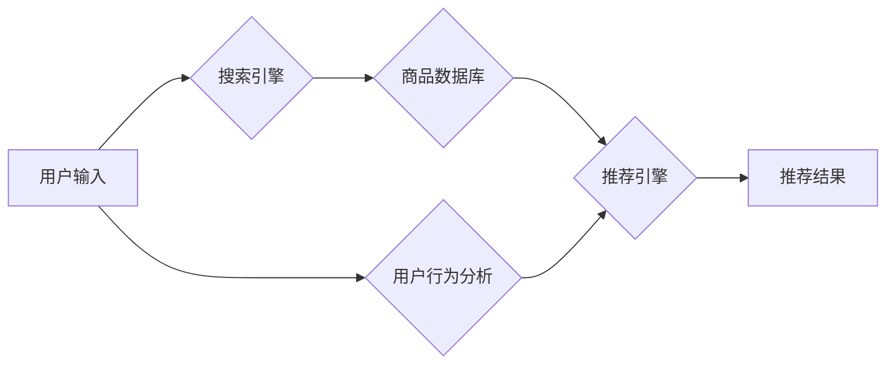

                 

## 电商平台搜索推荐系统的AI 大模型应用：提高系统性能、效率、准确率与实时性

> 关键词：电商平台、搜索推荐系统、AI 大模型、性能优化、效率提升、准确率提高、实时性

> 摘要：随着电商平台的蓬勃发展，搜索推荐系统作为用户获取商品信息和进行购买决策的关键环节，其性能、效率、准确率和实时性都面临着严峻挑战。本文将深入探讨AI大模型在电商平台搜索推荐系统中的应用，分析其核心概念、算法原理、数学模型、代码实现以及实际应用场景，并展望未来发展趋势和挑战。

## 1. 背景介绍

电商平台的快速发展催生了对搜索推荐系统的巨大需求。用户在海量商品中寻找所需产品，需要高效、精准的搜索和推荐服务。传统的搜索推荐系统主要依赖于规则引擎和基于特征的机器学习算法，但随着数据量的激增和用户行为的复杂化，这些方法逐渐难以满足用户的需求。

AI大模型的出现为电商平台搜索推荐系统带来了新的机遇。其强大的学习能力和泛化能力能够从海量数据中挖掘更深层次的模式和关系，从而提供更精准、个性化的搜索和推荐服务。

## 2. 核心概念与联系

**2.1 核心概念**

* **AI大模型:** 指规模庞大、训练数据海量的人工智能模型，能够学习复杂的数据模式和关系，并进行泛化学习。
* **电商平台搜索推荐系统:** 指用于帮助用户在电商平台上搜索和发现商品的系统，其核心功能包括：
    * **搜索:** 根据用户输入的关键词，从商品数据库中检索出相关商品。
    * **推荐:** 根据用户的历史行为、偏好和上下文信息，推荐用户可能感兴趣的商品。
* **自然语言处理 (NLP):** 用于处理和理解人类语言的计算机科学领域，在搜索推荐系统中用于理解用户搜索意图和生成推荐描述。
* **深度学习 (DL):** 一种机器学习方法，利用多层神经网络模拟人类大脑的学习过程，能够学习复杂的数据模式。

**2.2 架构图**



**2.3 联系**

AI大模型可以应用于电商平台搜索推荐系统的各个环节，例如：

* **搜索引擎:** 使用NLP技术和深度学习模型，理解用户搜索意图，提高搜索结果的准确率和相关性。
* **推荐引擎:** 使用深度学习模型，分析用户历史行为、偏好和上下文信息，推荐更精准、个性化的商品。
* **商品数据库:** 使用AI大模型进行商品分类、标签化和描述生成，提高商品信息的质量和可搜索性。

## 3. 核心算法原理 & 具体操作步骤

**3.1 算法原理概述**

电商平台搜索推荐系统中常用的AI大模型算法包括：

* **Transformer:**  一种基于注意力机制的深度学习模型，能够捕捉文本序列中的长距离依赖关系，在搜索和推荐任务中表现出色。
* **BERT:**  一种预训练语言模型，能够理解上下文信息，提高搜索结果的准确率和相关性。
* **Recurrent Neural Networks (RNN):**  一种能够处理序列数据的深度学习模型，常用于用户行为分析和推荐系统。

**3.2 算法步骤详解**

以Transformer模型为例，其训练步骤如下：

1. **数据预处理:** 将用户搜索词、商品描述等文本数据进行清洗、分词、词向量化等预处理操作。
2. **模型训练:** 使用预训练的Transformer模型，在海量数据上进行微调，学习用户搜索意图和商品特征之间的关系。
3. **模型评估:** 使用测试数据评估模型的性能，例如准确率、召回率、F1-score等指标。
4. **模型部署:** 将训练好的模型部署到生产环境中，用于实时搜索和推荐。

**3.3 算法优缺点**

* **优点:** 能够学习复杂的数据模式，提高搜索和推荐的准确率和个性化程度。
* **缺点:** 训练成本高，需要海量数据和强大的计算资源。

**3.4 算法应用领域**

* **电商平台搜索:** 提高搜索结果的准确率和相关性，帮助用户快速找到所需商品。
* **商品推荐:** 根据用户的历史行为和偏好，推荐用户可能感兴趣的商品。
* **个性化营销:** 根据用户的兴趣和需求，提供个性化的商品推荐和促销信息。

## 4. 数学模型和公式 & 详细讲解 & 举例说明

**4.1 数学模型构建**

Transformer模型的核心是注意力机制，其数学模型可以表示为：

$$
Attention(Q, K, V) = softmax(\frac{QK^T}{\sqrt{d_k}})V
$$

其中：

* $Q$：查询矩阵
* $K$：键矩阵
* $V$：值矩阵
* $d_k$：键向量的维度
* $softmax$：softmax函数

**4.2 公式推导过程**

注意力机制的目的是计算查询向量与键向量的相关性，并根据相关性对值向量进行加权求和。

* 首先，计算查询向量与每个键向量的点积，即 $QK^T$。
* 然后，对点积结果进行归一化，使用softmax函数将点积值转换为概率分布。
* 最后，将概率分布与值向量相乘，得到加权求和的结果。

**4.3 案例分析与讲解**

假设我们有一个句子 "The cat sat on the mat"，我们想计算 "cat" 这个词与整个句子的相关性。

* 可以将每个词作为查询向量和键向量。
* 计算 "cat" 与每个词的点积，得到一个概率分布。
* 根据概率分布，对每个词的值向量进行加权求和，得到 "cat" 与整个句子的相关性表示。

## 5. 项目实践：代码实例和详细解释说明

**5.1 开发环境搭建**

* Python 3.7+
* TensorFlow/PyTorch
* CUDA/cuDNN

**5.2 源代码详细实现**

```python
import tensorflow as tf

# 定义Transformer模型
class Transformer(tf.keras.Model):
    def __init__(self, vocab_size, embedding_dim, num_heads, num_layers):
        super(Transformer, self).__init__()
        self.embedding = tf.keras.layers.Embedding(vocab_size, embedding_dim)
        self.transformer_layers = tf.keras.layers.StackedRNNCells([tf.keras.layers.MultiHeadAttention(num_heads=num_heads, key_dim=embedding_dim) for _ in range(num_layers)])

    def call(self, inputs):
        embeddings = self.embedding(inputs)
        outputs = self.transformer_layers(embeddings)
        return outputs

# 实例化模型
model = Transformer(vocab_size=10000, embedding_dim=128, num_heads=8, num_layers=6)

# 训练模型
model.compile(optimizer='adam', loss='mse')
model.fit(x_train, y_train, epochs=10)
```

**5.3 代码解读与分析**

* 代码定义了一个Transformer模型，包含嵌入层、多头注意力层和堆叠的RNN层。
* 嵌入层将词向量化，多头注意力层捕捉文本序列中的长距离依赖关系，RNN层处理序列数据。
* 模型使用Adam优化器和均方误差损失函数进行训练。

**5.4 运行结果展示**

训练完成后，可以使用测试数据评估模型的性能，例如准确率、召回率、F1-score等指标。

## 6. 实际应用场景

**6.1 搜索推荐系统**

* **商品搜索:** 根据用户输入的关键词，推荐相关商品。
* **个性化推荐:** 根据用户的历史行为和偏好，推荐个性化的商品。
* **跨境电商:** 跨语言搜索和推荐，帮助用户找到海外商品。

**6.2 其他应用场景**

* **内容推荐:** 推荐新闻、视频、文章等内容。
* **广告推荐:** 根据用户的兴趣和需求，推荐精准的广告。
* **客服机器人:** 使用AI大模型构建客服机器人，提供智能化的客户服务。

**6.3 未来应用展望**

* **多模态搜索推荐:** 将文本、图像、视频等多种模态信息融合，提供更丰富的搜索和推荐体验。
* **实时个性化推荐:** 基于用户的实时行为和上下文信息，提供更精准、个性化的推荐服务。
* **可解释性AI:** 提高AI模型的透明度和可解释性，帮助用户理解推荐结果背后的逻辑。

## 7. 工具和资源推荐

**7.1 学习资源推荐**

* **书籍:**
    * 深度学习
    * 自然语言处理
* **在线课程:**
    * Coursera
    * edX
    * fast.ai

**7.2 开发工具推荐**

* **TensorFlow:** 开源深度学习框架
* **PyTorch:** 开源深度学习框架
* **HuggingFace:** 提供预训练模型和工具

**7.3 相关论文推荐**

* Attention Is All You Need
* BERT: Pre-training of Deep Bidirectional Transformers for Language Understanding

## 8. 总结：未来发展趋势与挑战

**8.1 研究成果总结**

AI大模型在电商平台搜索推荐系统中的应用取得了显著成果，提高了搜索结果的准确率、推荐的个性化程度和用户体验。

**8.2 未来发展趋势**

* 多模态搜索推荐
* 实时个性化推荐
* 可解释性AI

**8.3 面临的挑战**

* 训练成本高
* 数据隐私和安全
* 模型可解释性

**8.4 研究展望**

未来研究将重点关注降低训练成本、提高模型可解释性和安全性，以及探索新的应用场景。

## 9. 附录：常见问题与解答

* **Q: AI大模型的训练需要多少数据？**

* **A:** 训练AI大模型需要海量数据，通常需要百万甚至数十亿条数据。

* **Q: AI大模型的训练成本很高吗？**

* **A:** 训练AI大模型的成本较高，需要强大的计算资源和专业人才。

* **Q: 如何保证AI大模型的安全性？**

* **A:** 需要采取措施防止模型被恶意攻击，保护用户数据隐私。


作者：禅与计算机程序设计艺术 / Zen and the Art of Computer Programming 
<end_of_turn>

