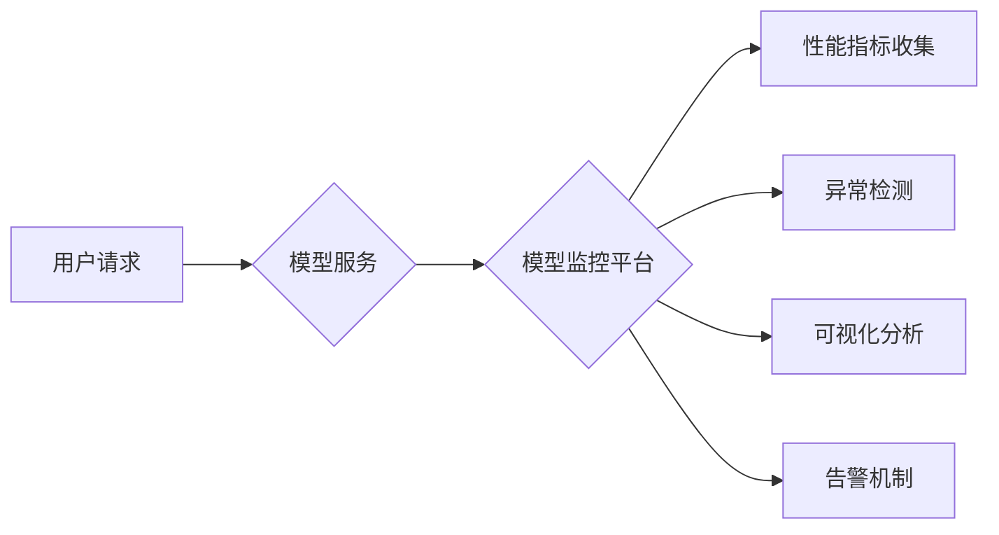

                 

## 电商搜索推荐场景下的AI大模型模型部署监控平台功能优化

> 关键词：AI大模型、模型部署、监控平台、电商搜索推荐、性能指标、异常检测、可视化分析

## 1. 背景介绍

随着人工智能技术的飞速发展，大模型在电商搜索推荐领域展现出巨大的潜力。大模型能够学习海量数据，精准理解用户需求，提供个性化推荐，从而提升用户体验和商业转化率。然而，大模型的部署和运行也面临着诸多挑战，例如模型性能波动、资源消耗过高、数据漂移等问题。因此，构建一个高效、可靠的模型部署监控平台至关重要，能够实时监测模型性能，及时发现异常，并提供可视化分析和告警机制，保障大模型的稳定运行和持续优化。

## 2. 核心概念与联系

### 2.1  AI大模型

AI大模型是指在海量数据上训练，拥有庞大参数规模的深度学习模型。其强大的学习能力和泛化能力使其能够应用于各种复杂的任务，例如自然语言处理、图像识别、语音合成等。在电商搜索推荐场景下，大模型可以学习用户行为、商品特征、搜索意图等信息，构建精准的推荐模型，提升推荐效果。

### 2.2  模型部署

模型部署是指将训练好的AI模型部署到实际应用环境中，使其能够接受用户请求并提供服务。在电商搜索推荐场景下，模型部署通常涉及以下步骤：

* 模型打包：将训练好的模型转换为可部署的格式，例如ONNX、TensorRT等。
* 部署环境搭建：搭建模型运行所需的硬件和软件环境，例如服务器、GPU、框架等。
* 模型服务化：将模型封装成可供调用服务的接口，例如RESTful API、gRPC等。

### 2.3  模型监控平台

模型监控平台是一个用于实时监测和分析模型性能的系统。其主要功能包括：

* **性能指标监控:** 收集和展示模型的各种性能指标，例如准确率、召回率、AUC等。
* **异常检测:** 利用机器学习算法检测模型性能异常，并及时发出告警。
* **可视化分析:** 提供直观的图表和数据可视化工具，帮助用户分析模型性能趋势和问题根源。
* **告警机制:** 设置模型性能阈值，当模型性能指标超过阈值时，自动触发告警通知。

### 2.4  架构图



## 3. 核心算法原理 & 具体操作步骤

### 3.1  算法原理概述

模型监控平台的核心算法主要包括：

* **性能指标计算:** 利用统计学方法计算模型的各种性能指标，例如准确率、召回率、F1-score等。
* **异常检测:** 利用机器学习算法，例如自编码器、异常值检测器等，检测模型性能异常。
* **数据漂移检测:** 利用统计学方法或机器学习算法，检测模型输入数据分布的变化，判断是否存在数据漂移问题。

### 3.2  算法步骤详解

#### 3.2.1  性能指标计算

1. 收集模型预测结果和真实标签数据。
2. 计算模型的各种性能指标，例如准确率、召回率、F1-score等。
3. 将性能指标存储到数据库中，以便进行后续分析和监控。

#### 3.2.2  异常检测

1. 将模型性能指标数据作为输入，训练异常检测模型。
2. 利用训练好的异常检测模型，对实时采集的模型性能指标数据进行预测。
3. 当模型预测结果超过预设阈值时，判断模型性能异常，并触发告警机制。

#### 3.2.3  数据漂移检测

1. 将模型训练时使用的历史数据和实时采集的数据进行比较。
2. 利用统计学方法或机器学习算法，计算数据分布的变化程度。
3. 当数据分布变化超过预设阈值时，判断存在数据漂移问题，并采取相应的措施，例如重新训练模型或更新模型参数。

### 3.3  算法优缺点

#### 3.3.1  性能指标计算

* **优点:** 计算方法简单，易于实现。
* **缺点:** 仅能反映模型在特定指标上的表现，无法全面评估模型性能。

#### 3.3.2  异常检测

* **优点:** 可以及时发现模型性能异常，并采取措施进行修复。
* **缺点:** 需要训练专门的异常检测模型，且模型的性能也需要不断评估和优化。

#### 3.3.3  数据漂移检测

* **优点:** 可以及时发现数据分布变化，避免模型性能下降。
* **缺点:** 需要收集和分析大量历史数据，且数据漂移检测算法的性能也需要不断改进。

### 3.4  算法应用领域

* **电商搜索推荐:** 监控推荐模型的性能，及时发现异常，保障推荐效果。
* **金融风险控制:** 监控欺诈检测模型的性能，及时发现异常交易，降低风险。
* **医疗诊断:** 监控疾病诊断模型的性能，及时发现误诊情况，提高诊断准确率。

## 4. 数学模型和公式 & 详细讲解 & 举例说明

### 4.1  数学模型构建

在模型监控平台中，常用的数学模型包括：

* **线性回归模型:** 用于预测模型性能指标，例如准确率、召回率等。
* **支持向量机 (SVM):** 用于分类模型性能异常，例如正常运行、性能下降、模型崩溃等。
* **自编码器:** 用于数据漂移检测，通过重建输入数据来判断数据分布的变化。

### 4.2  公式推导过程

#### 4.2.1  线性回归模型

线性回归模型的目标是找到一条直线，使得模型预测值与真实值之间的误差最小。其数学公式如下：

$$
y = mx + c
$$

其中：

* $y$ 是模型预测值
* $x$ 是模型输入特征
* $m$ 是模型斜率
* $c$ 是模型截距

#### 4.2.2  支持向量机 (SVM)

SVM的目标是找到一个超平面，将不同类别的样本分开，并最大化分类间隔。其数学公式较为复杂，涉及到拉格朗日乘子法等优化算法。

#### 4.2.3  自编码器

自编码器是一种无监督学习模型，其结构包括编码器和解码器。编码器将输入数据压缩成低维表示，解码器将低维表示恢复成原始数据。数据漂移检测利用自编码器的重建误差来判断数据分布的变化。

### 4.3  案例分析与讲解

#### 4.3.1  电商搜索推荐场景

假设电商平台有一个基于大模型的商品推荐系统。通过模型监控平台，可以实时监测推荐系统的准确率、召回率等指标。如果发现这些指标出现异常波动，则可能是模型性能下降或数据漂移导致的。平台可以根据异常情况，自动触发告警，并提供相应的解决方案，例如重新训练模型或更新模型参数。

#### 4.3.2  金融风险控制场景

金融机构可以使用模型监控平台监控欺诈检测模型的性能。如果发现欺诈检测模型的准确率下降，则可能是攻击者利用新的欺诈手段，需要及时更新模型参数或训练新的模型。

## 5. 项目实践：代码实例和详细解释说明

### 5.1  开发环境搭建

* 操作系统: Ubuntu 20.04
* 编程语言: Python 3.8
* 框架: Flask
* 数据库: MySQL
* 监控工具: Prometheus, Grafana

### 5.2  源代码详细实现

```python
from flask import Flask, request, jsonify
from sklearn.linear_model import LinearRegression

app = Flask(__name__)

# 加载模型
model = LinearRegression()

# 模型训练数据
X_train = [[1], [2], [3], [4], [5]]
y_train = [2, 4, 6, 8, 10]
model.fit(X_train, y_train)

@app.route('/predict', methods=['POST'])
def predict():
    data = request.get_json()
    input_feature = data['feature']
    prediction = model.predict([[input_feature]])
    return jsonify({'prediction': prediction[0]})

if __name__ == '__main__':
    app.run(debug=True)
```

### 5.3  代码解读与分析

* 该代码示例是一个简单的模型部署服务，使用Flask框架构建。
* 模型训练数据和模型加载代码已注释，实际部署中需要根据实际情况进行修改。
* `/predict`接口用于接收用户请求，并返回模型预测结果。

### 5.4  运行结果展示

运行该代码后，可以访问`http://localhost:5000/predict`接口，并发送JSON格式的请求数据，例如：

```json
{
  "feature": 6
}
```

服务器将返回模型预测结果，例如：

```json
{
  "prediction": 12.0
}
```

## 6. 实际应用场景

### 6.1  电商搜索推荐场景

在电商平台，模型监控平台可以用于监控商品推荐模型的性能，例如准确率、召回率、点击率等。通过实时监测这些指标，可以及时发现模型性能下降或数据漂移问题，并采取相应的措施进行修复。

### 6.2  金融风险控制场景

在金融领域，模型监控平台可以用于监控欺诈检测模型的性能，例如准确率、召回率、F1-score等。通过实时监测这些指标，可以及时发现欺诈行为，并采取相应的措施进行防范。

### 6.3  医疗诊断场景

在医疗领域，模型监控平台可以用于监控疾病诊断模型的性能，例如准确率、召回率、AUC等。通过实时监测这些指标，可以及时发现误诊情况，并采取相应的措施进行改进。

### 6.4  未来应用展望

随着人工智能技术的不断发展，模型监控平台将在更多领域得到应用，例如自动驾驶、智能客服、智能制造等。未来，模型监控平台将更加智能化、自动化，能够自动识别模型性能异常，并提供更精准的解决方案。

## 7. 工具和资源推荐

### 7.1  学习资源推荐

* **书籍:**
    * 《Deep Learning》 by Ian Goodfellow, Yoshua Bengio, and Aaron Courville
    * 《Hands-On Machine Learning with Scikit-Learn, Keras & TensorFlow》 by Aurélien Géron
* **在线课程:**
    * Coursera: Machine Learning by Andrew Ng
    * Udacity: Deep Learning Nanodegree

### 7.2  开发工具推荐

* **框架:**
    * TensorFlow
    * PyTorch
    * Keras
* **监控工具:**
    * Prometheus
    * Grafana
    * ELK Stack

### 7.3  相关论文推荐

* **论文:**
    * "Monitoring and Debugging Deep Learning Models" by  A. Krizhevsky, I. Sutskever, and G. E. Hinton
    * "Towards Robustness Against Adversarial Examples" by  I. Goodfellow, J. Shlens, and C. Szegedy

## 8. 总结：未来发展趋势与挑战

### 8.1  研究成果总结

模型监控平台在电商搜索推荐场景下发挥着越来越重要的作用，能够有效保障大模型的稳定运行和持续优化。

### 8.2  未来发展趋势

* **模型自诊断:** 模型能够自动识别自身性能异常，并提供诊断建议。
* **自动化修复:** 模型能够自动修复自身性能问题，无需人工干预。
* **多模态数据融合:** 模型能够融合文本、图像、音频等多模态数据，提供更全面的监控和分析。

### 8.3  面临的挑战

* **模型复杂度:** 大模型的复杂性使得模型监控更加困难。
* **数据漂移:** 数据分布变化会导致模型性能下降，需要不断更新模型参数。
* **可解释性:** 模型的决策过程难以解释，需要提高模型的可解释性。

### 8.4  研究展望

未来，模型监控平台将朝着更加智能化、自动化、可解释化的方向发展，为大模型的应用提供更可靠的保障。

## 9. 附录：常见问题与解答

### 9.1  问题: 如何选择合适的模型监控指标？

**解答:** 选择合适的模型监控指标需要根据实际应用场景和模型类型进行选择。例如，在电商搜索推荐场景下，常用的指标包括准确率、召回率、点击率等。

### 9.2  问题: 如何应对数据漂移问题？

**解答:** 数据漂移问题可以通过以下方法进行应对：

* **定期重新训练模型:** 使用最新的数据重新训练模型，更新模型参数。
* **使用在线学习算法:** 使用在线学习算法，不断更新模型参数，适应数据分布的变化。
* **数据预处理:** 对数据进行预处理，例如特征工程、数据清洗等，减少数据漂移的影响。


作者：禅与计算机程序设计艺术 / Zen and the Art of Computer Programming 
<end_of_turn>

