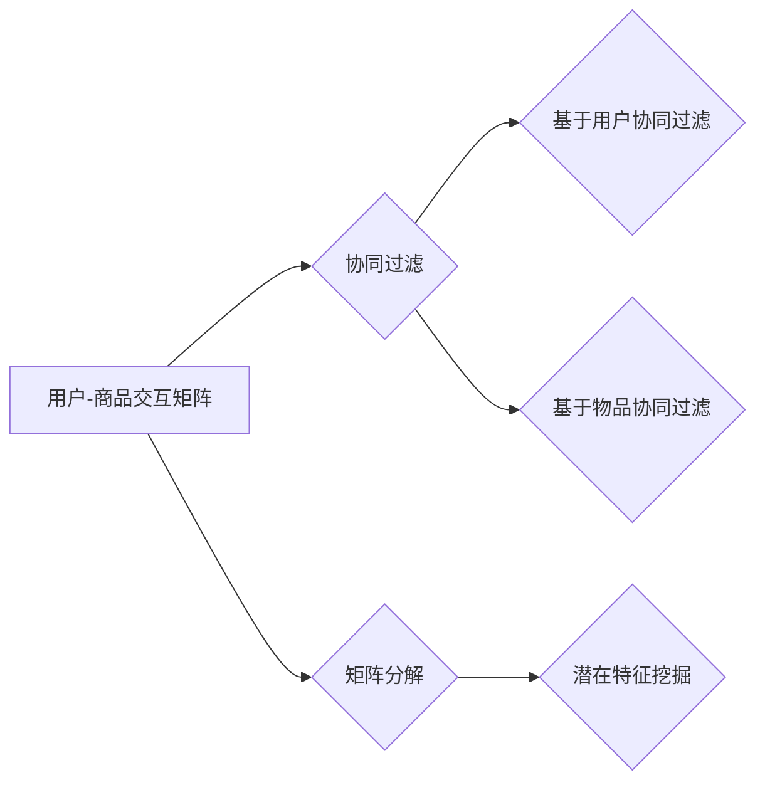

                 

## 电商搜索的稀疏数据挖掘技术

> 关键词：电商搜索、稀疏数据、协同过滤、矩阵分解、推荐系统、数据挖掘、机器学习

## 1. 背景介绍

在当今数据爆炸的时代，电商平台积累了海量用户行为数据，其中用户搜索行为数据尤为重要。这些数据蕴含着用户需求、商品偏好等宝贵信息，是构建高效精准的电商搜索系统的关键。然而，电商搜索数据往往呈现出高度稀疏的特点：

* **用户行为多样性:** 用户搜索词语丰富多样，每个用户搜索的商品数量有限，导致用户-商品交互矩阵极度稀疏。
* **商品种类繁多:** 电商平台商品种类繁多，每个商品被搜索的次数也相对较少，导致商品-搜索词语交互矩阵也呈现稀疏性。

传统的基于稠密数据的机器学习算法难以有效处理稀疏数据，因此，针对电商搜索的稀疏数据挖掘技术成为研究热点。

## 2. 核心概念与联系

稀疏数据挖掘的核心在于从稀疏的数据中挖掘出隐藏的模式和规律。在电商搜索领域，主要涉及以下核心概念：

* **用户-商品交互矩阵:**  将用户和商品作为行和列，用户对商品的交互行为（如点击、购买）作为矩阵元素，形成一个稀疏矩阵。
* **协同过滤:**  根据用户的历史行为，预测用户对未交互商品的兴趣。协同过滤算法可以分为基于用户的协同过滤和基于物品的协同过滤。
* **矩阵分解:** 将稀疏的用户-商品交互矩阵分解成多个低维矩阵，从而挖掘用户和商品的潜在特征。

**核心概念架构流程图:**



## 3. 核心算法原理 & 具体操作步骤

### 3.1  算法原理概述

协同过滤和矩阵分解是处理稀疏数据挖掘的核心算法。

* **协同过滤:**  基于用户的相似性或商品的相似性，预测用户对商品的兴趣。
* **矩阵分解:** 将稀疏的用户-商品交互矩阵分解成多个低维矩阵，从而挖掘用户和商品的潜在特征。

### 3.2  算法步骤详解

**协同过滤算法步骤:**

1. **构建用户-商品交互矩阵:** 将用户和商品作为行和列，用户对商品的交互行为作为矩阵元素。
2. **计算用户相似度或商品相似度:** 使用余弦相似度、皮尔逊相关系数等方法计算用户之间的相似度或商品之间的相似度。
3. **预测用户对商品的兴趣:**  根据用户的相似用户或商品的相似商品，预测用户对目标商品的兴趣。

**矩阵分解算法步骤:**

1. **初始化用户和商品特征矩阵:** 将用户和商品特征矩阵随机初始化。
2. **计算预测值:**  根据用户和商品特征矩阵，计算用户对商品的预测评分。
3. **更新用户和商品特征矩阵:** 使用梯度下降等优化算法，更新用户和商品特征矩阵，使得预测值与实际评分之间的误差最小化。
4. **重复步骤2和3:**  重复上述步骤，直到误差达到预设阈值。

### 3.3  算法优缺点

**协同过滤算法:**

* **优点:**  能够挖掘用户和商品之间的隐性关系，推荐效果较好。
* **缺点:**  数据稀疏性问题严重，冷启动问题难以解决。

**矩阵分解算法:**

* **优点:**  能够有效处理数据稀疏性问题，冷启动问题相对较好。
* **缺点:**  需要大量的计算资源，参数设置较为复杂。

### 3.4  算法应用领域

协同过滤和矩阵分解算法广泛应用于电商搜索、推荐系统、电影评分等领域。

## 4. 数学模型和公式 & 详细讲解 & 举例说明

### 4.1  数学模型构建

**协同过滤模型:**

假设用户集合为U，商品集合为I，用户-商品交互矩阵为R，其中R(u,i)表示用户u对商品i的评分。协同过滤模型的目标是预测用户u对商品i的评分R(u,i)。

**矩阵分解模型:**

将用户-商品交互矩阵R分解成两个低维矩阵：用户特征矩阵P和商品特征矩阵Q。

$$R \approx P Q^T$$

其中，P(u,k)表示用户u的第k个特征值，Q(i,k)表示商品i的第k个特征值。

### 4.2  公式推导过程

**协同过滤模型的评分预测公式:**

$$ \hat{R}(u,i) = \sum_{k=1}^{K} P(u,k) Q(i,k) $$

其中，K为特征维度。

**矩阵分解模型的损失函数:**

$$ L(P,Q) = \frac{1}{2} \sum_{u \in U, i \in I} (R(u,i) - \hat{R}(u,i))^2 $$

### 4.3  案例分析与讲解

**案例:** 假设有一个用户-商品交互矩阵，其中用户集合为{u1, u2, u3}, 商品集合为{i1, i2, i3}, 矩阵元素表示用户对商品的评分。

**协同过滤模型:**

根据用户的评分历史，计算用户之间的相似度，例如u1和u2的相似度较高，则可以预测u1对u2未交互的商品i3的评分。

**矩阵分解模型:**

将用户-商品交互矩阵分解成用户特征矩阵和商品特征矩阵，例如用户u1的特征向量为[0.5, 0.8, 0.2], 商品i3的特征向量为[0.3, 0.1, 0.9], 则可以预测u1对i3的评分为0.5*0.3 + 0.8*0.1 + 0.2*0.9 = 0.4.

## 5. 项目实践：代码实例和详细解释说明

### 5.1  开发环境搭建

* Python 3.x
* Scikit-learn
* Pandas
* NumPy

### 5.2  源代码详细实现

```python
import pandas as pd
from sklearn.metrics.pairwise import cosine_similarity

# 加载用户-商品交互数据
data = pd.read_csv('user_item_interactions.csv')

# 构建用户-商品交互矩阵
user_item_matrix = data.pivot_table(index='user_id', columns='item_id', values='rating')

# 计算用户相似度
user_similarity = cosine_similarity(user_item_matrix)

# 预测用户对商品的兴趣
def predict_user_interest(user_id, item_id):
    # 获取用户相似用户
    similar_users = user_similarity[user_id].argsort()[:-10:-1]
    # 计算预测评分
    predicted_rating = 0
    for similar_user in similar_users:
        if user_item_matrix.loc[similar_user, item_id] is not None:
            predicted_rating += user_item_matrix.loc[similar_user, item_id]
    return predicted_rating / len(similar_users)

# 预测用户1对商品3的兴趣
predicted_rating = predict_user_interest(1, 3)
print(f'用户1对商品3的预测评分: {predicted_rating}')
```

### 5.3  代码解读与分析

* 代码首先加载用户-商品交互数据，构建用户-商品交互矩阵。
* 然后使用余弦相似度计算用户之间的相似度。
* 最后，定义一个函数`predict_user_interest`来预测用户对商品的兴趣，该函数根据用户的相似用户，计算预测评分。

### 5.4  运行结果展示

运行代码后，可以得到用户1对商品3的预测评分。

## 6. 实际应用场景

### 6.1  电商搜索推荐

电商平台可以利用稀疏数据挖掘技术，根据用户的搜索历史和浏览记录，推荐用户可能感兴趣的商品。

### 6.2  个性化商品展示

电商平台可以根据用户的兴趣偏好，个性化展示商品，提高用户体验。

### 6.3  商品分类与聚类

电商平台可以利用稀疏数据挖掘技术，对商品进行分类和聚类，方便用户查找和浏览商品。

### 6.4  未来应用展望

随着数据量的不断增长和算法的不断发展，稀疏数据挖掘技术在电商搜索领域将有更广泛的应用，例如：

* **更精准的推荐:** 利用更先进的协同过滤和矩阵分解算法，实现更精准的商品推荐。
* **更个性化的搜索:**  根据用户的搜索习惯和偏好，提供更个性化的搜索结果。
* **更智能的商品分类:** 利用深度学习等算法，实现更智能的商品分类和聚类。

## 7. 工具和资源推荐

### 7.1  学习资源推荐

* **书籍:**
    * 《推荐系统》
    * 《数据挖掘：概念与技术》
* **在线课程:**
    * Coursera: Machine Learning
    * edX: Data Science

### 7.2  开发工具推荐

* **Python:**  数据分析和机器学习的常用语言。
* **Scikit-learn:**  机器学习库，提供各种协同过滤和矩阵分解算法。
* **Spark:**  大数据处理框架，可以处理海量稀疏数据。

### 7.3  相关论文推荐

* **Matrix Factorization Techniques for Recommender Systems**
* **Collaborative Filtering: A User-Based Approach**

## 8. 总结：未来发展趋势与挑战

### 8.1  研究成果总结

稀疏数据挖掘技术在电商搜索领域取得了显著成果，例如协同过滤和矩阵分解算法能够有效处理稀疏数据，提高推荐效果。

### 8.2  未来发展趋势

* **深度学习:**  利用深度学习算法，挖掘更深层次的用户和商品特征，提高推荐精准度。
* **联邦学习:**  在保护用户隐私的前提下，利用联邦学习技术，协同训练推荐模型。
* **多模态数据融合:**  融合文本、图像、视频等多模态数据，构建更全面的用户画像，提高推荐效果。

### 8.3  面临的挑战

* **数据稀疏性:**  电商平台数据仍然存在高度稀疏性，如何有效处理稀疏数据仍然是挑战。
* **冷启动问题:**  对于新用户和新商品，如何快速获取其特征信息，解决冷启动问题也是挑战。
* **用户隐私保护:**  如何保护用户隐私，同时实现精准推荐，也是需要解决的挑战。

### 8.4  研究展望

未来，稀疏数据挖掘技术将继续发展，为电商搜索提供更精准、更个性化的服务。


## 9. 附录：常见问题与解答

**Q1: 协同过滤和矩阵分解算法有什么区别？**

**A1:** 协同过滤算法直接基于用户的历史行为，预测用户对商品的兴趣，而矩阵分解算法将用户-商品交互矩阵分解成多个低维矩阵，挖掘用户和商品的潜在特征，从而预测用户对商品的兴趣。

**Q2: 如何解决协同过滤算法的冷启动问题？**

**A2:**  可以利用用户画像、商品属性等信息，为新用户和新商品进行初始化，或者使用基于内容的推荐算法，结合协同过滤算法，缓解冷启动问题。


作者：禅与计算机程序设计艺术 / Zen and the Art of Computer Programming 
<end_of_turn>

