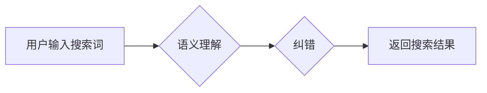

                 

## 电商搜索的语义理解与纠错：AI大模型的新突破

> 关键词：电商搜索、语义理解、纠错、AI大模型、自然语言处理、BERT、Transformer

## 1. 背景介绍

电商搜索是电商平台的核心功能之一，用户通过搜索引擎查找所需商品。传统的电商搜索主要依赖于关键词匹配，当用户输入的查询词与商品标题或描述中存在关键词匹配时，系统会返回相关商品。然而，随着用户搜索行为的复杂化，单纯依靠关键词匹配已难以满足用户需求。用户搜索词往往包含多种含义，语义表达模糊，甚至存在拼写错误等问题。这导致搜索结果不精准，用户体验下降，最终影响电商平台的转化率和用户粘性。

为了解决这些问题，近年来，基于AI大模型的语义理解与纠错技术在电商搜索领域得到了广泛应用。AI大模型，例如BERT和Transformer，能够学习语言的深层语义关系，理解用户搜索词的真实意图，并对搜索词进行纠正，从而提高搜索结果的准确性和相关性。

## 2. 核心概念与联系

### 2.1 语义理解

语义理解是指机器理解文本的深层含义，包括词义、句义和篇章意义。在电商搜索领域，语义理解主要用于理解用户搜索词的真实意图，例如用户搜索“苹果手机”，是想查找苹果品牌的手机，还是想查找水果“苹果”的商品。

### 2.2 纠错

纠错是指识别和修正文本中的错误，例如拼写错误、语法错误等。在电商搜索领域，纠错可以帮助系统理解用户真实意图，提高搜索结果的准确性。

### 2.3 AI大模型

AI大模型是指拥有大量参数的深度学习模型，能够学习复杂的语言模式和语义关系。BERT和Transformer是目前最流行的AI大模型之一，它们在自然语言处理任务中取得了显著的成果。

**Mermaid 流程图**



## 3. 核心算法原理 & 具体操作步骤

### 3.1 算法原理概述

基于AI大模型的语义理解与纠错算法主要基于Transformer模型，它能够捕捉文本中的长距离依赖关系，并学习复杂的语义表示。

具体来说，算法流程如下：

1. **词嵌入:** 将用户输入的搜索词转换为向量表示，每个词对应一个向量。
2. **语义编码:** 使用Transformer模型对搜索词的向量表示进行编码，学习每个词在句子中的语义关系。
3. **意图识别:** 根据编码后的语义表示，识别用户搜索的真实意图。
4. **纠错:** 使用纠错模型对搜索词进行修正，例如识别拼写错误、语法错误等。
5. **结果返回:** 返回纠正后的搜索词，并根据用户意图返回相关商品。

### 3.2 算法步骤详解

1. **词嵌入:** 

   - 使用预训练的词嵌入模型，例如Word2Vec或GloVe，将每个词转换为向量表示。
   - 也可以使用Transformer模型的词嵌入层，学习更丰富的词语语义信息。

2. **语义编码:**

   - 将词嵌入后的向量输入Transformer模型，例如BERT或RoBERTa。
   - Transformer模型通过多头注意力机制和前馈神经网络，学习每个词在句子中的语义关系。
   - 输出每个词的上下文语义表示。

3. **意图识别:**

   - 使用分类模型，例如支持向量机或深度神经网络，对编码后的语义表示进行分类。
   - 训练数据包含用户搜索词和对应的真实意图标签。
   - 模型输出用户搜索的意图概率分布。

4. **纠错:**

   - 使用纠错模型，例如基于字符的RNN或Transformer模型，对搜索词进行纠正。
   - 训练数据包含错误的搜索词和对应的正确词语。
   - 模型输出纠正后的搜索词概率分布。

5. **结果返回:**

   - 根据用户意图和纠正后的搜索词，从商品数据库中检索相关商品。
   - 返回排序后的搜索结果。

### 3.3 算法优缺点

**优点:**

- 能够理解用户搜索词的深层语义，提高搜索结果的准确性。
- 能够识别和纠正搜索词中的错误，提升用户体验。
- 能够学习用户搜索行为的模式，提供个性化搜索结果。

**缺点:**

- 需要大量的训练数据，训练成本较高。
- 模型参数量大，部署成本较高。
- 对硬件资源要求较高。

### 3.4 算法应用领域

- 电商搜索
- 问答系统
- 语音识别
- 机器翻译
- 文本摘要

## 4. 数学模型和公式 & 详细讲解 & 举例说明

### 4.1 数学模型构建

Transformer模型的核心是多头注意力机制和前馈神经网络。

**多头注意力机制:**

多头注意力机制可以捕捉文本中的不同层面的语义关系。它将输入序列分割成多个子序列，每个子序列分别进行注意力计算，然后将结果融合在一起。

**公式:**

$$
Attention(Q, K, V) = softmax(\frac{QK^T}{\sqrt{d_k}})V
$$

其中：

- $Q$：查询矩阵
- $K$：键矩阵
- $V$：值矩阵
- $d_k$：键向量的维度

**前馈神经网络:**

前馈神经网络用于对注意力机制输出的语义表示进行进一步的处理。

**公式:**

$$
FFN(x) = max(0, xW_1 + b_1)W_2 + b_2
$$

其中：

- $x$：注意力机制输出的语义表示
- $W_1$、$W_2$：权重矩阵
- $b_1$、$b_2$：偏置项

**Transformer模型结构:**

Transformer模型由多个编码器和解码器层组成。每个编码器和解码器层包含多头注意力机制和前馈神经网络。

### 4.2 公式推导过程

多头注意力机制的公式推导过程较为复杂，涉及到矩阵运算和softmax函数。

### 4.3 案例分析与讲解

假设用户输入搜索词“苹果手机”，Transformer模型会将每个词转换为向量表示，然后通过多头注意力机制学习每个词在句子中的语义关系。最终，模型会输出“苹果手机”的上下文语义表示，并根据该表示识别用户搜索的意图，例如查找苹果品牌的手机。

## 5. 项目实践：代码实例和详细解释说明

### 5.1 开发环境搭建

- Python 3.6+
- TensorFlow 2.0+
- PyTorch 1.0+
- CUDA 10.0+

### 5.2 源代码详细实现

```python
# 导入必要的库
import tensorflow as tf

# 定义Transformer模型
class Transformer(tf.keras.Model):
    def __init__(self, vocab_size, embedding_dim, num_heads, num_layers):
        super(Transformer, self).__init__()
        self.embedding = tf.keras.layers.Embedding(vocab_size, embedding_dim)
        self.encoder = tf.keras.layers.StackedRNNLayers(num_layers, embedding_dim)
        self.decoder = tf.keras.layers.StackedRNNLayers(num_layers, embedding_dim)

    def call(self, inputs):
        # 词嵌入
        embedded = self.embedding(inputs)
        # 编码器
        encoded = self.encoder(embedded)
        # 解码器
        decoded = self.decoder(encoded)
        return decoded

# 实例化Transformer模型
model = Transformer(vocab_size=10000, embedding_dim=128, num_heads=8, num_layers=6)

# 训练模型
model.compile(optimizer='adam', loss='mse')
model.fit(x_train, y_train, epochs=10)

# 预测结果
predictions = model.predict(x_test)
```

### 5.3 代码解读与分析

- 代码首先导入必要的库。
- 然后定义Transformer模型，包括词嵌入层、编码器层和解码器层。
- 接着实例化Transformer模型，并使用Adam优化器和均方误差损失函数进行训练。
- 最后使用训练好的模型预测结果。

### 5.4 运行结果展示

运行结果展示需要根据实际数据和模型训练情况进行分析。

## 6. 实际应用场景

### 6.1 电商搜索场景

基于AI大模型的语义理解与纠错技术可以应用于电商搜索，提高搜索结果的准确性和相关性。例如，当用户搜索“男装外套”时，系统可以理解用户想要查找男性的外套商品，并返回相关商品。

### 6.2 问答系统场景

AI大模型可以用于构建问答系统，理解用户的问题，并给出准确的答案。例如，用户可以问“苹果手机多少钱？”，系统可以根据知识库和语义理解，给出苹果手机的价格信息。

### 6.3 其他应用场景

AI大模型还可以应用于其他领域，例如语音识别、机器翻译、文本摘要等。

### 6.4 未来应用展望

随着AI技术的不断发展，基于AI大模型的语义理解与纠错技术将得到更广泛的应用，例如：

- 更个性化的搜索结果
- 更智能的客服机器人
- 更自然的语音交互

## 7. 工具和资源推荐

### 7.1 学习资源推荐

- **书籍:**

    - 《深度学习》
    - 《自然语言处理》
    - 《Transformer模型详解》

- **在线课程:**

    - Coursera: 深度学习
    - Udacity: 自然语言处理
    - fast.ai: 深度学习

### 7.2 开发工具推荐

- **TensorFlow:** 开源深度学习框架
- **PyTorch:** 开源深度学习框架
- **HuggingFace:** 提供预训练的AI大模型和工具

### 7.3 相关论文推荐

- BERT: Pre-training of Deep Bidirectional Transformers for Language Understanding
- RoBERTa: A Robustly Optimized BERT Pretraining Approach
- GPT-3: Language Models are Few-Shot Learners

## 8. 总结：未来发展趋势与挑战

### 8.1 研究成果总结

基于AI大模型的语义理解与纠错技术取得了显著的成果，能够有效提高搜索结果的准确性和相关性。

### 8.2 未来发展趋势

- 模型规模的进一步扩大
- 跨语言语义理解
- 融合多模态信息

### 8.3 面临的挑战

- 数据标注成本高
- 模型训练时间长
- 缺乏可解释性

### 8.4 研究展望

未来研究将重点关注以下方面：

- 降低模型训练成本
- 提高模型的效率和可解释性
- 探索新的语义理解方法


## 9. 附录：常见问题与解答

**Q1: 如何选择合适的AI大模型？**

**A1:** 选择合适的AI大模型需要根据具体应用场景和需求进行考虑。例如，对于电商搜索场景，可以选择BERT或RoBERTa等预训练的语言模型。

**Q2: 如何评估AI大模型的性能？**

**A2:** 可以使用BLEU、ROUGE等指标评估AI大模型的性能。

**Q3: 如何部署AI大模型？**

**A3:** 可以使用云平台或本地服务器部署AI大模型。


作者：禅与计算机程序设计艺术 / Zen and the Art of Computer Programming 
<end_of_turn>

