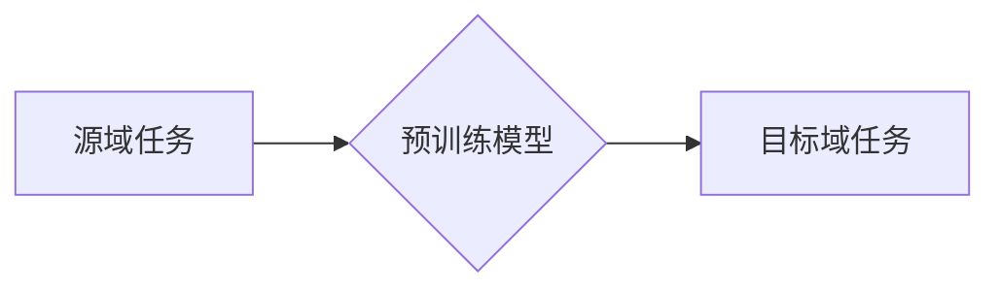

                 

## 电商行业中的迁移学习：大模型在跨平台用户行为预测与应用中的创新

> 关键词：迁移学习、大模型、用户行为预测、跨平台、电商行业、模型迁移、数据增强

## 1. 背景介绍

随着电商行业的蓬勃发展，用户行为预测已成为商家获取用户洞察、优化营销策略、提升转化率的关键环节。传统的用户行为预测模型通常依赖于单一平台的数据，难以捕捉用户在不同平台之间的行为关联性，导致预测精度有限。

迁移学习作为一种机器学习范式，能够利用已训练好的模型在源域上的知识迁移到目标域，从而在目标域上进行高效的学习。在大模型时代，迁移学习的优势更加凸显。大模型拥有海量参数和强大的泛化能力，可以学习到更深层的用户行为模式，并有效地跨平台迁移知识。

## 2. 核心概念与联系

**2.1 迁移学习的概念**

迁移学习是一种机器学习范式，旨在利用源域任务的知识迁移到目标域任务，以提高目标域任务的学习效率和性能。

**2.2 迁移学习的优势**

* **数据效率:** 在目标域数据有限的情况下，迁移学习可以利用源域数据进行预训练，减少目标域数据需求。
* **泛化能力:** 迁移学习可以帮助模型学习到更通用的特征和模式，从而提高在目标域上的泛化能力。
* **快速训练:** 迁移学习可以利用预训练模型的知识，减少目标域任务的训练时间。

**2.3 迁移学习的应用场景**

迁移学习在电商行业中具有广泛的应用场景，例如：

* **用户行为预测:** 利用用户在不同平台上的行为数据，预测用户在目标平台上的购买行为、浏览偏好等。
* **个性化推荐:** 根据用户的历史行为和偏好，个性化推荐商品和服务。
* **广告投放优化:** 预测用户对不同广告的点击率和转化率，优化广告投放策略。

**2.4 迁移学习的架构**



## 3. 核心算法原理 & 具体操作步骤

**3.1 算法原理概述**

迁移学习的核心思想是利用源域任务的知识迁移到目标域任务。常见的迁移学习方法包括：

* **特征迁移:** 将源域任务的特征提取模型迁移到目标域任务，并使用迁移后的特征进行目标域任务的训练。
* **参数迁移:** 将源域任务的预训练模型参数迁移到目标域任务，并微调目标域任务的模型参数。
* **知识蒸馏:** 将源域任务的知识蒸馏到目标域任务的模型中，例如将大模型的知识蒸馏到小模型中。

**3.2 算法步骤详解**

1. **数据准备:** 收集源域和目标域的数据，并进行预处理，例如数据清洗、特征工程等。
2. **源域任务训练:** 使用源域数据训练一个预训练模型，例如使用图像分类数据集训练一个图像分类模型。
3. **模型迁移:** 将预训练模型的特征提取层或参数迁移到目标域任务的模型中。
4. **目标域任务微调:** 使用目标域数据对迁移后的模型进行微调，以适应目标域任务的特定需求。
5. **模型评估:** 使用目标域数据评估迁移后的模型的性能，并进行调整和优化。

**3.3 算法优缺点**

**优点:**

* 数据效率高
* 泛化能力强
* 训练速度快

**缺点:**

* 需要源域和目标域数据之间的相似性
* 模型迁移过程可能需要一定的技巧和经验

**3.4 算法应用领域**

* 自然语言处理
* 图像识别
* 语音识别
* 机器翻译
* 医疗诊断

## 4. 数学模型和公式 & 详细讲解 & 举例说明

**4.1 数学模型构建**

假设我们有一个源域任务和一个目标域任务，源域任务的目标是预测标签 $y_s$，目标域任务的目标是预测标签 $y_t$。

* $x_s$：源域数据
* $x_t$：目标域数据
* $f_s$：源域任务的模型
* $f_t$：目标域任务的模型

**4.2 公式推导过程**

迁移学习的目标是利用源域任务的知识来提高目标域任务的性能。我们可以通过以下公式来表示迁移学习的过程：

$$
f_t = f_s + \Delta f
$$

其中，$\Delta f$ 是目标域任务模型与源域任务模型之间的差异。

**4.3 案例分析与讲解**

例如，我们想利用用户在电商平台A上的购买行为数据来预测用户在电商平台B上的购买行为。

* 源域任务：预测用户在平台A上的购买行为
* 目标域任务：预测用户在平台B上的购买行为

我们可以使用迁移学习的方法，将平台A上的预训练模型迁移到平台B的任务中，并进行微调，以提高平台B上的预测精度。

## 5. 项目实践：代码实例和详细解释说明

**5.1 开发环境搭建**

* Python 3.7+
* TensorFlow 2.0+
* PyTorch 1.0+
* CUDA 10.0+

**5.2 源代码详细实现**

```python
# 导入必要的库
import tensorflow as tf

# 定义迁移学习模型
class TransferLearningModel(tf.keras.Model):
    def __init__(self):
        super(TransferLearningModel, self).__init__()
        # 使用预训练模型的特征提取层
        self.base_model = tf.keras.applications.ResNet50(weights='imagenet', include_top=False)
        # 添加新的全连接层
        self.fc1 = tf.keras.layers.Dense(128, activation='relu')
        self.fc2 = tf.keras.layers.Dense(10, activation='softmax')

    def call(self, inputs):
        # 使用预训练模型提取特征
        x = self.base_model(inputs)
        # 添加新的全连接层
        x = self.fc1(x)
        x = self.fc2(x)
        return x

# 实例化模型
model = TransferLearningModel()

# 编译模型
model.compile(optimizer='adam',
              loss='sparse_categorical_crossentropy',
              metrics=['accuracy'])

# 训练模型
model.fit(train_data, train_labels, epochs=10)

# 评估模型
loss, accuracy = model.evaluate(test_data, test_labels)
print('Loss:', loss)
print('Accuracy:', accuracy)
```

**5.3 代码解读与分析**

* 使用预训练模型的特征提取层：

代码中使用 `tf.keras.applications.ResNet50` 来加载预训练的 ResNet50 模型，并将其 `include_top=False`，只保留特征提取层。

* 添加新的全连接层：

代码中添加了两个全连接层 `fc1` 和 `fc2`，用于将特征提取层的输出映射到目标域任务的输出空间。

* 编译和训练模型：

代码中使用 `adam` 优化器、`sparse_categorical_crossentropy` 损失函数和 `accuracy` 指标来编译模型，并使用 `fit` 方法训练模型。

**5.4 运行结果展示**

训练完成后，可以使用 `evaluate` 方法评估模型的性能，并打印损失和准确率。

## 6. 实际应用场景

**6.1 用户行为预测**

* 预测用户在不同平台上的购买行为、浏览偏好等。
* 预测用户对特定商品的兴趣和购买意愿。

**6.2 个性化推荐**

* 根据用户的历史行为和偏好，个性化推荐商品和服务。
* 提供更精准的广告推荐，提高广告点击率和转化率。

**6.3 广告投放优化**

* 预测用户对不同广告的点击率和转化率，优化广告投放策略。
* 根据用户画像和行为特征，精准投放广告，提高广告效果。

**6.4 未来应用展望**

* 利用迁移学习技术，跨平台融合用户行为数据，构建更全面的用户画像。
* 开发更智能的个性化推荐系统，提供更精准的商品和服务推荐。
* 优化广告投放策略，提高广告效果和用户体验。

## 7. 工具和资源推荐

**7.1 学习资源推荐**

* **书籍:**

* 《迁移学习》
* 《深度学习》

* **在线课程:**

* Coursera: 迁移学习
* Udacity: 深度学习

**7.2 开发工具推荐**

* TensorFlow
* PyTorch
* Keras

**7.3 相关论文推荐**

* 《迁移学习: 一种机器学习范式》
* 《迁移学习在电商领域的应用》

## 8. 总结：未来发展趋势与挑战

**8.1 研究成果总结**

迁移学习在电商行业中取得了显著的成果，例如提高了用户行为预测的精度、个性化推荐的精准度、广告投放的效率等。

**8.2 未来发展趋势**

* **跨模态迁移学习:** 将不同模态的数据（例如文本、图像、音频）进行迁移学习，构建更全面的用户画像。
* **联邦迁移学习:** 在保护用户隐私的前提下，利用多个平台的数据进行迁移学习，提高模型的泛化能力。
* **自适应迁移学习:** 根据目标域的数据分布动态调整迁移学习模型，提高模型的适应性。

**8.3 面临的挑战**

* **数据异构性:** 不同平台的数据格式、特征和分布可能存在差异，需要进行有效的预处理和数据融合。
* **模型解释性:** 迁移学习模型的决策过程往往比较复杂，需要提高模型的解释性，方便商家理解和信任模型的预测结果。
* **伦理问题:** 迁移学习可能会导致数据泄露和隐私侵犯等伦理问题，需要制定相应的规范和机制来保障用户权益。

**8.4 研究展望**

未来，迁移学习将在电商行业中发挥越来越重要的作用，并推动电商行业的发展。


## 9. 附录：常见问题与解答

**9.1 如何选择合适的迁移学习方法？**

选择合适的迁移学习方法需要根据具体的应用场景和数据特点进行考虑。

* 如果源域数据和目标域数据之间相似性较高，可以使用特征迁移的方法。
* 如果源域数据和目标域数据之间差异较大，可以使用参数迁移或知识蒸馏的方法。

**9.2 如何评估迁移学习模型的性能？**

可以使用目标域任务的标准评估指标来评估迁移学习模型的性能，例如准确率、召回率、F1-score等。

**9.3 如何解决数据异构性问题？**

可以使用数据预处理和数据融合的方法来解决数据异构性问题。

* 数据预处理：对不同平台的数据进行格式转换、特征工程等操作，使其更加一致。
* 数据融合：将不同平台的数据进行融合，构建更全面的用户画像。


作者：禅与计算机程序设计艺术 / Zen and the Art of Computer Programming 
<end_of_turn>

