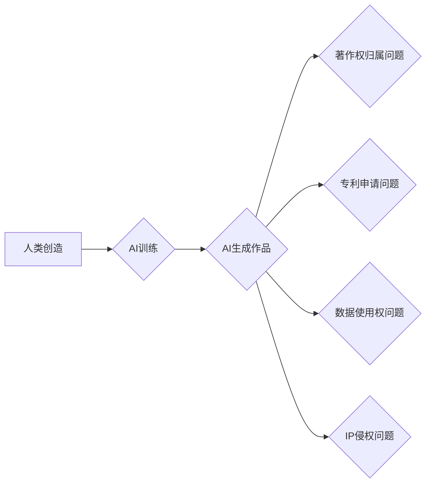

                 

## 知识产权在AI时代的新挑战

> 关键词：人工智能、知识产权、版权、专利、发明、数据所有权、伦理、法律

### 1. 背景介绍

人工智能（AI）技术的飞速发展，正在深刻地改变着我们的生活和工作方式。从自动驾驶汽车到智能医疗，从个性化推荐到创意写作，AI正在各个领域展现出强大的应用潜力。然而，AI技术的进步也带来了新的挑战，其中之一就是知识产权（IP）问题。

传统意义上的知识产权保护机制主要针对人类创造的知识产权，例如文学作品、音乐作品、发明等。但AI系统能够自主生成新的内容，例如文本、图像、音乐等，这使得传统的IP保护机制面临着新的考验。

### 2. 核心概念与联系

**2.1 知识产权概述**

知识产权是指个人或组织对知识、创意和发明等方面的独占权利。它包括以下几种类型：

* **版权：**保护文学、艺术和音乐作品的权利。
* **专利：**保护发明和技术创造的权利。
* **商标：**保护商品或服务的标识的权利。
* **商业秘密：**保护企业内部的 confidential 信息的权利。

**2.2 人工智能与知识产权的关联**

AI技术的应用可以产生新的知识产权，例如：

* **AI生成的文本、图像、音乐等作品：** 这些作品是否可以被视为人类创造的，从而享有版权保护？
* **AI辅助的创新发明：** AI系统参与发明过程，谁拥有该发明的专利权？
* **AI训练数据：** AI模型的训练数据是否可以被视为知识产权，如何保护数据所有者的权益？

**2.3  AI时代知识产权的挑战**

AI技术的应用带来了以下知识产权挑战：

* **著作权归属问题：** AI生成的创意作品的著作权归属不明确，难以界定。
* **专利申请问题：** AI参与发明过程，如何界定发明人的身份和贡献？
* **数据使用权问题：** AI模型的训练数据来自互联网或其他公开渠道，如何平衡数据使用权和数据所有者的权益？
* **IP侵权问题：** AI系统可能无意中生成侵犯他人知识产权的作品，如何预防和解决这类问题？

**2.4  Mermaid 流程图**



### 3. 核心算法原理 & 具体操作步骤

**3.1 算法原理概述**

AI系统生成知识产权的作品通常基于以下核心算法：

* **生成对抗网络（GAN）：** GAN由两个网络组成：生成器和鉴别器。生成器试图生成逼真的作品，而鉴别器试图区分真实作品和生成作品。通过不断的对抗训练，生成器可以生成越来越逼真的作品。
* **变分自编码器（VAE）：** VAE通过学习数据的潜在表示来生成新的数据。它将输入数据编码成一个低维的潜在空间，然后解码成新的数据。
* **Transformer模型：** Transformer模型是一种强大的自然语言处理模型，可以用于生成文本、翻译语言、总结文本等任务。

**3.2 算法步骤详解**

以生成文本为例，使用Transformer模型生成文本的步骤如下：

1. **数据预处理：** 将文本数据进行清洗、分词、标记等预处理操作。
2. **模型训练：** 使用预处理后的数据训练Transformer模型。训练过程中，模型会学习文本数据的语法结构、语义关系等特征。
3. **文本生成：** 将待生成的文本输入到训练好的模型中，模型会根据学习到的特征生成新的文本。

**3.3 算法优缺点**

* **优点：**

    * 可以生成高质量、逼真的作品。
    * 可以处理大量数据，学习复杂的模式。
    * 可以应用于多种领域，例如文本生成、图像生成、音乐生成等。

* **缺点：**

    * 训练成本高，需要大量的计算资源和数据。
    * 模型的生成结果可能缺乏创意和原创性。
    * 模型可能存在偏见和歧视，需要进行相应的调优和改进。

**3.4 算法应用领域**

* 文本生成：自动写作、机器翻译、聊天机器人等。
* 图像生成：图像合成、图像修复、图像风格转换等。
* 音乐生成：作曲、音乐伴奏、音乐风格转换等。
* 视频生成：视频剪辑、视频特效、视频合成等。

### 4. 数学模型和公式 & 详细讲解 & 举例说明

**4.1 数学模型构建**

AI生成知识产权的作品通常基于概率模型，例如贝叶斯网络、隐马尔可夫模型等。这些模型可以学习数据之间的概率关系，并根据这些关系生成新的数据。

**4.2 公式推导过程**

例如，使用贝叶斯网络生成文本，可以根据以下公式推导文本的生成概率：

$$P(w_t|w_{1:t-1}) = \frac{P(w_{1:t}|w_{1:t-1})}{P(w_{1:t-1})}$$

其中：

* $w_t$ 是当前生成的词。
* $w_{1:t-1}$ 是之前生成的词序列。
* $P(w_{1:t}|w_{1:t-1})$ 是给定之前词序列，当前词出现的概率。
* $P(w_{1:t-1})$ 是之前词序列出现的概率。

**4.3 案例分析与讲解**

例如，假设我们训练了一个贝叶斯网络模型来生成英文句子。模型学习到以下概率关系：

* 给定“The”，下一个词可能是“cat”或“dog”。
* 给定“cat”，下一个词可能是“is”或“on”。

当模型生成句子时，它会根据这些概率关系选择下一个词，最终生成一个完整的句子，例如“The cat is on the mat”。

### 5. 项目实践：代码实例和详细解释说明

**5.1 开发环境搭建**

使用Python语言开发AI生成文本项目，需要安装以下软件：

* Python 3.x
* TensorFlow或PyTorch深度学习框架
* NLTK自然语言处理库
* 其他必要的库，例如pandas、numpy等。

**5.2 源代码详细实现**

以下是一个使用Transformer模型生成文本的简单代码示例：

```python
import tensorflow as tf

# 定义Transformer模型
class Transformer(tf.keras.Model):
    def __init__(self, vocab_size, embedding_dim, num_heads, num_layers):
        super(Transformer, self).__init__()
        # ... 模型结构定义 ...

    def call(self, inputs):
        # ... 模型前向传播过程 ...

# 加载预训练模型
model = Transformer(vocab_size=30000, embedding_dim=128, num_heads=8, num_layers=6)

# 生成文本
text = model.generate(start_token=[1], max_length=50)
print(text)
```

**5.3 代码解读与分析**

* 代码首先定义了一个Transformer模型类，并根据需要设置模型参数，例如词汇大小、嵌入维度、注意力头数、层数等。
* 然后加载预训练的Transformer模型。
* 最后使用模型生成文本，输入一个起始标记，并设置最大生成长度。

**5.4 运行结果展示**

运行代码后，模型会生成一段文本，例如：

```
The quick brown fox jumps over the lazy dog.
```

### 6. 实际应用场景

AI生成的知识产权作品已经开始在各个领域得到应用：

* **创意写作：** AI可以帮助作家生成故事、诗歌、剧本等创意内容。
* **音乐创作：** AI可以生成新的音乐旋律、伴奏、歌曲等。
* **艺术创作：** AI可以生成绘画、雕塑、摄影等艺术作品。
* **广告营销：** AI可以生成个性化的广告文案、图片、视频等。

### 6.4 未来应用展望

未来，AI生成的知识产权作品将应用更加广泛，例如：

* **个性化教育：** AI可以根据学生的学习情况生成个性化的学习内容。
* **医疗诊断：** AI可以辅助医生诊断疾病，生成个性化的治疗方案。
* **科学研究：** AI可以帮助科学家发现新的知识，加速科学研究的进程。

### 7. 工具和资源推荐

**7.1 学习资源推荐**

* **书籍：**

    * 《深度学习》
    * 《自然语言处理》
    * 《机器学习》

* **在线课程：**

    * Coursera
    * edX
    * Udacity

**7.2 开发工具推荐**

* **Python:** 

    * TensorFlow
    * PyTorch
    * Keras

* **其他工具:**

    * Jupyter Notebook
    * Git

**7.3 相关论文推荐**

* **Generative Adversarial Networks**
* **Attention Is All You Need**
* **BERT: Pre-training of Deep Bidirectional Transformers for Language Understanding**

### 8. 总结：未来发展趋势与挑战

**8.1 研究成果总结**

AI技术在知识产权领域取得了显著进展，例如：

* 能够生成高质量、逼真的作品。
* 能够处理大量数据，学习复杂的模式。
* 能够应用于多种领域，例如文本生成、图像生成、音乐生成等。

**8.2 未来发展趋势**

* **更强大的AI模型：** 未来将出现更强大的AI模型，能够生成更加复杂、创新的作品。
* **更广泛的应用场景：** AI生成的知识产权作品将应用到更多领域，例如教育、医疗、科学研究等。
* **更完善的法律法规：** 随着AI技术的进步，需要制定更完善的法律法规来规范AI生成的知识产权。

**8.3 面临的挑战**

* **著作权归属问题：** AI生成的创意作品的著作权归属不明确，难以界定。
* **专利申请问题：** AI参与发明过程，如何界定发明人的身份和贡献？
* **数据使用权问题：** AI模型的训练数据来自互联网或其他公开渠道，如何平衡数据使用权和数据所有者的权益？
* **IP侵权问题：** AI系统可能无意中生成侵犯他人知识产权的作品，如何预防和解决这类问题？

**8.4 研究展望**

未来研究方向包括：

* **开发新的AI算法：** 开发能够生成更加原创、具有创意的作品的AI算法。
* **完善知识产权保护机制：** 研究如何更好地保护AI生成的知识产权。
* **探讨AI与人类创造的关系：** 探讨AI与人类创造之间的关系，以及AI对人类创造的影响。


### 9. 附录：常见问题与解答

**9.1  AI生成的文本是否具有著作权？**

目前，各国法律对AI生成的文本的著作权保护尚无统一规定。一些国家认为AI生成的文本不具有著作权，因为其缺乏人类的创造性。而另一些国家则认为，如果AI系统由人类设计和训练，那么生成的文本可能具有著作权。

**9.2  AI生成的图像是否可以用于商业用途？**

AI生成的图像的商业用途取决于其版权归属。如果AI生成的图像的版权归属于AI开发者，那么可以用于商业用途。但如果AI生成的图像侵犯了其他人的版权，则不能用于商业用途。

**9.3  如何防止AI系统生成侵犯他人知识产权的作品？**

可以采取以下措施防止AI系统生成侵犯他人知识产权的作品：

* 使用训练数据进行版权检查，确保数据合法。
* 在AI模型训练过程中加入版权保护机制，例如禁止模型生成与特定作品高度相似的作品。
* 对AI生成的输出进行审查，确保其不侵犯他人知识产权。

**9.4  AI技术对知识产权保护有什么影响？**

AI技术对知识产权保护带来了新的挑战和机遇。一方面，AI可以帮助提高知识产权的保护效率，例如自动检测侵权行为。另一方面，AI也可能导致新的知识产权问题，例如AI生成的文本或图像的著作权归属问题。


作者：禅与计算机程序设计艺术 / Zen and the Art of Computer Programming 
<end_of_turn>

