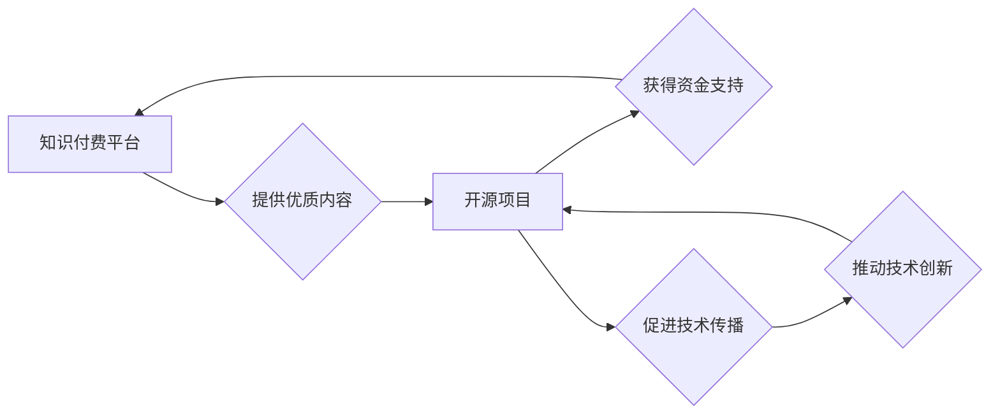

                 

## 知识付费与开源项目:相辅相成的关系

> 关键词：知识付费、开源项目、社区驱动、技术传播、商业模式、价值共创、技术生态

## 1. 背景介绍

在当今数字时代，知识已成为最宝贵的资源之一。随着互联网的普及和科技的飞速发展，知识的获取和传播方式发生了根本性的改变。知识付费和开源项目作为两种不同的知识传播模式，在技术领域扮演着越来越重要的角色。

知识付费是指通过付费的方式获取知识和技能，包括在线课程、付费博客、电子书等。开源项目则是指源代码公开可供任何人免费使用、修改和分发，并鼓励社区共同参与开发和维护的软件项目。

虽然两种模式看似截然不同，但实际上它们之间存在着密切的联系，并能够相互促进，共同推动技术进步和创新。

## 2. 核心概念与联系

### 2.1 知识付费

知识付费的核心在于将知识和技能转化为有价值的商品，并通过付费的方式提供给需要学习的人。它打破了传统知识传播的壁垒，让更多人能够获得高质量的知识和技能，从而提升自身价值。

### 2.2 开源项目

开源项目的核心在于开放和共享。它鼓励开发者共同参与，协作开发和维护软件，从而降低开发成本，提高软件质量，并促进技术创新。

### 2.3 相互联系

知识付费和开源项目之间存在着相辅相成的关系：

* **开源项目为知识付费提供内容基础:** 开源项目提供了丰富的技术文档、代码示例和社区支持，为知识付费平台提供优质的内容基础。
* **知识付费为开源项目提供资金支持:** 知识付费可以为开源项目提供资金支持，帮助开发者更好地投入到项目开发和维护中。
* **共同促进技术传播和创新:** 知识付费和开源项目共同推动技术传播和创新，形成良性循环。

**Mermaid 流程图:**



## 3. 核心算法原理 & 具体操作步骤

### 3.1 算法原理概述

知识付费和开源项目之间相互促进的关系可以看作是一种“价值共创”的算法。

* **输入:** 知识和技能、技术需求、社区参与
* **过程:** 知识付费平台提供优质内容，开源项目提供技术基础和社区支持，开发者通过付费学习和开源贡献，共同创造价值。
* **输出:** 技术进步、创新成果、社区发展

### 3.2 算法步骤详解

1. **知识付费平台提供优质内容:** 知识付费平台需要根据市场需求和用户痛点，提供高质量的知识和技能课程、教程、文档等内容。
2. **开源项目提供技术基础和社区支持:** 开源项目需要提供完善的技术文档、代码示例和社区支持，帮助开发者理解和使用开源技术。
3. **开发者付费学习和开源贡献:** 开发者可以通过付费的方式学习开源技术，并根据自身能力和兴趣，为开源项目做出贡献。
4. **共同创造价值:** 开发者通过学习和贡献，提升自身技术能力，并推动开源项目的进步，最终共同创造价值。

### 3.3 算法优缺点

**优点:**

* **促进技术传播和创新:** 通过知识付费和开源项目的结合，可以有效地促进技术传播和创新。
* **降低技术门槛:** 开源项目可以降低技术门槛，让更多人能够接触到先进的技术。
* **构建良性循环:** 知识付费和开源项目之间形成的良性循环，可以持续推动技术进步和发展。

**缺点:**

* **知识付费平台需要投入大量资源:** 知识付费平台需要投入大量资源进行内容创作、平台建设和运营维护。
* **开源项目需要持续的社区支持:** 开源项目需要持续的社区支持，才能保证项目的健康发展。
* **知识付费和开源项目之间存在着利益冲突:** 知识付费平台和开源项目之间可能存在着利益冲突，需要找到平衡点。

### 3.4 算法应用领域

知识付费和开源项目相辅相成的关系在各个技术领域都有广泛的应用，例如：

* **软件开发:** 开源框架和库为开发者提供基础，知识付费平台提供针对特定技术的培训和指导。
* **数据科学:** 开源数据分析工具和平台为数据科学家提供基础，知识付费平台提供数据挖掘和机器学习的培训和实战经验。
* **人工智能:** 开源深度学习框架和模型为人工智能开发者提供基础，知识付费平台提供人工智能算法和应用的培训和指导。

## 4. 数学模型和公式 & 详细讲解 & 举例说明

### 4.1 数学模型构建

我们可以用一个简单的数学模型来描述知识付费和开源项目之间的关系：

* **V = K * C * S**

其中：

* **V:** 代表共同创造的价值
* **K:** 代表知识和技能的价值
* **C:** 代表社区参与的程度
* **S:** 代表开源项目的规模

### 4.2 公式推导过程

这个公式的推导过程基于以下假设：

* 知识和技能是创造价值的基础
* 社区参与程度越高，创造的价值越高
* 开源项目的规模越大，创造的价值越高

### 4.3 案例分析与讲解

例如，一个开源数据库项目，其代码质量高，社区活跃，吸引了大量的开发者贡献代码和修复bug。同时，相关的知识付费平台也提供针对该数据库的培训课程和技术文档，帮助开发者更好地理解和使用该数据库。

在这种情况下，K、C和S都比较高，因此V也会比较高。

## 5. 项目实践：代码实例和详细解释说明

### 5.1 开发环境搭建

为了更好地理解知识付费和开源项目之间的关系，我们可以创建一个简单的项目实践。

例如，我们可以创建一个开源的博客平台，并提供相关的知识付费课程，帮助开发者学习如何使用该平台。

### 5.2 源代码详细实现

我们可以使用Python和Django框架来实现这个博客平台。

```python
# views.py
from django.shortcuts import render

def index(request):
    return render(request, 'index.html')
```

### 5.3 代码解读与分析

这段代码定义了一个名为index的视图函数，该函数负责处理首页的请求。

当用户访问首页时，该函数会渲染名为index.html的模板文件。

### 5.4 运行结果展示

运行该代码后，我们可以访问博客平台的首页。

## 6. 实际应用场景

### 6.1 知识付费平台

* **Udemy:** 提供各种在线课程，涵盖多个领域。
* **Coursera:** 与知名大学合作，提供在线课程和学位证书。
* **Skillshare:** 提供创意和专业技能课程。

### 6.2 开源项目

* **Linux:** 开源操作系统，广泛应用于服务器和个人电脑。
* **Android:** 开源移动操作系统，占据全球移动市场份额的很大一部分。
* **TensorFlow:** 开源深度学习框架，广泛应用于人工智能领域。

### 6.4 未来应用展望

随着技术的不断发展，知识付费和开源项目将更加紧密地结合在一起。

* **更个性化的学习体验:** 知识付费平台将利用人工智能技术，提供更个性化的学习体验。
* **更强大的开源社区:** 开源社区将更加强大，吸引更多开发者参与。
* **更广泛的技术应用:** 知识付费和开源项目将应用于更广泛的技术领域。

## 7. 工具和资源推荐

### 7.1 学习资源推荐

* **GitHub:** 开源代码托管平台，提供丰富的开源项目资源。
* **Stack Overflow:** 开发者社区，可以解答技术问题。
* **Coursera:** 在线学习平台，提供各种在线课程。

### 7.2 开发工具推荐

* **Git:** 版本控制工具，用于管理代码版本。
* **Python:** 编程语言，广泛应用于数据科学和人工智能领域。
* **Django:** Python Web开发框架，用于构建Web应用程序。

### 7.3 相关论文推荐

* **The Economics of Open Source Software**
* **The Open Source Advantage**
* **The Future of Knowledge Sharing**

## 8. 总结：未来发展趋势与挑战

### 8.1 研究成果总结

知识付费和开源项目相辅相成，共同推动技术进步和创新。

* 知识付费为开源项目提供资金支持，开源项目为知识付费提供内容基础。
* 共同创造价值，降低技术门槛，促进技术传播和创新。

### 8.2 未来发展趋势

* 更个性化的学习体验
* 更强大的开源社区
* 更广泛的技术应用

### 8.3 面临的挑战

* 知识付费平台需要投入大量资源
* 开源项目需要持续的社区支持
* 知识付费和开源项目之间存在着利益冲突

### 8.4 研究展望

* 如何更好地平衡知识付费和开源项目的利益关系
* 如何利用人工智能技术，提供更个性化的学习体验
* 如何吸引更多开发者参与开源项目

## 9. 附录：常见问题与解答

**Q1: 知识付费和开源项目之间有什么区别？**

**A1:** 知识付费是指通过付费的方式获取知识和技能，而开源项目是指源代码公开可供任何人免费使用、修改和分发。

**Q2: 知识付费和开源项目如何相互促进？**

**A2:** 知识付费平台可以为开源项目提供资金支持，开源项目可以为知识付费平台提供内容基础。

**Q3: 如何参与开源项目？**

**A3:** 可以通过GitHub等平台找到开源项目，并根据项目需求贡献代码、修复bug或提供文档支持。

**Q4: 如何选择合适的知识付费平台？**

**A4:** 可以参考平台的课程质量、师资力量、用户评价等因素。

**Q5: 开源项目有哪些优势？**

**A5:** 开源项目可以降低开发成本，提高软件质量，并促进技术创新。


作者：禅与计算机程序设计艺术 / Zen and the Art of Computer Programming 
<end_of_turn>

