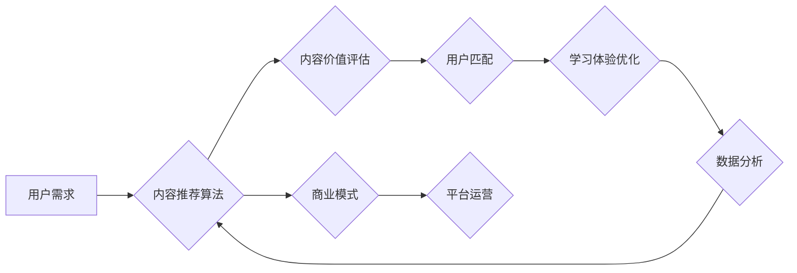

                 

## 知识付费创业中的内容价值提升

> 关键词：知识付费、内容价值、算法优化、用户体验、数据分析、商业模式、人工智能

### 1. 背景介绍

知识付费行业近年来发展迅速，成为新兴的经济增长点。随着互联网技术的普及和人们对知识的需求不断增长，越来越多的创作者和企业涌入这个领域，提供各种类型的付费课程、咨询服务和知识产品。然而，知识付费市场竞争激烈，如何提升内容价值，吸引用户付费成为众多创业者面临的共同挑战。

### 2. 核心概念与联系

**2.1 内容价值**

内容价值是指知识付费产品或服务能够为用户带来的实际利益和价值。它包括以下几个方面：

* **知识深度和实用性:** 内容是否具有深度、原创性和实用性，能够解决用户实际问题，提升用户技能和知识水平。
* **学习体验:** 内容的呈现形式、互动性、趣味性等，能够提供良好的学习体验，提高用户学习效率和兴趣。
* **师资力量:** 内容创作者的专业背景、经验和能力，能够保证内容的权威性和可信度。
* **社区氛围:**  知识付费平台是否能够构建良好的学习社区，提供用户交流、互动和支持的平台。

**2.2 算法优化**

算法优化是指通过算法设计和调整，提升知识付费平台内容推荐、用户匹配、学习路径规划等方面的效率和精准度。

**2.3 用户体验**

用户体验是指用户在使用知识付费平台时，感受到的整体感受和满意度。良好的用户体验能够提高用户粘性、提升付费意愿。

**2.4 数据分析**

数据分析是指通过对用户行为、学习数据等进行分析，挖掘用户需求、学习偏好和平台运营规律，为内容价值提升提供数据支持。

**2.5 商业模式**

商业模式是指知识付费平台的盈利模式，包括订阅制、课程销售、会员体系等。合理的商业模式能够保证平台的持续发展和用户价值创造。

**Mermaid 流程图**



### 3. 核心算法原理 & 具体操作步骤

**3.1 算法原理概述**

知识付费平台的算法优化主要涉及以下几个方面：

* **内容推荐算法:** 基于用户历史行为、学习偏好、知识图谱等信息，推荐用户感兴趣和有价值的内容。
* **用户匹配算法:** 根据用户兴趣、学习目标、知识水平等信息，匹配用户与合适的课程、导师或学习社区。
* **学习路径规划算法:** 根据用户学习进度、知识掌握情况，规划个性化的学习路径，提高学习效率和用户体验。

**3.2 算法步骤详解**

**3.2.1 内容推荐算法**

1. **数据收集:** 收集用户行为数据（浏览记录、购买记录、评论等）、学习数据（学习进度、知识掌握情况）、内容特征数据（主题、标签、作者等）。
2. **数据预处理:** 对收集到的数据进行清洗、转换、特征提取等预处理工作。
3. **模型训练:** 选择合适的推荐算法模型（如协同过滤、内容过滤、深度学习等），利用预处理后的数据进行模型训练。
4. **推荐结果输出:** 根据训练好的模型，对用户进行个性化内容推荐。

**3.2.2 用户匹配算法**

1. **用户画像构建:** 根据用户基本信息、学习偏好、知识水平等信息，构建用户画像。
2. **课程/导师/社区特征提取:**  提取课程、导师、学习社区的特征信息（主题、难度、风格、经验等）。
3. **匹配规则设定:**  根据用户画像和课程/导师/社区特征，设定匹配规则。
4. **用户匹配:** 利用匹配规则，将用户与合适的课程、导师或学习社区进行匹配。

**3.2.3 学习路径规划算法**

1. **学习目标设定:**  根据用户学习目标、知识水平等信息，设定学习目标。
2. **课程/知识点库构建:**  构建课程和知识点的库，并建立课程之间的关联关系。
3. **路径规划算法:**  选择合适的路径规划算法（如贪婪算法、动态规划算法等），根据用户学习目标和知识掌握情况，规划个性化的学习路径。
4. **路径推荐:**  将规划好的学习路径推荐给用户。

**3.3 算法优缺点**

**优点:**

* **提升内容推荐精准度:** 算法可以根据用户个性化需求，推荐更精准的内容，提高用户满意度。
* **优化用户匹配:** 算法可以帮助用户找到更合适的课程、导师或学习社区，提高学习效率。
* **个性化学习路径:** 算法可以根据用户学习进度和知识掌握情况，规划个性化的学习路径，提高学习体验。

**缺点:**

* **数据依赖:** 算法需要大量的数据进行训练和优化，数据质量直接影响算法效果。
* **算法复杂度:** 一些算法的复杂度较高，需要强大的计算能力和技术支持。
* **算法偏差:** 算法可能会存在偏差，导致推荐结果不准确或不公平。

**3.4 算法应用领域**

* **在线教育平台:** 内容推荐、用户匹配、学习路径规划。
* **知识付费平台:** 内容推荐、用户匹配、课程推荐。
* **社交媒体平台:** 内容推荐、用户兴趣匹配、个性化内容推送。
* **电商平台:** 商品推荐、用户画像构建、个性化营销。

### 4. 数学模型和公式 & 详细讲解 & 举例说明

**4.1 数学模型构建**

**4.1.1 内容价值评估模型**

假设用户对内容的价值评估可以用以下公式表示：

$$
Value = f(Content\_Features, User\_Features)
$$

其中：

* $Value$：用户对内容的价值评估
* $Content\_Features$：内容的特征向量，例如主题、标签、作者、难度等
* $User\_Features$：用户的特征向量，例如兴趣、学习目标、知识水平等
* $f$：价值评估函数，可以是线性回归、神经网络等模型

**4.1.2 用户匹配模型**

用户与课程/导师/社区的匹配度可以用余弦相似度来衡量：

$$
Similarity = \frac{User\_Features \cdot Course\_Features}{||User\_Features|| ||Course\_Features||}
$$

其中：

* $Similarity$：用户与课程/导师/社区的匹配度
* $User\_Features$：用户的特征向量
* $Course\_Features$：课程/导师/社区的特征向量
* $\cdot$：点积运算
* $||User\_Features||$：用户特征向量的模长
* $||Course\_Features||$：课程/导师/社区特征向量的模长

**4.2 公式推导过程**

**4.2.1 内容价值评估模型推导**

根据用户对内容的价值评估，可以构建一个回归模型，例如线性回归模型：

$$
Value = w_0 + w_1 * Content\_Feature_1 + w_2 * Content\_Feature_2 + ... + w_n * Content\_Feature_n
$$

其中：

* $w_0$：截距项
* $w_1, w_2, ..., w_n$：权重系数
* $Content\_Feature_1, Content\_Feature_2, ..., Content\_Feature_n$：内容的特征向量

通过训练数据，可以利用最小二乘法等方法求解权重系数，得到最终的价值评估模型。

**4.2.2 用户匹配模型推导**

余弦相似度可以衡量两个向量的方向相似度，因此可以用来衡量用户与课程/导师/社区的匹配度。

**4.3 案例分析与讲解**

**4.3.1 内容价值评估案例**

假设一个在线教育平台想要评估用户对编程课程的价值评估，可以收集用户浏览记录、购买记录、课程评价等数据，构建一个内容价值评估模型。

**4.3.2 用户匹配案例**

一个知识付费平台想要匹配用户与合适的课程，可以收集用户兴趣、学习目标、知识水平等数据，构建一个用户匹配模型。

### 5. 项目实践：代码实例和详细解释说明

**5.1 开发环境搭建**

* 操作系统：Windows/macOS/Linux
* 编程语言：Python
* 开发工具：Jupyter Notebook/VS Code
* 库依赖：pandas、numpy、scikit-learn、tensorflow等

**5.2 源代码详细实现**

```python
# 内容价值评估模型
import pandas as pd
from sklearn.linear_model import LinearRegression

# 加载数据
data = pd.read_csv('content_data.csv')

# 特征工程
# ...

# 训练模型
model = LinearRegression()
model.fit(data[['Content\_Feature_1', 'Content\_Feature_2', ...]], data['Value'])

# 用户匹配模型
import numpy as np

# 用户特征向量
user_features = np.array([user_feature_1, user_feature_2, ...])

# 课程特征向量
course_features = np.array([course_feature_1, course_feature_2, ...])

# 计算余弦相似度
similarity = np.dot(user_features, course_features) / (np.linalg.norm(user_features) * np.linalg.norm(course_features))

# 学习路径规划算法
# ...

```

**5.3 代码解读与分析**

* 代码示例展示了内容价值评估模型和用户匹配模型的实现过程。
* 内容价值评估模型使用线性回归算法，根据内容特征和用户特征预测用户对内容的价值评估。
* 用户匹配模型使用余弦相似度来衡量用户与课程的匹配度。

**5.4 运行结果展示**

运行代码后，可以得到以下结果：

* 内容价值评估模型的预测结果，例如用户对特定课程的价值评估分数。
* 用户与课程的匹配度，例如用户与特定课程的相似度得分。

### 6. 实际应用场景

**6.1 在线教育平台**

* 内容推荐：根据用户的学习历史、兴趣和知识水平，推荐相关的课程和学习资源。
* 用户匹配：将用户与合适的导师或学习小组进行匹配，提高学习效率和互动性。
* 学习路径规划：根据用户的学习目标和进度，规划个性化的学习路径，帮助用户高效掌握知识。

**6.2 知识付费平台**

* 内容推荐：根据用户的兴趣和需求，推荐相关的付费课程、咨询服务和知识产品。
* 用户匹配：将用户与合适的课程创作者或导师进行匹配，提高用户学习体验和满意度。
* 课程推荐：根据用户的学习目标和进度，推荐相关的后续课程，提升用户学习深度和广度。

**6.3 其他应用场景**

* 个人学习：利用算法工具，个性化规划学习路径，提高学习效率。
* 职业发展：根据用户的职业目标和技能需求，推荐相关的学习资源和职业发展路径。
* 社交推荐：根据用户的兴趣和社交关系，推荐相关的用户和内容。

**6.4 未来应用展望**

随着人工智能技术的不断发展，知识付费平台的算法优化将更加智能化、个性化和精准化。未来，算法将能够更加深入地理解用户的需求和学习行为，提供更加个性化的学习体验和价值。

### 7. 工具和资源推荐

**7.1 学习资源推荐**

* **在线课程:** Coursera、edX、Udacity等平台提供丰富的机器学习、数据分析和人工智能课程。
* **书籍:** 《机器学习》、《深度学习》、《Python编程》等书籍可以帮助你学习相关知识。
* **开源项目:** TensorFlow、PyTorch等开源项目可以帮助你实践算法开发。

**7.2 开发工具推荐**

* **Python:** Python 是机器学习和数据分析的常用编程语言。
* **Jupyter Notebook:** Jupyter Notebook 是一个交互式编程环境，方便进行数据分析和算法开发。
* **VS Code:** VS Code 是一个功能强大的代码编辑器，支持多种编程语言和插件。

**7.3 相关论文推荐**

* **推荐系统:** 《Collaborative Filtering for Implicit Feedback Datasets》
* **深度学习:** 《Deep Learning》
* **自然语言处理:** 《BERT: Pre-training of Deep Bidirectional Transformers for Language Understanding》

### 8. 总结：未来发展趋势与挑战

**8.1 研究成果总结**

知识付费平台的算法优化取得了显著成果，能够有效提升内容推荐精准度、用户匹配效率和学习体验。

**8.2 未来发展趋势**

* **更智能化的算法:** 利用深度学习等先进算法，实现更精准的个性化推荐和学习路径规划。
* **更丰富的用户数据:** 收集更多用户的学习行为、兴趣偏好和反馈数据，为算法优化提供更丰富的支持。
* **更完善的平台生态:** 建立更完善的学习社区、导师体系和知识库，为用户提供更全面的学习支持。

**8.3 面临的挑战**

* **数据隐私保护:** 知识付费平台需要妥善处理用户数据，保障用户隐私安全。
* **算法公平性:** 算法需要避免存在偏差，确保推荐结果公平公正。
* **用户信任:** 知识付费平台需要建立用户的信任，保证内容质量和服务水平。

**8.4 研究展望**

未来，知识付费平台的算法优化将继续朝着更智能化、个性化和可解释的方向发展，为用户提供更优质的学习体验和价值。


### 9. 附录：常见问题与解答

**9.1 如何提高算法的准确性？**

* 收集更多高质量的数据
* 选择更合适的算法模型
* 优化算法参数
* 进行交叉验证和调参

**9.2 如何解决算法偏差问题？**

* 使用公平的算法模型
* 构建多元化的数据样本
* 定期评估算法偏差，并进行调整

**9.3 如何保障用户数据隐私？**

* 采用加密技术保护用户数据
* 明确用户数据使用协议
* 遵守相关数据隐私法规

**9.4 如何建立用户的信任？**

* 提供高质量的内容和服务
* 建立良好的用户反馈机制
* 透明公开算法机制

作者：禅与计算机程序设计艺术 / Zen and the Art of Computer Programming 


<end_of_turn>

