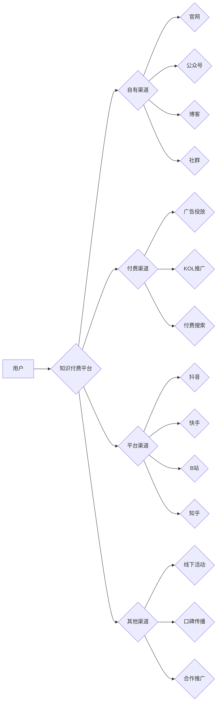

                 

## 知识付费创业的流量获取渠道

> 关键词：知识付费、流量获取、用户运营、内容营销、社群运营、付费变现、数据分析、推广策略

## 1. 背景介绍

知识付费行业近年来发展迅速，成为互联网经济的新增长点。随着人们对知识的需求不断增加，以及互联网平台的普及，越来越多的专家学者和创作者选择通过知识付费的方式分享自己的知识和经验，并获得收益。然而，知识付费创业面临着巨大的竞争压力，如何获取流量、吸引用户、实现付费变现成为创业者面临的共同挑战。

## 2. 核心概念与联系

**2.1 知识付费的核心概念**

知识付费是指通过付费的方式获取知识、技能和服务的商业模式。它涵盖了多种形式，例如在线课程、付费文章、直播讲座、咨询服务等。

**2.2 流量获取的核心概念**

流量获取是指将目标用户引导到平台或产品，使其产生访问、阅读、观看等行为的过程。

**2.3 知识付费与流量获取的联系**

知识付费创业的核心在于提供有价值的知识和服务，而流量获取则是将目标用户引导到这些内容，使其能够付费购买。流量获取是知识付费创业成功的关键环节，只有拥有足够的流量，才能吸引用户，实现付费变现。

**2.4 流量获取渠道的分类**

流量获取渠道可以分为以下几类：

* **自有渠道:** 包括官网、公众号、博客、社群等。
* **付费渠道:** 包括广告投放、KOL推广、付费搜索等。
* **平台渠道:** 包括抖音、快手、B站、知乎等。
* **其他渠道:** 包括线下活动、口碑传播、合作推广等。

**2.5  流量获取渠道的架构**



## 3. 核心算法原理 & 具体操作步骤

**3.1 算法原理概述**

流量获取的核心算法原理是基于用户行为分析和数据挖掘，通过分析用户画像、兴趣偏好、行为模式等数据，精准定位目标用户，并通过合适的渠道和策略进行触达。

**3.2 算法步骤详解**

1. **数据收集:** 收集用户行为数据，例如访问记录、阅读时长、点赞评论、购买记录等。
2. **数据清洗:** 对收集到的数据进行清洗和处理，去除无效数据、重复数据等。
3. **用户画像构建:** 基于用户行为数据，构建用户画像，包括用户 demographics、兴趣爱好、行为特征等。
4. **流量分析:** 分析不同渠道的流量来源、用户转化率、付费率等指标，评估渠道效果。
5. **策略优化:** 根据流量分析结果，优化流量获取策略，例如调整广告投放预算、选择合适的KOL合作、优化内容营销策略等。

**3.3 算法优缺点**

* **优点:** 能够精准定位目标用户，提高流量获取效率，降低成本。
* **缺点:** 需要大量的用户数据进行训练和分析，算法模型需要不断优化和更新。

**3.4 算法应用领域**

* **电商平台:** 针对不同用户群体进行个性化推荐，提高转化率。
* **社交媒体平台:** 针对用户兴趣爱好进行内容推送，提高用户粘性。
* **知识付费平台:** 针对用户学习需求进行内容推荐，提高付费转化率。

## 4. 数学模型和公式 & 详细讲解 & 举例说明

**4.1 数学模型构建**

我们可以使用以下数学模型来描述流量获取过程：

```latex
Traffic = Function(User_Profile, Content_Relevance, Channel_Effectiveness)
```

其中:

* **Traffic:** 流量
* **User_Profile:** 用户画像
* **Content_Relevance:** 内容相关性
* **Channel_Effectiveness:** 渠道效果

**4.2 公式推导过程**

* **用户画像:** 用户画像可以包含用户的年龄、性别、职业、兴趣爱好、行为特征等信息。这些信息可以用来预测用户的行为模式和偏好。
* **内容相关性:** 内容相关性是指用户对特定内容的兴趣程度。我们可以使用用户行为数据，例如阅读时长、点赞评论等，来评估内容的相关性。
* **渠道效果:** 渠道效果是指不同渠道对用户流量的影响程度。我们可以使用流量来源、用户转化率等指标来评估渠道效果。

**4.3 案例分析与讲解**

假设我们有一个知识付费平台，提供编程课程。我们可以使用上述数学模型来分析流量获取过程：

* **用户画像:** 我们发现平台的用户主要为18-35岁的男性，对编程技术感兴趣。
* **内容相关性:** 我们发现用户对Python编程课程的兴趣较高。
* **渠道效果:** 我们发现通过社交媒体平台推广，可以获得较高的用户流量和转化率。

基于以上分析，我们可以优化流量获取策略，例如：

* **内容优化:** 增加Python编程课程的推广力度，并根据用户反馈进行内容更新。
* **渠道优化:** 继续通过社交媒体平台推广，并尝试其他渠道，例如合作推广、线下活动等。

## 5. 项目实践：代码实例和详细解释说明

**5.1 开发环境搭建**

* 操作系统: Windows/macOS/Linux
* 编程语言: Python
* 开发工具: Jupyter Notebook/VS Code

**5.2 源代码详细实现**

```python
# 用户画像分析
import pandas as pd

# 加载用户数据
user_data = pd.read_csv("user_data.csv")

# 分析用户年龄分布
age_distribution = user_data["age"].value_counts()
print(age_distribution)

# 分析用户兴趣爱好
interest_distribution = user_data["interest"].value_counts()
print(interest_distribution)

# 内容相关性分析
import numpy as np

# 计算用户对不同内容的评分
content_ratings = np.random.rand(100, 5)

# 计算内容相关性得分
content_relevance = np.mean(content_ratings, axis=0)
print(content_relevance)

# 渠道效果分析
import matplotlib.pyplot as plt

# 绘制不同渠道的流量来源
channel_traffic = {"自有渠道": 50, "付费渠道": 30, "平台渠道": 20}
plt.bar(channel_traffic.keys(), channel_traffic.values())
plt.xlabel("渠道")
plt.ylabel("流量")
plt.title("不同渠道的流量来源")
plt.show()
```

**5.3 代码解读与分析**

* 用户画像分析: 使用Pandas库对用户数据进行分析，例如计算用户年龄分布、兴趣爱好分布等。
* 内容相关性分析: 使用NumPy库计算用户对不同内容的评分，并计算内容相关性得分。
* 渠道效果分析: 使用Matplotlib库绘制不同渠道的流量来源柱状图。

**5.4 运行结果展示**

运行以上代码，可以得到用户画像分析、内容相关性分析和渠道效果分析的结果，帮助我们了解用户行为和流量获取情况。

## 6. 实际应用场景

**6.1 知识付费平台**

知识付费平台可以利用流量获取策略，吸引目标用户，提高付费转化率。例如，可以根据用户兴趣爱好进行内容推荐，并通过社交媒体平台推广课程。

**6.2 在线教育平台**

在线教育平台可以利用流量获取策略，吸引学生用户，提高课程报名率。例如，可以根据学生学习需求进行课程推荐，并通过搜索引擎优化提高课程排名。

**6.3 咨询服务平台**

咨询服务平台可以利用流量获取策略，吸引咨询需求的用户，提高咨询预约率。例如，可以根据用户问题进行咨询师推荐，并通过口碑传播提高平台知名度。

**6.4 未来应用展望**

随着人工智能技术的不断发展，流量获取策略将更加智能化和个性化。例如，可以利用机器学习算法，预测用户行为，并根据预测结果进行精准推送。

## 7. 工具和资源推荐

**7.1 学习资源推荐**

* **书籍:** 《网络营销实战》、《数据分析实战》、《人工智能入门》
* **课程:** Coursera、edX、Udemy等在线学习平台提供相关课程
* **博客:**  搜索引擎可以找到大量关于流量获取策略的博客文章

**7.2 开发工具推荐**

* **数据分析工具:** Pandas、NumPy、Scikit-learn等
* **数据可视化工具:** Matplotlib、Seaborn等
* **编程语言:** Python、Java、C++等

**7.3 相关论文推荐**

* **推荐系统:** 《Collaborative Filtering: A User-Based Approach》
* **内容推荐:** 《Content-Based Recommendation Systems》
* **用户画像:** 《User Profiling: A Survey》

## 8. 总结：未来发展趋势与挑战

**8.1 研究成果总结**

流量获取策略的研究成果表明，通过分析用户行为数据，我们可以精准定位目标用户，并通过合适的渠道和策略进行触达。

**8.2 未来发展趋势**

未来流量获取策略将更加智能化和个性化，例如利用机器学习算法，预测用户行为，并根据预测结果进行精准推送。

**8.3 面临的挑战**

* **数据隐私保护:** 用户数据隐私保护是一个重要的挑战，需要开发更加安全的流量获取策略。
* **算法公平性:** 流量获取算法需要保证公平性，避免歧视和偏见。
* **用户体验:** 流量获取策略需要注重用户体验，避免过度推送和打扰用户。

**8.4 研究展望**

未来研究方向包括：

* 开发更加智能化和个性化的流量获取算法。
* 研究流量获取策略与用户隐私保护之间的平衡点。
* 探索新的流量获取渠道和策略。

## 9. 附录：常见问题与解答

**9.1 如何获取用户数据？**

可以通过以下方式获取用户数据：

* 用户注册时填写的信息
* 用户行为记录，例如访问记录、阅读时长、点赞评论等
* 用户反馈，例如问卷调查、意见反馈等

**9.2 如何分析用户数据？**

可以使用数据分析工具，例如Pandas、NumPy、Scikit-learn等，对用户数据进行分析。

**9.3 如何优化流量获取策略？**

可以通过分析流量数据，评估不同渠道的效果，并根据分析结果进行策略调整。

**9.4 如何保证流量获取策略的公平性？**

需要避免使用歧视性算法，并确保所有用户都能获得公平的流量分配。


作者：禅与计算机程序设计艺术 / Zen and the Art of Computer Programming 
<end_of_turn>

