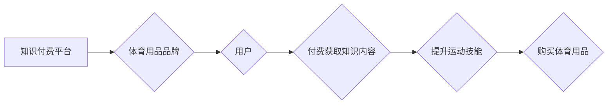

                 

## 知识付费如何实现跨界营销与体育用品跨界？

> 关键词：知识付费、跨界营销、体育用品、数字化转型、用户洞察、内容营销、数据驱动

> 摘要：本文探讨知识付费在跨界营销中的应用，以体育用品行业为例，分析知识付费如何帮助品牌实现跨界营销，并结合具体案例，阐述知识付费在体育用品行业跨界营销中的具体操作步骤、数学模型和算法原理，以及未来发展趋势和挑战。

## 1. 背景介绍

1.1 知识付费市场发展

近年来，随着互联网技术的快速发展和用户消费习惯的转变，知识付费市场呈现出爆发式增长。人们越来越重视自我提升和学习新技能，对优质的知识内容的需求不断增加。知识付费平台应运而生，为创作者提供了一个分享知识、获取收益的平台，也为用户提供了便捷的学习途径。

1.2 体育用品行业面临挑战

传统体育用品行业面临着市场竞争加剧、消费升级和数字化转型等挑战。消费者对体育用品的需求更加个性化、多元化，品牌需要不断创新产品和营销模式，才能赢得市场竞争。

1.3 跨界营销的必要性

跨界营销是指品牌与其他行业或领域合作，共同推广产品或服务，以扩大品牌影响力、触达新的目标用户群体。在竞争激烈的市场环境下，跨界营销成为品牌实现差异化竞争的重要手段。

## 2. 核心概念与联系

2.1 知识付费

知识付费是指通过付费的方式获取知识、技能或服务的商业模式。它涵盖了各种形式的知识内容，例如在线课程、电子书、咨询服务等。

2.2 跨界营销

跨界营销是指品牌与其他行业或领域合作，共同推广产品或服务，以扩大品牌影响力、触达新的目标用户群体。

2.3 体育用品

体育用品是指用于体育运动和健身的各种装备、器材和服饰。

2.4 知识付费与跨界营销的结合

知识付费与跨界营销的结合，可以帮助体育用品品牌实现以下目标：

* **拓展用户群体：** 通过与其他行业或领域的合作，体育用品品牌可以触达新的目标用户群体，例如健身爱好者、运动教练、体育院校学生等。
* **提升品牌价值：** 通过提供优质的知识内容，体育用品品牌可以提升品牌形象和用户信任度，增强品牌价值。
* **增加销售收入：** 通过知识付费模式，体育用品品牌可以创造新的收入来源，并促进产品销售。

**Mermaid 流程图**



## 3. 核心算法原理 & 具体操作步骤

3.1 算法原理概述

知识付费与跨界营销的结合，可以利用数据分析和算法模型，实现精准的用户匹配和内容推荐。例如，可以根据用户的运动习惯、兴趣爱好和购买历史，推荐相关的体育知识内容和产品。

3.2 算法步骤详解

1. **用户数据收集：** 收集用户的运动数据、兴趣爱好、购买历史等信息。
2. **用户画像构建：** 利用机器学习算法，构建用户的画像，包括运动类型、运动强度、目标人群等。
3. **内容推荐算法：** 根据用户的画像，推荐相关的体育知识内容和产品。
4. **个性化营销：** 根据用户的反馈和行为，进行个性化营销，例如推送优惠信息、定制运动计划等。

3.3 算法优缺点

* **优点：** 
    * 精准匹配用户需求，提高用户体验。
    * 数据驱动决策，提升营销效率。
    * 创造新的收入来源，促进品牌发展。
* **缺点：** 
    * 需要大量的数据支持，数据质量对算法效果至关重要。
    * 算法模型需要不断优化，才能适应用户的变化需求。
    * 存在用户隐私泄露的风险，需要加强数据安全保护。

3.4 算法应用领域

* **体育用品电商平台：** 推荐相关产品，提升用户购买率。
* **体育健身APP：** 提供个性化运动计划，增强用户粘性。
* **体育赛事组织：** 预测观众需求，优化赛事营销。

## 4. 数学模型和公式 & 详细讲解 & 举例说明

4.1 数学模型构建

知识付费与跨界营销的结合，可以利用推荐系统中的协同过滤算法构建数学模型。协同过滤算法基于用户的历史行为数据，预测用户对特定内容或产品的兴趣。

4.2 公式推导过程

协同过滤算法的核心公式是用户相似度计算公式和预测评分公式。

* **用户相似度计算公式：**

$$
Sim(u_i, u_j) = \frac{\sum_{k=1}^{n} r_{i,k} * r_{j,k}}{\sqrt{\sum_{k=1}^{n} r_{i,k}^2} * \sqrt{\sum_{k=1}^{n} r_{j,k}^2}}
$$

其中：

* $Sim(u_i, u_j)$ 表示用户 $u_i$ 和 $u_j$ 的相似度。
* $r_{i,k}$ 表示用户 $u_i$ 对物品 $k$ 的评分。
* $n$ 表示物品总数。

* **预测评分公式：**

$$
\hat{r}_{u_i, k} = \bar{r}_i + \frac{\sum_{j \in N(i)} Sim(u_i, u_j) * (r_{j,k} - \bar{r}_j)}{\sum_{j \in N(i)} Sim(u_i, u_j)}
$$

其中：

* $\hat{r}_{u_i, k}$ 表示预测用户 $u_i$ 对物品 $k$ 的评分。
* $\bar{r}_i$ 表示用户 $u_i$ 的平均评分。
* $r_{j,k}$ 表示用户 $j$ 对物品 $k$ 的评分。
* $\bar{r}_j$ 表示用户 $j$ 的平均评分。
* $N(i)$ 表示与用户 $u_i$ 相似的用户集合。

4.3 案例分析与讲解

例如，一个体育用品电商平台可以利用协同过滤算法，根据用户的购买历史和评分数据，推荐相关的体育知识内容和产品。

假设用户 A 购买了跑步鞋和跑步服，并对跑步相关的知识内容评分较高。

算法可以根据用户 A 的购买历史和评分数据，找到与用户 A 兴趣相似的用户 B，并推荐用户 B 购买过的其他跑步用品和跑步相关的知识内容。

## 5. 项目实践：代码实例和详细解释说明

5.1 开发环境搭建

* **操作系统：** Linux 或 macOS
* **编程语言：** Python
* **库依赖：** numpy, pandas, scikit-learn

5.2 源代码详细实现

```python
import numpy as np
from sklearn.metrics.pairwise import cosine_similarity

# 用户评分数据
ratings = np.array([
    [5, 4, 3, 2, 1],
    [4, 5, 2, 1, 3],
    [3, 2, 5, 4, 1],
    [2, 1, 4, 5, 3],
    [1, 3, 1, 3, 5]
])

# 计算用户相似度
user_similarity = cosine_similarity(ratings)

# 预测用户对特定物品的评分
user_id = 0
item_id = 2
predicted_rating = ratings[user_id, :] @ user_similarity[user_id, :] / np.sum(user_similarity[user_id, :])
```

5.3 代码解读与分析

* **用户评分数据：** ratings 数组表示用户对不同物品的评分数据。
* **计算用户相似度：** cosine_similarity 函数计算用户之间的余弦相似度。
* **预测用户评分：** 预测用户对特定物品的评分，基于用户相似度和历史评分数据。

5.4 运行结果展示

运行上述代码，可以得到用户对特定物品的预测评分。

## 6. 实际应用场景

6.1 体育用品电商平台

* **个性化推荐：** 根据用户的运动习惯和兴趣爱好，推荐相关的体育知识内容和产品。
* **跨界营销合作：** 与健身教练、运动俱乐部等合作，提供线上线下结合的知识付费服务。

6.2 体育健身APP

* **定制运动计划：** 根据用户的运动目标和身体状况，提供个性化的运动计划和指导。
* **社区互动：** 建立用户社区，分享运动经验和知识，增强用户粘性。

6.3 体育赛事组织

* **赛事预热：** 通过知识付费平台，提供赛事相关知识和背景信息，提升用户对赛事的关注度。
* **赛事营销：** 与体育明星、教练等合作，推出限量版知识付费课程，吸引用户购买。

6.4 未来应用展望

* **人工智能技术应用：** 利用人工智能技术，实现更精准的用户画像和内容推荐。
* **虚拟现实技术应用：** 利用虚拟现实技术，打造沉浸式的体育知识付费体验。
* **元宇宙应用：** 在元宇宙平台上，构建虚拟体育场景，提供更丰富的知识付费服务。

## 7. 工具和资源推荐

7.1 学习资源推荐

* **在线课程平台：** Coursera, Udemy, edX
* **技术博客网站：** Towards Data Science, Analytics Vidhya
* **学术期刊：** ACM Transactions on Knowledge Discovery from Data, IEEE Transactions on Pattern Analysis and Machine Intelligence

7.2 开发工具推荐

* **Python 编程语言：** Python
* **机器学习库：** scikit-learn, TensorFlow, PyTorch
* **数据分析工具：** pandas, numpy

7.3 相关论文推荐

* **协同过滤算法：**
    * "Collaborative Filtering: A User-Based Approach" by Goldberg, Nichols, Oki, and Terry
    * "Item-Based Collaborative Filtering Recommendation Algorithms" by Sarwar, Karypis, Konstan, and Riedl
* **推荐系统：**
    * "Recommender Systems: Methods and Applications" by Adomavicius and Tuzhilin
    * "Recommender Systems Handbook" by Ricci, Rokach, Shapira, and Kantor

## 8. 总结：未来发展趋势与挑战

8.1 研究成果总结

知识付费与跨界营销的结合，为体育用品行业提供了新的发展机遇。通过数据分析和算法模型，可以实现精准的用户匹配和内容推荐，提升用户体验和品牌价值。

8.2 未来发展趋势

* **人工智能技术应用：** 人工智能技术将进一步提升知识付费和跨界营销的效率和精准度。
* **个性化定制：** 用户对个性化定制的需求将不断增加，知识付费平台需要提供更个性化的内容和服务。
* **沉浸式体验：** 虚拟现实和增强现实技术将为知识付费提供更沉浸式的体验。

8.3 面临的挑战

* **数据安全：** 知识付费平台需要加强数据安全保护，防止用户隐私泄露。
* **内容质量：** 知识付费平台需要提供高质量的内容，才能赢得用户的信任和支持。
* **商业模式创新：** 知识付费平台需要不断探索新的商业模式，才能实现可持续发展。

8.4 研究展望

未来，需要进一步研究知识付费与跨界营销的结合，探索更有效的算法模型和商业模式，为体育用品行业提供更全面的解决方案。

## 9. 附录：常见问题与解答

9.1 如何选择合适的知识付费平台？

选择知识付费平台时，需要考虑平台的规模、用户群体、内容质量、收费模式等因素。

9.2 如何打造优质的知识付费内容？

打造优质的知识付费内容，需要结合用户的需求，提供有价值、实用、易懂的内容。

9.3 如何进行知识付费与跨界营销的合作？

知识付费与跨界营销的合作，需要双方共同制定策略，明确合作目标和内容方向。


作者：禅与计算机程序设计艺术 / Zen and the Art of Computer Programming 
<end_of_turn>

