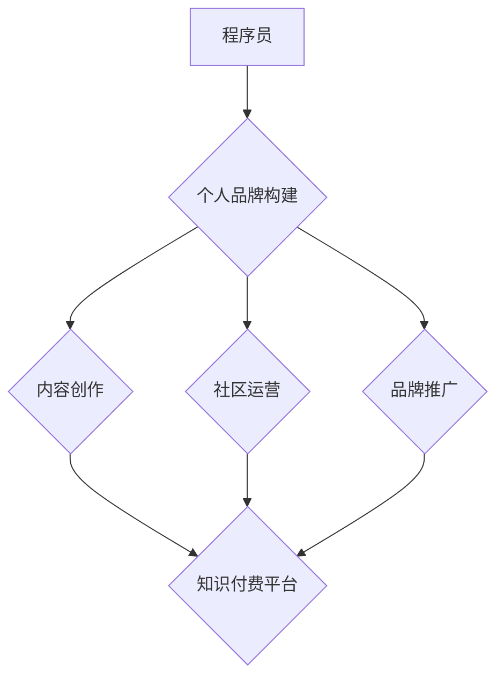

                 

## 知识付费时代程序员的个人品牌打造

> 关键词：程序员，个人品牌，知识付费，技术博客，内容创作，社区运营，品牌推广

> 摘要：随着知识付费时代的到来，程序员个人品牌的打造变得尤为重要。本文将从程序员个人品牌的核心概念、构建策略、内容创作、社区运营、品牌推广等方面进行深入探讨，帮助程序员在知识付费时代获得成功。

## 1. 背景介绍

1.1. 知识付费时代的兴起

互联网时代，信息爆炸，知识成为最宝贵的资源。知识付费模式的兴起，为知识产权的保护和传播提供了新的途径。程序员作为技术人才，拥有丰富的技术经验和知识储备，是知识付费领域的天然主角。

1.2. 程序员个人品牌的价值

个人品牌是个人在特定领域内建立的独特形象和声誉。对于程序员来说，个人品牌可以提升个人价值，扩大影响力，获得更多机会。

* **提升个人价值:** 个人品牌可以展示程序员的技术能力、经验和专业素养，使其在求职、合作、创业等方面更有竞争力。
* **扩大影响力:** 个人品牌可以帮助程序员建立个人影响力，吸引更多关注和粉丝，从而获得更多资源和机会。
* **获得更多机会:** 个人品牌可以为程序员打开更多职业发展路径，例如技术咨询、培训讲师、技术写作等。

## 2. 核心概念与联系

2.1. 程序员个人品牌构建

程序员个人品牌构建是一个系统工程，需要从以下几个方面着手：

* **定位:** 明确个人品牌的核心价值和目标受众。
* **内容创作:** 创作高质量的技术内容，展示个人技术能力和专业素养。
* **社区运营:** 积极参与技术社区，与其他程序员交流学习，建立人脉关系。
* **品牌推广:** 利用各种渠道推广个人品牌，扩大影响力。

2.2. 知识付费与个人品牌

知识付费和个人品牌是相辅相成的关系。个人品牌可以为知识付费提供平台和流量，而知识付费可以进一步提升个人品牌的价值和影响力。



## 3. 核心算法原理 & 具体操作步骤

3.1. 算法原理概述

个人品牌构建是一个迭代的过程，需要不断积累和优化。

* **内容创作:** 创作高质量的技术内容，例如博客文章、视频教程、开源项目等，展示个人技术能力和专业素养。
* **社区运营:** 积极参与技术社区，例如 Stack Overflow、GitHub、微信公众号等，与其他程序员交流学习，建立人脉关系。
* **品牌推广:** 利用各种渠道推广个人品牌，例如社交媒体、技术论坛、线下活动等，扩大影响力。

3.2. 算法步骤详解

* **阶段一：定位和规划**

    * 确定个人品牌的核心价值和目标受众。
    * 制定个人品牌建设的长期规划和短期目标。
    * 选择合适的平台和渠道进行品牌推广。

* **阶段二：内容创作和积累**

    * 创作高质量的技术内容，例如博客文章、视频教程、开源项目等。
    * 坚持定期更新内容，保持用户活跃度。
    * 优化内容的搜索引擎排名，提高内容的曝光率。

* **阶段三：社区运营和人脉积累**

    * 积极参与技术社区，例如 Stack Overflow、GitHub、微信公众号等。
    * 与其他程序员交流学习，建立人脉关系。
    * 分享自己的技术经验和见解，提升个人影响力。

* **阶段四：品牌推广和影响力扩大**

    * 利用社交媒体、技术论坛、线下活动等渠道推广个人品牌。
    * 与其他技术博主、企业合作，扩大品牌影响力。
    * 参与技术会议和活动，提升个人知名度。

3.3. 算法优缺点

* **优点:**

    * 能够有效提升个人价值和影响力。
    * 能够获得更多职业发展机会。
    * 能够建立个人知识体系和品牌资产。

* **缺点:**

    * 需要投入大量时间和精力。
    * 需要不断学习和更新知识。
    * 需要具备一定的营销和推广能力。

3.4. 算法应用领域

* **技术咨询:** 个人品牌可以帮助程序员获得技术咨询的客户。
* **培训讲师:** 个人品牌可以帮助程序员成为技术培训讲师。
* **技术写作:** 个人品牌可以帮助程序员成为技术作家。
* **创业:** 个人品牌可以帮助程序员创业，建立自己的技术公司。

## 4. 数学模型和公式 & 详细讲解 & 举例说明

4.1. 数学模型构建

个人品牌价值可以看作是一个函数，其输入是个人品牌建设的投入，输出是个人品牌带来的收益。

```latex
Brand Value = f(Investment)
```

其中，

* **Brand Value:** 个人品牌价值
* **Investment:** 个人品牌建设的投入，包括时间、精力、金钱等

4.2. 公式推导过程

个人品牌价值的计算是一个复杂的过程，需要考虑多种因素，例如个人能力、行业发展趋势、市场竞争等。

* **个人能力:** 个人能力是个人品牌价值的基础，包括技术能力、沟通能力、人际关系等。
* **行业发展趋势:** 行业发展趋势会影响个人品牌价值，例如新技术、新需求等。
* **市场竞争:** 市场竞争会影响个人品牌价值，例如同行的竞争、客户的接受度等。

4.3. 案例分析与讲解

假设一个程序员投入了 1000 小时的时间和精力进行个人品牌建设，他的技术能力和沟通能力都比较优秀，并且选择了热门的技术领域。根据上述模型，我们可以推断出他的个人品牌价值会相对较高。

## 5. 项目实践：代码实例和详细解释说明

5.1. 开发环境搭建

* **操作系统:** Linux/macOS/Windows
* **编程语言:** Python/JavaScript/Java等
* **工具:** Git、Markdown编辑器、博客平台等

5.2. 源代码详细实现

```python
# 这是一个简单的博客文章示例代码
def create_blog_post(title, content):
    """
    创建博客文章
    """
    print(f"## {title}")
    print(content)

# 示例使用
create_blog_post("个人品牌打造", "这是一个关于个人品牌打造的博客文章...")
```

5.3. 代码解读与分析

* **函数定义:** 代码定义了一个名为 `create_blog_post` 的函数，该函数接受标题和内容两个参数。
* **函数体:** 函数体使用 `print` 语句输出标题和内容。
* **示例使用:** 代码示例使用 `create_blog_post` 函数创建了一个博客文章。

5.4. 运行结果展示

```
## 个人品牌打造
这是一个关于个人品牌打造的博客文章...
```

## 6. 实际应用场景

6.1. 技术博客

程序员可以通过技术博客分享自己的技术经验和见解，建立个人品牌，吸引更多关注和粉丝。

6.2. 社区运营

程序员可以通过积极参与技术社区，与其他程序员交流学习，建立人脉关系，提升个人影响力。

6.3. 知识付费

程序员可以通过知识付费平台，例如 Udemy、Coursera 等，销售自己的技术课程和教程，获得收益。

6.4. 未来应用展望

随着知识付费时代的深入发展，程序员个人品牌将更加重要。未来，程序员个人品牌将更加多元化，例如：

* **垂直领域品牌:** 程序员可以专注于某个特定的技术领域，打造垂直领域的个人品牌。
* **跨平台品牌:** 程序员可以将个人品牌扩展到多个平台，例如博客、社交媒体、视频平台等。
* **社区品牌:** 程序员可以建立自己的技术社区，聚集粉丝，打造社区品牌。

## 7. 工具和资源推荐

7.1. 学习资源推荐

* **在线课程平台:** Udemy、Coursera、edX等
* **技术博客:** CSDN、博客园、Medium等
* **技术社区:** Stack Overflow、GitHub、知乎等

7.2. 开发工具推荐

* **代码编辑器:** VS Code、Sublime Text、Atom等
* **版本控制工具:** Git、GitHub等
* **博客平台:** WordPress、Hexo、Ghost等

7.3. 相关论文推荐

* **The Impact of Personal Branding on Career Success**
* **Building a Personal Brand in the Digital Age**
* **The Role of Social Media in Personal Branding**

## 8. 总结：未来发展趋势与挑战

8.1. 研究成果总结

* 程序员个人品牌建设是一个系统工程，需要从内容创作、社区运营、品牌推广等方面着手。
* 知识付费和个人品牌是相辅相成的关系，可以相互促进。
* 未来，程序员个人品牌将更加多元化，更加注重垂直领域、跨平台和社区品牌。

8.2. 未来发展趋势

* **人工智能:** 人工智能技术将对个人品牌建设产生深远影响，例如自动生成内容、个性化推荐等。
* **元宇宙:** 元宇宙将为个人品牌建设提供新的平台和机会，例如虚拟形象、虚拟社区等。
* **Web3:** Web3 技术将赋予个人品牌更多的自主性和控制权，例如去中心化身份认证、数据所有权等。

8.3. 面临的挑战

* **内容竞争:** 内容竞争日益激烈，程序员需要创作更加高质量、更有价值的内容。
* **平台变革:** 平台规则和算法不断变化，程序员需要及时适应和调整策略。
* **隐私安全:** 个人信息泄露和隐私安全问题日益突出，程序员需要重视数据安全和隐私保护。

8.4. 研究展望

* **个性化品牌建设:** 研究如何利用人工智能技术，为每个程序员提供个性化的品牌建设方案。
* **跨平台品牌整合:** 研究如何将个人品牌整合到多个平台，形成更加完整的品牌体系。
* **品牌价值评估:** 研究如何更加准确地评估个人品牌的价值，为程序员提供更科学的品牌建设指导。

## 9. 附录：常见问题与解答

9.1. 如何确定个人品牌的核心价值？

* 思考自己的技术优势和兴趣爱好。
* 分析目标受众的需求和痛点。
* 结合行业发展趋势，寻找差异化竞争点。

9.2. 如何提升个人品牌的影响力？

* 创作高质量的技术内容，并积极推广。
* 参与技术社区，与其他程序员交流学习。
* 利用社交媒体平台，扩大个人品牌影响力。

9.3. 如何获得知识付费的收益？

* 选择合适的知识付费平台。
* 创作优质的课程和教程。
* 积极推广自己的知识产品。


作者：禅与计算机程序设计艺术 / Zen and the Art of Computer Programming 
<end_of_turn>

