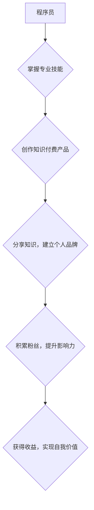

                 

## 知识付费：程序员的个人品牌战略

> 关键词：知识付费、程序员、个人品牌、内容创作、技术社区、在线课程、付费订阅

> 摘要：随着互联网技术的发展，知识付费成为一种新的商业模式，为程序员提供了展示技术能力、分享经验、获取收益的平台。本文将探讨知识付费在程序员领域的应用，分析其核心概念、运作机制、成功案例以及未来发展趋势，并为程序员提供构建个人品牌、打造知识付费产品的策略建议。

## 1. 背景介绍

1.1  互联网时代知识经济的兴起

互联网时代，信息爆炸式增长，知识成为最宝贵的资源。传统知识传播模式面临挑战，知识付费模式应运而生，以其便捷、高效、精准的特点，迅速成为知识传播的新趋势。

1.2  程序员群体对知识付费的需求

程序员作为技术人才，不断学习新技术、提升技能是职业发展的关键。知识付费为程序员提供了获取高质量技术知识、学习实战经验的便捷途径，满足了他们对专业技能提升的迫切需求。

1.3  知识付费平台的蓬勃发展

近年来，国内外涌现出众多知识付费平台，如Udemy、Coursera、慕课网、知识星球等，为程序员提供丰富的学习资源和知识分享平台。

## 2. 核心概念与联系

2.1  知识付费模式

知识付费是指通过付费的方式获取知识、技能、服务等。它打破了传统知识传播的免费模式，建立了知识价值的市场化机制。

2.2  个人品牌建设

个人品牌是指个人在特定领域或行业内建立的独特形象和声誉。对于程序员而言，个人品牌代表着他们的技术能力、专业技能、个人价值观等，是他们在技术社区和职场中的重要资产。

2.3  知识付费与个人品牌的关系

知识付费可以成为程序员构建个人品牌的有效途径。通过创作高质量的知识付费产品，程序员可以展示自己的技术实力、分享经验，积累粉丝，提升个人影响力，从而建立强大的个人品牌。

**Mermaid 流程图**



## 3. 核心算法原理 & 具体操作步骤

3.1  算法原理概述

知识付费的成功取决于以下几个核心算法原理：

* **价值创造算法**: 识别用户需求，创作具有价值、实用性的知识产品。
* **内容传播算法**: 利用社交媒体、技术社区等平台，有效传播知识产品，扩大影响力。
* **用户运营算法**: 构建用户社区，提供优质服务，提升用户粘性，促进用户复购。
* **收益分配算法**: 建立公平合理的收益分配机制，激励内容创作者，保证平台可持续发展。

3.2  算法步骤详解

* **价值创造**: 
    * 调研用户需求，了解市场痛点，确定知识产品方向。
    * 深入研究技术领域，积累专业知识和经验。
    * 打造高质量的知识产品，包括视频课程、电子书、在线文档等。
* **内容传播**: 
    * 利用社交媒体平台，发布知识产品预告、精彩片段、学习心得等内容，吸引用户关注。
    * 积极参与技术社区，分享技术经验，解答用户疑问，建立个人影响力。
    * 与其他内容创作者合作，进行资源互推，扩大知识产品传播范围。
* **用户运营**: 
    * 建立用户社区，提供交流平台，促进用户互动。
    * 定期举办线上线下活动，增强用户粘性。
    * 收集用户反馈，不断优化知识产品和服务。
* **收益分配**: 
    * 选择合适的付费模式，如订阅制、课程购买、会员制度等。
    * 建立公平合理的收益分配机制，保证内容创作者获得应有的回报。

3.3  算法优缺点

* **优点**: 
    * 能够有效满足用户对知识的需求。
    * 为程序员提供了展示技术能力、分享经验、获取收益的平台。
    * 推动了技术知识的传播和普及。
* **缺点**: 
    * 知识产品质量参差不齐，存在信息不对称问题。
    * 用户付费意愿不高，知识付费市场竞争激烈。
    * 平台运营成本高，需要投入大量人力物力。

3.4  算法应用领域

* **在线课程**: 提供编程语言、软件开发、算法设计等方面的课程。
* **技术博客**: 分享技术经验、项目案例、学习心得等内容。
* **付费订阅**: 提供独家技术文档、代码库、技术咨询等服务。
* **技术社区**: 建立技术交流平台，提供技术支持、解答用户疑问。

## 4. 数学模型和公式 & 详细讲解 & 举例说明

4.1  数学模型构建

知识付费平台的收益模型可以抽象为以下数学模型：

```
收益 = 用户数量 * 平均付费金额 * 支付转化率
```

其中：

* 用户数量：平台注册用户数或付费用户数。
* 平均付费金额：用户平均支付的金额。
* 支付转化率：访问平台的用户中付费的用户比例。

4.2  公式推导过程

* 用户数量：可以通过用户增长率、用户留存率等指标进行预测和分析。
* 平均付费金额：可以通过用户付费行为分析、市场调研等方式进行确定。
* 支付转化率：可以通过用户行为分析、营销活动效果评估等方式进行优化。

4.3  案例分析与讲解

假设一个知识付费平台，拥有10000注册用户，其中1000用户付费，平均付费金额为100元，支付转化率为10%。根据上述公式，该平台的收益为：

```
收益 = 1000 * 100 * 0.1 = 10000元
```

## 5. 项目实践：代码实例和详细解释说明

5.1  开发环境搭建

* 语言选择：Python
* 框架选择：Django
* 数据库选择：MySQL

5.2  源代码详细实现

```python
# views.py
from django.shortcuts import render

def index(request):
    return render(request, 'index.html')

# models.py
class Course(models.Model):
    title = models.CharField(max_length=200)
    description = models.TextField()
    price = models.DecimalField(max_digits=6, decimal_places=2)

# urls.py
from django.urls import path
from . import views

urlpatterns = [
    path('', views.index, name='index'),
]
```

5.3  代码解读与分析

* views.py 文件定义了首页视图函数，负责渲染首页模板。
* models.py 文件定义了课程模型，包含课程标题、描述和价格等字段。
* urls.py 文件定义了URL路由，将首页访问请求映射到views.py中的index视图函数。

5.4  运行结果展示

运行上述代码，即可访问知识付费平台的首页，展示课程列表等内容。

## 6. 实际应用场景

6.1  在线编程课程

* 提供编程语言入门、进阶、实战等方面的课程。
* 通过视频讲解、代码练习、项目实战等方式，帮助用户掌握编程技能。

6.2  技术文档订阅

* 提供独家技术文档、代码库、工具包等资源。
* 通过付费订阅的方式，用户可以获得持续更新的技术内容和服务。

6.3  技术咨询服务

* 提供一对一技术咨询服务，帮助用户解决技术难题。
* 通过付费咨询的方式，用户可以获得专业技术人员的指导和帮助。

6.4  未来应用展望

* 知识付费平台将更加注重用户体验，提供个性化学习方案和互动学习模式。
* 知识付费内容将更加丰富多样，涵盖更广泛的技术领域和专业技能。
* 知识付费平台将与其他服务平台融合，形成更加完整的技术生态系统。

## 7. 工具和资源推荐

7.1  学习资源推荐

* **在线学习平台**: Udemy, Coursera, 慕课网, 知识星球
* **技术博客**: CSDN, 知乎, 博客园
* **开源社区**: GitHub, GitLab

7.2  开发工具推荐

* **代码编辑器**: VS Code, Sublime Text, Atom
* **版本控制工具**: Git
* **项目管理工具**: Trello, Jira

7.3  相关论文推荐

* **The Economics of Online Education**
* **The Impact of Online Learning on Student Outcomes**
* **The Future of Knowledge Sharing**

## 8. 总结：未来发展趋势与挑战

8.1  研究成果总结

知识付费为程序员提供了展示技术能力、分享经验、获取收益的平台，推动了技术知识的传播和普及。

8.2  未来发展趋势

* 用户体验优化
* 内容丰富多样化
* 平台生态系统建设

8.3  面临的挑战

* 知识产品质量控制
* 用户付费意愿提升
* 平台运营成本控制

8.4  研究展望

* 探索更有效的知识付费模式
* 研究用户行为和学习心理
* 打造更加智能化、个性化的知识付费平台

## 9. 附录：常见问题与解答

* **如何打造优质的知识付费产品？**

   * 深入了解用户需求，提供有价值、实用性的内容。
   * 采用多种形式呈现知识，如视频、文字、音频等。
   * 保证知识内容的准确性、时效性和原创性。

* **如何推广我的知识付费产品？**

   * 利用社交媒体平台，发布预告、精彩片段、学习心得等内容。
   * 积极参与技术社区，分享经验、解答用户疑问。
   * 与其他内容创作者合作，进行资源互推。

* **如何获得稳定的知识付费收入？**

   * 建立用户社区，提供优质服务，提升用户粘性。
   * 定期举办线上线下活动，增强用户参与度。
   * 探索多元化收入模式，如会员制度、广告合作等。


作者：禅与计算机程序设计艺术 / Zen and the Art of Computer Programming<end_of_turn>

