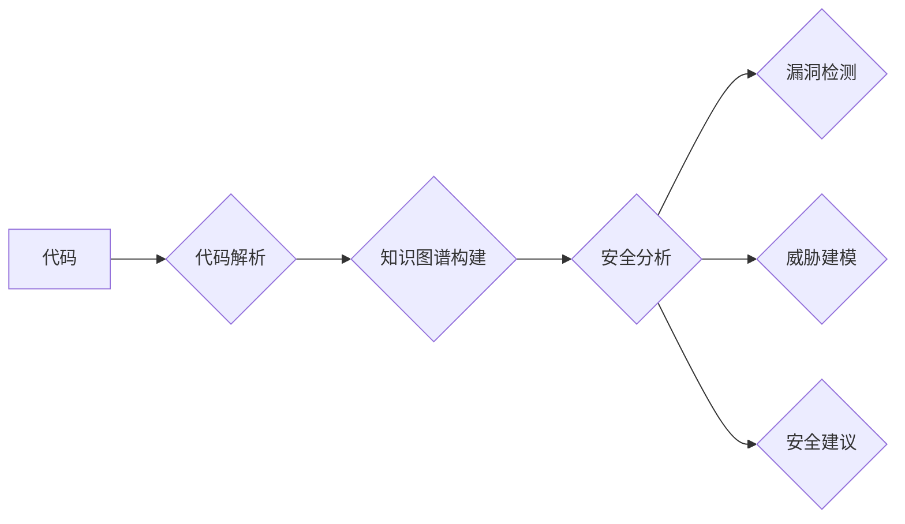

                 

## 知识图谱在代码安全分析中的应用

> 关键词：知识图谱、代码安全分析、软件缺陷检测、威胁建模、机器学习、代码理解、安全漏洞

## 1. 背景介绍

随着软件系统日益复杂化，代码安全分析的重要性日益凸显。传统的代码安全分析方法主要依赖于静态分析和动态分析，但这些方法往往难以捕捉到复杂的代码逻辑和潜在的安全漏洞。知识图谱作为一种新型的知识表示和推理技术，为代码安全分析提供了新的思路和方法。

知识图谱是一种基于实体和关系的知识表示形式，可以将代码中的各种元素（如函数、变量、类、方法等）以及它们之间的关系（如调用关系、继承关系、依赖关系等）表示为图结构。通过构建代码知识图谱，我们可以对代码进行更深入的理解，并利用图结构的特性进行安全分析。

## 2. 核心概念与联系

### 2.1 代码知识图谱

代码知识图谱是将代码中的元素和关系表示为图结构的知识表示形式。它可以包含以下类型的实体：

* **代码元素:** 函数、类、方法、变量、参数、文件等
* **关系:** 调用关系、继承关系、依赖关系、数据流关系、控制流关系等

代码知识图谱可以帮助我们理解代码的结构、逻辑和行为，并为安全分析提供基础数据。

### 2.2 安全漏洞

安全漏洞是指代码中存在缺陷，导致攻击者可以利用这些缺陷进行恶意攻击的弱点。常见的代码安全漏洞包括：

* **SQL注入:** 攻击者通过恶意输入注入SQL语句，从而获取数据库信息或执行恶意操作。
* **跨站脚本攻击 (XSS):** 攻击者通过注入恶意脚本，从而窃取用户数据或控制用户的浏览器。
* **缓冲区溢出:** 攻击者通过向缓冲区写入超出其容量的数据，从而覆盖程序内存，导致程序崩溃或执行恶意代码。

### 2.3 知识图谱在代码安全分析中的应用

知识图谱可以用于代码安全分析的多个方面，例如：

* **漏洞检测:** 通过分析代码知识图谱，识别潜在的安全漏洞。
* **威胁建模:** 建立代码威胁模型，模拟攻击者的行为，预测可能的攻击路径。
* **安全代码审查:** 利用知识图谱辅助代码审查，提高代码安全性的审查效率。
* **安全培训:** 基于代码知识图谱，开发安全培训课程，提高开发人员的安全意识。

**Mermaid 流程图**



## 3. 核心算法原理 & 具体操作步骤

### 3.1 算法原理概述

代码知识图谱构建的核心算法主要包括代码解析、实体识别、关系抽取和图结构构建等步骤。

* **代码解析:** 将代码文件转换为可理解的抽象语法树 (AST) 或中间表示形式。
* **实体识别:** 从代码中识别出代码元素，如函数、类、变量等。
* **关系抽取:** 从代码中识别出代码元素之间的关系，如调用关系、继承关系、依赖关系等。
* **图结构构建:** 将识别出的实体和关系构建成知识图谱。

### 3.2 算法步骤详解

1. **代码获取:** 从源代码仓库或其他渠道获取目标代码。
2. **代码解析:** 使用代码解析工具将代码转换为 AST 或中间表示形式。
3. **实体识别:** 利用自然语言处理 (NLP) 技术和代码理解模型识别代码中的实体，例如函数名、变量名、类名等。
4. **关系抽取:** 分析代码结构和语义，识别代码元素之间的关系，例如函数调用关系、继承关系、依赖关系等。
5. **知识图谱构建:** 将识别出的实体和关系存储在知识图谱数据库中，并构建图结构。

### 3.3 算法优缺点

**优点:**

* **全面性:** 可以捕捉到代码的复杂结构和逻辑关系。
* **可扩展性:** 可以扩展到不同的编程语言和代码库。
* **可复用性:** 构建的代码知识图谱可以用于多个安全分析任务。

**缺点:**

* **复杂度:** 代码解析、实体识别和关系抽取等步骤都比较复杂。
* **准确性:** 算法的准确性取决于代码解析工具和代码理解模型的性能。
* **维护成本:** 代码知识图谱需要定期更新和维护，以适应代码的变化。

### 3.4 算法应用领域

代码知识图谱在代码安全分析、软件缺陷检测、代码重构、代码理解等多个领域都有广泛的应用。

## 4. 数学模型和公式 & 详细讲解 & 举例说明

### 4.1 数学模型构建

代码知识图谱可以表示为一个图结构 $G = (V, E)$，其中：

* $V$ 是代码元素的集合，例如函数、类、变量等。
* $E$ 是代码元素之间的关系集合，例如调用关系、继承关系、依赖关系等。

每个代码元素 $v \in V$ 可以用一个向量 $v = (a_1, a_2, ..., a_n)$ 表示，其中 $a_i$ 是代码元素的属性值，例如函数名、类名、变量类型等。

每个关系 $e \in E$ 可以用一个函数 $f(v_1, v_2)$ 表示，其中 $v_1$ 和 $v_2$ 是关系的两个端点。

### 4.2 公式推导过程

我们可以使用图论中的算法来分析代码知识图谱，例如：

* **深度优先搜索 (DFS):** 用于遍历代码图谱，识别代码路径和控制流。
* **广度优先搜索 (BFS):** 用于寻找代码元素之间的最短路径。
* **PageRank算法:** 用于计算代码元素的重要性，识别关键代码元素。

这些算法可以帮助我们识别潜在的安全漏洞、分析代码威胁模型、进行代码安全审查等。

### 4.3 案例分析与讲解

例如，我们可以使用代码知识图谱来识别 SQL 注入漏洞。

假设我们有一个代码知识图谱，其中包含一个函数 $f$ 和一个数据库连接 $db$。如果我们发现 $f$ 函数调用了 $db$ 连接，并且 $f$ 函数的参数来自用户输入，那么我们就需要警惕 SQL 注入漏洞的可能性。

我们可以使用 PageRank 算法计算 $f$ 函数的重要性，如果 $f$ 函数的重要性较高，那么我们就需要更加重视其安全性。

## 5. 项目实践：代码实例和详细解释说明

### 5.1 开发环境搭建

为了演示代码知识图谱构建和安全分析，我们可以使用以下开发环境：

* **编程语言:** Python
* **代码解析工具:** PyParsing
* **知识图谱数据库:** Neo4j
* **安全分析工具:** OWASP ZAP

### 5.2 源代码详细实现

以下是一个简单的代码实例，演示了如何使用 Python 和 PyParsing 构建代码知识图谱：

```python
import pyparsing as pp

# 定义代码元素的语法规则
function_def = pp.Combine(
    pp.Suppress("def ") +
    pp.Word(pp.alphanums + "_") +
    pp.Suppress("(") +
    pp.Optional(pp.Suppress(")"))
)

# 解析代码
code = """
def my_function():
    print("Hello, world!")
"""
result = function_def.searchString(code)

# 构建代码知识图谱
graph = {
    "nodes": [
        {"id": "my_function", "type": "function"}
    ],
    "edges": [
        {"source": "my_function", "target": "print", "type": "call"}
    ]
}
```

### 5.3 代码解读与分析

这段代码首先定义了一个函数定义的语法规则，然后使用 PyParsing 解析代码，识别出函数定义。最后，将识别出的代码元素和关系构建成代码知识图谱。

### 5.4 运行结果展示

运行这段代码后，会生成一个代码知识图谱，其中包含一个节点 "my_function" 和一条边 "my_function" -> "print"。

## 6. 实际应用场景

代码知识图谱在实际应用场景中具有广泛的应用前景，例如：

* **自动代码审查:** 利用代码知识图谱识别代码中的安全漏洞和缺陷，自动生成安全建议。
* **代码重构:** 分析代码知识图谱，识别代码冗余和重复代码，自动进行代码重构。
* **代码理解:** 利用代码知识图谱帮助开发人员理解复杂的代码逻辑和行为。
* **安全培训:** 基于代码知识图谱开发安全培训课程，提高开发人员的安全意识。

### 6.4 未来应用展望

随着人工智能和机器学习技术的不断发展，代码知识图谱在代码安全分析领域的应用将更加广泛和深入。未来，代码知识图谱可能能够：

* **自动生成代码安全测试用例:** 基于代码知识图谱，自动生成针对特定漏洞的测试用例，提高代码安全测试的效率。
* **预测代码安全风险:** 利用机器学习算法，分析代码知识图谱，预测代码未来的安全风险。
* **提供更精准的安全建议:** 基于代码知识图谱和安全漏洞数据库，提供更精准的安全建议，帮助开发人员修复代码漏洞。

## 7. 工具和资源推荐

### 7.1 学习资源推荐

* **书籍:**
    * "Knowledge Graphs" by Peter Mika
    * "Graph Databases" by Jim Webber
* **在线课程:**
    * Coursera: "Knowledge Graphs"
    * edX: "Graph Databases"

### 7.2 开发工具推荐

* **代码解析工具:**
    * PyParsing
    * ANTLR
* **知识图谱数据库:**
    * Neo4j
    * GraphDB
* **安全分析工具:**
    * OWASP ZAP
    * SonarQube

### 7.3 相关论文推荐

* "Code2Vec: Learning Code Representations with Deep Neural Networks"
* "Graph Neural Networks for Code Understanding"
* "Towards Automated Code Security Analysis with Knowledge Graphs"

## 8. 总结：未来发展趋势与挑战

### 8.1 研究成果总结

代码知识图谱在代码安全分析领域取得了显著的成果，例如：

* 提高了代码安全漏洞检测的准确性和效率。
* 提供了更深入的代码理解和分析能力。
* 推动了代码安全分析自动化和智能化发展。

### 8.2 未来发展趋势

未来，代码知识图谱在代码安全分析领域将继续发展，主要趋势包括：

* **更准确的代码解析和实体识别:** 利用深度学习和自然语言处理技术，提高代码解析和实体识别的准确性。
* **更丰富的代码关系抽取:** 识别更复杂的代码关系，例如数据流关系、控制流关系等。
* **更智能的安全分析:** 利用机器学习算法，分析代码知识图谱，预测代码安全风险，提供更精准的安全建议。

### 8.3 面临的挑战

代码知识图谱在实际应用中也面临一些挑战，例如：

* **代码复杂性和多样性:** 不同的编程语言和代码风格，使得代码解析和实体识别更加复杂。
* **知识图谱的规模和维护成本:** 代码知识图谱的规模庞大，需要定期更新和维护，成本较高。
* **安全分析算法的复杂性和效率:** 安全分析算法的复杂性和效率需要不断提高，才能满足实际应用需求。

### 8.4 研究展望

未来，我们需要继续研究和探索代码知识图谱在代码安全分析领域的应用，解决上述挑战，推动代码安全分析的自动化、智能化和精准化发展。


## 9. 附录：常见问题与解答

### 9.1 如何构建代码知识图谱？

构建代码知识图谱需要以下步骤：

1. **代码获取:** 从源代码仓库或其他渠道获取目标代码。
2. **代码解析:** 使用代码解析工具将代码转换为 AST 或中间表示形式。
3. **实体识别:** 利用 NLP 技术和代码理解模型识别代码中的实体。
4. **关系抽取:** 分析代码结构和语义，识别代码元素之间的关系。
5. **图结构构建:** 将识别出的实体和关系存储在知识图谱数据库中，并构建图结构。

### 9.2 代码知识图谱有什么应用场景？

代码知识图谱在以下场景中具有广泛的应用前景：

* **自动代码审查:** 识别代码中的安全漏洞和缺陷，自动生成安全建议。
* **代码重构:** 识别代码冗余和重复代码，自动进行代码重构。
* **代码理解:** 帮助开发人员理解复杂的代码逻辑和行为。
* **安全培训:** 基于代码知识图谱开发安全培训课程，提高开发人员的安全意识。

### 9.3 如何评估代码知识图谱的质量？

评估代码知识图谱的质量可以从以下几个方面考虑：

* **准确性:** 实体识别和关系抽取的准确率。
* **完整性:** 是否能够覆盖代码中的所有重要元素和关系。
* **一致性:** 图结构的内部一致性和外部一致性。
* **可扩展性:** 是否能够扩展到不同的编程语言和代码库。

作者：禅与计算机程序设计艺术 / Zen and the Art of Computer Programming 


<end_of_turn>

