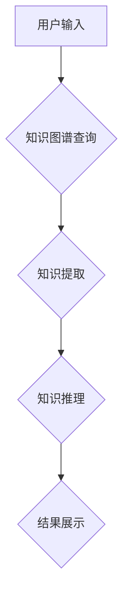

                 

## 知识工具要提高效率和用户体验

> 关键词：知识工具、效率提升、用户体验、人工智能、数据分析、知识图谱、自然语言处理

> 摘要：本文探讨了知识工具在提高效率和用户体验方面的关键作用。从核心概念和算法原理到实际应用场景，我们深入分析了知识工具的构建和应用，并展望了未来发展趋势。通过对人工智能、数据分析、知识图谱和自然语言处理等技术的应用，知识工具将深刻改变我们获取、处理和利用知识的方式，为用户提供更加便捷、高效和智能化的体验。

## 1. 背景介绍

在信息爆炸的时代，海量数据和信息涌现，如何高效地获取、处理和利用知识成为一个重大挑战。传统的信息检索方式往往局限于关键词匹配，难以满足用户对复杂知识的探索需求。知识工具应运而生，旨在通过人工智能、数据分析和知识图谱等技术，将分散的知识点连接起来，构建一个可理解、可导航的知识网络，从而帮助用户更高效地获取和利用知识。

知识工具的应用领域广泛，涵盖教育、科研、商业、医疗等各个领域。例如，在教育领域，知识工具可以帮助学生理解复杂的课本内容，提供个性化的学习路径；在科研领域，知识工具可以帮助研究人员快速查阅相关文献，发现新的研究方向；在商业领域，知识工具可以帮助企业分析市场趋势，制定更有效的营销策略。

## 2. 核心概念与联系

### 2.1 知识图谱

知识图谱是一种基于知识表示的数据库，它将知识表示为实体和关系的网络结构。实体代表现实世界中的事物，关系代表事物之间的联系。知识图谱可以存储和推理各种类型的知识，例如事实、概念、规则等。

### 2.2 自然语言处理

自然语言处理（NLP）是人工智能的一个分支，它致力于使计算机能够理解和处理人类语言。NLP技术可以用于文本分析、机器翻译、语音识别等领域。

### 2.3 人工智能

人工智能（AI）是指使机器能够像人类一样学习、 reasoning 和解决问题的能力。人工智能技术可以用于知识工具的多个方面，例如知识提取、知识推理、个性化推荐等。

**Mermaid 流程图**



## 3. 核心算法原理 & 具体操作步骤

### 3.1 算法原理概述

知识工具的核心算法原理包括知识图谱构建、知识提取、知识推理和知识推荐等。

* **知识图谱构建:** 知识图谱构建算法通常采用文本挖掘、结构化数据抽取和人工标注等方法，从各种数据源中提取知识，并将其表示为实体和关系的网络结构。

* **知识提取:** 知识提取算法利用自然语言处理技术，从文本中识别出实体和关系，并将其转换为知识图谱中的节点和边。

* **知识推理:** 知识推理算法利用知识图谱中的关系和规则，进行逻辑推理，推导出新的知识或结论。

* **知识推荐:** 知识推荐算法根据用户的兴趣和行为，从知识图谱中推荐相关的知识或资源。

### 3.2 算法步骤详解

以知识提取为例，其具体操作步骤如下：

1. **文本预处理:** 对输入文本进行清洗、分词、词性标注等预处理操作，以便于后续的知识提取。
2. **实体识别:** 利用命名实体识别（NER）算法，识别出文本中的实体，例如人名、地名、机构名等。
3. **关系抽取:** 利用关系抽取算法，识别出实体之间的关系，例如“工作于”、“出生于”、“拥有”等。
4. **知识表示:** 将提取出的实体和关系转换为知识图谱中的节点和边，形成知识图谱。

### 3.3 算法优缺点

**优点:**

* 能够从文本中提取结构化知识，提高知识的利用效率。
* 可以进行知识推理和知识发现，挖掘隐藏的知识关系。
* 可以个性化推荐知识，满足用户的个性化需求。

**缺点:**

* 知识提取算法的准确率仍然存在一定局限性，需要不断改进。
* 知识图谱的构建和维护需要大量的资源和人力投入。
* 知识推理算法的复杂度较高，需要强大的计算能力。

### 3.4 算法应用领域

知识提取算法广泛应用于各个领域，例如：

* **信息检索:** 提高信息检索的准确性和效率。
* **问答系统:** 构建更智能的问答系统，能够理解用户的自然语言问题。
* **文本摘要:** 自动生成文本摘要，提取文本的关键信息。
* **知识管理:** 建立知识库，管理和共享组织知识。

## 4. 数学模型和公式 & 详细讲解 & 举例说明

### 4.1 数学模型构建

知识图谱可以表示为一个图结构，其中节点代表实体，边代表关系。可以使用图论中的概念和算法来分析和推理知识图谱。

**实体:**

* $e_i$ 代表第 $i$ 个实体。

**关系:**

* $r_j$ 代表第 $j$ 个关系。

**知识图谱:**

* $G = (E, R, T)$，其中 $E$ 是实体集合，$R$ 是关系集合，$T$ 是实体和关系之间的连接关系。

### 4.2 公式推导过程

**路径查询:**

给定两个实体 $e_i$ 和 $e_j$，以及一个关系序列 $r_1, r_2, ..., r_k$，路径查询问题是判断是否存在一条从 $e_i$ 到 $e_j$ 的路径，其关系序列为 $r_1, r_2, ..., r_k$。

**公式:**

* $Path(e_i, e_j, r_1, r_2, ..., r_k) = True$，如果存在一条从 $e_i$ 到 $e_j$ 的路径，其关系序列为 $r_1, r_2, ..., r_k$。
* $Path(e_i, e_j, r_1, r_2, ..., r_k) = False$，否则。

**举例说明:**

假设知识图谱中存在以下关系：

* $e_1$ 与 $e_2$ 关系为 $r_1$
* $e_2$ 与 $e_3$ 关系为 $r_2$

则 $Path(e_1, e_3, r_1, r_2) = True$。

### 4.3 案例分析与讲解

知识图谱可以用于分析和推理各种类型的知识关系。例如，可以利用知识图谱分析疾病和药物之间的关系，发现新的药物治疗方案。

**案例:**

假设知识图谱中包含了以下知识：

* 实体：疾病、药物、症状
* 关系：治疗、引起、缓解

通过分析知识图谱，可以发现某些药物可以治疗某些疾病，某些疾病会导致某些症状。

**讲解:**

通过分析知识图谱，可以发现新的药物治疗方案，例如，如果发现药物 $A$ 可以治疗疾病 $B$，而疾病 $B$ 可以引起症状 $C$，那么可以推断出药物 $A$ 可以缓解症状 $C$。

## 5. 项目实践：代码实例和详细解释说明

### 5.1 开发环境搭建

* **操作系统:** Ubuntu 20.04 LTS
* **编程语言:** Python 3.8
* **库依赖:**

```
pip install rdflib networkx spacy
```

### 5.2 源代码详细实现

```python
# 知识图谱构建示例代码

from rdflib import Graph, Literal, URIRef
from rdflib.namespace import RDF, RDFS

# 创建知识图谱
g = Graph()

# 添加实体
g.add((URIRef("http://example.org/person/alice"), RDF.type, URIRef("http://example.org/schema/Person")))
g.add((URIRef("http://example.org/person/bob"), RDF.type, URIRef("http://example.org/schema/Person")))

# 添加关系
g.add((URIRef("http://example.org/person/alice"), URIRef("http://example.org/schema/knows"), URIRef("http://example.org/person/bob")))

# 查询知识图谱
for s, p, o in g.triples((URIRef("http://example.org/person/alice"), None, None)):
    print(f"{s} {p} {o}")
```

### 5.3 代码解读与分析

* 代码首先创建了一个知识图谱对象 `g`。
* 然后，代码添加了两个实体和一个关系。
* 最后，代码查询了知识图谱，并打印出所有三元组。

### 5.4 运行结果展示

```
http://example.org/person/alice http://www.w3.org/1999/02/22-rdf-syntax-ns#type http://example.org/schema/Person
http://example.org/person/alice http://example.org/schema/knows http://example.org/person/bob
```

## 6. 实际应用场景

### 6.1 教育领域

* **个性化学习:** 根据学生的学习进度和兴趣，推荐个性化的学习资源和学习路径。
* **智能辅导:** 利用知识图谱和自然语言处理技术，构建智能辅导系统，帮助学生解决学习问题。
* **知识发现:** 帮助学生发现知识之间的联系，加深对知识的理解。

### 6.2 科研领域

* **文献检索:** 快速检索相关文献，发现新的研究方向。
* **知识管理:** 建立知识库，管理和共享科研成果。
* **数据分析:** 利用知识图谱分析科研数据，发现隐藏的知识规律。

### 6.3 商业领域

* **市场分析:** 分析市场趋势，制定更有效的营销策略。
* **客户服务:** 利用知识图谱构建智能客服系统，提高客户服务效率。
* **产品推荐:** 根据用户的兴趣和行为，推荐相关的产品。

### 6.4 未来应用展望

随着人工智能、数据分析和知识图谱技术的不断发展，知识工具将应用于更多领域，例如医疗、法律、金融等。未来，知识工具将更加智能化、个性化和便捷化，为用户提供更加丰富的知识体验。

## 7. 工具和资源推荐

### 7.1 学习资源推荐

* **书籍:**

    * 《知识图谱》
    * 《人工智能》
    * 《自然语言处理》

* **在线课程:**

    * Coursera: Knowledge Graphs Specialization
    * edX: Artificial Intelligence
    * Udacity: Natural Language Processing Nanodegree

### 7.2 开发工具推荐

* **知识图谱构建工具:**

    * Apache Jena
    * Stardog
    * GraphDB

* **自然语言处理工具:**

    * spaCy
    * NLTK
    * Stanford CoreNLP

### 7.3 相关论文推荐

* **知识图谱:**

    * “A Survey on Knowledge Graph Embedding”
    * “Knowledge Graph Construction: A Survey”

* **自然语言处理:**

    * “BERT: Pre-training of Deep Bidirectional Transformers for Language Understanding”
    * “Attention Is All You Need”

## 8. 总结：未来发展趋势与挑战

### 8.1 研究成果总结

知识工具在提高效率和用户体验方面取得了显著成果。人工智能、数据分析和知识图谱技术的不断发展，为知识工具的构建和应用提供了强大的技术支撑。

### 8.2 未来发展趋势

* **更加智能化:** 利用深度学习等先进算法，构建更加智能的知识工具，能够理解和推理更加复杂的知识关系。
* **更加个性化:** 根据用户的个性化需求，提供更加个性化的知识服务。
* **更加跨领域:** 将知识工具应用于更多领域，例如医疗、法律、金融等。

### 8.3 面临的挑战

* **知识获取和表示:** 如何从海量数据中获取高质量的知识，并将其有效地表示为知识图谱仍然是一个挑战。
* **知识推理和发现:** 如何构建更加强大的知识推理和知识发现算法，挖掘隐藏的知识规律仍然是一个难题。
* **数据隐私和安全:** 如何保护用户数据隐私和安全，是知识工具应用中需要解决的重要问题。

### 8.4 研究展望

未来，知识工具将继续朝着更加智能化、个性化和跨领域的方向发展。研究人员将继续探索新的算法和技术，以解决知识获取、表示、推理和发现等方面的挑战，为用户提供更加便捷、高效和智能化的知识体验。

## 9. 附录：常见问题与解答

**问题 1:** 知识工具与搜索引擎有什么区别？

**解答:** 搜索引擎主要通过关键词匹配来检索信息，而知识工具则通过构建知识图谱，理解知识之间的关系，从而提供更加深入和全面的知识服务。

**问题 2:** 如何构建一个知识图谱？

**解答:** 构建知识图谱需要多种技术手段，例如文本挖掘、结构化数据抽取和人工标注等。

**问题 3:** 知识工具有哪些应用场景？

**解答:** 知识工具的应用场景广泛，例如教育、科研、商业、医疗等。


作者：禅与计算机程序设计艺术 / Zen and the Art of Computer Programming<end_of_turn>

