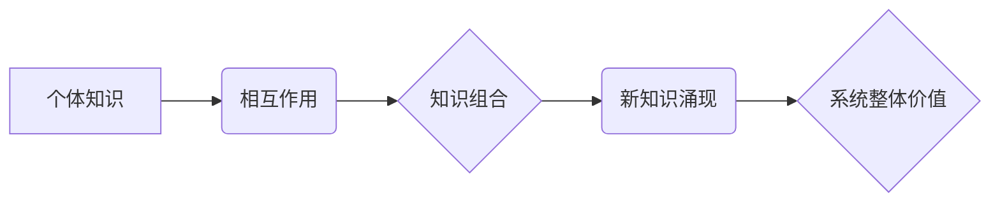

                 

## 知识的涌现性：整体大于部分之和

> 关键词：知识涌现、复杂系统、人工智能、机器学习、网络效应、协同进化

> 摘要：本文探讨了知识涌现现象，即复杂系统中知识的非线性生成和积累，并分析了其在人工智能、机器学习等领域的重要意义。通过介绍核心概念、算法原理、数学模型以及实际应用场景，阐述了知识涌现的机制和特点，并展望了其未来发展趋势和挑战。

## 1. 背景介绍

在信息时代，知识已成为最宝贵的资源。然而，知识的获取和积累并非简单的线性累积，而是呈现出一种非线性的涌现性。知识涌现是指在复杂系统中，通过相互作用和协同进化，从个体知识的组合中产生出新的、更高级的知识，这种新知识的价值远大于其组成部分的简单叠加。

这种现象在自然界中随处可见，例如生物进化、生态系统形成、社会文化发展等。在技术领域，知识涌现也扮演着至关重要的角色。例如，开源软件社区的协同开发，互联网上的知识共享和传播，以及人工智能领域的深度学习算法，都体现了知识涌现的本质。

## 2. 核心概念与联系

知识涌现的核心概念包括：

* **复杂系统:** 由众多相互作用的个体组成，个体之间存在着非线性关系，系统整体的行为难以通过简单地分析个体行为来预测。
* **协同进化:** 个体之间通过相互作用和竞争，共同演化，最终形成一个更加复杂、更加适应环境的系统。
* **网络效应:** 系统中个体之间的连接和交互会产生放大效应，使得系统整体的价值远大于其组成部分的简单总和。

**Mermaid 流程图:**



## 3. 核心算法原理 & 具体操作步骤

### 3.1  算法原理概述

知识涌现算法通常基于复杂系统理论和网络科学，旨在模拟个体之间的相互作用和协同进化过程，从而实现知识的非线性生成和积累。常见的算法包括：

* **人工蜂群算法 (ABC):** 借鉴蜂群觅食行为，模拟个体之间的协同搜索和信息共享，找到最优的知识组合。
* **粒子群优化算法 (PSO):** 模拟粒子群的运动轨迹，通过个体之间的相互吸引和竞争，找到最优的知识结构。
* **遗传算法 (GA):** 借鉴生物进化机制，通过选择、交叉和变异操作，不断优化知识组合，最终生成更优的知识结构。

### 3.2  算法步骤详解

以人工蜂群算法为例，其具体操作步骤如下：

1. **初始化种群:** 生成初始的个体知识库，每个个体代表一种可能的知识组合。
2. **评估适应度:** 根据知识组合的质量和价值，对每个个体进行评估，计算其适应度值。
3. **选择和交叉:** 根据适应度值，选择具有较高适应度的个体进行交叉操作，生成新的个体知识库。
4. **变异:** 对部分个体进行随机变异操作，增加算法的探索能力。
5. **迭代更新:** 重复步骤2-4，直到达到预设的迭代次数或收敛条件。

### 3.3  算法优缺点

**优点:**

* 能够有效模拟复杂系统的涌现性，找到非线性关系中的最佳解。
* 具有较强的鲁棒性，能够处理不确定性和噪声信息。
* 能够处理高维、复杂的问题。

**缺点:**

* 计算复杂度较高，需要大量的计算资源。
* 算法参数的设置对结果影响较大，需要进行仔细的调优。
* 难以保证算法的全局最优解。

### 3.4  算法应用领域

知识涌现算法广泛应用于以下领域：

* **人工智能:** 知识表示、推理、机器学习、自然语言处理等。
* **数据挖掘:** 模式识别、异常检测、关联规则挖掘等。
* **优化问题:** 资源分配、路径规划、调度优化等。
* **生物信息学:** 基因组分析、蛋白质结构预测等。

## 4. 数学模型和公式 & 详细讲解 & 举例说明

### 4.1  数学模型构建

知识涌现过程可以抽象为一个复杂网络模型，其中节点代表个体知识，边代表知识之间的关联关系。网络的拓扑结构和节点之间的连接强度会影响知识的传播和融合，从而影响知识涌现的结果。

### 4.2  公式推导过程

可以利用图论和网络科学中的相关公式来描述知识网络的结构和演化过程，例如：

* **度分布:** 描述网络中节点的连接数分布。
* **聚类系数:** 描述网络中节点的聚集程度。
* **路径长度:** 描述网络中节点之间的平均距离。

这些指标可以用来量化知识网络的复杂性和连接性，从而分析知识涌现的机制。

### 4.3  案例分析与讲解

例如，在社交网络中，用户之间的连接关系可以看作是知识网络。用户之间的互动和信息传播会形成新的知识结构，并影响用户之间的认知和行为。通过分析社交网络的度分布、聚类系数和路径长度等指标，可以了解知识在社交网络中的传播模式和影响力。

## 5. 项目实践：代码实例和详细解释说明

### 5.1  开发环境搭建

可以使用 Python 语言和相关库来实现知识涌现算法的开发。例如，可以使用 NetworkX 库来构建和分析知识网络，可以使用 Scikit-learn 库来进行机器学习和数据挖掘。

### 5.2  源代码详细实现

```python
import networkx as nx

# 创建知识网络
G = nx.Graph()
# 添加节点
G.add_nodes_from(['知识1', '知识2', '知识3', '知识4'])
# 添加边
G.add_edges_from([('知识1', '知识2'), ('知识2', '知识3'), ('知识3', '知识4')])

# 计算度分布
degree_distribution = nx.degree_histogram(G)
print(degree_distribution)

# 计算聚类系数
clustering_coefficient = nx.average_clustering(G)
print(clustering_coefficient)
```

### 5.3  代码解读与分析

这段代码首先创建了一个知识网络，并添加了节点和边。然后，使用 NetworkX 库计算了网络的度分布和聚类系数，这些指标可以用来量化知识网络的复杂性和连接性。

### 5.4  运行结果展示

运行这段代码后，会输出网络的度分布和聚类系数，这些结果可以帮助我们了解知识网络的结构和特性。

## 6. 实际应用场景

### 6.1  人工智能领域

* **知识图谱构建:** 利用知识涌现算法从海量文本数据中提取知识，构建知识图谱，为人工智能应用提供知识基础。
* **机器学习模型优化:** 通过知识涌现，优化机器学习模型的参数和结构，提高模型的性能和泛化能力。
* **自然语言理解:** 利用知识涌现，理解自然语言中的语义关系和知识结构，提高自然语言处理的准确性和效率。

### 6.2  其他领域

* **药物研发:** 利用知识涌现，从生物医学文献中提取药物研发相关知识，加速药物研发过程。
* **金融风险管理:** 利用知识涌现，分析金融市场数据，识别潜在的风险和机会。
* **城市规划:** 利用知识涌现，分析城市数据，优化城市规划和管理。

### 6.4  未来应用展望

随着人工智能和数据科学的发展，知识涌现技术将有更广泛的应用场景，例如：

* **个性化教育:** 根据学生的学习情况，利用知识涌现技术生成个性化的学习内容和路径。
* **智能医疗:** 利用知识涌现，分析患者的医疗数据，提供个性化的诊断和治疗方案。
* **自动驾驶:** 利用知识涌现，构建自动驾驶系统的知识库，提高自动驾驶的安全性、可靠性和智能性。

## 7. 工具和资源推荐

### 7.1  学习资源推荐

* **书籍:**
    * 《复杂系统》 - 约翰·霍尔顿
    * 《网络科学》 - 杰弗里·萨克斯
    * 《人工智能：现代方法》 - Stuart Russell 和 Peter Norvig
* **在线课程:**
    * Coursera: 复杂系统
    * edX: 网络科学
    * Udacity: 深度学习

### 7.2  开发工具推荐

* **Python:** 
    * NetworkX: 图论和网络分析库
    * Scikit-learn: 机器学习库
    * TensorFlow: 深度学习库
* **其他工具:**
    * Gephi: 图像可视化工具
    * Cytoscape: 生物网络分析工具

### 7.3  相关论文推荐

* **Emergence of Complex Systems** - John Holland
* **The Structure and Dynamics of Networks** - Albert-László Barabási
* **Deep Learning** - Ian Goodfellow, Yoshua Bengio, and Aaron Courville

## 8. 总结：未来发展趋势与挑战

### 8.1  研究成果总结

知识涌现研究取得了显著进展，为理解复杂系统和人工智能提供了新的视角。

### 8.2  未来发展趋势

* **更精准的知识表示:** 开发更精确的知识表示方法，能够更好地捕捉知识之间的复杂关系。
* **更有效的知识涌现算法:** 设计更有效的知识涌现算法，能够处理更大规模、更复杂的数据。
* **更广泛的应用场景:** 将知识涌现技术应用于更多领域，例如个性化教育、智能医疗、自动驾驶等。

### 8.3  面临的挑战

* **数据质量和可用性:** 知识涌现算法依赖于高质量、可用的数据，而现实世界的数据往往存在噪声、不完整和不一致等问题。
* **算法解释性和可解释性:** 许多知识涌现算法是黑箱模型，难以解释其内部工作机制，这限制了其在一些应用场景中的应用。
* **伦理和社会影响:** 知识涌现技术可能会带来一些伦理和社会问题，例如数据隐私、算法偏见等，需要进行深入的探讨和研究。

### 8.4  研究展望

未来，知识涌现研究将继续朝着更精准、更有效、更广泛的方向发展，为人工智能和复杂系统研究提供新的理论和方法。


## 9. 附录：常见问题与解答

**Q1: 知识涌现和机器学习有什么区别？**

**A1:** 知识涌现和机器学习都是人工智能领域的重要研究方向，但它们侧重点不同。机器学习主要关注如何从数据中学习规律，构建预测模型，而知识涌现则更关注如何从数据中提取知识，构建知识图谱，并理解知识之间的关系。

**Q2: 知识涌现算法的计算复杂度很高吗？**

**A2:** 确实，许多知识涌现算法的计算复杂度较高，需要大量的计算资源。但随着算法的改进和硬件性能的提升，这个问题正在得到解决。

**Q3: 知识涌现技术有哪些伦理和社会问题？**

**A3:** 知识涌现技术可能会带来一些伦理和社会问题，例如数据隐私、算法偏见、知识垄断等。需要进行深入的探讨和研究，制定相应的规范和制度，确保知识涌现技术能够安全、公平、可持续地发展。


作者：禅与计算机程序设计艺术 / Zen and the Art of Computer Programming<end_of_turn>

