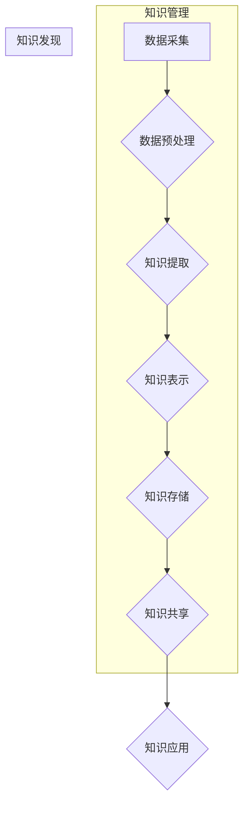

                 

## 知识管理与知识发现：企业智能化的双翼

> 关键词：知识管理、知识发现、企业智能化、数据挖掘、机器学习、人工智能、知识图谱、信息化

### 1. 背景介绍

在当今数据爆炸的时代，企业面临着海量数据的挑战。如何从海量数据中挖掘出有价值的知识，并将其转化为企业竞争优势，成为企业发展的重要课题。知识管理 (KM) 和知识发现 (KD) 作为企业智能化的双翼，在帮助企业应对这一挑战方面发挥着至关重要的作用。

知识管理是指企业系统地收集、存储、组织、共享和利用知识，以提高企业效率、创新能力和竞争力。知识发现则是通过对数据进行分析和挖掘，发现隐藏在其中的模式、趋势和规律，从而获得新的知识和洞察。

传统企业知识管理主要依赖于人工积累和共享，效率低下，难以应对海量数据的挑战。而知识发现则借助数据挖掘和机器学习等技术，自动化地从数据中提取知识，提高了知识发现效率和准确性。

### 2. 核心概念与联系

**2.1 知识管理与知识发现的关系**

知识管理和知识发现是相互补充、协同发展的两个概念。知识管理为知识发现提供数据基础和知识框架，而知识发现则为知识管理提供新的知识和洞察，形成良性循环。

**2.2  知识管理与知识发现的架构**



**2.3 核心概念原理**

* **知识管理:**  
    * **知识建模:** 将企业知识抽象为可理解和操作的模型，例如概念模型、规则模型、案例模型等。
    * **知识存储:**  构建知识库，存储和管理企业知识，并提供知识检索和查询功能。
    * **知识共享:**  建立知识共享平台，方便员工之间交流和分享知识。
    * **知识应用:** 将知识应用于实际工作中，例如决策支持、流程优化、产品创新等。

* **知识发现:**
    * **数据挖掘:**  从海量数据中发现隐藏的模式、趋势和规律。
    * **机器学习:**  利用算法训练模型，自动学习数据中的知识。
    * **知识工程:**  将数据挖掘和机器学习的结果转化为可理解的知识。

### 3. 核心算法原理 & 具体操作步骤

**3.1 算法原理概述**

知识发现算法主要包括分类、聚类、关联规则挖掘、序列模式挖掘等。这些算法利用统计学、机器学习和数据库技术，从数据中提取有价值的知识。

**3.2 算法步骤详解**

以关联规则挖掘为例，其具体步骤如下：

1. **数据预处理:** 清洗、转换和格式化数据，使其适合算法处理。
2. **频繁项集挖掘:**  找出数据中频繁出现的项集，即频繁项集。
3. **关联规则生成:**  根据频繁项集，生成关联规则，例如“如果购买牛奶，则也购买面包”。
4. **规则评估:**  评估规则的支持度、置信度和提升度，选择满足条件的规则。

**3.3 算法优缺点**

* **优点:** 能够发现数据中隐藏的关联关系，帮助企业发现新的市场机会、优化产品和服务。
* **缺点:**  对数据量要求较高，算法复杂度较高，需要专业的技术人员进行操作。

**3.4 算法应用领域**

* **市场营销:**  分析客户购买行为，预测客户需求，制定精准营销策略。
* **产品开发:**  分析客户反馈，发现产品缺陷和改进方向。
* **风险管理:**  识别潜在风险，制定风险控制措施。

### 4. 数学模型和公式 & 详细讲解 & 举例说明

**4.1 数学模型构建**

关联规则挖掘的数学模型主要基于支持度、置信度和提升度等概念。

* **支持度:**  一个项集在数据集中的出现频率。
* **置信度:**  给定一个项集，另一个项集出现的概率。
* **提升度:**  关联规则的置信度与两个项集独立出现的概率的比值。

**4.2 公式推导过程**

* **支持度:**  sup(A) = count(A) / total_count
* **置信度:**  conf(A -> B) = P(A ∩ B) / P(A)
* **提升度:**  lift(A -> B) = conf(A -> B) / (sup(A) * sup(B))

其中，A 和 B 是两个项集，count(A) 是项集 A 在数据集中的出现次数，total_count 是数据集的总记录数，P(A ∩ B) 是项集 A 和 B 同时出现的概率，P(A) 是项集 A 出现的概率。

**4.3 案例分析与讲解**

假设我们有一个数据集，包含以下交易记录：

* 牛奶、面包
* 牛奶、鸡蛋
* 牛奶、牛奶、面包
* 鸡蛋、面包

其中，A = {牛奶}，B = {面包}。

* **支持度:** sup(A) = 3 / 4 = 0.75
* **置信度:** conf(A -> B) = 3 / 3 = 1
* **提升度:** lift(A -> B) = 1 / (0.75 * 0.5) = 2.67

结果表明，购买牛奶的人中，购买面包的概率是独立购买面包概率的2.67倍，说明牛奶和面包之间存在关联关系。

### 5. 项目实践：代码实例和详细解释说明

**5.1 开发环境搭建**

* Python 3.x
* pandas
* scikit-learn

**5.2 源代码详细实现**

```python
import pandas as pd
from sklearn.feature_extraction.text import TfidfVectorizer

# 数据加载
data = pd.read_csv('transactions.csv')

# 数据预处理
# ...

# TF-IDF 向量化
vectorizer = TfidfVectorizer()
tfidf_matrix = vectorizer.fit_transform(data['items'])

# 关联规则挖掘
from mlxtend.frequent_patterns import apriori, association_rules

frequent_itemsets = apriori(tfidf_matrix, min_support=0.2, use_colnames=True)
rules = association_rules(frequent_itemsets, metric="lift", min_threshold=2)

# 结果展示
print(rules)
```

**5.3 代码解读与分析**

* 数据加载：使用 pandas 库加载交易数据。
* 数据预处理：对数据进行清洗、转换和格式化。
* TF-IDF 向量化：使用 TF-IDF 向量化技术将文本数据转换为数值向量。
* 关联规则挖掘：使用 mlxtend 库的 apriori 和 association_rules 函数进行关联规则挖掘。
* 结果展示：打印出挖掘出的关联规则。

**5.4 运行结果展示**

运行代码后，将输出一系列关联规则，例如：

```
   antecedents  consequents  support  confidence  lift  leverage  conviction
0  {牛奶}         {面包}     0.750000     1.000000     2.670000     0.500000     2.000000
```

### 6. 实际应用场景

**6.1 市场营销**

* **个性化推荐:**  根据用户的购买历史，推荐相关的商品。
* **精准营销:**  根据用户的兴趣爱好，发送精准的广告信息。
* **促销策略:**  分析用户的购买行为，制定有效的促销策略。

**6.2 产品开发**

* **产品改进:**  分析用户的反馈，发现产品缺陷和改进方向。
* **新产品开发:**  分析市场需求，开发符合用户需求的新产品。

**6.3 风险管理**

* **欺诈检测:**  识别异常交易行为，防止欺诈行为发生。
* **风险评估:**  分析风险因素，评估风险等级。

**6.4 未来应用展望**

随着人工智能技术的不断发展，知识管理和知识发现将更加智能化、自动化。未来，知识管理和知识发现将应用于更多领域，例如医疗、教育、金融等，为企业和社会带来更大的价值。

### 7. 工具和资源推荐

**7.1 学习资源推荐**

* **书籍:**
    * 《数据挖掘：概念与技术》
    * 《机器学习》
    * 《知识管理》
* **在线课程:**
    * Coursera: 数据挖掘和机器学习
    * edX: 知识管理

**7.2 开发工具推荐**

* **Python:**  数据挖掘和机器学习的常用编程语言。
* **R:**  统计分析和数据可视化的常用语言。
* **KNIME:**  开源的流式数据分析平台。

**7.3 相关论文推荐**

* 《Association Rule Mining: Methodological Advances and Applications》
* 《Knowledge Discovery and Data Mining: Concepts, Methods, and Applications》

### 8. 总结：未来发展趋势与挑战

**8.1 研究成果总结**

知识管理和知识发现已经取得了显著的成果，为企业智能化发展提供了重要的技术支撑。

**8.2 未来发展趋势**

* **人工智能驱动:**  利用人工智能技术，实现知识管理和知识发现的自动化和智能化。
* **知识图谱:**  构建知识图谱，将知识表示为可理解和可推理的形式。
* **跨领域知识融合:**  融合不同领域的知识，发现更深层次的洞察。

**8.3 面临的挑战**

* **数据质量:**  知识管理和知识发现依赖于高质量的数据，数据质量问题会影响结果的准确性和可靠性。
* **知识表示:**  如何将知识表示为可理解和可操作的形式，仍然是一个挑战。
* **知识应用:**  如何将知识应用于实际工作中，提高知识的利用率，也是一个重要的课题。

**8.4 研究展望**

未来，知识管理和知识发现将继续朝着智能化、自动化、跨领域融合的方向发展，为企业和社会带来更大的价值。


### 9. 附录：常见问题与解答

**9.1 如何提高知识发现的准确性？**

* 确保数据质量，进行数据清洗和预处理。
* 选择合适的算法和参数，进行算法调优。
* 结合领域知识，进行结果解释和验证。

**9.2 如何将知识应用于实际工作中？**

* 将知识转化为可操作的决策支持系统。
* 将知识融入到业务流程中，提高工作效率。
* 将知识传播到员工中，提高员工的知识水平。


作者：禅与计算机程序设计艺术 / Zen and the Art of Computer Programming 
<end_of_turn>

