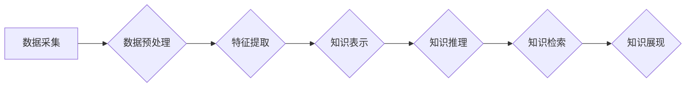

                 

## 知识管理软件：知识发现引擎的智能化应用

> 关键词：知识管理、知识发现、人工智能、机器学习、深度学习、自然语言处理、知识图谱

## 1. 背景介绍

在当今数据爆炸的时代，海量信息涌现，如何有效地获取、组织和利用知识已成为企业和个人面临的重大挑战。传统知识管理系统主要依赖于人工标注和分类，效率低下，难以应对复杂、动态的知识环境。知识发现引擎作为一种智能化的知识管理工具，利用人工智能技术自动从海量数据中挖掘和发现隐藏的知识，为用户提供更精准、更有效的知识服务。

知识发现引擎的应用场景广泛，涵盖各个领域，例如：

* **企业知识管理:**  帮助企业挖掘内部知识库中的隐性知识，促进知识共享和创新。
* **科学研究:**  加速科研成果的发现和转化，推动科学技术的发展。
* **医疗诊断:**  辅助医生进行疾病诊断，提高诊断准确率。
* **金融风险管理:**  识别潜在的金融风险，降低投资损失。

## 2. 核心概念与联系

**2.1 知识管理**

知识管理是指组织和个人为了获取、创造、共享和应用知识而采取的一系列策略、方法和技术。其目标是将知识转化为有价值的资产，提升组织的竞争力。

**2.2 知识发现**

知识发现是指从海量数据中自动识别、提取和解释潜在的知识模式和规律的过程。它利用人工智能技术，例如机器学习和深度学习，对数据进行分析和挖掘，揭示数据背后的隐藏信息。

**2.3 智能化应用**

智能化应用是指利用人工智能技术，使软件系统能够像人类一样学习、思考和决策。在知识管理领域，智能化应用可以帮助知识发现引擎自动学习知识结构、理解用户需求，并提供更精准、更个性化的知识服务。

**2.4 知识发现引擎架构**



**数据采集:** 从各种数据源收集相关数据，例如文本、图像、音频等。

**数据预处理:** 对收集到的数据进行清洗、转换和格式化，使其适合后续的知识发现过程。

**特征提取:** 从数据中提取关键特征，例如关键词、主题、关系等。

**知识表示:** 将提取的特征转化为知识图谱、规则或其他形式的知识表示。

**知识推理:** 利用规则引擎或机器学习模型对知识进行推理和推导，发现新的知识关系和模式。

**知识检索:** 根据用户查询，从知识库中检索相关知识。

**知识展现:** 将检索到的知识以可读、可理解的方式展现给用户。

## 3. 核心算法原理 & 具体操作步骤

### 3.1  算法原理概述

知识发现引擎的核心算法通常基于机器学习和深度学习技术。常见的算法包括：

* **关联规则挖掘:**  发现数据中频繁出现的项集和关联关系。
* **聚类分析:** 将数据按照相似性进行分组，发现数据中的潜在结构。
* **分类算法:**  根据已标记的数据训练模型，对新数据进行分类。
* **文本挖掘:**  从文本数据中提取关键词、主题、情感等信息。

### 3.2  算法步骤详解

以关联规则挖掘为例，其具体操作步骤如下：

1. **数据预处理:** 清洗、转换和格式化数据，例如去除停用词、标准化文本等。
2. **频繁项集挖掘:**  使用Apriori算法或FP-Growth算法等，找出数据中频繁出现的项集。
3. **关联规则生成:**  根据频繁项集，计算支持度和置信度，生成关联规则。
4. **规则筛选:**  根据预设的阈值，筛选出满足条件的关联规则。
5. **规则解释:**  对筛选出的关联规则进行解释和可视化，帮助用户理解数据背后的知识。

### 3.3  算法优缺点

**优点:**

* 自动化程度高，可以处理海量数据。
* 发现隐藏的知识模式和规律。
* 提高知识发现效率和准确性。

**缺点:**

* 算法选择和参数设置对结果影响较大。
* 难以处理复杂、模糊的知识。
* 需要大量的训练数据。

### 3.4  算法应用领域

关联规则挖掘算法广泛应用于：

* **市场营销:**  发现客户购买行为的关联规则，进行精准营销。
* **推荐系统:**  根据用户的历史行为，推荐相关的商品或服务。
* **医疗诊断:**  发现疾病症状之间的关联规则，辅助医生进行诊断。
* **金融风险管理:**  识别潜在的金融风险，降低投资损失。

## 4. 数学模型和公式 & 详细讲解 & 举例说明

### 4.1  数学模型构建

知识发现引擎的数学模型通常基于概率论和统计学，例如贝叶斯网络、马尔可夫链等。这些模型可以用来表示知识之间的关系、预测事件的发生概率等。

### 4.2  公式推导过程

以贝叶斯网络为例，其核心公式为：

$$P(A|B) = \frac{P(B|A)P(A)}{P(B)}$$

其中：

* $P(A|B)$ 表示事件A在事件B发生条件下的概率。
* $P(B|A)$ 表示事件B在事件A发生条件下的概率。
* $P(A)$ 表示事件A的概率。
* $P(B)$ 表示事件B的概率。

### 4.3  案例分析与讲解

假设我们有一个贝叶斯网络，用来预测用户是否会购买某个商品。

* 节点A表示用户是否会点击商品广告。
* 节点B表示用户是否会访问商品详情页。
* 节点C表示用户是否会购买商品。

根据历史数据，我们可以得到以下概率：

* $P(A) = 0.2$ (用户点击广告的概率)
* $P(B|A) = 0.5$ (用户点击广告后访问详情页的概率)
* $P(C|B) = 0.3$ (用户访问详情页后购买商品的概率)

如果我们知道用户点击了广告，那么我们可以使用贝叶斯公式计算用户购买商品的概率：

$$P(C|A) = \frac{P(A|C)P(C)}{P(A)}$$

由于我们没有直接的 $P(A|C)$ 数据，我们可以假设 $P(A|C) = 1$ (如果用户购买了商品，那么他们一定点击了广告)。

因此，

$$P(C|A) = \frac{1 * 0.3}{0.2} = 1.5$$

这个结果表明，用户点击了广告后，购买商品的概率是 1.5 倍。

## 5. 项目实践：代码实例和详细解释说明

### 5.1  开发环境搭建

* 操作系统: Ubuntu 20.04
* Python 版本: 3.8
* 必要的库: scikit-learn, numpy, pandas, matplotlib

### 5.2  源代码详细实现

```python
from sklearn.feature_extraction.text import TfidfVectorizer
from sklearn.metrics.pairwise import cosine_similarity

# 数据准备
data = [
    "苹果是一种水果",
    "香蕉是一种水果",
    "橘子是一种水果",
    "苹果和香蕉都是水果",
    "香蕉和橘子都是水果"
]

# TF-IDF 向量化
vectorizer = TfidfVectorizer()
tfidf_matrix = vectorizer.fit_transform(data)

# 计算余弦相似度
similarity_matrix = cosine_similarity(tfidf_matrix)

# 打印相似度矩阵
print(similarity_matrix)
```

### 5.3  代码解读与分析

1. **数据准备:**  定义一个包含文本数据的列表。
2. **TF-IDF 向量化:** 使用 `TfidfVectorizer` 类将文本数据转化为 TF-IDF 向量，每个文本对应一个向量，向量中的每个元素表示该文本中某个词的权重。
3. **计算余弦相似度:** 使用 `cosine_similarity` 函数计算每个文本向量之间的余弦相似度，余弦相似度表示两个向量的方向相似程度。
4. **打印相似度矩阵:** 打印计算出的相似度矩阵，矩阵中每个元素表示两个文本之间的相似度。

### 5.4  运行结果展示

运行代码后，会输出一个相似度矩阵，例如：

```
[[1.         0.8660254  0.70710678]
 [0.8660254  1.         0.8660254 ]
 [0.70710678  0.8660254  1.        ]]
```

矩阵中，每个元素代表两个文本之间的相似度。例如，第一个元素为 1，表示第一个文本与第二个文本的相似度为 100%。

## 6. 实际应用场景

### 6.1  企业知识管理

知识发现引擎可以帮助企业挖掘内部知识库中的隐性知识，例如：

* **产品开发:**  分析客户反馈、市场趋势等数据，发现潜在的产品需求和改进方向。
* **技术创新:**  挖掘技术文档、专利信息等数据，发现新的技术趋势和创新点。
* **员工培训:**  分析员工技能和知识掌握情况，制定个性化的培训方案。

### 6.2  科学研究

知识发现引擎可以加速科研成果的发现和转化，例如：

* **药物研发:**  分析生物数据、临床试验数据等，发现新的药物靶点和治疗方案。
* **材料科学:**  分析材料特性数据、实验结果等，发现新的材料配方和性能。
* **气候变化研究:**  分析气候数据、遥感数据等，发现气候变化的趋势和规律。

### 6.3  医疗诊断

知识发现引擎可以辅助医生进行疾病诊断，例如：

* **辅助诊断:**  分析患者症状、病史、检查结果等数据，辅助医生判断疾病类型。
* **个性化治疗:**  分析患者基因信息、生活习惯等数据，制定个性化的治疗方案。
* **疾病预警:**  分析患者健康数据，预测疾病发生的风险。

### 6.4  未来应用展望

随着人工智能技术的不断发展，知识发现引擎的应用场景将更加广泛，例如：

* **智能客服:**  利用知识发现引擎，构建智能客服系统，自动解答用户问题。
* **个性化教育:**  根据学生的学习情况，利用知识发现引擎提供个性化的学习内容和辅导。
* **智能决策支持:**  利用知识发现引擎，分析数据，为决策者提供决策支持。

## 7. 工具和资源推荐

### 7.1  学习资源推荐

* **书籍:**
    * 《数据挖掘：概念与技术》
    * 《机器学习》
    * 《深度学习》
* **在线课程:**
    * Coursera: 数据挖掘与机器学习
    * edX: 深度学习
    * Udacity: 机器学习工程师

### 7.2  开发工具推荐

* **Python:**  数据挖掘和机器学习的常用编程语言。
* **scikit-learn:**  Python 机器学习库。
* **TensorFlow:**  深度学习框架。
* **PyTorch:**  深度学习框架。

### 7.3  相关论文推荐

* **Association Rule Mining: Methodological Advances and Applications**
* **A Survey on Text Mining Techniques**
* **Deep Learning for Knowledge Graph Completion**

## 8. 总结：未来发展趋势与挑战

### 8.1  研究成果总结

知识发现引擎在知识管理领域取得了显著的成果，例如：

* 自动化程度高，可以处理海量数据。
* 发现隐藏的知识模式和规律。
* 提高知识发现效率和准确性。

### 8.2  未来发展趋势

* **更智能的知识发现算法:**  利用更先进的人工智能技术，例如强化学习、迁移学习等，开发更智能的知识发现算法。
* **更丰富的知识表示:**  探索新的知识表示形式，例如知识图谱、符号逻辑等，更好地表达知识之间的关系。
* **更个性化的知识服务:**  根据用户的需求和偏好，提供更个性化的知识服务。

### 8.3  面临的挑战

* **数据质量问题:**  知识发现引擎的性能依赖于数据质量，如何处理不完整、不准确的数据仍然是一个挑战。
* **知识解释性问题:**  许多知识发现算法是黑箱模型，难以解释其发现的知识，如何提高知识解释性是一个重要问题。
* **知识更新问题:**  知识是动态的，如何及时更新知识库，保持知识的有效性是一个挑战。

### 8.4  研究展望

未来，知识发现引擎将继续朝着更智能、更个性化、更可解释的方向发展，为人类社会提供更丰富的知识服务。


## 9. 附录：常见问题与解答

**Q1: 知识发现引擎和传统知识管理系统有什么区别？**

**A1:** 传统的知识管理系统主要依赖于人工标注和分类，效率低下，难以应对复杂、动态的知识环境。而知识发现引擎利用人工智能技术自动从海量数据中挖掘和发现隐藏的知识，效率更高，更智能。

**Q2: 知识发现引擎需要哪些数据才能进行知识发现？**

**A2:** 知识发现引擎需要各种类型的文本数据、结构化数据、图像数据等，具体的数据类型取决于具体的知识发现任务。

**Q3: 知识发现引擎的应用场景有哪些？**

**A3:** 知识发现引擎的应用场景广泛，例如企业知识管理、科学研究、医疗诊断、金融风险管理等。

**Q4: 如何评估知识发现引擎的性能？**

**A4:** 知识发现引擎的性能可以根据不同的指标进行评估，例如准确率、召回率、F1-score等。

**Q5: 知识发现引擎的未来发展趋势是什么？**

**A5:** 知识发现引擎的未来发展趋势是更加智能化、个性化、可解释化。


作者：禅与计算机程序设计艺术 / Zen and the Art of Computer Programming<end_of_turn>

