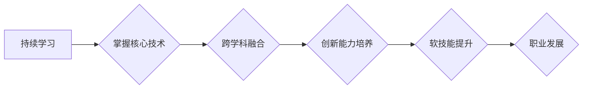

                 

## 知识经济下程序员的职业发展策略

> 关键词：知识经济、程序员、职业发展、技术趋势、学习策略、软技能、创新能力

> 摘要：随着知识经济的蓬勃发展，程序员职业面临着前所未有的机遇和挑战。本文将深入探讨知识经济下程序员的职业发展策略，从技术趋势、学习策略、软技能提升、创新能力培养等方面进行分析，并结合实际案例和工具推荐，为程序员提供全面的职业发展指南。

## 1. 背景介绍

1.1 知识经济的兴起

21世纪，全球经济结构发生深刻变化，以知识、信息和技术为主要驱动的知识经济成为主流。知识成为生产要素中最重要的组成部分，而程序员作为掌握核心技术、创造软件价值的关键人才，在知识经济中扮演着越来越重要的角色。

1.2 程序员职业的演变

传统的程序员工作主要集中在代码编写和软件维护方面。然而，随着技术的不断发展，程序员的职责范围不断拓展，涵盖了软件设计、架构、测试、项目管理、数据分析等多个领域。程序员需要具备更广泛的知识和技能，才能适应不断变化的市场需求。

1.3 知识经济下程序员面临的挑战

* **技术迭代速度快:**  软件技术发展日新月异，程序员需要不断学习新技术，才能保持竞争力。
* **市场竞争激烈:**  全球化和互联网的发展，使得程序员市场竞争更加激烈。
* **跨学科融合:**  软件开发越来越需要与其他学科的交叉融合，例如数据科学、人工智能、物联网等。

## 2. 核心概念与联系

**知识经济下程序员职业发展策略的核心概念包括:**

* **持续学习:**  在知识经济时代，学习成为一种永恒的需要。程序员需要不断学习新技术、新工具和新知识，才能保持竞争力。
* **跨学科融合:**  软件开发越来越需要与其他学科的交叉融合，例如数据科学、人工智能、物联网等。程序员需要具备跨学科的思维能力和知识背景。
* **创新能力:**  创新能力是知识经济时代的核心竞争力。程序员需要具备解决问题、创造新价值的能力。
* **软技能提升:**  除了技术技能，程序员还需要具备良好的沟通、团队合作、领导力和解决问题的能力等软技能。

**程序员职业发展策略的流程图:**

## 3. 核心算法原理 & 具体操作步骤

3.1 算法原理概述

在知识经济时代，程序员需要掌握各种算法和数据结构，才能高效地解决问题，提高工作效率。常见的算法包括排序算法、搜索算法、图算法、动态规划算法等。

3.2 算法步骤详解

* **排序算法:**  将数据按照特定规则进行排列，例如冒泡排序、插入排序、快速排序等。
* **搜索算法:**  在数据集合中查找特定元素，例如线性搜索、二分搜索等。
* **图算法:**  处理图结构的数据，例如深度优先搜索、广度优先搜索等。
* **动态规划算法:**  解决复杂问题，通过将问题分解成子问题，并存储子问题的解，避免重复计算。

3.3 算法优缺点

不同的算法具有不同的优缺点，程序员需要根据实际情况选择合适的算法。例如，快速排序算法的时间复杂度较低，但空间复杂度较高；线性搜索算法简单易实现，但时间复杂度较高。

3.4 算法应用领域

算法广泛应用于各个领域，例如搜索引擎、推荐系统、人工智能、数据分析等。

## 4. 数学模型和公式 & 详细讲解 & 举例说明

4.1 数学模型构建

数学模型可以用来描述和分析算法的性能，例如时间复杂度、空间复杂度等。

4.2 公式推导过程

时间复杂度通常用大O符号表示，例如O(n)、O(log n)、O(n^2)等。

* **O(n):**  算法的时间复杂度与输入数据的大小线性相关。
* **O(log n):**  算法的时间复杂度与输入数据的大小对数相关。
* **O(n^2):**  算法的时间复杂度与输入数据的大小平方相关。

4.3 案例分析与讲解

例如，冒泡排序算法的时间复杂度为O(n^2)，因为需要比较n-1次，每次比较都需要遍历n个元素。

## 5. 项目实践：代码实例和详细解释说明

5.1 开发环境搭建

程序员需要选择合适的开发环境，例如IDE、编译器、数据库等。

5.2 源代码详细实现

程序员需要编写源代码，实现算法的逻辑。

5.3 代码解读与分析

程序员需要对代码进行解读和分析，理解代码的逻辑和功能。

5.4 运行结果展示

程序员需要运行代码，观察运行结果，并进行测试和调试。

## 6. 实际应用场景

程序员的技能可以应用于各个领域，例如：

* **软件开发:**  开发各种类型的软件，例如网站、应用程序、游戏等。
* **数据科学:**  分析和处理大数据，挖掘数据中的价值。
* **人工智能:**  开发人工智能算法，例如机器学习、深度学习等。
* **网络安全:**  保护网络系统和数据安全。

6.4 未来应用展望

随着技术的不断发展，程序员的职业发展前景更加广阔。例如，云计算、物联网、区块链等新兴技术将为程序员带来新的机遇。

## 7. 工具和资源推荐

7.1 学习资源推荐

* 在线学习平台：Coursera、edX、Udemy等
* 书籍： 《编程之美》、《算法导论》等
* 开源项目：GitHub、GitLab等

7.2 开发工具推荐

* IDE：Visual Studio Code、IntelliJ IDEA等
* 编程语言：Python、Java、C++等
* 数据库：MySQL、PostgreSQL等

7.3 相关论文推荐

* ACM Digital Library
* IEEE Xplore

## 8. 总结：未来发展趋势与挑战

8.1 研究成果总结

知识经济下，程序员职业发展策略需要不断适应变化的市场需求，持续学习新技术，提升跨学科融合能力，培养创新能力和软技能。

8.2 未来发展趋势

* **人工智能:**  人工智能将成为未来软件开发的重要趋势，程序员需要掌握人工智能相关技术。
* **云计算:**  云计算将改变软件开发模式，程序员需要了解云计算平台和服务。
* **物联网:**  物联网将连接各种设备，程序员需要开发物联网应用软件。

8.3 面临的挑战

* **技术迭代速度快:**  程序员需要不断学习新技术，才能保持竞争力。
* **人才短缺:**  随着科技发展，程序员人才需求不断增加，人才短缺问题日益突出。
* **职业道德:**  程序员需要遵守职业道德规范，维护软件开发的诚信和可持续发展。

8.4 研究展望

未来，程序员职业发展策略的研究将更加注重人工智能、云计算、物联网等新兴技术的应用，以及程序员的软技能培养和职业道德建设。

## 9. 附录：常见问题与解答

* **如何学习新技术？**

建议利用在线学习平台、书籍、开源项目等资源进行学习，并结合实际项目实践。

* **如何提升软技能？**

可以通过参加培训课程、阅读相关书籍、参与团队项目等方式提升软技能。

* **如何应对技术迭代速度快？**

保持学习的热情，关注行业动态，并积极尝试新技术。

* **如何找到合适的职业发展方向？**

根据自身兴趣和能力，结合市场需求，选择合适的职业发展方向。

作者：禅与计算机程序设计艺术 / Zen and the Art of Computer Programming 
<end_of_turn>

