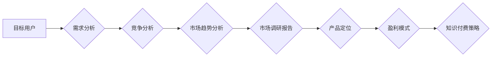

                 

## 程序员如何进行知识付费的市场调研

> 关键词：知识付费、程序员、市场调研、需求分析、竞争分析、产品定位、盈利模式

> 摘要：本文旨在指导程序员进行知识付费市场调研，帮助他们深入了解市场需求、竞争格局和盈利模式，从而制定有效的知识付费策略，打造成功的知识产品。

## 1. 背景介绍

随着互联网技术的快速发展和知识经济的兴起，知识付费行业蓬勃发展，成为一种新的商业模式。程序员作为技术人才，拥有丰富的专业知识和经验，具备成为知识付费创作者的巨大潜力。然而，知识付费市场竞争激烈，想要成功，需要进行深入的市场调研，了解目标用户的需求、竞争对手的策略以及市场趋势。

## 2. 核心概念与联系

### 2.1 知识付费

知识付费是指通过付费的方式获取知识、技能和经验。它涵盖了多种形式，例如在线课程、电子书、付费博客、直播讲座等。

### 2.2 程序员知识付费

程序员知识付费是指程序员将自己的专业知识和经验转化为付费产品，通过线上平台或线下活动向其他程序员或技术爱好者提供服务。

### 2.3 市场调研

市场调研是指通过收集和分析市场信息，了解目标用户的需求、竞争对手的策略以及市场趋势，为企业决策提供依据。

**Mermaid 流程图**



## 3. 核心算法原理 & 具体操作步骤

### 3.1 算法原理概述

程序员知识付费市场调研的核心算法原理是基于数据分析和市场规律的推导。通过收集和分析市场数据，可以识别出用户需求、竞争格局和市场趋势，从而制定有效的知识付费策略。

### 3.2 算法步骤详解

1. **目标用户定位:** 确定目标用户的群体特征、需求痛点和学习习惯。
2. **需求分析:** 通过问卷调查、用户访谈、论坛分析等方式，了解目标用户的学习需求、知识痛点和付费意愿。
3. **竞争分析:** 分析竞争对手的产品、价格、营销策略和用户评价，找出竞争优势和劣势。
4. **市场趋势分析:** 关注行业发展趋势、技术变革和用户需求变化，预测未来市场机会和挑战。
5. **产品定位:** 根据市场调研结果，确定知识产品的主题、内容、形式和价格策略。
6. **盈利模式:** 选择合适的盈利模式，例如订阅制、课程销售、会员体系等。
7. **营销推广:** 制定有效的营销推广策略，吸引目标用户购买知识产品。

### 3.3 算法优缺点

**优点:**

* 数据驱动，决策更科学。
* 能够深入了解市场需求和竞争格局。
* 提高知识付费产品的成功率。

**缺点:**

* 需要投入时间和资源进行数据收集和分析。
* 市场环境变化快，需要不断更新调研结果。

### 3.4 算法应用领域

程序员知识付费市场调研算法广泛应用于以下领域:

* 在线教育平台
* 技术博客和论坛
* 个人知识创作者
* 技术咨询公司

## 4. 数学模型和公式 & 详细讲解 & 举例说明

### 4.1 数学模型构建

在程序员知识付费市场调研中，可以使用一些数学模型来分析数据和预测市场趋势。例如，可以使用回归分析模型来预测知识产品的销售额，可以使用聚类分析模型来识别用户群体，可以使用预测模型来预测未来市场需求。

### 4.2 公式推导过程

具体的公式推导过程取决于所使用的数学模型。例如，线性回归模型的公式如下:

$$y = mx + c$$

其中，y是预测值，x是自变量，m是回归系数，c是截距。

### 4.3 案例分析与讲解

假设我们想要预测一个在线课程的销售额，可以使用线性回归模型。我们可以收集过去课程销售数据和相关因素数据，例如课程价格、课程时长、课程评价等，然后使用线性回归模型来建立预测模型。

## 5. 项目实践：代码实例和详细解释说明

### 5.1 开发环境搭建

可以使用Python语言和相关库进行程序员知识付费市场调研。需要安装Python环境和数据分析库，例如Pandas、NumPy、Scikit-learn等。

### 5.2 源代码详细实现

```python
import pandas as pd
from sklearn.linear_model import LinearRegression

# 加载数据
data = pd.read_csv('course_data.csv')

# 选择特征变量和目标变量
X = data[['price', 'duration', 'rating']]
y = data['sales']

# 创建线性回归模型
model = LinearRegression()

# 训练模型
model.fit(X, y)

# 预测销售额
new_data = pd.DataFrame({'price': [100], 'duration': [10], 'rating': [4.5]})
predicted_sales = model.predict(new_data)

# 打印预测结果
print(predicted_sales)
```

### 5.3 代码解读与分析

这段代码首先加载了课程数据，然后选择特征变量和目标变量。接着创建了一个线性回归模型，并使用训练数据训练模型。最后，使用新的数据预测销售额。

### 5.4 运行结果展示

运行代码后，会输出预测的销售额。

## 6. 实际应用场景

### 6.1 在线教育平台

在线教育平台可以利用市场调研数据来优化课程内容、制定价格策略和进行用户精准营销。

### 6.2 技术博客和论坛

技术博客和论坛可以根据用户需求进行内容创作，并通过付费会员制或广告收入实现盈利。

### 6.3 个人知识创作者

个人知识创作者可以利用市场调研数据来确定知识产品的主题、内容和形式，并选择合适的推广渠道。

### 6.4 未来应用展望

随着人工智能技术的进步，程序员知识付费市场调研将更加智能化和自动化。例如，可以使用机器学习算法自动分析用户数据，预测市场趋势，并提供个性化的知识推荐。

## 7. 工具和资源推荐

### 7.1 学习资源推荐

* **书籍:** 《数据分析实战》、《Python数据分析入门》
* **在线课程:** Coursera、edX、Udemy
* **博客和论坛:** CSDN、知乎、Stack Overflow

### 7.2 开发工具推荐

* **Python:** Python是一种开源的编程语言，广泛应用于数据分析和机器学习。
* **Pandas:** Pandas是一个用于数据分析和处理的Python库。
* **NumPy:** NumPy是一个用于数值计算的Python库。
* **Scikit-learn:** Scikit-learn是一个用于机器学习的Python库。

### 7.3 相关论文推荐

* **"Market Research for Knowledge Products"**
* **"Data Mining for Knowledge Discovery"**

## 8. 总结：未来发展趋势与挑战

### 8.1 研究成果总结

程序员知识付费市场调研是一个重要的研究领域，它可以帮助程序员更好地了解市场需求和竞争格局，从而制定有效的知识付费策略。

### 8.2 未来发展趋势

未来，程序员知识付费市场调研将更加智能化和自动化，人工智能技术将被广泛应用于数据分析、市场预测和用户推荐。

### 8.3 面临的挑战

程序员知识付费市场调研面临着一些挑战，例如数据获取成本高、市场环境变化快、用户隐私保护等。

### 8.4 研究展望

未来，需要进一步研究人工智能技术在程序员知识付费市场调研中的应用，以及如何解决数据获取成本高、市场环境变化快等挑战。

## 9. 附录：常见问题与解答

### 9.1 如何收集程序员知识付费市场数据？

可以使用问卷调查、用户访谈、论坛分析、搜索引擎数据分析等方式收集数据。

### 9.2 如何分析程序员知识付费市场数据？

可以使用数据分析工具和技术，例如Python、Pandas、NumPy、Scikit-learn等，对数据进行分析和挖掘。

### 9.3 如何制定有效的程序员知识付费策略？

需要根据市场调研结果，确定知识产品的主题、内容、形式、价格策略和推广渠道。


作者：禅与计算机程序设计艺术 / Zen and the Art of Computer Programming 
<end_of_turn>

