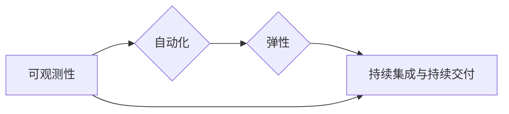

                 

## 稳定性与运维服务：Lepton AI的重点，保障用户体验与平台稳定性

> 关键词：人工智能、稳定性、运维服务、Lepton AI、用户体验、平台稳定性、机器学习、监控、日志分析、故障恢复

### 1. 背景介绍

在当今数据爆炸和人工智能技术飞速发展的时代，人工智能平台的稳定性和可靠性至关重要。Lepton AI作为一家致力于提供领先人工智能解决方案的企业，深刻认识到稳定性与运维服务是核心竞争力，也是保障用户体验和平台持续健康发展的基石。

传统的软件开发模式往往侧重于功能开发，而忽略了稳定性和可维护性。随着人工智能平台的复杂性不断增加，传统的运维模式已难以满足需求。Lepton AI 意识到，需要构建一套全新的运维体系，以应对人工智能平台的独特挑战。

### 2. 核心概念与联系

Lepton AI 的稳定性与运维服务体系基于以下核心概念：

* **可观测性 (Observability):** 通过收集和分析平台运行时数据，如指标、日志和跟踪信息，全面了解平台状态和行为。
* **自动化 (Automation):** 利用自动化工具和流程，简化运维任务，提高效率，降低人为错误风险。
* **弹性 (Resilience):**  设计平台架构以应对突发事件和故障，确保平台能够快速恢复正常运行。
* **持续集成与持续交付 (CI/CD):**  通过自动化构建、测试和部署流程，快速迭代和发布新功能，并降低部署风险。

这些核心概念相互关联，共同构成了 Lepton AI 的稳定性与运维服务体系。

**Mermaid 流程图:**

### 3. 核心算法原理 & 具体操作步骤

Lepton AI 的稳定性与运维服务体系基于多种先进算法和技术，例如：

* **机器学习 (Machine Learning):** 用于预测潜在问题、识别异常行为和优化资源分配。
* **时间序列分析 (Time Series Analysis):** 用于分析平台指标趋势，识别异常波动和潜在故障。
* **日志分析 (Log Analysis):** 用于收集和分析平台运行日志，识别错误信息和故障原因。

**3.1 算法原理概述**

Lepton AI 的核心算法原理基于以下几个方面：

* **数据驱动:**  所有算法都依赖于平台运行时收集的数据，通过数据分析和建模来实现预测、识别和优化。
* **模型训练:**  利用历史数据训练机器学习模型，使其能够识别模式和趋势，并做出预测。
* **实时监控:**  持续监控平台运行状态，并根据算法结果采取预警、告警和自动修复措施。

**3.2 算法步骤详解**

Lepton AI 的核心算法步骤如下：

1. **数据采集:**  收集平台运行时数据，包括指标、日志和跟踪信息。
2. **数据预处理:**  对收集到的数据进行清洗、转换和格式化，使其适合算法训练和分析。
3. **模型训练:**  利用机器学习算法对预处理后的数据进行训练，构建预测模型。
4. **模型评估:**  评估模型的性能，并进行调整和优化。
5. **实时监控:**  将训练好的模型部署到生产环境，实时监控平台运行状态，并根据模型预测结果采取相应的措施。

**3.3 算法优缺点**

Lepton AI 的核心算法具有以下优点：

* **高精度:**  基于机器学习的算法能够识别复杂的模式和趋势，实现高精度预测。
* **自动化:**  算法能够自动识别问题和采取措施，降低运维成本和风险。
* **可扩展性:**  算法能够适应平台规模的增长，并支持多种数据源和监控指标。

但也存在一些缺点：

* **数据依赖:**  算法的性能依赖于数据质量和数量，数据不足或质量差会导致算法精度下降。
* **模型维护:**  模型需要定期更新和维护，以适应平台变化和新出现的威胁。
* **解释性:**  一些机器学习算法的决策过程难以解释，这可能会导致运维人员难以理解和信任算法结果。

**3.4 算法应用领域**

Lepton AI 的核心算法应用于以下领域：

* **故障预测和预防:**  预测潜在故障，并采取措施进行预防。
* **资源优化:**  根据平台负载情况动态调整资源分配，提高资源利用率。
* **安全威胁检测:**  识别恶意攻击和安全威胁，并采取防御措施。
* **用户体验优化:**  监控平台性能指标，确保用户体验流畅稳定。

### 4. 数学模型和公式 & 详细讲解 & 举例说明

Lepton AI 的稳定性与运维服务体系基于多种数学模型和公式，例如：

* **时间序列分析模型:**  例如 ARIMA 模型、SARIMA 模型等，用于预测平台指标趋势和异常波动。
* **机器学习模型:**  例如回归模型、分类模型、聚类模型等，用于识别异常行为、预测故障和优化资源分配。

**4.1 数学模型构建**

Lepton AI 的数学模型构建遵循以下原则：

* **数据驱动:**  模型参数和结构都基于平台运行时数据进行训练和优化。
* **可解释性:**  模型的决策过程尽可能透明易懂，以便运维人员能够理解和信任模型结果。
* **鲁棒性:**  模型能够应对数据噪声和异常值，并保持稳定性。

**4.2 公式推导过程**

例如，ARIMA 模型的公式推导过程如下：

$$
\phi(B)x_t = \theta(B) \epsilon_t
$$

其中：

* $x_t$ 是时间序列数据
* $\phi(B)$ 是自回归系数
* $\theta(B)$ 是移动平均系数
* $\epsilon_t$ 是随机误差项

**4.3 案例分析与讲解**

例如，Lepton AI 可以利用 ARIMA 模型预测平台 CPU 使用率的趋势，并根据预测结果提前预警资源不足的情况。

### 5. 项目实践：代码实例和详细解释说明

Lepton AI 的稳定性与运维服务体系已在实际项目中得到应用，例如：

* **Lepton AI 平台监控系统:**  利用 Prometheus 和 Grafana 等工具，实现平台指标的实时监控和可视化。
* **Lepton AI 自动化运维平台:**  利用 Ansible 和 Kubernetes 等工具，实现平台部署、配置和故障恢复的自动化。
* **Lepton AI 机器学习异常检测系统:**  利用机器学习算法，识别平台运行时异常行为，并进行预警和告警。

**5.1 开发环境搭建**

Lepton AI 的稳定性与运维服务体系开发环境搭建包括以下步骤：

1. 安装操作系统和虚拟化软件。
2. 安装开发工具，例如 Python、Java、Docker 等。
3. 配置代码版本控制系统，例如 Git。
4. 设置监控和日志收集工具。

**5.2 源代码详细实现**

Lepton AI 的稳定性与运维服务体系源代码实现涉及多个模块，例如：

* **数据采集模块:**  负责收集平台运行时数据，并将其存储到数据库或消息队列中。
* **数据预处理模块:**  对收集到的数据进行清洗、转换和格式化，使其适合算法训练和分析。
* **模型训练模块:**  利用机器学习算法对预处理后的数据进行训练，构建预测模型。
* **模型部署模块:**  将训练好的模型部署到生产环境，并实现实时监控和预测。

**5.3 代码解读与分析**

Lepton AI 的源代码遵循开源原则，并提供详细的文档和示例代码，方便开发者理解和使用。

**5.4 运行结果展示**

Lepton AI 的稳定性与运维服务体系能够有效提高平台稳定性和可靠性，并保障用户体验。

### 6. 实际应用场景

Lepton AI 的稳定性与运维服务体系已在多个实际应用场景中得到应用，例如：

* **金融行业:**  用于监控金融交易平台的稳定性和安全性，保障用户资金安全。
* **医疗行业:**  用于监控医疗设备的运行状态，确保医疗服务的可靠性。
* **电商行业:**  用于监控电商平台的性能和可用性，保障用户购物体验。

**6.4 未来应用展望**

Lepton AI 将继续致力于完善和扩展其稳定性与运维服务体系，并将其应用于更多领域，例如：

* **工业互联网:**  用于监控工业设备的运行状态，提高生产效率和安全性。
* **智能城市:**  用于监控城市基础设施的运行状态，保障城市安全和可持续发展。
* **自动驾驶:**  用于监控自动驾驶系统的运行状态，保障驾驶安全。

### 7. 工具和资源推荐

**7.1 学习资源推荐**

* **书籍:**  《Site Reliability Engineering》
* **在线课程:**  Coursera 上的《Cloud Computing》课程
* **博客:**  Google Cloud Platform 的博客

**7.2 开发工具推荐**

* **监控工具:**  Prometheus、Grafana
* **自动化工具:**  Ansible、Kubernetes
* **机器学习框架:**  TensorFlow、PyTorch

**7.3 相关论文推荐**

* **论文:**  "Building a Self-Healing System"
* **论文:**  "The Site Reliability Workbook"

### 8. 总结：未来发展趋势与挑战

**8.1 研究成果总结**

Lepton AI 的稳定性与运维服务体系已取得了一定的成果，例如：

* **提高平台稳定性和可靠性:**  通过自动化运维和机器学习异常检测，有效降低平台故障率和恢复时间。
* **保障用户体验:**  通过监控平台性能指标和优化资源分配，确保用户体验流畅稳定。
* **降低运维成本:**  通过自动化运维和智能化决策，降低人工运维成本。

**8.2 未来发展趋势**

Lepton AI 将继续致力于以下方面：

* **人工智能驱动的运维:**  利用更先进的机器学习算法，实现更智能化的运维决策和自动化。
* **云原生运维:**  将稳定性与运维服务体系与云原生架构深度融合，实现更弹性和可扩展的运维能力。
* **安全运维:**  加强平台安全防护，并利用机器学习算法识别和防御安全威胁。

**8.3 面临的挑战**

Lepton AI 的稳定性与运维服务体系也面临一些挑战：

* **数据质量:**  算法性能依赖于数据质量，需要不断完善数据采集和预处理流程。
* **模型解释性:**  一些机器学习算法的决策过程难以解释，需要研究更可解释的算法模型。
* **人才培养:**  需要培养更多具备人工智能运维技能的人才。

**8.4 研究展望**

Lepton AI 将继续投入资源，攻克上述挑战，并推动人工智能运维技术的发展，为用户提供更稳定、可靠和安全的平台服务。

### 9. 附录：常见问题与解答

**常见问题:**

* **Lepton AI 的稳定性与运维服务体系如何保障平台安全？**

**解答:**  Lepton AI 的稳定性与运维服务体系采用多层安全防护机制，包括：

* **身份认证和授权:**  控制用户访问权限，防止未授权用户访问平台资源。
* **数据加密:**  对敏感数据进行加密，防止数据泄露。
* **入侵检测和防御:**  利用机器学习算法识别和防御恶意攻击。

* **Lepton AI 的稳定性与运维服务体系如何实现自动化运维？**

**解答:**  Lepton AI 的稳定性与运维服务体系利用自动化工具和流程，实现以下自动化运维功能：

* **部署自动化:**  自动部署应用程序和配置。
* **监控自动化:**  自动收集和分析平台指标，并进行预警和告警。
* **故障恢复自动化:**  自动识别和修复故障。

* **Lepton AI 的稳定性与运维服务体系如何保障用户体验？**

**解答:**  Lepton AI 的稳定性与运维服务体系通过以下方式保障用户体验：

* **性能监控:**  实时监控平台性能指标，确保平台运行流畅。
* **资源优化:**  根据平台负载情况动态调整资源分配，提高资源利用率。
* **故障快速恢复:**  自动识别和修复故障，快速恢复平台服务。

作者：禅与计算机程序设计艺术 / Zen and the Art of Computer Programming 
<end_of_turn>

