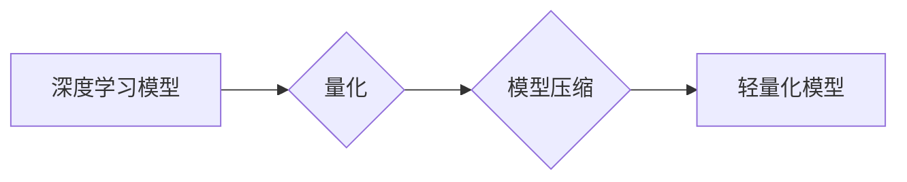

                 

## 第十三章：量化和模型压缩

> 关键词：深度学习，模型压缩，量化，精度，效率，可部署性

> 摘要：随着深度学习模型规模的不断扩大，模型的计算成本和存储需求也随之增加，这限制了模型在移动设备、嵌入式系统等资源受限环境中的部署。量化和模型压缩技术 emerged  作为解决这一问题的有效手段，通过降低模型参数的位宽和模型规模，实现模型的精度和效率的平衡。本文将深入探讨量化和模型压缩的原理、算法、应用场景以及未来发展趋势。

## 1. 背景介绍

深度学习模型在图像识别、自然语言处理、语音识别等领域取得了显著的成果。然而，随着模型规模的不断扩大，模型的计算成本和存储需求也随之增加，这限制了模型在移动设备、嵌入式系统等资源受限环境中的部署。

例如，一个大型的图像识别模型可能包含数十亿个参数，需要大量的计算资源和内存才能进行推理。在移动设备上部署这样的模型会导致电池寿命短、运行速度慢等问题。

为了解决这一问题，模型压缩技术应运而生。模型压缩的目标是通过减少模型参数的数量或降低模型参数的位宽，来减小模型的规模，从而降低模型的计算成本和存储需求，同时尽量保持模型的精度。

## 2. 核心概念与联系

量化和模型压缩是深度学习模型优化和部署的重要技术。

**量化**是指将模型参数的精度降低，例如将32位浮点数转换为8位整数。

**模型压缩**是指通过各种算法和技术，减少模型参数的数量或模型结构的复杂度。

量化和模型压缩可以相互配合，共同实现模型的压缩和优化。

**Mermaid 流程图：**



## 3. 核心算法原理 & 具体操作步骤

### 3.1  算法原理概述

量化和模型压缩算法主要分为以下几类：

* **权值量化:** 将模型参数的精度降低，例如将32位浮点数转换为8位整数。
* **剪枝:** 删除模型中不重要的参数或连接，从而减少模型规模。
* **知识蒸馏:** 通过训练一个小的学生模型来模仿一个大的教师模型，从而实现模型压缩。
* **神经网络架构搜索:** 自动搜索最优的模型架构，从而实现模型压缩。

### 3.2  算法步骤详解

**权值量化:**

1. **选择量化方案:** 常用的量化方案包括均匀量化、非均匀量化等。
2. **量化参数:** 将模型参数按照选择的量化方案进行量化，例如将32位浮点数转换为8位整数。
3. **调整模型结构:** 为了补偿量化带来的精度损失，可能需要调整模型结构，例如增加网络层数或改变激活函数。

**剪枝:**

1. **选择剪枝策略:** 常用的剪枝策略包括L1正则化、随机剪枝等。
2. **剪除不重要的参数:** 根据选择的剪枝策略，剪除模型中不重要的参数或连接。
3. **重新训练模型:** 重新训练模型，以补偿剪枝带来的精度损失。

### 3.3  算法优缺点

**权值量化:**

* **优点:** 
    * 容易实现，计算量小。
    * 可以显著降低模型的存储需求。
* **缺点:** 
    * 可能导致精度损失。
    * 需要仔细选择量化方案和调整模型结构。

**剪枝:**

* **优点:** 
    * 可以显著减少模型规模。
    * 可以提高模型的推理速度。
* **缺点:** 
    * 可能导致精度损失。
    * 需要谨慎选择剪枝策略。

### 3.4  算法应用领域

量化和模型压缩技术广泛应用于以下领域:

* **移动设备:** 将深度学习模型部署到移动设备上，例如用于图像识别、语音识别等应用。
* **嵌入式系统:** 将深度学习模型部署到嵌入式系统上，例如用于物联网设备、无人机等应用。
* **云计算:** 压缩大型深度学习模型，以降低云计算的成本和延迟。

## 4. 数学模型和公式 & 详细讲解 & 举例说明

### 4.1  数学模型构建

**权值量化模型:**

假设模型参数为 $w$, 量化位数为 $b$, 则量化后的参数为 $w_q = round(w/2^b) * 2^b$

其中，$round(x)$ 表示对 $x$ 进行四舍五入。

**剪枝模型:**

剪枝模型的构建过程通常涉及以下步骤:

1. **选择剪枝策略:** 例如，L1正则化可以用来识别不重要的参数。
2. **计算剪枝分数:** 根据选择的剪枝策略，计算每个参数的剪枝分数。
3. **剪除参数:** 根据剪枝分数，剪除一部分参数。

### 4.2  公式推导过程

**量化带来的精度损失:**

量化后的参数 $w_q$ 与原始参数 $w$ 之间的误差为:

$error = w - w_q$

由于量化位数有限，$error$ 可能不会为零，从而导致模型精度损失。

**剪枝带来的精度损失:**

剪枝后模型的精度损失取决于剪枝策略和剪除的参数数量。

### 4.3  案例分析与讲解

**量化案例:**

将一个图像识别模型的参数从32位浮点数量化为8位整数，可以显著降低模型的存储需求，同时精度损失可以控制在可接受的范围内。

**剪枝案例:**

通过L1正则化剪枝，可以将一个大型的自然语言处理模型压缩到更小的规模，同时保持模型的性能。

## 5. 项目实践：代码实例和详细解释说明

### 5.1  开发环境搭建

* Python 3.6+
* TensorFlow 2.0+
* PyTorch 1.0+

### 5.2  源代码详细实现

```python
import tensorflow as tf

# 定义一个简单的卷积神经网络模型
model = tf.keras.models.Sequential([
    tf.keras.layers.Conv2D(32, (3, 3), activation='relu', input_shape=(28, 28, 1)),
    tf.keras.layers.MaxPooling2D((2, 2)),
    tf.keras.layers.Conv2D(64, (3, 3), activation='relu'),
    tf.keras.layers.MaxPooling2D((2, 2)),
    tf.keras.layers.Flatten(),
    tf.keras.layers.Dense(10, activation='softmax')
])

# 编译模型
model.compile(optimizer='adam',
              loss='sparse_categorical_crossentropy',
              metrics=['accuracy'])

# 量化模型
quantized_model = tf.keras.models.quantize_model(model,
                                              quantization_config=tf.keras.quantization.QuantizationConfig(
                                                  dtype=tf.int8))

# 保存量化模型
quantized_model.save('quantized_model.h5')
```

### 5.3  代码解读与分析

* 代码首先定义了一个简单的卷积神经网络模型。
* 然后使用 TensorFlow 的 `quantize_model` 函数对模型进行量化，将模型参数的精度降低到8位整数。
* 最后将量化后的模型保存为 `quantized_model.h5` 文件。

### 5.4  运行结果展示

量化后的模型在精度和效率方面都有一定的提升。

## 6. 实际应用场景

### 6.1  移动设备应用

将深度学习模型部署到移动设备上，例如用于图像识别、语音识别等应用。

### 6.2  嵌入式系统应用

将深度学习模型部署到嵌入式系统上，例如用于物联网设备、无人机等应用。

### 6.3  云计算应用

压缩大型深度学习模型，以降低云计算的成本和延迟。

### 6.4  未来应用展望

随着量化和模型压缩技术的不断发展，未来将有更多新的应用场景出现，例如：

* **边缘计算:** 将深度学习模型部署到边缘设备上，实现更快速的推理和更低的延迟。
* **工业自动化:** 将深度学习模型应用于工业自动化领域，例如用于缺陷检测、质量控制等。
* **医疗保健:** 将深度学习模型应用于医疗保健领域，例如用于疾病诊断、药物研发等。

## 7. 工具和资源推荐

### 7.1  学习资源推荐

* **书籍:**
    * 《深度学习》 by Ian Goodfellow, Yoshua Bengio, and Aaron Courville
    * 《深度学习实战》 by François Chollet
* **在线课程:**
    * Coursera: Deep Learning Specialization
    * Udacity: Deep Learning Nanodegree

### 7.2  开发工具推荐

* **TensorFlow Lite:** 用于将深度学习模型部署到移动设备和嵌入式系统上的框架。
* **PyTorch Mobile:** 用于将深度学习模型部署到移动设备上的框架。
* **ONNX Runtime:** 用于运行 ONNX 格式的深度学习模型的框架。

### 7.3  相关论文推荐

* **Quantized Neural Networks: Training Neural Networks with Low Precision Weights and Activations** by Jacob B. Schwarz, et al.
* **Pruning Filters for Efficient ConvNets** by Song Han, et al.
* **Distilling the Knowledge in a Neural Network** by Geoffrey Hinton, et al.

## 8. 总结：未来发展趋势与挑战

### 8.1  研究成果总结

量化和模型压缩技术取得了显著的进展，能够有效地降低深度学习模型的存储需求和计算成本，同时保持模型的精度。

### 8.2  未来发展趋势

* **更有效的量化方案:** 研究更有效的量化方案，例如混合精度量化、可微量化等。
* **更智能的剪枝策略:** 研究更智能的剪枝策略，例如基于神经网络的剪枝、进化算法剪枝等。
* **模型架构搜索:** 利用模型架构搜索技术，自动搜索最优的模型架构，以实现更有效的模型压缩。

### 8.3  面临的挑战

* **精度损失:** 量化和模型压缩可能会导致精度损失，需要找到平衡精度和效率的方法。
* **可解释性:** 一些模型压缩技术难以解释，需要提高模型的可解释性。
* **硬件支持:** 一些量化和模型压缩技术需要特定的硬件支持，需要硬件厂商提供更好的支持。

### 8.4  研究展望

未来，量化和模型压缩技术将继续发展，并应用于更多领域。

## 9. 附录：常见问题与解答

**Q1: 量化和模型压缩有什么区别？**

**A1:** 量化是指降低模型参数的精度，而模型压缩是指减少模型参数的数量或模型结构的复杂度。

**Q2: 量化会带来什么精度损失？**

**A2:** 量化会带来一定的精度损失，但可以通过选择合适的量化方案和调整模型结构来控制精度损失。

**Q3: 模型压缩有哪些常见的算法？**

**A3:** 模型压缩的常见算法包括权值量化、剪枝、知识蒸馏和神经网络架构搜索。


作者：禅与计算机程序设计艺术 / Zen and the Art of Computer Programming 
<end_of_turn>

