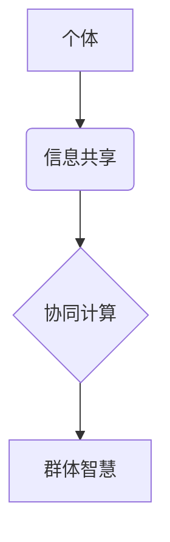

                 

## 群体智慧：人类计算的无限潜力

> 关键词：群体智慧、人类计算、协同计算、分布式算法、机器学习、数据分析、决策支持、社会网络

## 1. 背景介绍

在信息时代，数据爆炸式增长，人类面临着前所未有的信息处理挑战。传统的单机计算模式已难以满足日益复杂的计算需求。而群体智慧，即通过将多个个体协同工作，发挥集体智慧，解决复杂问题的新兴计算模式，正逐渐成为解决这一挑战的关键。

群体智慧的概念源于生物学，模拟蜂群、鸟群等群体智能行为。在计算机领域，群体智慧被应用于各种场景，例如：

* **决策支持:** 通过收集和分析大量用户数据，群体智慧算法可以帮助企业做出更精准的决策。
* **预测分析:** 利用群体智慧，可以对市场趋势、用户行为等进行预测，为企业提供更有效的决策依据。
* **创意生成:** 群体智慧可以激发创意，帮助人们从不同的角度思考问题，找到更具创新性的解决方案。
* **问题解决:** 将复杂问题分解成多个子问题，由不同的个体协同解决，可以提高问题的解决效率。

## 2. 核心概念与联系

群体智慧的核心概念是将多个个体（例如计算机、传感器、人）连接起来，通过信息共享和协作，实现比单个个体更强大的计算能力。

**群体智慧架构**



**核心概念原理:**

* **个体智能:** 每个个体都具备一定的智能，能够独立完成部分任务。
* **信息共享:** 个体之间可以共享信息，例如数据、知识、经验等。
* **协同计算:** 个体通过协作，共同完成复杂任务。
* **自组织:** 群体智慧系统通常具有自组织能力，能够根据环境变化自动调整个体之间的关系和协作方式。

## 3. 核心算法原理 & 具体操作步骤

群体智慧算法种类繁多，其中一些常见的算法包括：

* **蚁群算法:** 借鉴蚂蚁寻找食物的路径优化策略，用于解决路径规划、资源分配等问题。
* **粒子群算法:** 模仿鸟群觅食的行为，用于优化函数、求解最优解等问题。
* **遗传算法:** 借鉴生物进化机制，用于解决优化、搜索等问题。

### 3.1  算法原理概述

以蚁群算法为例，其原理是模拟蚂蚁寻找食物的路径优化策略。蚂蚁在寻找食物的过程中，会留下信息素，引导其他蚂蚁沿着更优路径前进。

### 3.2  算法步骤详解

1. **初始化:** 随机生成若干个蚂蚁，每个蚂蚁都从起点出发。
2. **信息素更新:** 蚂蚁在移动过程中，会根据路径上的信息素浓度选择下一个节点。同时，蚂蚁也会根据路径长度和信息素浓度更新路径上的信息素浓度。
3. **路径构建:** 每个蚂蚁沿着选择的路径移动，直到到达终点。
4. **最优路径选择:** 根据所有蚂蚁的路径长度，选择最短的路径作为最优路径。

### 3.3  算法优缺点

**优点:**

* 能够找到全局最优解。
* 适应性强，能够处理复杂、非线性问题。
* 并行性好，能够利用多核处理器加速计算。

**缺点:**

* 算法收敛速度较慢。
* 需要大量的计算资源。
* 参数设置对算法性能影响较大。

### 3.4  算法应用领域

蚁群算法广泛应用于以下领域:

* **路径规划:** 优化交通路线、物流配送路线等。
* **资源分配:** 优化资源调度、任务分配等。
* **网络路由:** 优化网络流量路由。
* **机器学习:** 用于特征选择、分类等。

## 4. 数学模型和公式 & 详细讲解 & 举例说明

群体智慧算法的数学模型通常基于概率论、统计学和图论等学科。

### 4.1  数学模型构建

以蚁群算法为例，其数学模型可以描述为：

* **信息素更新公式:**

$$
\tau_{ij}(t+1) = (1-\rho)\tau_{ij}(t) + \sum_{k=1}^{m} \Delta \tau_{ij}^k
$$

其中:

* $\tau_{ij}(t)$ 表示时间 $t$ 时，路径 $ij$ 上的信息素浓度。
* $\rho$ 表示信息素挥发系数。
* $\Delta \tau_{ij}^k$ 表示第 $k$ 只蚂蚁在路径 $ij$ 上留下的信息素量。
* $m$ 表示蚂蚁的数量。

* **选择路径概率公式:**

$$
p_{ij}^k = \frac{\tau_{ij}(t)^\alpha \eta_{ij}^\beta}{\sum_{l \in N_i^k} \tau_{il}(t)^\alpha \eta_{il}^\beta}
$$

其中:

* $p_{ij}^k$ 表示第 $k$ 只蚂蚁选择路径 $ij$ 的概率。
* $\alpha$ 和 $\beta$ 是权重参数，控制信息素浓度和路径长度的影响。
* $N_i^k$ 表示蚂蚁 $k$ 在节点 $i$ 可达的节点集合。
* $\eta_{ij}$ 表示路径 $ij$ 的启发式信息，例如路径长度。

### 4.2  公式推导过程

信息素更新公式的推导过程是基于信息素的挥发和蚂蚁留下的信息素量之间的关系。选择路径概率公式的推导过程是基于蚂蚁选择路径的启发式策略，即蚂蚁倾向于选择信息素浓度高、路径长度短的路径。

### 4.3  案例分析与讲解

以TSP问题为例，蚁群算法可以用来找到最短的旅行路线。

假设有 $n$ 个城市，需要找到从城市 $1$ 出发，经过所有城市，最后返回城市 $1$ 的最短路线。

蚁群算法可以将这个问题转化为路径规划问题，每个城市作为节点，路径作为边。

通过信息素更新和路径选择概率公式，蚁群算法可以逐步找到最短的旅行路线。

## 5. 项目实践：代码实例和详细解释说明

### 5.1  开发环境搭建

* 操作系统: Ubuntu 20.04
* 编程语言: Python 3.8
* 库依赖: NetworkX, matplotlib

### 5.2  源代码详细实现

```python
import networkx as nx
import matplotlib.pyplot as plt

# 定义城市坐标
cities = {
    'A': (0, 0),
    'B': (1, 1),
    'C': (2, 0),
    'D': (1, -1),
}

# 创建图
graph = nx.Graph()
graph.add_nodes_from(cities)
for city1 in cities:
    for city2 in cities:
        if city1 != city2:
            graph.add_edge(city1, city2, weight=nx.distance.euclidean(cities[city1], cities[city2]))

# 蚁群算法实现
def ant_colony_optimization(graph, num_ants, iterations):
    # ...

# 运行蚁群算法
result = ant_colony_optimization(graph, num_ants=10, iterations=100)

# 显示结果
nx.draw(graph, with_labels=True, node_color='skyblue', node_size=500)
plt.show()
```

### 5.3  代码解读与分析

* 代码首先定义了城市坐标和创建了图结构。
* 然后，定义了蚁群算法的实现函数，其中包含信息素更新和路径选择概率公式的实现。
* 最后，运行蚁群算法并显示结果。

### 5.4  运行结果展示

运行结果将显示出蚁群算法找到的最短旅行路线。

## 6. 实际应用场景

群体智慧算法已广泛应用于以下领域:

* **金融领域:** 股票预测、风险管理、欺诈检测等。
* **医疗领域:** 疾病诊断、药物研发、医疗资源分配等。
* **交通领域:** 交通流量预测、路线规划、智能交通系统等。
* **能源领域:** 能源调度、电力系统优化等。

### 6.4  未来应用展望

随着人工智能、大数据、物联网等技术的快速发展，群体智慧算法的应用场景将更加广泛。

例如:

* **个性化推荐:** 基于用户行为数据，群体智慧算法可以提供更精准的个性化推荐。
* **自动驾驶:** 群体智慧算法可以帮助自动驾驶汽车更好地感知周围环境，做出更安全的决策。
* **智能制造:** 群体智慧算法可以优化生产流程，提高生产效率。

## 7. 工具和资源推荐

### 7.1  学习资源推荐

* **书籍:**
    * 《群体智慧》
    * 《人工智能：现代方法》
* **在线课程:**
    * Coursera: 人工智能
    * edX: 计算机科学导论

### 7.2  开发工具推荐

* **Python:** 广泛应用于群体智慧算法开发。
* **NetworkX:** 用于构建和分析图结构的Python库。
* **Scikit-learn:** 用于机器学习算法开发的Python库。

### 7.3  相关论文推荐

* **Ant Colony Optimization: A Metaheuristic Approach to Problem Solving**
* **Particle Swarm Optimization: A Tutorial**
* **Genetic Algorithms: A Practical Guide**

## 8. 总结：未来发展趋势与挑战

群体智慧算法作为一种新兴的计算模式，具有巨大的潜力。未来发展趋势包括:

* **算法效率提升:** 研究更有效的群体智慧算法，提高算法的收敛速度和解决问题的能力。
* **应用场景拓展:** 将群体智慧算法应用于更多领域，例如医疗、教育、文化等。
* **理论研究深入:** 深入研究群体智慧算法的理论基础，例如自组织、协同进化等。

群体智慧算法也面临着一些挑战:

* **参数设置:** 群体智慧算法的参数设置对算法性能影响较大，需要进行大量的实验和调优。
* **数据依赖:** 群体智慧算法需要大量的真实数据进行训练和测试，数据质量直接影响算法性能。
* **解释性:** 群体智慧算法的决策过程相对复杂，难以解释算法的决策结果。

## 9. 附录：常见问题与解答

**Q1: 群体智慧算法与机器学习有什么区别？**

**A1:** 群体智慧算法和机器学习都是人工智能领域的重要分支，但它们侧重点不同。机器学习主要通过训练模型，学习数据中的规律，而群体智慧算法则通过模拟生物群体智能行为，解决复杂问题。

**Q2: 群体智慧算法的应用场景有哪些？**

**A2:** 群体智慧算法的应用场景非常广泛，例如路径规划、资源分配、网络路由、机器学习等。

**Q3: 如何选择合适的群体智慧算法？**

**A3:** 选择合适的群体智慧算法需要根据具体问题特点进行选择。例如，对于路径规划问题，蚁群算法是一个不错的选择；对于优化问题，粒子群算法是一个更合适的选项。


作者：禅与计算机程序设计艺术 / Zen and the Art of Computer Programming 
<end_of_turn>

