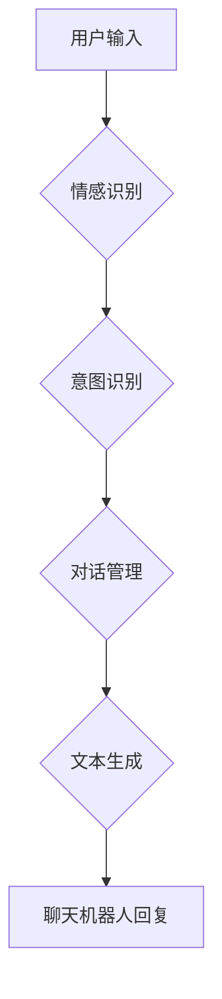

                 

## 聊天机器人情感：表达情感以增强用户体验

> 关键词：聊天机器人、情感计算、自然语言处理、用户体验、机器学习、深度学习

### 1. 背景介绍

随着人工智能技术的飞速发展，聊天机器人已经从简单的问答系统演变为能够进行自然对话、理解用户意图并提供个性化服务的智能助手。然而，传统的聊天机器人往往缺乏情感表达能力，导致用户体验单调乏味，难以建立深层次的连接。

情感计算作为人工智能的一个重要分支，致力于理解、识别和模拟人类的情感。将情感计算技术融入聊天机器人，使其能够感知用户的情绪，并做出相应的回应，将极大地提升用户体验，使聊天机器人更加人性化、智能化。

### 2. 核心概念与联系

#### 2.1 情感计算

情感计算旨在理解、识别和模拟人类的情感。它涵盖了多个领域，包括：

* **情感识别:** 从文本、语音、面部表情等数据中识别用户的具体情感，例如快乐、悲伤、愤怒、恐惧等。
* **情感分类:** 将情感归类到更广泛的类别中，例如积极、消极、中性等。
* **情感分析:** 分析文本或对话中的情感倾向，例如对某个主题的正面或负面评价。
* **情感合成:** 生成能够表达特定情感的文本、语音或图像。

#### 2.2 自然语言处理

自然语言处理 (NLP) 旨在使计算机能够理解和处理人类语言。它涉及以下关键技术：

* **文本分析:** 分析文本结构、语法和语义。
* **文本分类:** 将文本归类到预定义的类别中。
* **情感分析:** 分析文本中的情感倾向。
* **机器翻译:** 将文本从一种语言翻译成另一种语言。

#### 2.3 聊天机器人

聊天机器人是一种能够与人类进行自然对话的软件程序。它通常使用自然语言处理技术来理解用户输入，并生成相应的回复。

**Mermaid 流程图:**



### 3. 核心算法原理 & 具体操作步骤

#### 3.1 算法原理概述

情感识别算法通常基于机器学习或深度学习技术。

* **机器学习:** 使用训练数据来学习情感与文本特征之间的关系，并构建情感分类模型。常见的机器学习算法包括支持向量机 (SVM)、朴素贝叶斯 (Naive Bayes) 和决策树 (Decision Tree)。
* **深度学习:** 使用多层神经网络来学习更复杂的文本表示，并实现更精准的情感识别。常见的深度学习模型包括循环神经网络 (RNN)、长短期记忆网络 (LSTM) 和卷积神经网络 (CNN)。

#### 3.2 算法步骤详解

1. **数据收集:** 收集包含文本和情感标签的数据集，例如电影评论、社交媒体帖子等。
2. **数据预处理:** 对文本数据进行清洗、分词、词干提取等预处理操作，以便于模型训练。
3. **特征提取:** 从文本数据中提取情感相关的特征，例如单词、词组、语法结构等。
4. **模型训练:** 使用机器学习或深度学习算法对训练数据进行训练，构建情感识别模型。
5. **模型评估:** 使用测试数据评估模型的性能，例如准确率、召回率、F1-score等。
6. **模型部署:** 将训练好的模型部署到聊天机器人系统中，用于识别用户输入的情感。

#### 3.3 算法优缺点

**优点:**

* **高准确率:** 深度学习模型能够学习更复杂的文本表示，实现更高的情感识别准确率。
* **可扩展性:** 深度学习模型可以轻松扩展到处理更大的数据集和更复杂的语言。
* **自动化:** 情感识别算法可以自动化识别用户情绪，无需人工干预。

**缺点:**

* **数据依赖:** 深度学习模型需要大量的训练数据才能达到较高的准确率。
* **计算资源:** 训练深度学习模型需要大量的计算资源和时间。
* **解释性:** 深度学习模型的决策过程难以解释，难以理解模型是如何识别情感的。

#### 3.4 算法应用领域

情感识别算法广泛应用于以下领域:

* **聊天机器人:** 使聊天机器人能够感知用户情绪，并做出相应的回应。
* **社交媒体分析:** 分析社交媒体数据中的情感倾向，了解用户对品牌、产品或事件的看法。
* **市场调研:** 收集用户对产品或服务的反馈，了解用户需求和满意度。
* **客户服务:** 自动识别客户情绪，提供更精准的客户服务。
* **医疗保健:** 分析患者的语言和行为，识别潜在的心理健康问题。

### 4. 数学模型和公式 & 详细讲解 & 举例说明

#### 4.1 数学模型构建

情感识别模型通常基于分类模型，例如逻辑回归、支持向量机或神经网络。这些模型将文本特征映射到情感类别，并学习情感类别之间的概率分布。

#### 4.2 公式推导过程

**逻辑回归:**

逻辑回归模型使用 sigmoid 函数将线性模型的输出映射到 0 到 1 之间的概率值，表示情感类别属于某个类别的概率。

$$
P(y=1|x) = \frac{1}{1 + e^{-(w^T x + b)}}
$$

其中：

* $P(y=1|x)$ 是情感类别为 1 的概率。
* $x$ 是文本特征向量。
* $w$ 是权重向量。
* $b$ 是偏置项。

**支持向量机:**

支持向量机模型试图找到一个最佳的分隔超平面，将不同情感类别的样本分开。

#### 4.3 案例分析与讲解

**电影评论情感分类:**

假设我们有一个包含电影评论和情感标签的数据集，例如：

* “这部电影太棒了！” (正面)
* “这部电影很无聊。” (负面)

我们可以使用情感识别模型对新的电影评论进行分类。例如，对于评论 “这部电影很有趣”，模型可能会预测其情感类别为正面。

### 5. 项目实践：代码实例和详细解释说明

#### 5.1 开发环境搭建

* Python 3.x
* TensorFlow 或 PyTorch
* NLTK 或 spaCy

#### 5.2 源代码详细实现

```python
import tensorflow as tf

# 定义模型结构
model = tf.keras.Sequential([
    tf.keras.layers.Embedding(input_dim=vocab_size, output_dim=embedding_dim),
    tf.keras.layers.LSTM(units=128),
    tf.keras.layers.Dense(units=num_classes, activation='softmax')
])

# 编译模型
model.compile(optimizer='adam',
              loss='sparse_categorical_crossentropy',
              metrics=['accuracy'])

# 训练模型
model.fit(x_train, y_train, epochs=10)

# 评估模型
loss, accuracy = model.evaluate(x_test, y_test)
print('Loss:', loss)
print('Accuracy:', accuracy)

# 预测情感
prediction = model.predict(x_new)
```

#### 5.3 代码解读与分析

* **Embedding 层:** 将单词映射到低维向量空间，捕捉单词之间的语义关系。
* **LSTM 层:** 学习文本序列中的长期依赖关系，理解上下文信息。
* **Dense 层:** 将 LSTM 输出映射到情感类别，并使用 softmax 函数输出每个类别的概率。
* **编译模型:** 指定优化器、损失函数和评估指标。
* **训练模型:** 使用训练数据训练模型，更新模型参数。
* **评估模型:** 使用测试数据评估模型的性能。
* **预测情感:** 使用训练好的模型对新的文本进行预测。

#### 5.4 运行结果展示

运行结果将显示模型的训练损失、准确率以及对测试数据的预测结果。

### 6. 实际应用场景

#### 6.1 聊天机器人客服

情感识别可以帮助聊天机器人客服更好地理解客户的需求和情绪，提供更个性化和有效的服务。例如，如果客户表达出沮丧的情绪，客服可以提供更贴心的安慰和帮助。

#### 6.2 社交媒体监控

情感识别可以用于监控社交媒体平台上的舆情，了解用户对品牌、产品或事件的看法。例如，如果发现用户对某个产品的评价 overwhelmingly 负面，企业可以及时采取措施进行改进。

#### 6.3 市场调研

情感识别可以帮助企业收集用户对产品或服务的反馈，了解用户需求和满意度。例如，可以通过分析用户对产品评论的情感倾向，了解用户对产品功能的满意度。

#### 6.4 教育领域

情感识别可以用于分析学生的学习情绪，帮助老师更好地了解学生的学习状态和需求。例如，如果发现学生表现出焦虑或沮丧的情绪，老师可以提供相应的帮助和支持。

#### 6.5 医疗保健

情感识别可以用于分析患者的语言和行为，识别潜在的心理健康问题。例如，可以通过分析患者的聊天记录，识别出可能患有抑郁症或焦虑症的患者。

### 6.5 未来应用展望

随着人工智能技术的不断发展，情感识别技术将应用于更多领域，例如：

* **个性化教育:** 根据学生的学习情绪，提供个性化的学习内容和教学方法。
* **精准医疗:** 根据患者的情绪状态，调整治疗方案，提高治疗效果。
* **人机交互:** 使人机交互更加自然、人性化。

### 7. 工具和资源推荐

#### 7.1 学习资源推荐

* **Stanford CS224N: Natural Language Processing with Deep Learning:** https://web.stanford.edu/class/cs224n/
* **Deep Learning Specialization by Andrew Ng:** https://www.deeplearning.ai/

#### 7.2 开发工具推荐

* **TensorFlow:** https://www.tensorflow.org/
* **PyTorch:** https://pytorch.org/

#### 7.3 相关论文推荐

* **Recurrent Neural Network for Text Classification:** https://arxiv.org/abs/1408.5882
* **Attention Is All You Need:** https://arxiv.org/abs/1706.03762

### 8. 总结：未来发展趋势与挑战

#### 8.1 研究成果总结

情感识别技术取得了显著的进展，能够识别多种情感类型，并应用于多个领域。

#### 8.2 未来发展趋势

* **更精准的情感识别:** 研究更先进的算法和模型，提高情感识别准确率。
* **多模态情感识别:** 将文本、语音、面部表情等多种模态信息融合，实现更全面的情感识别。
* **情感生成:** 研究生成能够表达特定情感的文本、语音或图像。

#### 8.3 面临的挑战

* **数据标注:** 情感识别模型需要大量的标注数据，数据标注成本高昂。
* **跨文化差异:** 情感表达方式存在文化差异，需要开发能够跨文化理解情感的模型。
* **伦理问题:** 情感识别技术可能被用于监控和控制用户，需要关注其伦理问题。

#### 8.4 研究展望

未来，情感识别技术将继续发展，应用于更多领域，为人类生活带来更多便利和福祉。


### 9. 附录：常见问题与解答

#### 9.1 如何选择合适的算法？

选择合适的算法取决于具体应用场景和数据特点。

* **文本数据量较小:** 可以使用机器学习算法，例如 SVM 或 Naive Bayes。
* **文本数据量较大:** 可以使用深度学习算法，例如 RNN 或 LSTM。

#### 9.2 如何处理文本数据？

文本数据需要进行预处理，例如：

* **清洗:** 去除停用词、标点符号等无用信息。
* **分词:** 将文本分割成单词或词组。
* **词干提取:** 将单词提取到词干形式。

#### 9.3 如何评估模型性能？

可以使用以下指标评估模型性能：

* **准确率:** 正确分类样本的比例。
* **召回率:** 识别出所有正样本的比例。
* **F1-score:** 准确率和召回率的 harmonic mean。


作者：禅与计算机程序设计艺术 / Zen and the Art of Computer Programming 
<end_of_turn>

