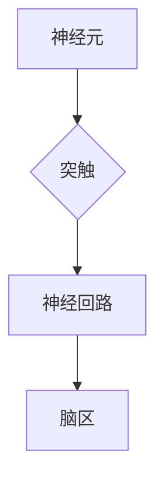

                 

## 脑图谱绘制技术：深入理解大脑工作原理

> 关键词：脑图谱、神经网络、图数据库、机器学习、人工智能、生物信息学、数据可视化

## 1. 背景介绍

人类大脑是世界上最复杂、最强大的计算系统，其运作机制至今仍是一个未解之谜。理解大脑的工作原理对于人工智能、医学、认知科学等领域都具有重大意义。脑图谱绘制技术作为一种新兴的跨学科研究领域，旨在构建大脑的完整结构和功能图谱，为深入理解大脑工作原理提供新的视角和工具。

近年来，随着神经科学、生物信息学、计算机科学等领域的快速发展，脑图谱绘制技术取得了显著进展。从早期基于手工标注的脑图谱到如今利用人工智能和机器学习算法自动构建脑图谱，技术手段不断革新。

## 2. 核心概念与联系

脑图谱绘制技术的核心概念包括：

* **神经元：**大脑的基本功能单元，负责接收、处理和传递信息。
* **突触：**神经元之间连接的结构，通过突触传递神经信号。
* **神经回路：**由多个神经元和突触组成的连接网络，负责执行特定的功能。
* **脑区：**大脑中具有特定功能的区域，例如视觉皮层、听觉皮层等。

这些概念相互关联，构成大脑复杂的神经网络结构。

**Mermaid 流程图：**



## 3. 核心算法原理 & 具体操作步骤

### 3.1  算法原理概述

脑图谱绘制技术主要依赖于以下核心算法：

* **图像处理和分析算法：**用于从脑部扫描图像中提取神经元、突触等结构信息。
* **机器学习算法：**用于识别和分类神经元类型、预测突触连接强度等。
* **图数据库算法：**用于存储和管理脑图谱数据，并进行高效查询和分析。

### 3.2  算法步骤详解

1. **数据获取：**收集脑部扫描图像数据，例如MRI、DTI等。
2. **图像预处理：**对图像进行噪声去除、增强等预处理，提高图像质量。
3. **神经元和突触检测：**利用图像处理和分析算法，从图像中识别和定位神经元和突触。
4. **神经元类型分类：**利用机器学习算法，根据神经元的形态、位置等特征，将其分类为不同的类型。
5. **突触连接预测：**利用机器学习算法，预测神经元之间的突触连接强度和方向。
6. **脑图谱构建：**将检测到的神经元、突触和连接信息存储到图数据库中，构建脑图谱。
7. **数据可视化：**利用数据可视化技术，将脑图谱以直观的方式展示出来。

### 3.3  算法优缺点

**优点：**

* 可以构建大脑的完整结构和功能图谱。
* 可以揭示大脑中复杂的神经网络结构和功能机制。
* 可以为人工智能、医学、认知科学等领域提供新的研究工具和思路。

**缺点：**

* 脑图谱绘制技术仍然处于早期阶段，面临着许多技术挑战。
* 现有的算法和技术手段难以完全捕捉大脑的复杂性。
* 脑图谱数据量巨大，存储和分析需要强大的计算能力。

### 3.4  算法应用领域

脑图谱绘制技术在以下领域具有广泛的应用前景：

* **人工智能：**构建更智能、更接近人类大脑的 AI 系统。
* **医学：**诊断和治疗神经系统疾病，例如阿尔茨海默病、帕金森病等。
* **认知科学：**研究大脑的认知功能，例如记忆、学习、决策等。
* **教育：**开发更有效的教育方法，帮助学生更好地理解大脑的工作原理。

## 4. 数学模型和公式 & 详细讲解 & 举例说明

### 4.1  数学模型构建

脑图谱绘制技术可以利用图论和网络科学中的数学模型来描述大脑的结构和功能。

* **图论模型：**将神经元视为图的节点，突触视为图的边，脑图谱可以表示为一个复杂的图结构。
* **网络科学模型：**利用网络拓扑结构、节点度分布、连接强度等指标来描述大脑网络的特性。

### 4.2  公式推导过程

例如，可以利用以下公式计算脑图谱中神经元的平均度：

$$
\bar{k} = \frac{\sum_{i=1}^{N} k_i}{N}
$$

其中：

* $\bar{k}$ 表示神经元的平均度。
* $N$ 表示神经元的总数。
* $k_i$ 表示第 $i$ 个神经元的度，即连接到该神经元的突触数量。

### 4.3  案例分析与讲解

通过分析脑图谱的数学模型和公式，可以揭示大脑网络的特性，例如：

* **小世界性：**大脑网络具有短路径和高聚类系数的特性，这意味着信息在脑中可以快速传播，同时不同脑区之间也存在着紧密的联系。
* **尺度自由性：**大脑网络的度分布遵循幂律分布，这意味着存在着少数高度节点和多数低度节点。

## 5. 项目实践：代码实例和详细解释说明

### 5.1  开发环境搭建

* 操作系统：Linux/macOS/Windows
* 编程语言：Python
* 软件包：

    * NumPy
    * Scikit-learn
    * NetworkX
    * Matplotlib

### 5.2  源代码详细实现

```python
import numpy as np
from sklearn.cluster import KMeans
from networkx import Graph

# 假设 brain_data 是脑部扫描图像数据
# 使用图像处理算法提取神经元和突触信息
# ...

# 将神经元信息存储到一个列表中
neurons = []
# ...

# 使用 KMeans 算法对神经元进行分类
kmeans = KMeans(n_clusters=5)
kmeans.fit(neurons)
# 将神经元分类结果存储到每个神经元的属性中
for i, neuron in enumerate(neurons):
    neuron['cluster'] = kmeans.labels_[i]

# 创建一个图数据库
brain_graph = Graph()
# 将神经元添加到图数据库中
for neuron in neurons:
    brain_graph.add_node(neuron['id'], cluster=neuron['cluster'])
# 将突触连接添加到图数据库中
# ...

# 使用 Matplotlib 绘制脑图谱
# ...
```

### 5.3  代码解读与分析

* 代码首先使用图像处理算法从脑部扫描图像数据中提取神经元和突触信息。
* 然后，使用 KMeans 算法对神经元进行分类，并将分类结果存储到每个神经元的属性中。
* 接着，创建了一个图数据库，并将神经元和突触连接添加到图数据库中。
* 最后，使用 Matplotlib 绘制脑图谱。

### 5.4  运行结果展示

运行代码后，可以生成一个可视化的脑图谱，展示神经元之间的连接关系和不同神经元类型的分布。

## 6. 实际应用场景

脑图谱绘制技术在以下实际应用场景中发挥着重要作用：

* **疾病诊断和治疗：**通过分析脑图谱，可以识别与疾病相关的脑区和神经回路，为疾病诊断和治疗提供新的依据。例如，研究发现阿尔茨海默病患者的脑图谱中存在着特定的连接模式，可以帮助早期诊断和治疗。
* **个性化医疗：**每个人的脑图谱都是独一无二的，可以根据个人的脑图谱来制定个性化的治疗方案。
* **脑机接口：**脑图谱绘制技术可以帮助开发更精准的脑机接口，实现人机交互的新模式。

### 6.4  未来应用展望

未来，脑图谱绘制技术将应用于更广泛的领域，例如：

* **教育：**开发基于脑图谱的个性化学习系统，帮助学生更好地理解和记忆知识。
* **艺术创作：**利用脑图谱来创作新的艺术作品，例如音乐、绘画、舞蹈等。
* **科学研究：**脑图谱绘制技术可以为认知科学、神经科学、生物信息学等领域的研究提供新的工具和思路。

## 7. 工具和资源推荐

### 7.1  学习资源推荐

* **书籍：**

    * 《The Brain That Changes Itself》 by Norman Doidge
    * 《Principles of Neural Science》 by Eric Kandel

* **在线课程：**

    * Coursera: Neuroscience Specialization
    * edX: Introduction to Neuroscience

### 7.2  开发工具推荐

* **图像处理软件：**

    * ImageJ
    * Fiji

* **图数据库软件：**

    * Neo4j
    * OrientDB

* **数据可视化工具：**

    * Gephi
    * Cytoscape

### 7.3  相关论文推荐

* **Brain Connectivity:** https://www.ncbi.nlm.nih.gov/pmc/articles/PMC4819663/
* **Brain Mapping:** https://www.nature.com/articles/s41586-019-1614-4

## 8. 总结：未来发展趋势与挑战

### 8.1  研究成果总结

脑图谱绘制技术取得了显著进展，为理解大脑工作原理提供了新的视角和工具。

### 8.2  未来发展趋势

未来，脑图谱绘制技术将朝着以下方向发展：

* **更高分辨率的脑图谱：**利用更先进的成像技术，构建更高分辨率的脑图谱，揭示大脑中更微观的结构和功能。
* **更精准的脑图谱：**利用人工智能和机器学习算法，提高脑图谱的准确性和可靠性。
* **更全面的脑图谱：**不仅构建大脑的结构图谱，还要构建大脑的功能图谱，例如神经元活动模式、突触连接强度等。

### 8.3  面临的挑战

脑图谱绘制技术仍然面临着许多挑战：

* **数据获取和处理：**脑部扫描图像数据量巨大，处理和分析需要强大的计算能力。
* **算法开发：**需要开发更先进的算法，才能更好地捕捉大脑的复杂性。
* **伦理问题：**脑图谱数据包含着个人隐私信息，需要妥善处理和保护。

### 8.4  研究展望

尽管面临着挑战，但脑图谱绘制技术的前景依然光明。随着技术的不断发展，相信未来我们将能够构建出更完整、更精准、更全面的脑图谱，为理解大脑工作原理提供更深入的洞察。

## 9. 附录：常见问题与解答

* **Q：脑图谱绘制技术需要哪些硬件设备？**

    A：脑图谱绘制技术需要强大的计算能力，建议使用高性能服务器或云计算平台。

* **Q：脑图谱绘制技术有哪些应用场景？**

    A：脑图谱绘制技术在医学诊断、治疗、个性化医疗、脑机接口、教育等领域都有广泛的应用前景。

* **Q：脑图谱绘制技术有哪些伦理问题？**

    A：脑图谱数据包含着个人隐私信息，需要妥善处理和保护。


作者：禅与计算机程序设计艺术 / Zen and the Art of Computer Programming 
<end_of_turn>

