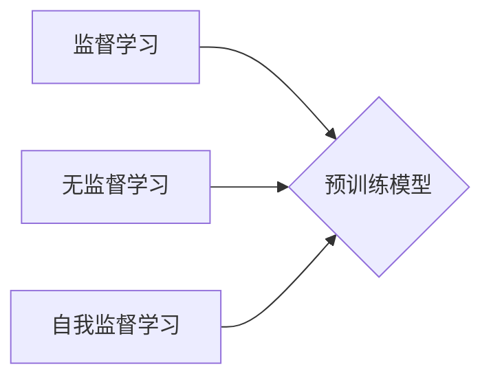

                 

## 自我监督学习在AI发展中的重要性

> 关键词：自我监督学习、无监督学习、监督学习、深度学习、迁移学习、数据增强、预训练模型

## 1. 背景介绍

人工智能（AI）的蓬勃发展离不开海量数据的支持。传统监督学习算法依赖于人工标注的数据，但标注数据成本高昂且耗时，难以满足AI模型训练的巨大需求。因此，探索无需人工标注数据的学习方式成为AI研究的热点。无监督学习作为一种无需人工标注数据就能从数据中学习模式和结构的学习方式，逐渐受到关注。

自我监督学习（Self-Supervised Learning，SSL）作为无监督学习的一种重要分支，通过设计巧妙的预训练任务，利用数据本身的结构和规律，为模型提供有价值的学习信号。与传统的无监督学习相比，SSL更接近监督学习，能够更好地学习数据的潜在表示，从而提升模型的泛化能力和最终性能。

## 2. 核心概念与联系

### 2.1 核心概念

* **监督学习 (Supervised Learning):**  利用标记数据训练模型，模型学习输入与输出之间的映射关系。
* **无监督学习 (Unsupervised Learning):**  利用未标记数据训练模型，模型学习数据的内在结构和模式。
* **自我监督学习 (Self-Supervised Learning):**  通过设计特殊的预训练任务，利用数据本身的结构和规律，为模型提供有价值的学习信号，从而实现无监督学习。

### 2.2  架构关系



## 3. 核心算法原理 & 具体操作步骤

### 3.1 算法原理概述

自我监督学习的核心思想是将一个无监督学习任务转化为一个类似监督学习的任务。具体来说，SSL算法通常会设计一个预训练任务，该任务能够从未标记数据中学习到有价值的表示。然后，通过在预训练任务上训练模型，学习到的表示可以用于下游任务的微调，从而提升模型的性能。

### 3.2 算法步骤详解

1. **数据预处理:** 对原始数据进行清洗、转换和格式化，使其适合模型训练。
2. **预训练任务设计:** 设计一个能够从未标记数据中学习有价值表示的预训练任务。常见的预训练任务包括：
    * **图像分类:** 将图像分成不同的类别，并预测每个图像所属的类别。
    * **文本分类:** 将文本分成不同的类别，并预测每个文本所属的类别。
    * **语言建模:** 预测文本序列中的下一个词。
    * **图像修复:** 预测图像中缺失的部分。
3. **模型训练:** 使用预训练任务训练模型，学习数据的潜在表示。
4. **下游任务微调:** 将预训练模型用于下游任务的微调，提升模型的性能。

### 3.3 算法优缺点

**优点:**

* **无需人工标注数据:** 可以利用海量未标记数据进行训练，降低数据标注成本。
* **提升模型泛化能力:** 通过学习数据的潜在表示，可以提升模型的泛化能力，使其能够更好地应对未知数据。
* **迁移学习:** 预训练模型可以迁移到其他下游任务中，提高训练效率和性能。

**缺点:**

* **预训练任务设计:** 设计有效的预训练任务是SSL的关键，但并非易事。
* **训练效率:** SSL模型的训练时间通常比监督学习模型长。
* **性能瓶颈:**  SSL模型的性能可能仍然低于监督学习模型，尤其是在数据量较少的情况下。

### 3.4 算法应用领域

* **计算机视觉:** 图像分类、目标检测、图像分割、图像生成等。
* **自然语言处理:** 文本分类、情感分析、机器翻译、文本摘要等。
* **语音识别:** 语音转文本、语音合成等。
* **推荐系统:** 商品推荐、用户画像等。

## 4. 数学模型和公式 & 详细讲解 & 举例说明

### 4.1 数学模型构建

假设我们有一个数据集 D = {x1, x2, ..., xn}，其中 xi 是一个输入样本。在自我监督学习中，我们通常会设计一个预测任务，例如预测输入样本的下一个词。

我们可以使用一个神经网络模型 f(x) 来预测下一个词，其中 f(x) 是一个从输入样本 x 到输出词的映射函数。

### 4.2 公式推导过程

为了训练模型 f(x)，我们需要定义一个损失函数 L(f(x), y)，其中 y 是真实标签。常见的损失函数包括交叉熵损失函数和均方误差损失函数。

模型的训练目标是最小化损失函数 L(f(x), y)。可以使用梯度下降算法或其他优化算法来更新模型参数，从而最小化损失函数。

### 4.3 案例分析与讲解

**语言建模:**

假设我们有一个文本序列 "The cat sat on the mat"，我们希望模型能够预测下一个词。

我们可以使用一个语言模型来预测下一个词。语言模型通常是一个循环神经网络（RNN）或Transformer模型。

模型会将文本序列中的每个词作为输入，并预测下一个词的概率分布。

在训练过程中，模型会使用交叉熵损失函数来计算预测结果与真实标签之间的差异。

通过最小化损失函数，模型能够学习到文本序列中的语义关系和语法规则，从而更好地预测下一个词。

## 5. 项目实践：代码实例和详细解释说明

### 5.1 开发环境搭建

* Python 3.6+
* TensorFlow 或 PyTorch
* CUDA 和 cuDNN (可选，用于GPU加速)

### 5.2 源代码详细实现

```python
import tensorflow as tf

# 定义一个简单的语言模型
class LanguageModel(tf.keras.Model):
    def __init__(self, vocab_size, embedding_dim, hidden_dim):
        super(LanguageModel, self).__init__()
        self.embedding = tf.keras.layers.Embedding(vocab_size, embedding_dim)
        self.lstm = tf.keras.layers.LSTM(hidden_dim)
        self.dense = tf.keras.layers.Dense(vocab_size)

    def call(self, inputs):
        x = self.embedding(inputs)
        x = self.lstm(x)
        x = self.dense(x)
        return x

# 构建模型
model = LanguageModel(vocab_size=10000, embedding_dim=128, hidden_dim=256)

# 定义损失函数和优化器
loss_fn = tf.keras.losses.SparseCategoricalCrossentropy()
optimizer = tf.keras.optimizers.Adam()

# 训练模型
# ...

```

### 5.3 代码解读与分析

* **模型结构:** 该代码定义了一个简单的语言模型，包含嵌入层、LSTM层和全连接层。
* **嵌入层:** 将每个词转换为一个低维向量表示。
* **LSTM层:** 学习文本序列中的上下文信息。
* **全连接层:** 将 LSTM层的输出映射到每个词的概率分布。
* **损失函数:** 使用交叉熵损失函数来计算预测结果与真实标签之间的差异。
* **优化器:** 使用Adam优化器来更新模型参数。

### 5.4 运行结果展示

* **训练过程:** 可以通过监控损失函数的变化来评估模型的训练效果。
* **预测结果:** 可以使用训练好的模型对新的文本序列进行预测，并评估预测结果的准确性。

## 6. 实际应用场景

### 6.1 图像分类

* **无标签图像分类:** 利用SSL算法从未标记的图像数据中学习图像特征，从而实现图像分类。
* **图像检索:** 利用SSL算法学习图像的语义表示，实现图像检索任务。

### 6.2 自然语言处理

* **文本生成:** 利用SSL算法训练语言模型，生成高质量的文本。
* **机器翻译:** 利用SSL算法训练机器翻译模型，提高翻译质量。

### 6.3 语音识别

* **语音增强:** 利用SSL算法从噪声语音中提取干净的语音信号。
* **语音识别:** 利用SSL算法训练语音识别模型，提高识别准确率。

### 6.4 未来应用展望

* **个性化推荐:** 利用SSL算法学习用户的个性化偏好，提供更精准的推荐。
* **医疗诊断:** 利用SSL算法分析医学图像和病历数据，辅助医生进行诊断。
* **自动驾驶:** 利用SSL算法训练自动驾驶模型，提高驾驶安全性。

## 7. 工具和资源推荐

### 7.1 学习资源推荐

* **书籍:**
    * "Deep Learning" by Ian Goodfellow, Yoshua Bengio, and Aaron Courville
    * "Hands-On Machine Learning with Scikit-Learn, Keras & TensorFlow" by Aurélien Géron
* **在线课程:**
    * Coursera: "Deep Learning Specialization" by Andrew Ng
    * Udacity: "Deep Learning Nanodegree"
* **博客和网站:**
    * Towards Data Science
    * Machine Learning Mastery

### 7.2 开发工具推荐

* **TensorFlow:** https://www.tensorflow.org/
* **PyTorch:** https://pytorch.org/
* **Keras:** https://keras.io/

### 7.3 相关论文推荐

* "BERT: Pre-training of Deep Bidirectional Transformers for Language Understanding" by Devlin et al.
* "ImageNet Classification with Deep Convolutional Neural Networks" by Krizhevsky et al.
* "SimCLR: A Simple Framework for Contrastive Learning of Visual Representations" by Chen et al.

## 8. 总结：未来发展趋势与挑战

### 8.1 研究成果总结

自我监督学习在近年来取得了显著进展，在计算机视觉、自然语言处理等领域取得了优异的性能。SSL算法能够有效利用未标记数据，提升模型的泛化能力和性能，为AI发展提供了新的思路和方法。

### 8.2 未来发展趋势

* **更有效的预训练任务设计:** 探索更有效的预训练任务，能够更好地学习数据的潜在表示。
* **多模态自我监督学习:** 将不同模态的数据融合在一起，进行自我监督学习，例如图像和文本的联合学习。
* **联邦学习与自我监督学习的结合:** 将联邦学习与自我监督学习相结合，能够在保护数据隐私的前提下进行模型训练。

### 8.3 面临的挑战

* **预训练任务的通用性:** 现有的预训练任务往往针对特定领域，缺乏通用性。
* **模型训练效率:** SSL模型的训练时间通常比监督学习模型长。
* **数据质量:** SSL算法对数据质量要求较高，数据噪声和偏差会影响模型性能。

### 8.4 研究展望

自我监督学习是一个充满挑战和机遇的领域，未来将会有更多新的算法、模型和应用场景涌现。随着技术的不断发展，SSL将成为推动AI发展的重要力量。

## 9. 附录：常见问题与解答

* **什么是自我监督学习？**

自我监督学习是一种利用未标记数据进行训练的机器学习方法，通过设计特殊的预训练任务，从数据本身中学习有价值的表示。

* **自我监督学习与监督学习有什么区别？**

监督学习需要人工标注的数据，而自我监督学习不需要人工标注数据。

* **自我监督学习有哪些应用场景？**

自我监督学习在计算机视觉、自然语言处理、语音识别等领域都有广泛的应用。

* **如何设计有效的预训练任务？**

设计有效的预训练任务是自我监督学习的关键，需要根据具体任务和数据特点进行设计。

* **自我监督学习有哪些挑战？**

自我监督学习面临着预训练任务的通用性、模型训练效率和数据质量等挑战。


作者：禅与计算机程序设计艺术 / Zen and the Art of Computer Programming 
<end_of_turn>

