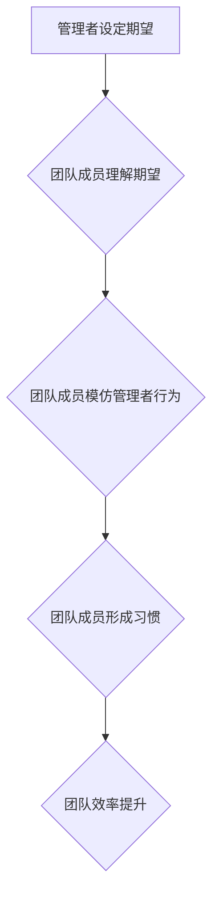

                 

## 行为模型:管理者塑造团队习惯的工具

> 关键词：团队习惯、行为模型、管理者、团队效能、文化建设、领导力、心理学、组织行为学

## 1. 背景介绍

在当今瞬息万变的科技时代，团队的效率和协作能力直接决定着企业的竞争力。而团队的效率和协作能力的基石，正是团队成员所形成的习惯。良好的团队习惯能够提升团队的凝聚力、执行力、创新力，最终推动企业发展。然而，团队习惯的形成并非一蹴而就，需要管理者通过有效的引导和塑造。

传统的管理模式往往侧重于任务分配和绩效考核，对团队习惯的培养重视程度相对较低。随着管理理念的不断发展，越来越多的管理者认识到团队习惯的重要性，并开始探索如何通过行为模型来塑造团队习惯。

## 2. 核心概念与联系

### 2.1 行为模型

行为模型是指描述个体或群体行为的框架或模式。它试图解释个体或群体在特定情境下做出特定行为的原因和机制。行为模型可以帮助我们理解团队成员的行为动机、行为模式以及行为的影响因素。

### 2.2 团队习惯

团队习惯是指团队成员在工作中反复出现的、自动化且潜移默化的行为模式。这些习惯可以是积极的，例如高效的沟通、快速的决策、良好的代码规范；也可以是消极的，例如拖延、缺乏沟通、混乱的代码结构。

### 2.3 管理者角色

管理者在塑造团队习惯方面扮演着至关重要的角色。他们需要通过以下方式影响团队成员的行为：

* **设定明确的期望:** 管理者需要明确地传达团队的价值观、目标和行为准则，让团队成员了解团队期望的行为模式。
* **提供榜样:** 管理者自身的言行举止是团队成员学习的榜样。管理者需要以身作则，展现出团队期望的行为模式。
* **提供反馈和奖励:** 管理者需要及时地对团队成员的行为进行反馈，并对积极的行为进行奖励，以强化团队期望的行为模式。
* **建立文化氛围:** 管理者需要营造一个鼓励合作、学习和成长的文化氛围，让团队成员愿意积极参与到团队习惯的塑造过程中。

**Mermaid 流程图**



## 3. 核心算法原理 & 具体操作步骤

### 3.1 算法原理概述

塑造团队习惯的核心算法原理是基于行为主义心理学和组织行为学的理论。行为主义心理学认为，行为是通过强化和惩罚来塑造的。组织行为学则强调团队文化和领导力的重要性。

### 3.2 算法步骤详解

1. **识别关键习惯:** 管理者需要首先识别出团队中需要改进的关键习惯，例如沟通效率、问题解决能力、代码质量等。
2. **设定明确的目标:** 管理者需要设定具体的、可衡量的、可实现的、相关的和有时间限制的目标，例如提高团队沟通效率 20%、减少代码缺陷 10%等。
3. **设计行为激励机制:** 管理者需要设计有效的行为激励机制，例如奖励机制、惩罚机制、公开表扬等，以强化团队期望的行为模式。
4. **提供持续的反馈和支持:** 管理者需要定期对团队成员的行为进行反馈，并提供必要的支持和指导，帮助团队成员逐步形成新的习惯。
5. **持续改进和优化:** 管理者需要不断观察和评估团队习惯的形成情况，并根据实际情况进行调整和优化，以确保团队习惯的持续改进。

### 3.3 算法优缺点

**优点:**

* **可操作性强:** 行为模型提供了一种具体的、可操作的框架，帮助管理者有效地塑造团队习惯。
* **数据驱动:** 行为模型可以结合数据分析，评估团队习惯的形成情况，并进行数据驱动的调整和优化。
* **可量化:** 行为模型可以将团队习惯的形成过程量化，方便管理者跟踪和评估团队进步。

**缺点:**

* **需要时间和耐心:** 塑造团队习惯是一个需要时间和耐心的过程，需要管理者持续的投入和引导。
* **难以预测:** 人的行为是复杂的，难以完全预测，因此行为模型也存在一定的局限性。
* **文化差异:** 不同的文化背景下，行为模型的应用效果可能有所不同。

### 3.4 算法应用领域

行为模型在团队管理、教育培训、个人成长等领域都有广泛的应用。

## 4. 数学模型和公式 & 详细讲解 & 举例说明

### 4.1 数学模型构建

我们可以用一个简单的数学模型来描述团队习惯的形成过程：

**习惯强度 = 频率 * 强度 * 持续时间**

其中：

* **频率:** 指团队成员执行特定行为的次数。
* **强度:** 指团队成员执行特定行为的投入程度。
* **持续时间:** 指团队成员执行特定行为的时间长度。

### 4.2 公式推导过程

这个模型的推导过程基于行为主义心理学中的强化学习理论。强化学习理论认为，重复执行某个行为，并得到相应的奖励，会强化这个行为，使其更容易被重复执行。

* **频率:** 频率越高，团队成员对特定行为的熟悉程度越高，更容易形成习惯。
* **强度:** 强度越高，团队成员对特定行为的投入程度越高，更容易形成习惯。
* **持续时间:** 持续时间越长，团队成员对特定行为的记忆和认知越深刻，更容易形成习惯。

### 4.3 案例分析与讲解

假设一个团队想要提高代码质量的习惯。

* **频率:** 团队可以每周进行一次代码审查，让团队成员定期检查和改进代码。
* **强度:** 团队可以制定严格的代码规范，并对违反规范的代码进行批评和纠正。
* **持续时间:** 团队可以持续地进行代码审查和规范改进，直到代码质量得到显著提升。

通过以上措施，团队可以提高代码审查的频率、强度和持续时间，从而强化代码质量的习惯。

## 5. 项目实践：代码实例和详细解释说明

### 5.1 开发环境搭建

为了演示如何使用行为模型来塑造团队习惯，我们可以创建一个简单的项目，模拟团队成员的代码提交行为。

开发环境：

* 操作系统：Windows/Linux/macOS
* 编程语言：Python
* 工具：Git、GitHub

### 5.2 源代码详细实现

```python
import random

class TeamMember:
    def __init__(self, name):
        self.name = name
        self.code_quality = 0

    def commit_code(self):
        # 模拟代码提交行为
        code_quality = random.randint(1, 5)
        self.code_quality += code_quality
        print(f"{self.name} 提交了代码，代码质量为 {code_quality}")

class TeamManager:
    def __init__(self, team_members):
        self.team_members = team_members

    def set_expectations(self):
        # 设置团队期望的代码质量标准
        print("团队目标：提高代码质量，平均代码质量达到 3 分以上")

    def provide_feedback(self):
        # 为团队成员提供代码质量反馈
        for member in self.team_members:
            print(f"{member.name} 的代码质量为 {member.code_quality}")

    def reward_good_performance(self):
        # 为代码质量高的团队成员提供奖励
        for member in self.team_members:
            if member.code_quality >= 3:
                print(f"恭喜 {member.name}，代码质量优秀，获得奖励!")

# 创建团队成员
team_members = [TeamMember("张三"), TeamMember("李四"), TeamMember("王五")]

# 创建团队经理
team_manager = TeamManager(team_members)

# 设置团队期望
team_manager.set_expectations()

# 模拟团队成员提交代码
for member in team_members:
    member.commit_code()

# 为团队成员提供反馈和奖励
team_manager.provide_feedback()
team_manager.reward_good_performance()
```

### 5.3 代码解读与分析

这段代码模拟了一个简单的团队环境，其中包含团队成员和团队经理。

* **TeamMember类:** 代表团队成员，拥有姓名和代码质量属性。
* **TeamManager类:** 代表团队经理，拥有团队成员列表，并提供设置期望、提供反馈和奖励等功能。

代码演示了团队经理如何设置团队期望、为团队成员提供反馈和奖励，从而引导团队成员提高代码质量。

### 5.4 运行结果展示

运行这段代码后，会输出团队成员提交代码的记录，以及团队经理对代码质量的反馈和奖励。

## 6. 实际应用场景

### 6.1 团队沟通

* **设定期望:** 团队经理可以明确规定团队成员的沟通方式、沟通频率和沟通内容。
* **设计激励机制:** 可以通过奖励机制鼓励团队成员积极参与沟通，例如定期进行团队会议，并对积极参与的成员进行表扬和奖励。
* **提供反馈:** 团队经理可以定期对团队成员的沟通行为进行反馈，例如指出沟通方式不当的地方，并提供改进建议。

### 6.2 代码质量

* **设定期望:** 团队经理可以制定严格的代码规范，并要求团队成员严格遵守。
* **设计激励机制:** 可以通过奖励机制鼓励团队成员编写高质量的代码，例如对编写高质量代码的成员进行奖励，并公开表彰。
* **提供反馈:** 团队经理可以定期对团队成员的代码进行审查，并提供具体的反馈和建议。

### 6.3 项目进度

* **设定期望:** 团队经理可以制定明确的项目进度计划，并要求团队成员严格按照计划执行。
* **设计激励机制:** 可以通过奖励机制鼓励团队成员按时完成任务，例如对按时完成任务的成员进行奖励，并公开表彰。
* **提供反馈:** 团队经理可以定期对团队成员的进度进行跟踪，并及时提供反馈和支持。

### 6.4 未来应用展望

随着人工智能技术的不断发展，行为模型在团队管理方面的应用将会更加广泛和深入。例如，我们可以利用人工智能技术来分析团队成员的行为数据，并提供更精准的反馈和建议。

## 7. 工具和资源推荐

### 7.1 学习资源推荐

* **书籍:**
    * 《行为模型:管理者塑造团队习惯的工具》
    * 《影响力》
    * 《高效能人士的七个习惯》
* **在线课程:**
    * Coursera: 人工智能与机器学习
    * Udemy: 行为心理学与团队管理

### 7.2 开发工具推荐

* **Git:** 版本控制工具
* **GitHub:** 代码托管平台
* **Slack:** 团队协作工具

### 7.3 相关论文推荐

* **《行为模型在团队管理中的应用》**
* **《人工智能技术在行为模型中的应用》**

## 8. 总结：未来发展趋势与挑战

### 8.1 研究成果总结

行为模型为团队管理提供了有效的理论框架和实践方法，能够帮助管理者塑造团队习惯，提升团队效能。

### 8.2 未来发展趋势

未来，行为模型的研究将更加注重以下几个方面：

* **个性化:** 针对不同个体和团队的差异，开发更加个性化的行为模型。
* **数据驱动:** 利用大数据分析技术，更加精准地分析团队成员的行为数据，并提供更有效的反馈和建议。
* **人工智能:** 利用人工智能技术，自动识别团队成员的行为模式，并提供个性化的行为指导。

### 8.3 面临的挑战

行为模型的应用也面临一些挑战：

* **文化差异:** 不同的文化背景下，行为模型的应用效果可能有所不同。
* **伦理问题:** 利用人工智能技术分析团队成员的行为数据，需要考虑伦理问题，避免侵犯个人隐私。
* **技术复杂性:** 开发和应用复杂的行为模型需要专业的技术支持。

### 8.4 研究展望

未来，我们需要继续深入研究行为模型，克服其面临的挑战，并将其应用于更广泛的领域，以更好地帮助团队实现高效协作和持续发展。

## 9. 附录：常见问题与解答

**问题 1:** 如何评估行为模型的有效性？

**解答:** 可以通过跟踪团队成员的行为变化、团队绩效的提升等指标来评估行为模型的有效性。

**问题 2:** 如何应对团队成员对行为模型的抵触情绪？

**解答:** 可以通过透明地解释行为模型的原理和目的，并征求团队成员的意见和建议，来降低团队成员的抵触情绪。

**问题 3:** 如何将行为模型与其他管理方法相结合？

**解答:** 行为模型可以与其他管理方法相结合，例如目标管理、绩效考核等，形成更加完整的管理体系。


作者：禅与计算机程序设计艺术 / Zen and the Art of Computer Programming 
<end_of_turn>

