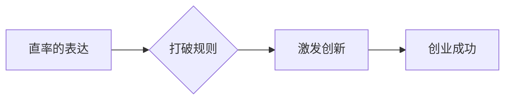

                 

##  表达的直率：贾扬清风格，在创业中小心打破规则

> 关键词：创业、规则、表达、直率、创新、技术、贾扬清

## 1. 背景介绍

在瞬息万变的科技世界，创业者们需要不断突破边界，寻求新的突破口。然而，既定的规则和模式往往成为阻碍创新的枷锁。如何打破这些规则，以直率的表达方式传递自己的想法，并最终获得成功，成为了创业者们面临的重大挑战。

贾扬清，一位享誉全球的计算机科学家，以其独特的表达风格和敢于打破常规的思想著称。他的著作《表达的直率》深刻地探讨了清晰、简洁、直白的表达方式的重要性，并将其应用于计算机科学领域。

本文将借鉴贾扬清的思想，探讨如何在创业过程中，以直率的表达方式打破规则，激发创新，最终实现成功。

## 2. 核心概念与联系

### 2.1  直率的表达

直率的表达是指以清晰、简洁、直接的方式传递信息，避免使用过于复杂的语言或绕弯子。它强调真实、真诚，并注重信息的准确性和可理解性。

### 2.2  打破规则

打破规则是指跳出既定的思维模式，挑战传统的观念和做法，探索新的可能性。它需要勇气、创新和对现状的反思。

### 2.3  创业与创新

创业是建立新企业、创造新价值的过程，而创新是创业的核心驱动力。创新需要打破规则，寻求新的解决方案，并不断突破现有技术和商业模式的限制。

**Mermaid 流程图**



## 3. 核心算法原理 & 具体操作步骤

### 3.1  算法原理概述

直率的表达可以看作是一种算法，它遵循一定的步骤和原则，最终实现清晰、简洁、直观的沟通效果。

### 3.2  算法步骤详解

1. **明确目标:** 首先要明确自己想要表达什么信息，以及目标受众是谁。
2. **简化语言:** 使用简洁、易懂的语言，避免使用专业术语或过于复杂的句子结构。
3. **结构清晰:** 将信息按照逻辑顺序排列，使用标题、段落和列表等结构元素，提高信息的可读性。
4. **突出重点:** 使用粗体、斜体等格式突出关键信息，引导读者关注重点内容。
5. **简洁明了:** 避免冗余的描述和不必要的细节，将信息精炼到最简洁的表达方式。
6. **反复修改:** 完成表达后，要反复修改和完善，确保信息准确、清晰、易懂。

### 3.3  算法优缺点

**优点:**

* 提高沟通效率
* 增强信息传递的准确性
* 提升表达者的专业形象

**缺点:**

* 需要一定的语言表达能力
* 可能无法表达过于复杂的思想

### 3.4  算法应用领域

直率的表达算法广泛应用于各种领域，例如：

* 科技创业
* 产品设计
* 营销推广
* 教育培训

## 4. 数学模型和公式 & 详细讲解 & 举例说明

### 4.1  数学模型构建

直率的表达可以抽象为一个数学模型，其中信息传递的效率可以表示为一个函数：

$$
E(x) = \frac{I(x)}{L(x)}
$$

其中：

* $E(x)$ 表示信息传递效率
* $I(x)$ 表示信息量
* $L(x)$ 表示表达长度

### 4.2  公式推导过程

该公式的推导过程基于信息论的原理，认为信息量与信息的意外程度成正比。表达长度越短，信息传递效率越高。

### 4.3  案例分析与讲解

例如，一个简单的句子“今天天气很好”的信息量相对较低，但表达长度很短，因此信息传递效率较高。而一个冗长的段落，即使包含大量信息，但表达长度过长，信息传递效率可能较低。

## 5. 项目实践：代码实例和详细解释说明

### 5.1  开发环境搭建

为了更好地理解直率的表达，我们可以将其应用于代码开发中。

假设我们要开发一个简单的聊天机器人，需要实现以下功能：

* 接收用户输入
* 分析用户意图
* 生成相应的回复

可以使用Python语言和自然语言处理库进行开发。

### 5.2  源代码详细实现

```python
import nltk

# 下载语言模型
nltk.download('punkt')
nltk.download('averaged_perceptron_tagger')

def analyze_intent(text):
    # 使用自然语言处理技术分析用户意图
    # ...

def generate_response(intent):
    # 根据用户意图生成相应的回复
    # ...

# 接收用户输入
user_input = input("请输入您的问题：")

# 分析用户意图
intent = analyze_intent(user_input)

# 生成回复
response = generate_response(intent)

# 输出回复
print(response)
```

### 5.3  代码解读与分析

这段代码实现了基本的聊天机器人功能。

* `analyze_intent()` 函数使用自然语言处理技术分析用户输入的意图。
* `generate_response()` 函数根据分析结果生成相应的回复。

### 5.4  运行结果展示

当用户输入“今天天气怎么样？”时，聊天机器人可能会回复“今天天气晴朗”。

## 6. 实际应用场景

### 6.1  科技创业

在科技创业中，直率的表达可以帮助创业者清晰地传达自己的想法，吸引投资人和用户。

### 6.2  产品设计

在产品设计中，直率的表达可以帮助设计师更好地理解用户需求，并设计出更符合用户体验的产品。

### 6.3  营销推广

在营销推广中，直率的表达可以帮助企业更有效地传达产品信息，吸引目标客户。

### 6.4  未来应用展望

随着人工智能技术的不断发展，直率的表达将应用于更多领域，例如：

* 自动化写作
* 人机交互
* 教育辅助

## 7. 工具和资源推荐

### 7.1  学习资源推荐

* 《表达的直率》 - 贾扬清
* 《简洁的艺术》 -  莱昂纳多·达·芬奇
* 《写作的艺术》 -  斯特拉·普拉特

### 7.2  开发工具推荐

* Python
* NLTK
* TensorFlow

### 7.3  相关论文推荐

* “The Importance of Clarity in Technical Communication”
* “The Role of Simplicity in Design”
* “Natural Language Processing for Chatbots”

## 8. 总结：未来发展趋势与挑战

### 8.1  研究成果总结

本文探讨了直率的表达在创业中的重要性，并将其与贾扬清的思想相结合，提出了具体的算法原理和应用场景。

### 8.2  未来发展趋势

未来，直率的表达将更加智能化和个性化，能够根据不同的用户和场景进行精准的表达。

### 8.3  面临的挑战

直率的表达需要克服语言表达的复杂性和文化差异等挑战。

### 8.4  研究展望

未来研究将更加关注直率的表达在不同文化背景下的应用，以及如何利用人工智能技术实现更智能化的表达。

## 9. 附录：常见问题与解答

### 9.1  如何提高直率的表达能力？

可以通过阅读经典作品、练习写作、学习沟通技巧等方式提高直率的表达能力。

### 9.2  直率的表达适用于所有场景吗？

直率的表达适用于大多数场景，但需要根据具体情况进行调整。例如，在正式场合，需要更加谨慎和正式的表达方式。


作者：禅与计算机程序设计艺术 / Zen and the Art of Computer Programming 
<end_of_turn>

