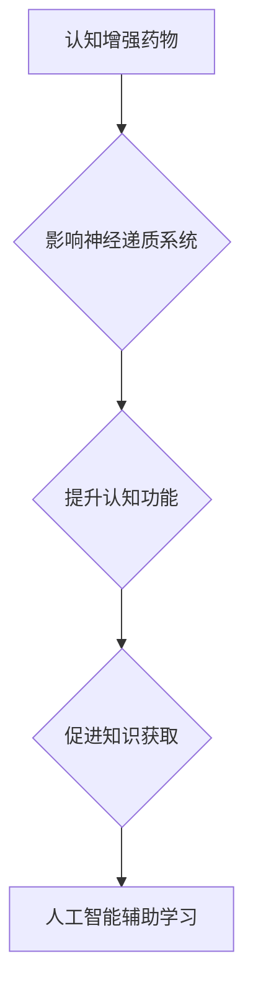

                 

## 认知增强药物：知识获取的伦理边界

> 关键词：认知增强药物，知识获取，伦理边界，人工智能，神经科学，社会影响

> 摘要：随着人工智能技术的飞速发展，认知增强药物也逐渐成为人们关注的焦点。本文将探讨认知增强药物的原理、作用机制、应用场景以及其带来的伦理挑战。我们将会深入分析知识获取的本质，探讨认知增强药物是否能够真正提升人类认知能力，并分析其对社会结构、教育体系、工作环境等方面的潜在影响。最后，我们将展望未来发展趋势，并提出应对伦理挑战的建议。

## 1. 背景介绍

人类对提升认知能力的渴望由来已久。从古代的智慧药到现代的脑机接口，人们一直在探索各种方法来增强记忆、注意力、学习能力等。近年来，随着神经科学和药物研发的进步，认知增强药物（Nootropics）逐渐成为一种备受关注的解决方案。

认知增强药物是指能够通过改变大脑功能来提升认知能力的药物。它们可以作用于多种神经递质系统，例如多巴胺、血清素、乙酰胆碱等，从而影响记忆、注意力、学习、执行功能等方面的表现。

目前，一些认知增强药物已经获得市场认可，例如咖啡因、安非他命等。然而，随着对大脑功能的深入了解，科学家们正在开发新型认知增强药物，这些药物具有更精准的靶向性和更强的功效。

## 2. 核心概念与联系

### 2.1 认知增强药物

认知增强药物是指能够通过改变大脑功能来提升认知能力的药物。它们可以作用于多种神经递质系统，例如多巴胺、血清素、乙酰胆碱等，从而影响记忆、注意力、学习、执行功能等方面的表现。

### 2.2 知识获取

知识获取是指人类从环境中获取、理解和存储信息的过程。它是一个复杂的过程，涉及到感知、记忆、思考、学习等多种认知功能。

### 2.3 人工智能

人工智能是指模拟人类智能的计算机系统。它可以学习、推理、解决问题、做出决策等。人工智能技术的发展为认知增强药物的研究提供了新的思路和工具。

**Mermaid 流程图**



## 3. 核心算法原理 & 具体操作步骤

### 3.1 算法原理概述

目前，还没有一种通用的“认知增强算法”。认知增强药物的作用机制主要依赖于对神经递质系统的调节。不同的药物作用于不同的神经递质，从而产生不同的认知增强效果。例如，咖啡因通过阻断腺苷受体来提高警觉性和注意力；安非他命通过增加多巴胺和去甲肾上腺素的水平来增强专注力和执行功能。

### 3.2 算法步骤详解

认知增强药物的研发是一个复杂的过程，涉及到以下步骤：

1. **目标识别:** 确定想要提升的特定认知功能，例如记忆力、注意力、学习能力等。
2. **机制研究:** 研究目标认知功能与哪些神经递质系统相关，以及这些神经递质系统如何运作。
3. **药物筛选:** 通过高通量筛选技术筛选出能够作用于目标神经递质系统的化合物。
4. **动物实验:** 对筛选出的化合物进行动物实验，评估其对认知功能的影响。
5. **临床试验:** 对经过动物实验验证的化合物进行人体临床试验，评估其安全性、有效性和耐受性。
6. **药物上市:** 如果临床试验结果良好，则可以申请药物上市许可证。

### 3.3 算法优缺点

**优点:**

* 能够快速提升认知功能。
* 针对性强，可以针对特定认知功能进行调节。

**缺点:**

* 副作用可能较大，例如失眠、焦虑、头痛等。
* 长期使用可能导致依赖性。
* 伦理问题复杂，例如公平性、安全性和滥用风险等。

### 3.4 算法应用领域

* **教育:** 帮助学生提高学习效率和记忆能力。
* **医疗:** 治疗认知障碍疾病，例如阿尔茨海默病、帕金森病等。
* **军事:** 提升士兵的作战能力和决策能力。
* **商业:** 提高员工的工作效率和创造力。

## 4. 数学模型和公式 & 详细讲解 & 举例说明

### 4.1 数学模型构建

认知增强药物的作用机制可以用数学模型来描述。例如，我们可以用一个简单的动力学模型来描述药物在血液中的浓度变化：

$$
\frac{dC}{dt} = k_a - k_e C
$$

其中：

* $C$ 是药物在血液中的浓度。
* $t$ 是时间。
* $k_a$ 是药物吸收速率常数。
* $k_e$ 是药物消除速率常数。

这个模型可以用来预测药物在体内分布和代谢的过程。

### 4.2 公式推导过程

这个动力学模型的推导过程如下：

1. 假设药物吸收是一个恒定的速率，即 $k_a$。
2. 假设药物的消除是一个与浓度成正比的过程，即 $k_e C$。
3. 根据物质守恒定律，药物在体内的总量等于吸收量减去消除量。

因此，我们可以得到上述动力学方程。

### 4.3 案例分析与讲解

我们可以用这个模型来分析不同药物的吸收和消除过程。例如，如果 $k_a$ 大而 $k_e$ 小，则药物的半衰期较长，在体内停留时间较长。反之，如果 $k_a$ 小而 $k_e$ 大，则药物的半衰期较短，在体内停留时间较短。

## 5. 项目实践：代码实例和详细解释说明

### 5.1 开发环境搭建

为了实现认知增强药物的模拟和分析，我们可以使用 Python 语言和相关的库，例如 NumPy、SciPy、Matplotlib 等。

### 5.2 源代码详细实现

```python
import numpy as np
from scipy.integrate import odeint

# 定义动力学方程
def model(C, t, ka, ke):
  return ka - ke * C

# 设置参数
ka = 0.1  # 吸收速率常数
ke = 0.05  # 消除速率常数
t = np.linspace(0, 10, 100)  # 时间范围
C0 = 0  # 初始浓度

# 求解动力学方程
sol = odeint(model, C0, t, args=(ka, ke))

# 绘制结果
import matplotlib.pyplot as plt
plt.plot(t, sol)
plt.xlabel('时间 (h)')
plt.ylabel('药物浓度 (mg/L)')
plt.title('药物浓度变化曲线')
plt.show()
```

### 5.3 代码解读与分析

这段代码首先定义了一个动力学方程，然后设置了药物的吸收和消除速率常数，以及时间范围和初始浓度。使用 odeint 函数求解动力学方程，得到药物在不同时间点的浓度变化曲线。最后，使用 Matplotlib 库绘制曲线图，展示药物浓度随时间的变化趋势。

### 5.4 运行结果展示

运行这段代码后，会生成一个药物浓度随时间变化的曲线图。曲线图可以直观地展示药物在体内吸收和消除的过程。

## 6. 实际应用场景

### 6.1 教育领域

认知增强药物可以帮助学生提高学习效率和记忆能力，例如：

* 帮助学生更好地理解和记忆课堂内容。
* 提高学生的考试成绩。
* 帮助学生克服学习障碍。

### 6.2 医疗领域

认知增强药物可以用于治疗认知障碍疾病，例如：

* 治疗阿尔茨海默病，改善记忆力和认知功能。
* 治疗帕金森病，改善注意力和执行功能。
* 治疗注意力缺陷多动障碍 (ADHD)，改善注意力和专注力。

### 6.3 军事领域

认知增强药物可以提升士兵的作战能力和决策能力，例如：

* 提高士兵的反应速度和决策能力。
* 增强士兵的耐力和抗压能力。
* 改善士兵的团队合作能力。

### 6.4 未来应用展望

随着认知科学和神经科学的不断发展，未来可能会出现更精准、更有效的认知增强药物。这些药物可以针对不同的认知功能进行调节，并具有更少的副作用。

## 7. 工具和资源推荐

### 7.1 学习资源推荐

* **书籍:**

    * 《认知增强药物》 by David J. Linden
    * 《大脑的奥秘》 by Oliver Sacks

* **网站:**

    * **Nootropics Depot:** https://nootropicsdepot.com/
    * **Limitless Mind:** https://limitlessmind.com/

### 7.2 开发工具推荐

* **Python:** https://www.python.org/
* **NumPy:** https://numpy.org/
* **SciPy:** https://scipy.org/
* **Matplotlib:** https://matplotlib.org/

### 7.3 相关论文推荐

* **The Cognitive Enhancement Debate** by John Harris
* **Nootropics: A Review of the Current Evidence** by Michael J. Smith

## 8. 总结：未来发展趋势与挑战

### 8.1 研究成果总结

认知增强药物的研究取得了显著进展，已经开发出一些能够提升认知功能的药物。这些药物在教育、医疗和军事等领域具有广泛的应用前景。

### 8.2 未来发展趋势

未来，认知增强药物的研究将更加注重精准性和安全性。科学家们将开发出更精准的靶向药物，并研究如何降低药物的副作用。

### 8.3 面临的挑战

认知增强药物的研发和应用还面临着一些挑战，例如：

* **伦理问题:** 认知增强药物的使用可能会导致社会不平等、滥用风险等伦理问题。
* **安全性问题:** 一些认知增强药物可能存在潜在的副作用，需要进一步研究和评估。
* **监管问题:** 认知增强药物的监管政策尚不完善，需要制定相应的法律法规。

### 8.4 研究展望

未来，我们需要加强对认知增强药物的伦理、安全性和监管方面的研究，并制定相应的政策和措施，确保认知增强药物的合理使用，造福人类社会。

## 9. 附录：常见问题与解答

**常见问题:**

* 认知增强药物真的能提升认知能力吗？
* 认知增强药物有哪些副作用？
* 认知增强药物的使用是否安全？
* 认知增强药物的伦理问题有哪些？

**解答:**

* 认知增强药物确实能够提升某些认知功能，但效果因人而异。
* 认知增强药物可能存在一些副作用，例如失眠、焦虑、头痛等。
* 认知增强药物的使用需要谨慎，并遵医嘱使用。
* 认知增强药物的伦理问题包括公平性、安全性和滥用风险等。


作者：禅与计算机程序设计艺术 / Zen and the Art of Computer Programming 
<end_of_turn>

