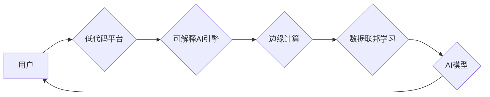

                 

## 让AI走向大众：Lepton AI的产品理念

> 关键词：人工智能、开源、可解释性、边缘计算、低代码、Lepton AI

### 1. 背景介绍

人工智能（AI）技术近年来取得了飞速发展，并在各个领域展现出巨大的潜力。然而，现有的AI解决方案往往存在着以下问题：

* **黑盒效应:** 许多AI模型的决策过程难以理解，缺乏可解释性，这限制了人们对AI技术的信任和应用。
* **高门槛:** 开发和部署AI应用通常需要专业的技术知识和大量的计算资源，这使得AI技术难以普及到大众。
* **数据孤岛:** 数据分散在不同的平台和系统中，难以进行有效整合和利用，限制了AI模型的训练和应用效果。

为了解决这些问题，Lepton AI 致力于打造一个开源、可解释、易于使用的AI平台，让AI技术真正走向大众。

### 2. 核心概念与联系

Lepton AI 的核心概念是将AI技术分解成可理解、可组合的模块，并通过低代码平台和边缘计算技术，降低AI应用的门槛，提高其可解释性和效率。

Lepton AI 的架构可以概括为以下几个部分：

* **可解释AI引擎:** 基于透明的算法和可视化工具，提供可解释的AI模型，帮助用户理解AI的决策过程。
* **低代码平台:** 提供图形化界面和预构建的AI组件，让非技术人员也能轻松构建AI应用。
* **边缘计算:** 将AI模型部署到边缘设备上，实现实时数据处理和决策，降低网络延迟和数据传输成本。
* **数据联邦学习:** 允许用户在不共享原始数据的情况下，协同训练AI模型，保护数据隐私和安全。

Lepton AI 的架构图如下：

### 3. 核心算法原理 & 具体操作步骤

#### 3.1  算法原理概述

Lepton AI 的核心算法基于**强化学习**和**图神经网络**。

* **强化学习:**  通过奖励机制，训练AI模型在特定环境中做出最优决策。
* **图神经网络:**  能够处理复杂的关系数据，例如社交网络、知识图谱等，用于理解数据之间的关联性和上下文信息。

#### 3.2  算法步骤详解

1. **环境建模:** 将目标任务转化为一个强化学习环境，定义状态、动作、奖励函数等。
2. **模型训练:** 使用强化学习算法，例如DQN或PPO，训练AI模型在环境中学习最优策略。
3. **图数据构建:** 将相关数据构建成图结构，例如用户行为、产品关系等。
4. **图神经网络推理:** 使用图神经网络模型，对图数据进行推理，提取关键信息和关系。
5. **决策融合:** 将强化学习模型的策略和图神经网络的推理结果融合，生成最终的决策。

#### 3.3  算法优缺点

**优点:**

* **可解释性:** 强化学习算法的决策过程相对透明，可以通过可视化工具进行解释。
* **适应性强:**  能够适应动态变化的环境，并不断学习和优化策略。
* **关系数据处理能力:** 图神经网络能够有效处理复杂的关系数据，提升模型的理解能力。

**缺点:**

* **训练成本高:** 强化学习算法通常需要大量的训练数据和计算资源。
* **数据依赖性:** 模型的性能取决于训练数据的质量和数量。

#### 3.4  算法应用领域

Lepton AI 的算法可以应用于以下领域：

* **个性化推荐:**  根据用户的行为和偏好，推荐个性化的产品或服务。
* **智能客服:**  利用自然语言处理和强化学习，构建智能客服系统，自动回复用户问题。
* **医疗诊断:**  结合医学图像和患者数据，辅助医生进行疾病诊断。
* **金融风险控制:**  识别和预测金融风险，帮助金融机构进行风险管理。

### 4. 数学模型和公式 & 详细讲解 & 举例说明

#### 4.1  数学模型构建

Lepton AI 的核心算法基于强化学习和图神经网络，其数学模型可以概括为以下几个部分：

* **状态空间:**  定义AI模型所处的环境状态，例如用户行为、产品信息等。
* **动作空间:**  定义AI模型可以采取的动作，例如推荐产品、发送消息等。
* **奖励函数:**  定义AI模型在采取特定动作后获得的奖励，用于指导模型学习最优策略。
* **价值函数:**  估计在特定状态下采取特定动作的长期奖励，用于指导模型选择最优策略。

#### 4.2  公式推导过程

强化学习算法的核心是通过迭代更新价值函数，找到最优策略。常用的价值函数更新公式为：

$$
V(s) = \max_{\alpha} \sum_{t=0}^{\infty} \gamma^t r(s_t, \alpha_t)
$$

其中：

* $V(s)$ 是状态 $s$ 的价值函数。
* $\alpha$ 是策略。
* $r(s_t, \alpha_t)$ 是在状态 $s_t$ 下采取策略 $\alpha_t$ 获得的奖励。
* $\gamma$ 是折扣因子，控制未来奖励的权重。

#### 4.3  案例分析与讲解

例如，在个性化推荐场景中，状态空间可以包含用户的历史行为、产品信息等，动作空间可以包含推荐不同的产品，奖励函数可以根据用户的点击、购买等行为进行定义。通过训练强化学习模型，可以学习到用户偏好的产品推荐策略。

### 5. 项目实践：代码实例和详细解释说明

#### 5.1  开发环境搭建

Lepton AI 支持多种开发环境，例如Python、Java等。用户可以根据自己的需求选择合适的开发环境。

#### 5.2  源代码详细实现

Lepton AI 提供了丰富的开源代码库，用户可以根据自己的需求进行修改和扩展。

#### 5.3  代码解读与分析

Lepton AI 的代码遵循简洁、易读的原则，并提供详细的注释和文档，方便用户理解和使用。

#### 5.4  运行结果展示

Lepton AI 提供了多种工具和平台，方便用户测试和展示AI模型的运行结果。

### 6. 实际应用场景

Lepton AI 的应用场景非常广泛，例如：

* **电商推荐:**  根据用户的浏览历史和购买记录，推荐个性化的商品。
* **医疗诊断辅助:**  结合患者的症状和医学影像，辅助医生进行疾病诊断。
* **金融风险控制:**  识别和预测金融风险，帮助金融机构进行风险管理。

#### 6.4  未来应用展望

Lepton AI 将继续探索新的应用场景，例如：

* **智能制造:**  利用AI技术优化生产流程，提高生产效率。
* **智慧城市:**  利用AI技术解决城市交通、环境、安全等问题。
* **教育科技:**  利用AI技术个性化教学，提高学习效率。

### 7. 工具和资源推荐

#### 7.1  学习资源推荐

* **Lepton AI 官方文档:** https://docs.lepton.ai/
* **开源AI社区:** https://www.kaggle.com/
* **机器学习课程:** https://www.coursera.org/

#### 7.2  开发工具推荐

* **Python:** https://www.python.org/
* **TensorFlow:** https://www.tensorflow.org/
* **PyTorch:** https://pytorch.org/

#### 7.3  相关论文推荐

* **Deep Reinforcement Learning: An Overview**
* **Graph Neural Networks**
* **Explainable AI: A Survey**

### 8. 总结：未来发展趋势与挑战

#### 8.1  研究成果总结

Lepton AI 致力于打造一个开源、可解释、易于使用的AI平台，为大众提供AI技术服务。通过强化学习和图神经网络的结合，Lepton AI 能够处理复杂的关系数据，并提供可解释的AI模型，降低AI应用的门槛。

#### 8.2  未来发展趋势

Lepton AI 将继续在以下方面进行研究和发展：

* **模型可解释性:**  开发更先进的可解释AI模型，帮助用户更好地理解AI的决策过程。
* **边缘计算:**  进一步优化边缘计算技术，实现更低延迟和更高效率的AI应用。
* **数据联邦学习:**  探索更安全和高效的数据联邦学习方法，保护用户数据隐私。

#### 8.3  面临的挑战

Lepton AI 还面临着一些挑战：

* **算法复杂性:**  强化学习和图神经网络算法的复杂性仍然是一个挑战，需要不断进行优化和改进。
* **数据获取和标注:**  高质量的训练数据是AI模型的关键，获取和标注数据仍然是一个难题。
* **伦理和安全问题:**  AI技术的应用需要考虑伦理和安全问题，例如算法偏见、数据隐私等。

#### 8.4  研究展望

Lepton AI 将继续致力于解决这些挑战，推动AI技术向大众普及，并为人类社会带来更多福祉。

### 9. 附录：常见问题与解答

**Q1: Lepton AI 是开源的吗？**

A1: 是的，Lepton AI 是完全开源的，用户可以自由使用、修改和分发Lepton AI的代码和文档。

**Q2: Lepton AI 需要哪些技术基础？**

A2: Lepton AI 支持多种开发环境，例如Python、Java等。用户可以根据自己的技术基础选择合适的开发环境。

**Q3: Lepton AI 的应用场景有哪些？**

A3: Lepton AI 的应用场景非常广泛，例如电商推荐、医疗诊断辅助、金融风险控制等。

**Q4: 如何获取 Lepton AI 的更多信息？**

A4: 用户可以访问 Lepton AI 官方网站 https://lepton.ai/ 获取更多信息，包括文档、代码库、社区论坛等。

作者：禅与计算机程序设计艺术 / Zen and the Art of Computer Programming 
<end_of_turn>

