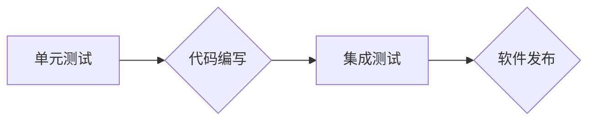

                 

## 软件测试策略：单元测试到集成测试

> 关键词：单元测试、集成测试、软件测试策略、测试驱动开发、代码覆盖率、测试框架、自动化测试

### 1. 背景介绍

在软件开发领域，质量始终是至关重要的。高质量的软件不仅能满足用户需求，还能提升用户体验，降低维护成本。而软件测试作为保证软件质量的关键环节，在整个软件开发生命周期中扮演着至关重要的角色。

传统的软件测试方法往往侧重于功能测试，在软件开发后期进行，容易导致问题难以发现和修复，增加开发成本和时间。随着软件开发模式的演变，测试驱动开发（Test-Driven Development，简称 TDD）逐渐成为主流，强调在编写代码之前先编写测试用例，并不断迭代测试和代码，以确保软件质量。

本文将深入探讨软件测试策略，从单元测试到集成测试，介绍测试的各个阶段、方法和工具，帮助读者理解软件测试的本质，掌握有效的测试策略，提升软件质量。

### 2. 核心概念与联系

软件测试策略的核心在于将测试工作融入到整个软件开发流程中，并根据软件的特性和开发阶段选择合适的测试方法。

#### 2.1 单元测试

单元测试是针对软件中最小的独立模块（单元）进行的测试，旨在验证每个单元的功能是否正确。单元测试通常由开发人员编写，并作为代码的一部分进行维护。

#### 2.2 集成测试

集成测试是将多个单元组合在一起进行测试，验证它们之间的交互是否正确。集成测试通常在单元测试完成后进行，旨在发现单元之间存在的接口问题或逻辑错误。

#### 2.3 测试驱动开发（TDD）

测试驱动开发是一种软件开发方法，强调在编写代码之前先编写测试用例，并不断迭代测试和代码，以确保软件质量。TDD 的核心原则包括：

* **先写测试用例：** 在编写任何代码之前，先编写测试用例，明确软件的功能需求和预期结果。
* **编写最小可行代码：** 只编写满足测试用例要求的最小代码，避免过度设计和复杂化。
* **运行测试用例：** 运行测试用例，验证代码是否满足预期结果。
* **重构代码：** 如果测试用例失败，则重构代码，使其满足测试用例要求。

#### 2.4 流程图



### 3. 核心算法原理 & 具体操作步骤

#### 3.1 算法原理概述

软件测试的算法原理主要基于以下几个方面：

* **覆盖率分析：** 通过分析测试用例对代码的覆盖率，评估测试的有效性。
* **异常处理：** 设计测试用例以模拟各种异常情况，验证软件的异常处理机制。
* **边界值分析：** 测试用例应涵盖代码的边界值，以发现潜在的错误。
* **数据驱动测试：** 使用不同的数据输入进行测试，验证软件对不同数据类型的处理能力。

#### 3.2 算法步骤详解

软件测试的具体操作步骤如下：

1. **需求分析：** 首先需要对软件的需求进行详细分析，明确软件的功能、性能和安全要求。
2. **测试用例设计：** 根据需求分析结果，设计测试用例，涵盖软件的功能、性能和安全等方面的测试场景。
3. **测试环境搭建：** 搭建测试环境，包括硬件、软件和网络环境，确保测试环境与实际运行环境一致。
4. **测试执行：** 执行测试用例，记录测试结果，并分析测试结果。
5. **缺陷报告：** 对发现的缺陷进行记录和报告，并跟踪缺陷的修复进度。
6. **测试总结：** 对测试工作进行总结，分析测试结果，并提出改进建议。

#### 3.3 算法优缺点

* **优点：** 软件测试可以有效地发现软件中的缺陷，提高软件质量，降低软件维护成本。
* **缺点：** 软件测试需要投入大量的时间和资源，并且无法保证发现所有缺陷。

#### 3.4 算法应用领域

软件测试广泛应用于各个领域，例如：

* **软件开发：** 作为软件开发过程中不可或缺的一部分，确保软件质量。
* **软件维护：** 在软件维护过程中，进行测试以确保修改后的代码不会引入新的缺陷。
* **软件安全：** 进行安全测试以发现软件中的安全漏洞。

### 4. 数学模型和公式 & 详细讲解 & 举例说明

#### 4.1 数学模型构建

软件测试的数学模型可以用来量化测试的覆盖率，评估测试的有效性。

* **代码覆盖率：** 代码覆盖率是指测试用例执行到的代码行数占总代码行数的比例。

$$
代码覆盖率 = \frac{执行到的代码行数}{总代码行数}
$$

* **分支覆盖率：** 分支覆盖率是指测试用例执行到的代码分支数占总代码分支数的比例。

$$
分支覆盖率 = \frac{执行到的代码分支数}{总代码分支数}
$$

#### 4.2 公式推导过程

代码覆盖率和分支覆盖率的公式推导过程如下：

* **代码覆盖率：** 假设一个软件程序包含 $N$ 行代码，测试用例执行了 $M$ 行代码，则代码覆盖率为 $M/N$。
* **分支覆盖率：** 假设一个软件程序包含 $B$ 个分支，测试用例执行了 $A$ 个分支，则分支覆盖率为 $A/B$。

#### 4.3 案例分析与讲解

假设一个软件程序包含 100 行代码，测试用例执行了 80 行代码，则代码覆盖率为 80%。

假设一个软件程序包含 10 个分支，测试用例执行了 8 个分支，则分支覆盖率为 80%。

### 5. 项目实践：代码实例和详细解释说明

#### 5.1 开发环境搭建

* **操作系统：** Windows、macOS 或 Linux
* **编程语言：** Python、Java 或 C++
* **测试框架：** pytest、JUnit 或 Google Test

#### 5.2 源代码详细实现

```python
# 单元测试示例
def add(x, y):
    return x + y

def test_add():
    assert add(2, 3) == 5
    assert add(-1, 1) == 0
```

#### 5.3 代码解读与分析

* `add` 函数定义了两个整数相加的操作。
* `test_add` 函数定义了两个测试用例，分别测试了 `add` 函数在正常情况和特殊情况下的执行结果。
* `assert` 语句用于断言测试结果是否符合预期。

#### 5.4 运行结果展示

运行测试用例后，如果测试结果通过，则会显示测试成功的信息。如果测试结果失败，则会显示测试失败的信息，并指出失败的原因。

### 6. 实际应用场景

#### 6.1 软件开发

在软件开发过程中，单元测试和集成测试可以帮助开发人员发现和修复软件中的缺陷，提高软件质量。

#### 6.2 软件维护

在软件维护过程中，单元测试可以帮助开发人员验证修改后的代码是否会引入新的缺陷，确保软件的稳定性。

#### 6.3 自动化测试

自动化测试可以帮助开发人员提高测试效率，并减少人工错误。

#### 6.4 未来应用展望

随着软件开发模式的不断演变，软件测试将更加注重自动化、智能化和持续集成。

### 7. 工具和资源推荐

#### 7.1 学习资源推荐

* **书籍：**
    * 《软件测试艺术》
    * 《软件测试全书》
    * 《测试驱动开发》
* **网站：**
    * https://www.guru99.com/software-testing-tutorial.html
    * https://www.tutorialspoint.com/software_testing/index.htm

#### 7.2 开发工具推荐

* **测试框架：**
    * pytest (Python)
    * JUnit (Java)
    * Google Test (C++)
* **自动化测试工具：**
    * Selenium
    * Appium
    * Cypress

#### 7.3 相关论文推荐

* **论文：**
    * "Test-Driven Development: A Practical Guide"
    * "The Art of Software Testing"
    * "Software Testing: Principles and Practices"

### 8. 总结：未来发展趋势与挑战

#### 8.1 研究成果总结

软件测试已经成为软件开发过程中不可或缺的一部分，并取得了显著的成果。

#### 8.2 未来发展趋势

* **自动化测试：** 自动化测试将更加广泛地应用于软件测试领域，提高测试效率和准确性。
* **智能化测试：** 基于人工智能技术的智能化测试将能够自动生成测试用例，并根据测试结果进行分析和优化。
* **持续集成：** 持续集成将更加深入地融入软件开发流程，使得软件测试成为一个持续的过程。

#### 8.3 面临的挑战

* **测试覆盖率：** 如何提高测试覆盖率，确保测试的有效性仍然是一个挑战。
* **测试效率：** 如何提高测试效率，减少测试时间和成本仍然是一个挑战。
* **测试复杂性：** 随着软件的复杂性不断增加，测试的复杂性也随之增加，如何应对测试的复杂性仍然是一个挑战。

#### 8.4 研究展望

未来软件测试的研究方向将集中在以下几个方面：

* **人工智能驱动的测试：** 利用人工智能技术自动生成测试用例、分析测试结果和优化测试策略。
* **云原生测试：** 针对云原生应用开发新的测试方法和工具。
* **安全测试：** 开发更加有效的安全测试方法和工具，以应对不断增长的网络安全威胁。

### 9. 附录：常见问题与解答

#### 9.1 什么是单元测试？

单元测试是指针对软件中最小的独立模块（单元）进行的测试，旨在验证每个单元的功能是否正确。

#### 9.2 什么是集成测试？

集成测试是指将多个单元组合在一起进行测试，验证它们之间的交互是否正确。

#### 9.3 如何提高测试覆盖率？

提高测试覆盖率的方法包括：

* 设计更加全面的测试用例。
* 使用代码覆盖率分析工具。
* 采用测试驱动开发（TDD）方法。

#### 9.4 什么是自动化测试？

自动化测试是指使用自动化工具执行测试用例，以提高测试效率和准确性。

#### 9.5 什么是持续集成？

持续集成是指将代码变更频繁地集成到主代码库中，并进行自动化测试，以确保代码质量和稳定性。


作者：禅与计算机程序设计艺术 / Zen and the Art of Computer Programming 
<end_of_turn>

