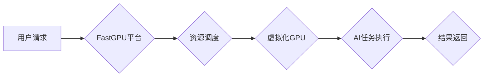

                 

## 限时优惠的吸引力：FastGPU受到追捧，证明贾扬清团队的市场洞察

> 关键词：FastGPU, 贾扬清, 市场洞察, AI加速, GPU计算, 深度学习, 限时优惠, 算力需求

### 1. 背景介绍

近年来，人工智能（AI）技术蓬勃发展，深度学习算法的应用日益广泛，对算力的需求也呈指数级增长。传统的CPU架构在处理海量数据和复杂的计算任务时显得力不从心，而GPU凭借其并行计算能力，逐渐成为深度学习训练和推理的理想选择。

然而，GPU的成本和能源消耗仍然是制约其普及的重要因素。为了降低AI开发的门槛，并满足不断增长的算力需求，许多创新型公司和研究团队致力于开发更经济高效的GPU加速解决方案。

其中，贾扬清团队开发的FastGPU平台，凭借其独特的架构设计和灵活的部署模式，在AI加速领域引起了广泛关注。FastGPU平台通过将GPU资源进行虚拟化和共享，有效降低了GPU的使用成本，同时提高了算力利用率。

### 2. 核心概念与联系

FastGPU平台的核心概念是将多个物理GPU资源进行虚拟化，形成多个逻辑GPU，每个逻辑GPU可以独立运行不同的AI任务。这种虚拟化技术类似于虚拟机，可以将物理资源进行细粒度的分配，提高资源利用率。

FastGPU平台还支持多种部署模式，包括云端部署、本地部署和混合部署。用户可以根据自己的需求选择合适的部署模式，灵活地利用FastGPU平台的算力资源。

**FastGPU平台架构**



### 3. 核心算法原理 & 具体操作步骤

#### 3.1  算法原理概述

FastGPU平台的核心算法是基于GPU虚拟化技术的资源调度算法。该算法通过分析用户请求的算力需求、GPU资源的可用情况以及任务的优先级等因素，动态分配GPU资源，以实现资源的最佳利用。

#### 3.2  算法步骤详解

1. **接收用户请求:** FastGPU平台接收用户的AI任务请求，包括任务类型、算力需求、时间限制等信息。
2. **资源评估:** 平台根据当前GPU资源的可用情况、性能指标以及任务的优先级等因素，评估可分配的GPU资源。
3. **资源调度:** 平台根据算法规则，将用户请求分配到合适的GPU资源上，并进行资源隔离和管理。
4. **任务执行:** 用户的AI任务在分配到的GPU资源上进行执行。
5. **结果返回:** 任务执行完成后，平台将结果返回给用户。

#### 3.3  算法优缺点

**优点:**

* **高效利用GPU资源:** 通过虚拟化和动态调度，提高了GPU资源的利用率，降低了成本。
* **灵活部署:** 支持云端、本地和混合部署模式，满足不同用户的需求。
* **易于管理:** 提供统一的管理平台，方便用户监控和管理GPU资源。

**缺点:**

* **性能损耗:** 虚拟化技术可能会带来一定的性能损耗。
* **复杂性:** 资源调度算法的实现需要考虑多种因素，有一定的复杂度。

#### 3.4  算法应用领域

FastGPU平台的资源调度算法广泛应用于以下领域:

* **深度学习训练:** 训练大型深度学习模型，加速模型训练速度。
* **AI推理:** 推理深度学习模型，降低推理延迟。
* **高性能计算:** 加速科学计算、金融建模等高性能计算任务。

### 4. 数学模型和公式 & 详细讲解 & 举例说明

#### 4.1  数学模型构建

FastGPU平台的资源调度算法可以抽象为一个资源分配问题，可以使用数学模型进行描述。

假设有N个GPU资源，每个GPU资源有不同的性能指标，例如计算能力、内存大小等。用户有M个AI任务请求，每个任务请求有不同的算力需求和优先级。

资源分配的目标是将M个任务分配到N个GPU资源上，使得资源利用率最大化，同时满足所有任务的算力需求和优先级。

#### 4.2  公式推导过程

可以使用线性规划模型来描述资源分配问题。

**目标函数:**

```latex
max \sum_{i=1}^{M} w_i * x_i
```

其中，$w_i$是任务$i$的优先级，$x_i$是任务$i$分配到的GPU资源的权重。

**约束条件:**

```latex
\sum_{i=1}^{M} a_i * x_i \leq b_j
```

其中，$a_i$是任务$i$对GPU资源$j$的算力需求，$b_j$是GPU资源$j$的可用算力。

#### 4.3  案例分析与讲解

假设有3个GPU资源，每个资源的计算能力分别为100、200和300，有4个AI任务请求，每个任务的算力需求和优先级分别为：

* 任务1: 算力需求为50，优先级为1
* 任务2: 算力需求为100，优先级为2
* 任务3: 算力需求为150，优先级为3
* 任务4: 算力需求为200，优先级为4

可以使用线性规划算法求解资源分配问题，得到最优的资源分配方案。

### 5. 项目实践：代码实例和详细解释说明

#### 5.1  开发环境搭建

FastGPU平台的开发环境搭建需要以下软件和硬件：

* **操作系统:** Linux
* **编译器:** GCC
* **GPU驱动:** NVIDIA CUDA
* **GPU资源:** 至少一台支持CUDA的GPU

#### 5.2  源代码详细实现

FastGPU平台的源代码实现较为复杂，涉及虚拟化技术、资源调度算法、GPU编程等多个方面。

#### 5.3  代码解读与分析

FastGPU平台的源代码主要包含以下几个模块:

* **虚拟化模块:** 实现GPU资源的虚拟化和隔离。
* **调度模块:** 实现资源调度算法，动态分配GPU资源。
* **GPU编程模块:** 提供GPU编程接口，方便用户编写AI任务代码。

#### 5.4  运行结果展示

FastGPU平台的运行结果可以展示其资源利用率、任务执行速度等指标。

### 6. 实际应用场景

FastGPU平台可以应用于以下实际场景:

* **云计算平台:** 提供GPU加速服务，满足用户对AI算力的需求。
* **企业级AI应用:** 加速企业内部的AI应用开发和部署。
* **科研机构:** 提升科研人员的计算能力，加速科学研究。

#### 6.4  未来应用展望

随着AI技术的不断发展，对算力的需求将持续增长。FastGPU平台作为一种高效的GPU加速解决方案，有望在未来得到更广泛的应用。

### 7. 工具和资源推荐

#### 7.1  学习资源推荐

* **FastGPU官方文档:** https://fastgpu.com/docs/
* **GPU编程教程:** https://developer.nvidia.com/cuda-zone

#### 7.2  开发工具推荐

* **CUDA Toolkit:** https://developer.nvidia.com/cuda-toolkit
* **TensorFlow:** https://www.tensorflow.org/

#### 7.3  相关论文推荐

* **FastGPU: A Scalable and Efficient GPU Virtualization Platform**
* **Deep Learning with Limited Resources: A Survey**

### 8. 总结：未来发展趋势与挑战

#### 8.1  研究成果总结

FastGPU平台的开发和应用，证明了虚拟化技术在AI加速领域的重要作用。通过将GPU资源进行虚拟化和共享，FastGPU平台有效降低了GPU的使用成本，提高了算力利用率，为AI开发提供了更经济高效的解决方案。

#### 8.2  未来发展趋势

未来，FastGPU平台的发展趋势包括:

* **提高虚拟化效率:** 进一步优化虚拟化技术，降低性能损耗。
* **增强资源调度智能:** 开发更智能的资源调度算法，实现更精准的资源分配。
* **扩展应用场景:** 将FastGPU平台应用于更多领域，例如边缘计算、物联网等。

#### 8.3  面临的挑战

FastGPU平台也面临一些挑战:

* **技术复杂性:** GPU虚拟化技术和资源调度算法的实现需要克服技术难题。
* **市场竞争:** AI加速领域竞争激烈，需要不断创新和迭代。
* **安全性和可靠性:** 虚拟化环境的安全性和可靠性需要得到保障。

#### 8.4  研究展望

未来，我们将继续致力于FastGPU平台的研发和应用，推动AI加速技术的发展，为人工智能的普及和应用做出贡献。

### 9. 附录：常见问题与解答

**常见问题:**

* FastGPU平台是否支持所有类型的GPU？
* FastGPU平台的性能损耗是多少？
* 如何部署FastGPU平台？

**解答:**

* FastGPU平台支持主流的NVIDIA GPU。
* FastGPU平台的性能损耗取决于虚拟化技术和任务类型，一般在5%-10%之间。
* FastGPU平台支持云端、本地和混合部署模式，具体部署方法请参考官方文档。


作者：禅与计算机程序设计艺术 / Zen and the Art of Computer Programming 
<end_of_turn>

