                 

# AI DMP 数据基建：数据质量与数据标准

> 关键词：数据质量, 数据标准, 数据治理, 数据清洗, 数据集成, 数据架构, 数据仓库, 数据治理框架

> 摘要：本文旨在深入探讨数据质量与数据标准在AI DMP（数据管理平台）中的重要性。通过逐步分析和推理，我们将详细阐述数据质量的关键要素、数据标准的构建方法，以及如何在实际项目中应用这些概念。文章将涵盖从理论到实践的全过程，包括数学模型、代码实现、实际应用场景等，旨在为读者提供全面的技术指导。

## 1. 背景介绍

随着大数据和人工智能技术的迅猛发展，数据管理平台（DMP）成为了企业数字化转型的重要工具。DMP不仅能够帮助企业收集、存储和分析海量数据，还能通过数据质量管理和数据标准建设，提升数据的准确性和可用性。本文将从数据质量与数据标准的角度出发，探讨如何构建一个高效、可靠的AI DMP。

### 1.1 数据质量的重要性

数据质量是数据管理平台的核心要素之一。高质量的数据能够为企业提供准确的洞察，支持科学的决策。数据质量不佳会导致分析结果失真，进而影响业务决策的准确性。因此，数据质量的提升是确保数据价值最大化的关键。

### 1.2 数据标准的必要性

数据标准是数据治理的重要组成部分。通过统一的数据标准，可以确保数据的一致性和可比性，减少数据冗余和冲突。数据标准的建立有助于提高数据的可维护性和可扩展性，从而提升整个数据管理平台的效率。

## 2. 核心概念与联系

### 2.1 数据质量的关键要素

数据质量的关键要素包括准确性、完整性、一致性、时效性、唯一性、相关性等。这些要素共同构成了数据质量的评估体系。

### 2.2 数据标准的构建方法

数据标准的构建方法主要包括定义数据模型、制定数据字典、建立数据质量规则等。通过这些方法，可以确保数据的一致性和规范性。

### 2.3 数据治理框架

数据治理框架是数据管理平台的核心架构。它包括数据治理策略、数据质量监控、数据标准管理等多个方面。通过构建数据治理框架，可以实现数据的全面管理和优化。

```mermaid
graph TD
    A[数据治理框架] --> B[数据治理策略]
    A --> C[数据质量监控]
    A --> D[数据标准管理]
    B --> E[数据模型定义]
    B --> F[数据字典制定]
    C --> G[数据质量规则]
    D --> H[数据标准定义]
    E --> I[数据模型]
    F --> J[数据字典]
    G --> K[数据质量评估]
    H --> L[数据标准]
    I --> M[数据模型]
    J --> N[数据字典]
    K --> O[数据质量报告]
    L --> P[数据标准]
    M --> Q[数据模型]
    N --> R[数据字典]
    O --> S[数据质量监控]
    P --> T[数据标准]
    Q --> U[数据模型]
    R --> V[数据字典]
    S --> W[数据质量报告]
    T --> X[数据标准]
    U --> Y[数据模型]
    V --> Z[数据字典]
    W --> AA[数据质量监控]
    X --> AB[数据标准]
    Y --> AC[数据模型]
    Z --> AD[数据字典]
    AA --> AE[数据质量报告]
    AB --> AF[数据标准]
    AC --> AG[数据模型]
    AD --> AH[数据字典]
    AE --> AI[数据质量监控]
    AF --> AJ[数据标准]
    AG --> AK[数据模型]
    AH --> AL[数据字典]
    AI --> AM[数据质量报告]
    AJ --> AN[数据标准]
    AK --> AO[数据模型]
    AL --> AP[数据字典]
    AM --> AQ[数据质量监控]
    AN --> AR[数据标准]
    AO --> AS[数据模型]
    AP --> AT[数据字典]
    AQ --> AU[数据质量报告]
    AR --> AV[数据标准]
    AS --> AW[数据模型]
    AT --> AX[数据字典]
    AU --> AY[数据质量监控]
    AV --> AZ[数据标准]
    AW --> BA[数据模型]
    AX --> BB[数据字典]
    AY --> BC[数据质量报告]
    AZ --> BD[数据标准]
    BA --> BE[数据模型]
    BB --> BF[数据字典]
    BC --> BG[数据质量报告]
    BD --> BH[数据标准]
    BE --> BI[数据模型]
    BF --> BJ[数据字典]
    BG --> BK[数据质量报告]
    BH --> BL[数据标准]
    BI --> BM[数据模型]
    BJ --> BN[数据字典]
    BK --> BO[数据质量报告]
    BL --> BP[数据标准]
    BM --> BQ[数据模型]
    BN --> BR[数据字典]
    BO --> BS[数据质量报告]
    BP --> BT[数据标准]
    BQ --> BU[数据模型]
    BR --> BV[数据字典]
    BS --> BW[数据质量报告]
    BT --> BX[数据标准]
    BU --> BY[数据模型]
    BV --> BZ[数据字典]
    BW --> CA[数据质量报告]
    BX --> CB[数据标准]
    BY --> CC[数据模型]
    BZ --> CD[数据字典]
    CA --> CE[数据质量报告]
    CB --> CF[数据标准]
    CC --> CG[数据模型]
    CD --> CH[数据字典]
    CE --> CI[数据质量报告]
    CF --> CJ[数据标准]
    CG --> CK[数据模型]
    CH --> CL[数据字典]
    CI --> CM[数据质量报告]
    CJ --> CN[数据标准]
    CK --> CO[数据模型]
    CL --> CP[数据字典]
    CM --> CQ[数据质量报告]
    CN --> CR[数据标准]
    CO --> CS[数据模型]
    CP --> CT[数据字典]
    CQ --> CU[数据质量报告]
    CR --> CV[数据标准]
    CS --> CW[数据模型]
    CT --> CX[数据字典]
    CU --> CY[数据质量报告]
    CV --> CZ[数据标准]
    CW --> DA[数据模型]
    CX --> DB[数据字典]
    CY --> DC[数据质量报告]
    CZ --> DD[数据标准]
    DA --> DE[数据模型]
    DB --> DF[数据字典]
    DC --> DG[数据质量报告]
    DD --> DH[数据标准]
    DE --> DI[数据模型]
    DF --> DJ[数据字典]
    DG --> DK[数据质量报告]
    DH --> DL[数据标准]
    DI --> DM[数据模型]
    DJ --> DN[数据字典]
    DK --> DO[数据质量报告]
    DL --> DP[数据标准]
    DM --> DQ[数据模型]
    DN --> DR[数据字典]
    DO --> DS[数据质量报告]
    DP --> DT[数据标准]
    DQ --> DU[数据模型]
    DR --> DV[数据字典]
    DS --> DW[数据质量报告]
    DT --> DX[数据标准]
    DU --> DY[数据模型]
    DV --> DZ[数据字典]
    DW --> EA[数据质量报告]
    DX --> EB[数据标准]
    DY --> EC[数据模型]
    DZ --> ED[数据字典]
    EA --> EE[数据质量报告]
    EB --> EF[数据标准]
    EC --> EG[数据模型]
    ED --> EH[数据字典]
    EE --> EI[数据质量报告]
    EF --> EJ[数据标准]
    EG --> EK[数据模型]
    EH --> EL[数据字典]
    EI --> EM[数据质量报告]
    EJ --> EN[数据标准]
    EK --> EO[数据模型]
    EL --> EP[数据字典]
    EM --> EQ[数据质量报告]
    EN --> ER[数据标准]
    EO --> ES[数据模型]
    EP --> ET[数据字典]
    EQ --> EU[数据质量报告]
    ER --> EV[数据标准]
    ES --> EW[数据模型]
    ET --> EX[数据字典]
    EU --> EY[数据质量报告]
    EV --> EZ[数据标准]
    EW --> FA[数据模型]
    EX --> FB[数据字典]
    EY --> FC[数据质量报告]
    EZ --> FD[数据标准]
    FA --> FE[数据模型]
    FB --> FF[数据字典]
    FC --> FG[数据质量报告]
    FD --> FH[数据标准]
    FE --> FI[数据模型]
    FF --> FJ[数据字典]
    FG --> FK[数据质量报告]
    FH --> FL[数据标准]
    FI --> FM[数据模型]
    FJ --> FN[数据字典]
    FK --> FO[数据质量报告]
    FL --> FP[数据标准]
    FM --> FQ[数据模型]
    FN --> FR[数据字典]
    FO --> FS[数据质量报告]
    FP --> FT[数据标准]
    FQ --> FU[数据模型]
    FR --> FV[数据字典]
    FS --> FW[数据质量报告]
    FT --> FX[数据标准]
    FU --> FY[数据模型]
    FV --> FZ[数据字典]
    FW --> GA[数据质量报告]
    FX --> GB[数据标准]
    FY --> GC[数据模型]
    FZ --> GD[数据字典]
    GA --> GE[数据质量报告]
    GB --> GH[数据标准]
    GC --> GI[数据模型]
    GD --> GJ[数据字典]
    GE --> GK[数据质量报告]
    GH --> GL[数据标准]
    GI --> GM[数据模型]
    GJ --> GN[数据字典]
    GK --> GO[数据质量报告]
    GL --> GP[数据标准]
    GM --> GQ[数据模型]
    GN --> GR[数据字典]
    GO --> GS[数据质量报告]
    GP --> GT[数据标准]
    GQ --> GU[数据模型]
    GR --> GV[数据字典]
    GS --> GW[数据质量报告]
    GT --> GX[数据标准]
    GU --> GY[数据模型]
    GV --> GZ[数据字典]
    GW --> HA[数据质量报告]
    GX --> HB[数据标准]
    GY --> HC[数据模型]
    GZ --> HD[数据字典]
    HA --> HE[数据质量报告]
    HB --> HI[数据标准]
    HC --> HJ[数据模型]
    HD --> HK[数据字典]
    HE --> HL[数据质量报告]
    HI --> HM[数据标准]
    HJ --> HN[数据模型]
    HK --> HO[数据字典]
    HL --> HP[数据质量报告]
    HM --> HQ[数据标准]
    HN --> HR[数据模型]
    HO --> HS[数据字典]
    HP --> HT[数据质量报告]
    HQ --> HU[数据标准]
    HR --> HV[数据模型]
    HS --> HW[数据字典]
    HT --> HX[数据质量报告]
    HU --> HY[数据标准]
    HV --> HZ[数据模型]
    HW --> IA[数据字典]
    HX --> IB[数据质量报告]
    HY --> IC[数据标准]
    HZ --> ID[数据模型]
    IA --> IE[数据字典]
    IB --> IF[数据质量报告]
    IC --> IG[数据标准]
    ID --> IH[数据模型]
    IE --> IJ[数据字典]
    IF --> IK[数据质量报告]
    IG --> IL[数据标准]
    IH --> IM[数据模型]
    IJ --> IN[数据字典]
    IK --> IO[数据质量报告]
    IL --> IP[数据标准]
    IM --> IQ[数据模型]
    IN --> IR[数据字典]
    IO --> IS[数据质量报告]
    IP --> IT[数据标准]
    IQ --> IU[数据模型]
    IR --> IV[数据字典]
    IS --> IW[数据质量报告]
    IT --> IX[数据标准]
    IU --> IY[数据模型]
    IV --> IZ[数据字典]
    IW --> JA[数据质量报告]
    IX --> JB[数据标准]
    IY --> JC[数据模型]
    IZ --> JD[数据字典]
    JA --> JE[数据质量报告]
    JB --> JF[数据标准]
    JC --> JG[数据模型]
    JD --> JH[数据字典]
    JE --> JJ[数据质量报告]
    JF --> JK[数据标准]
    JG --> JL[数据模型]
    JH --> JM[数据字典]
    JJ --> JN[数据质量报告]
    JK --> JO[数据标准]
    JL --> JP[数据模型]
    JM --> JQ[数据字典]
    JN --> JR[数据质量报告]
    JO --> JS[数据标准]
    JP --> JT[数据模型]
    JQ --> JU[数据字典]
    JR --> JV[数据质量报告]
    JS --> JW[数据标准]
    JT --> JX[数据模型]
    JU --> JY[数据字典]
    JV --> JZ[数据质量报告]
    JW --> KX[数据标准]
    JX --> KY[数据模型]
    JY --> KZ[数据字典]
    JZ --> LA[数据质量报告]
    KX --> LB[数据标准]
    KY --> LC[数据模型]
    KZ --> LD[数据字典]
    LA --> LE[数据质量报告]
    LB --> LF[数据标准]
    LC --> LG[数据模型]
    LD --> LH[数据字典]
    LE --> LI[数据质量报告]
    LF --> LJ[数据标准]
    LG --> LM[数据模型]
    LH --> LN[数据字典]
    LI --> LO[数据质量报告]
    LJ --> LP[数据标准]
    LM --> LQ[数据模型]
    LN --> LR[数据字典]
    LO --> LS[数据质量报告]
    LP --> LT[数据标准]
    LQ --> LU[数据模型]
    LR --> LV[数据字典]
    LS --> LW[数据质量报告]
    LT --> LX[数据标准]
    LU --> LY[数据模型]
    LV --> LZ[数据字典]
    LW --> MA[数据质量报告]
    LX --> MB[数据标准]
    LY --> MC[数据模型]
    LZ --> MD[数据字典]
    MA --> ME[数据质量报告]
    MB --> MF[数据标准]
    MC --> MG[数据模型]
    MD --> MH[数据字典]
    ME --> MJ[数据质量报告]
    MF --> MK[数据标准]
    MG --> ML[数据模型]
    MH --> MN[数据字典]
    MJ --> MO[数据质量报告]
    MK --> MP[数据标准]
    ML --> MQ[数据模型]
    MN --> MR[数据字典]
    MO --> MS[数据质量报告]
    MP --> MT[数据标准]
    MQ --> MU[数据模型]
    MR --> MV[数据字典]
    MS --> MW[数据质量报告]
    MT --> MX[数据标准]
    MU --> NY[数据模型]
    MV --> NZ[数据字典]
    MW --> OA[数据质量报告]
    MX --> OB[数据标准]
    NY --> OC[数据模型]
    NZ --> OD[数据字典]
    OA --> OE[数据质量报告]
    OB --> OF[数据标准]
    OC --> OG[数据模型]
    OD --> OH[数据字典]
    OE --> OJ[数据质量报告]
    OF --> OK[数据标准]
    OG --> OL[数据模型]
    OH --> OM[数据字典]
    OJ --> ON[数据质量报告]
    OK --> OP[数据标准]
    OL --> OQ[数据模型]
    OM --> OR[数据字典]
    ON --> OS[数据质量报告]
    OP --> OT[数据标准]
    OQ --> OU[数据模型]
    OR --> OV[数据字典]
    OS --> OW[数据质量报告]
    OT --> OX[数据标准]
    OU --> OY[数据模型]
    OV --> OZ[数据字典]
    OW --> PA[数据质量报告]
    OX --> PB[数据标准]
    OY --> PC[数据模型]
    OZ --> PD[数据字典]
    PA --> PB[数据质量报告]
    PB --> PC[数据标准]
    PC --> PD[数据模型]
    PD --> PE[数据字典]
    PE --> PF[数据质量报告]
    PF --> PG[数据标准]
    PG --> PH[数据模型]
    PH --> PI[数据字典]
    PI --> PJ[数据质量报告]
    PJ --> PK[数据标准]
    PK --> PL[数据模型]
    PL --> PM[数据字典]
    PM --> PN[数据质量报告]
    PN --> PO[数据标准]
    PO --> PP[数据模型]
    PP --> PQ[数据字典]
    PQ --> PR[数据质量报告]
    PR --> PS[数据标准]
    PS --> PT[数据模型]
    PT --> PU[数据字典]
    PU --> PV[数据质量报告]
    PV --> PW[数据标准]
    PW --> PX[数据模型]
    PX --> PY[数据字典]
    PY --> PZ[数据质量报告]
    PZ --> QA[数据标准]
    QA --> QB[数据模型]
    QB --> QC[数据字典]
    QC --> QD[数据质量报告]
    QD --> QE[数据标准]
    QE --> QF[数据模型]
    QF --> QG[数据字典]
    QG --> QH[数据质量报告]
    QH --> QI[数据标准]
    QI --> QJ[数据模型]
    QJ --> QK[数据字典]
    QK --> QL[数据质量报告]
    QL --> QM[数据标准]
    QM --> QN[数据模型]
    QN --> QO[数据字典]
    QO --> QP[数据质量报告]
    QP --> QQ[数据标准]
    QQ --> QR[数据模型]
    QR --> QS[数据字典]
    QS --> QT[数据质量报告]
    QT --> QU[数据标准]
    QU --> QV[数据模型]
    QV --> QW[数据字典]
    QW --> QX[数据质量报告]
    QX --> QY[数据标准]
    QY --> QZ[数据模型]
    QZ --> RA[数据字典]
    QX --> QY[数据质量报告]
    QY --> QZ[数据标准]
    QZ --> RA[数据模型]
```



## 3. 核心算法原理 & 具体操作步骤

### 3.1 数据清洗算法

数据清洗是提升数据质量的重要步骤。常见的数据清洗算法包括缺失值处理、异常值检测、重复数据处理等。

#### 3.1.1 缺失值处理

缺失值处理的方法包括删除、填充、插值等。具体操作步骤如下：

1. **删除法**：直接删除含有缺失值的记录。
2. **填充法**：用特定值填充缺失值，如均值、中位数、众数等。
3. **插值法**：通过插值方法估计缺失值，如线性插值、多项式插值等。

#### 3.1.2 异常值检测

异常值检测的方法包括统计方法、聚类方法、机器学习方法等。具体操作步骤如下：

1. **统计方法**：使用统计量（如Z-score、IQR等）检测异常值。
2. **聚类方法**：通过聚类算法（如K-means、DBSCAN等）识别异常值。
3. **机器学习方法**：使用异常检测算法（如Isolation Forest、One-Class SVM等）识别异常值。

### 3.2 数据集成算法

数据集成是将多个数据源中的数据合并到一个统一的数据仓库中。常见的数据集成算法包括数据清洗、数据转换、数据匹配等。

#### 3.2.1 数据清洗

数据清洗的步骤与3.1.1相同。

#### 3.2.2 数据转换

数据转换的步骤包括数据类型转换、数据格式转换、数据标准化等。具体操作步骤如下：

1. **数据类型转换**：将数据从一种类型转换为另一种类型，如将字符串转换为数值。
2. **数据格式转换**：将数据从一种格式转换为另一种格式，如将日期格式从YYYY-MM-DD转换为YYYYMMDD。
3. **数据标准化**：将数据转换为统一的格式，如将数值数据标准化为0-1范围。

#### 3.2.3 数据匹配

数据匹配的步骤包括数据清洗、数据转换、数据匹配算法等。具体操作步骤如下：

1. **数据清洗**：确保数据的准确性和一致性。
2. **数据转换**：将数据转换为统一的格式。
3. **数据匹配算法**：使用匹配算法（如模糊匹配、精确匹配等）识别和合并相同的数据。

## 4. 数学模型和公式 & 详细讲解 & 举例说明

### 4.1 数据质量评估模型

数据质量评估模型是衡量数据质量的重要工具。常见的数据质量评估模型包括准确性模型、完整性模型、一致性模型等。

#### 4.1.1 准确性模型

准确性模型用于评估数据的准确性。常见的准确性模型包括Z-score模型、IQR模型等。

$$
Z = \frac{x - \mu}{\sigma}
$$

其中，$x$表示数据值，$\mu$表示均值，$\sigma$表示标准差。

#### 4.1.2 完整性模型

完整性模型用于评估数据的完整性。常见的完整性模型包括缺失值检测模型、重复数据检测模型等。

$$
P(x) = \frac{1}{\sqrt{2\pi\sigma^2}}e^{-\frac{(x-\mu)^2}{2\sigma^2}}
$$

其中，$P(x)$表示数据值$x$的概率密度函数，$\mu$表示均值，$\sigma$表示标准差。

#### 4.1.3 一致性模型

一致性模型用于评估数据的一致性。常见的一致性模型包括数据匹配模型、数据转换模型等。

$$
C(x, y) = \frac{1}{1 + e^{-k(x-y)}}
$$

其中，$C(x, y)$表示数据$x$和数据$y$的一致性得分，$k$表示权重系数。

### 4.2 数据标准模型

数据标准模型是构建数据标准的重要工具。常见的数据标准模型包括数据字典模型、数据模型定义模型等。

#### 4.2.1 数据字典模型

数据字典模型用于定义数据的标准描述。常见的数据字典模型包括字段定义、数据类型定义、数据格式定义等。

$$
D = \{ (f_1, t_1, f_2, t_2, \ldots, f_n, t_n) \}
$$

其中，$D$表示数据字典，$f_i$表示字段名，$t_i$表示数据类型。

#### 4.2.2 数据模型定义模型

数据模型定义模型用于定义数据的标准结构。常见的数据模型定义模型包括实体关系模型、维度模型、事实模型等。

$$
M = \{ (E_1, R_1, E_2, R_2, \ldots, E_m, R_m) \}
$$

其中，$M$表示数据模型，$E_i$表示实体，$R_i$表示关系。

## 5. 项目实战：代码实际案例和详细解释说明

### 5.1 开发环境搭建

为了实现数据质量与数据标准的管理，我们需要搭建一个完整的开发环境。具体步骤如下：

1. **安装Python环境**：确保Python环境已安装，版本为3.7及以上。
2. **安装依赖库**：安装必要的Python库，如pandas、numpy、scikit-learn等。
3. **配置数据源**：配置数据源，如数据库连接、文件路径等。

### 5.2 源代码详细实现和代码解读

#### 5.2.1 数据清洗代码实现

```python
import pandas as pd
import numpy as np

def clean_data(df):
    # 删除含有缺失值的记录
    df = df.dropna()
    
    # 填充缺失值
    df['column1'] = df['column1'].fillna(df['column1'].mean())
    
    # 插值法填充缺失值
    df['column2'] = df['column2'].interpolate()
    
    return df
```

#### 5.2.2 异常值检测代码实现

```python
from scipy import stats

def detect_outliers(df):
    # 使用Z-score检测异常值
    z_scores = stats.zscore(df)
    abs_z_scores = np.abs(z_scores)
    filtered_entries = (abs_z_scores < 3).all(axis=1)
    return df[filtered_entries]
```

#### 5.2.3 数据集成代码实现

```python
def integrate_data(df1, df2):
    # 数据清洗
    df1 = clean_data(df1)
    df2 = clean_data(df2)
    
    # 数据转换
    df1['column1'] = df1['column1'].astype(float)
    df2['column1'] = df2['column1'].astype(float)
    
    # 数据匹配
    merged_df = pd.merge(df1, df2, on='column1', how='inner')
    
    return merged_df
```

### 5.3 代码解读与分析

#### 5.3.1 数据清洗代码解读

```python
def clean_data(df):
    # 删除含有缺失值的记录
    df = df.dropna()
    
    # 填充缺失值
    df['column1'] = df['column1'].fillna(df['column1'].mean())
    
    # 插值法填充缺失值
    df['column2'] = df['column2'].interpolate()
    
    return df
```

- **删除法**：`df = df.dropna()` 删除含有缺失值的记录。
- **填充法**：`df['column1'] = df['column1'].fillna(df['column1'].mean())` 用均值填充缺失值。
- **插值法**：`df['column2'] = df['column2'].interpolate()` 用插值法填充缺失值。

#### 5.3.2 异常值检测代码解读

```python
from scipy import stats

def detect_outliers(df):
    # 使用Z-score检测异常值
    z_scores = stats.zscore(df)
    abs_z_scores = np.abs(z_scores)
    filtered_entries = (abs_z_scores < 3).all(axis=1)
    return df[filtered_entries]
```

- **Z-score检测**：`z_scores = stats.zscore(df)` 计算每个数据点的Z-score。
- **筛选异常值**：`abs_z_scores = np.abs(z_scores)` 计算Z-score的绝对值。
- **筛选非异常值**：`filtered_entries = (abs_z_scores < 3).all(axis=1)` 筛选出Z-score小于3的数据。

#### 5.3.3 数据集成代码解读

```python
def integrate_data(df1, df2):
    # 数据清洗
    df1 = clean_data(df1)
    df2 = clean_data(df2)
    
    # 数据转换
    df1['column1'] = df1['column1'].astype(float)
    df2['column1'] = df2['column1'].astype(float)
    
    # 数据匹配
    merged_df = pd.merge(df1, df2, on='column1', how='inner')
    
    return merged_df
```

- **数据清洗**：`df1 = clean_data(df1)` 和 `df2 = clean_data(df2)` 分别对两个数据集进行清洗。
- **数据转换**：`df1['column1'] = df1['column1'].astype(float)` 和 `df2['column1'] = df2['column1'].astype(float)` 将数据类型转换为浮点数。
- **数据匹配**：`merged_df = pd.merge(df1, df2, on='column1', how='inner')` 使用`column1`作为键进行内连接。

## 6. 实际应用场景

### 6.1 数据质量提升

在实际项目中，数据质量的提升可以显著提高数据分析的准确性。例如，在电商领域，通过数据清洗和异常值检测，可以提高用户行为数据的准确性，从而更好地理解用户需求，优化产品推荐算法。

### 6.2 数据标准建设

数据标准的建设可以确保数据的一致性和可比性。例如，在金融领域，通过定义统一的数据字典和数据模型，可以确保不同部门之间的数据能够无缝对接，提高数据的可维护性和可扩展性。

## 7. 工具和资源推荐

### 7.1 学习资源推荐

- **书籍**：《数据质量管理》、《数据治理》
- **论文**：《数据质量评估方法综述》、《数据标准建设方法研究》
- **博客**：《数据质量与数据标准的实践》、《数据治理的最佳实践》
- **网站**：DataQualityCentral、DataGovernanceHub

### 7.2 开发工具框架推荐

- **Python库**：pandas、numpy、scikit-learn
- **数据治理工具**：Informatica、Talend、IBM InfoSphere

### 7.3 相关论文著作推荐

- **论文**：《数据质量评估方法综述》、《数据标准建设方法研究》
- **著作**：《数据质量管理》、《数据治理》

## 8. 总结：未来发展趋势与挑战

### 8.1 未来发展趋势

随着大数据和人工智能技术的不断发展，数据质量与数据标准的重要性将更加凸显。未来的发展趋势包括：

- **自动化数据质量评估**：通过机器学习和人工智能技术实现数据质量的自动化评估。
- **实时数据质量监控**：通过实时监控系统实现数据质量的实时监控。
- **数据标准的智能化建设**：通过智能化技术实现数据标准的自动建设和优化。

### 8.2 挑战

尽管数据质量与数据标准的重要性日益凸显，但仍面临一些挑战：

- **数据质量评估的复杂性**：数据质量评估的复杂性较高，需要综合考虑多个因素。
- **数据标准的维护成本**：数据标准的维护成本较高，需要投入大量资源。
- **数据标准的标准化**：数据标准的标准化程度较低，需要建立统一的标准体系。

## 9. 附录：常见问题与解答

### 9.1 问题1：如何处理大量缺失值？

**解答**：对于大量缺失值，可以考虑使用插值法或机器学习方法进行填充。插值法适用于连续型数据，而机器学习方法适用于分类型数据。

### 9.2 问题2：如何检测和处理异常值？

**解答**：可以使用统计方法（如Z-score、IQR等）和机器学习方法（如Isolation Forest、One-Class SVM等）进行异常值检测。对于检测到的异常值，可以考虑删除、填充或修正。

### 9.3 问题3：如何构建数据标准？

**解答**：构建数据标准需要定义数据字典和数据模型。数据字典定义数据的标准描述，数据模型定义数据的标准结构。可以通过专家评审和用户反馈进行优化。

## 10. 扩展阅读 & 参考资料

- **书籍**：《数据质量管理》、《数据治理》
- **论文**：《数据质量评估方法综述》、《数据标准建设方法研究》
- **博客**：《数据质量与数据标准的实践》、《数据治理的最佳实践》
- **网站**：DataQualityCentral、DataGovernanceHub

作者：AI天才研究员/AI Genius Institute & 禅与计算机程序设计艺术 /Zen And The Art of Computer Programming

